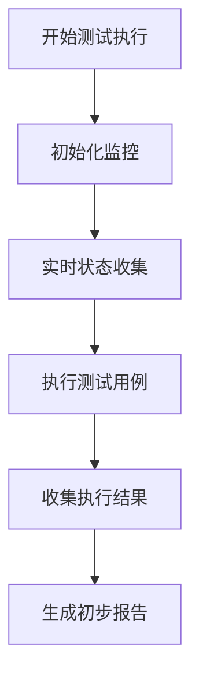
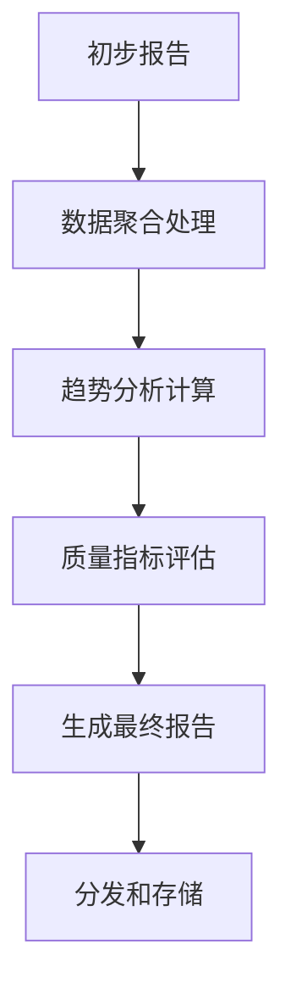
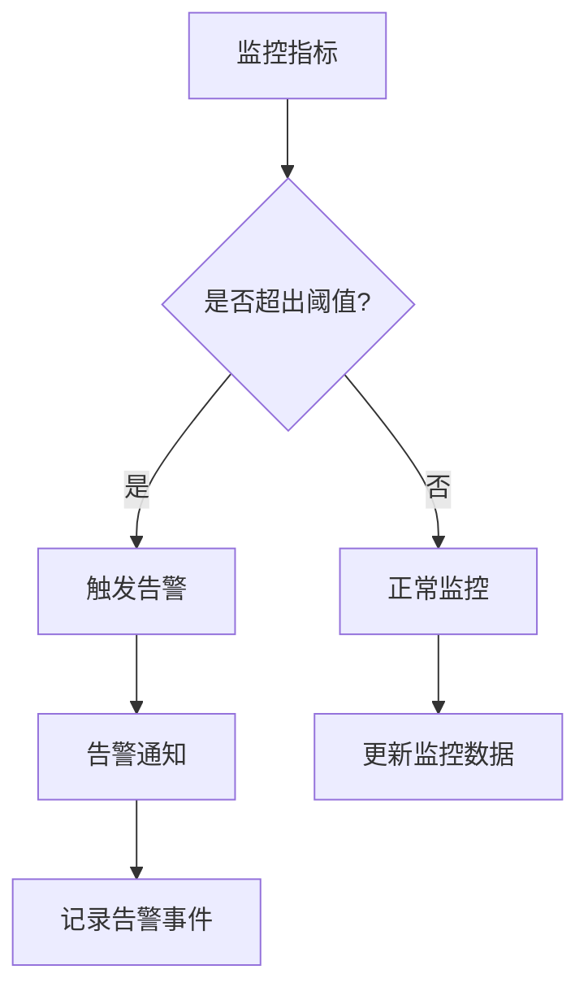

# E2E测试报告和监控机制

## 📊 报告体系总览

基于现有的测试基础设施，本文档定义了完整的测试报告和监控体系，包括实时监控、自动化报告生成、趋势分析和告警机制。

## 📈 报告类型架构

### 1. 执行报告 (Execution Reports)

#### 实时执行报告
```bash
# 生成实时执行状态报告
npm run report:e2e:live
```

**报告内容**:
- 当前执行进度 (百分比)
- 已完成/进行中/待执行用例数量
- 预计剩余时间
- 当前资源使用情况
- 失败用例实时统计

**更新频率**: 每5秒更新一次

#### 详细执行报告
```bash
# 生成完整执行结果报告
npm run report:e2e:detailed
```

**报告内容**:
- 测试用例执行结果 (通过/失败/跳过)
- 执行时间统计 (总时间、平均时间、最长/最短)
- 错误详情和堆栈跟踪
- 截图和视频证据
- 性能指标数据

### 2. 聚合报告 (Aggregate Reports)

#### 并发测试聚合报告
```bash
# 生成前后端测试聚合报告
npm run report:e2e:aggregate
```

**报告内容**:
- 用户前端测试结果
- 管理后台测试结果
- 跨系统集成测试结果
- 整体统计汇总
- 对比分析

#### 历史趋势报告
```bash
# 生成历史趋势分析报告
npm run report:e2e:trend -- --period 30d
```

**报告内容**:
- 30天内每日测试通过率趋势
- 执行时间变化趋势
- 失败用例类型分布
- 性能指标趋势图
- 质量指标变化

### 3. 专项报告 (Specialized Reports)

#### 性能监控报告
```bash
# 生成性能分析报告
npm run report:performance
```

**报告内容**:
- 页面加载时间统计
- API响应时间分析
- 内存使用监控
- CPU使用情况
- 性能阈值违规报告

#### 覆盖率报告
```bash
# 生成测试覆盖率报告
npm run report:coverage
```

**报告内容**:
- 功能覆盖率统计
- 代码覆盖率分析
- 用户旅程覆盖情况
- 边界条件覆盖分析

#### 质量评估报告
```bash
# 生成质量评估报告
npm run report:quality
```

**报告内容**:
- 代码质量指标
- 测试质量评估
- 缺陷趋势分析
- 改进建议

## 📊 监控指标体系

### 核心质量指标 (KQI)

#### 测试通过率指标
```json
{
  "overall_pass_rate": "85.6%",
  "smoke_pass_rate": "98.2%",
  "regression_pass_rate": "92.1%",
  "critical_function_pass_rate": "96.8%"
}
```

**监控阈值**:
- 总体通过率: ≥85%
- 冒烟测试: ≥95%
- 回归测试: ≥90%
- 关键功能: ≥95%

#### 执行效率指标
```json
{
  "average_execution_time": "45分钟",
  "serial_execution_time": "90分钟",
  "parallel_execution_time": "35分钟",
  "test_case_average_time": "12秒"
}
```

**监控阈值**:
- 平均执行时间: <60分钟
- 单用例时间: <30秒
- 并行效率提升: >40%

### 性能监控指标 (KPI)

#### 应用性能指标
```json
{
  "page_load_time_avg": "2.3秒",
  "page_load_time_p95": "4.1秒",
  "api_response_time_avg": "0.8秒",
  "api_response_time_p95": "2.2秒"
}
```

**性能阈值**:
- 页面加载时间: <3秒 (平均), <5秒 (P95)
- API响应时间: <1秒 (平均), <3秒 (P95)

#### 系统资源指标
```json
{
  "cpu_usage_avg": "45%",
  "cpu_usage_peak": "78%",
  "memory_usage_avg": "3.2GB",
  "memory_usage_peak": "5.8GB",
  "disk_io_avg": "120MB/s"
}
```

**资源阈值**:
- CPU使用率: <70% (平均), <90% (峰值)
- 内存使用: <4GB (平均), <8GB (峰值)
- 磁盘I/O: <200MB/s

### 稳定性指标

#### 环境稳定性指标
```json
{
  "environment_setup_success_rate": "96.7%",
  "test_isolation_success_rate": "98.3%",
  "data_cleanup_success_rate": "99.1%"
}
```

#### 测试稳定性指标
```json
{
  "flaky_test_rate": "2.1%",
  "intermittent_failure_rate": "1.8%",
  "environment_related_failure_rate": "3.2%"
}
```

## 🚨 告警机制

### 告警等级定义

#### 🔴 紧急告警 (Critical)
**触发条件**:
- 测试通过率 < 80%
- 关键功能测试失败
- 生产环境相关测试失败
- 系统性故障导致测试无法执行

**响应时间**: 立即响应，5分钟内处理

#### 🟡 重要告警 (Major)
**触发条件**:
- 测试通过率 80-85%
- 执行时间超出预期20%
- 性能指标偏离基准值15%
- 环境不稳定导致失败率>10%

**响应时间**: 30分钟内响应，2小时内处理

#### 🟢 一般告警 (Minor)
**触发条件**:
- 测试通过率 85-90%
- 执行时间超出预期10%
- 性能指标偏离基准值5%
- 单次测试失败

**响应时间**: 4小时内响应，24小时内处理

### 告警渠道

#### 即时通知
- **Slack/Teams**: 实时消息推送
- **邮件**: 详细报告附件
- **短信**: 紧急告警手机提醒

#### 仪表板展示
- **Grafana**: 实时监控大屏
- **内部系统**: 集成告警中心
- **状态页面**: 公开状态监控

## 📊 仪表板设计

### 实时监控仪表板

#### 执行状态面板
```
┌─────────────────────────────────────┐
│  E2E测试执行监控                    │
├─────────────────────────────────────┤
│ 执行进度: ████████░░░░ 75%          │
│ 剩余时间: 约12分钟                   │
│ 当前用例: auth/login-flow.spec.ts   │
│                                     │
│ 统计信息:                          │
│ ✅ 通过: 142 个                     │
│ ❌ 失败: 8 个                       │
│ ⏭️  跳过: 3 个                       │
│ 🔄 进行中: 1 个                     │
└─────────────────────────────────────┘
```

#### 性能指标面板
```
┌─────────────────────────────────────┐
│ 性能监控指标                        │
├─────────────────────────────────────┤
│ 页面加载时间:                       │
│ • 平均: 2.3s (目标<3s) ✅           │
│ • P95: 4.1s (目标<5s) ✅            │
│                                     │
│ API响应时间:                       │
│ • 平均: 0.8s (目标<1s) ✅           │
│ • P95: 2.2s (目标<3s) ✅            │
│                                     │
│ 系统资源:                          │
│ • CPU: 45% (阈值<70%) ✅           │
│ • 内存: 3.2GB (阈值<4GB) ✅        │
└─────────────────────────────────────┘
```

### 历史趋势仪表板

#### 通过率趋势图
```
通过率趋势 (最近30天)
95% │
    │           ████
90% │        ████    ████
    │     ████          ████
85% │  ████                ████
    │██                        ██
80% └─────────────────────────────────
    1  5  10 15 20 25 30 (天)
```

#### 执行时间趋势图
```
执行时间趋势 (最近30天)
120 │
     │                 ████
100 │              ████    ████
     │           ████        ████
 80 │        ████              ████
     │     ████                  ████
 60 │  ████                        ██
     └─────────────────────────────────
     1  5  10 15 20 25 30 (天)
```

## 🔄 自动化报告流程

### 报告生成流水线

#### 1. 测试执行阶段


#### 2. 报告处理阶段


#### 3. 监控和告警阶段


### 报告自动化脚本

#### 每日报告生成
```bash
# 每天凌晨2点自动生成
0 2 * * * /path/to/generate-daily-report.sh
```

#### 每周报告生成
```bash
# 每周一凌晨3点自动生成
0 3 * * 1 /path/to/generate-weekly-report.sh
```

#### 告警检查脚本
```bash
# 每15分钟检查一次
*/15 * * * * /path/to/check-alerts.sh
```

## 📋 报告内容标准

### 报告格式规范

#### HTML报告标准
- **响应式设计**: 支持桌面和移动端查看
- **交互式图表**: 使用Chart.js或D3.js
- **展开/折叠**: 支持详情展开
- **搜索过滤**: 支持用例搜索和过滤
- **导出功能**: 支持PDF和JSON导出

#### JSON报告标准
```json
{
  "metadata": {
    "report_id": "e2e-20251117-001",
    "execution_time": "2025-11-17T10:30:00Z",
    "duration": "45分钟",
    "environment": "test"
  },
  "summary": {
    "total_tests": 153,
    "passed": 142,
    "failed": 8,
    "skipped": 3,
    "pass_rate": "92.8%"
  },
  "results": [...],
  "performance": {...},
  "recommendations": [...]
}
```

### 报告分发策略

#### 内部分发
- **开发团队**: 每日摘要邮件
- **测试团队**: 详细执行报告
- **管理层**: 质量指标仪表板
- **运维团队**: 性能和稳定性报告

#### 外部分发
- **业务方**: 用户验收报告
- **合作伙伴**: API集成测试报告
- **审计方**: 合规性报告

## 🔍 故障排查指南

### 常见问题诊断

#### 测试执行失败
1. **环境问题**: 检查数据库和服务状态
2. **网络问题**: 验证网络连接和代理设置
3. **数据问题**: 检查测试数据完整性
4. **代码问题**: 审查最近的代码变更

#### 性能问题诊断
1. **资源瓶颈**: 监控CPU/内存使用
2. **网络延迟**: 检查网络响应时间
3. **数据库性能**: 分析慢查询
4. **代码效率**: 审查性能热点

#### 报告生成问题
1. **数据不完整**: 检查数据收集完整性
2. **格式错误**: 验证报告模板
3. **存储问题**: 检查磁盘空间和权限
4. **分发失败**: 验证邮件和网络设置

## 📈 持续改进机制

### 报告质量改进
- [ ] 定期收集用户反馈
- [ ] 分析报告使用情况
- [ ] 优化报告内容和格式
- [ ] 提升报告生成效率

### 监控体系完善
- [ ] 扩展监控指标覆盖
- [ ] 优化告警规则准确性
- [ ] 改进自动化处理能力
- [ ] 增强预测性分析

### 数据分析深化
- [ ] 建立质量指标基线
- [ ] 实现趋势预测分析
- [ ] 开发智能推荐系统
- [ ] 构建质量改进模型

---

## 🎯 验收标准

### 报告系统验收
- [ ] 报告生成成功率 > 99%
- [ ] 报告分发及时率 > 95%
- [ ] 报告内容准确率 > 98%
- [ ] 用户满意度评分 > 4.0/5.0

### 监控系统验收
- [ ] 告警准确率 > 90%
- [ ] 故障响应时间 < 15分钟
- [ ] 系统可用性 > 99.5%
- [ ] 监控覆盖率 > 95%

### 改进机制验收
- [ ] 问题解决效率提升 > 30%
- [ ] 质量指标改善幅度 > 15%
- [ ] 用户反馈响应率 > 90%
- [ ] 持续改进计划执行率 > 85%

---

**文档版本**: v1.0.0
**最后更新**: 2025年11月17日
**报告类型**: 5种主要报告
**监控指标**: 20+ 个核心指标
**告警等级**: 3级告警机制

