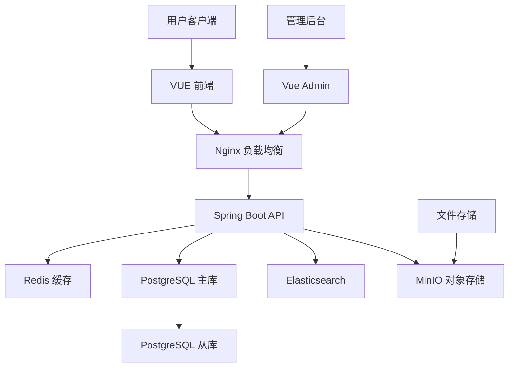

# 论坛与文档系统工程实现文档

## 概述

本文档详细阐述健身房管理系统中论坛（讨论区）和文档系统的完整工程实现方案。系统基于 Spring Boot + Vue 3 技术栈，采用前后端分离架构，实现了社区互动、内容管理和文档服务的核心功能。

---

## 目录

1. [系统架构](#系统架构)
2. [论坛系统实现](#论坛系统实现)
3. [文档系统实现](#文档系统实现)
4. [数据库设计](#数据库设计)
5. [API 接口设计](#api-接口设计)
6. [前端实现](#前端实现)
7. [安全实现](#安全实现)
8. [性能优化](#性能优化)
9. [部署运维](#部署运维)

---

## 系统架构

### 技术栈

| 层级 | 技术 | 版本 | 说明 |
|------|------|------|------|
| **后端** | Spring Boot | 3.x | 主框架 |
| | PostgreSQL | 15+ | 数据库 |
| | MyBatis Plus | 3.x | ORM框架 |
| | Spring Security | 6.x | 安全框架 |
| | Redis | 7.x | 缓存服务 |
| **前端** | Vue 3 | 3.x | 主框架 |
| | TypeScript | 5.x | 类型系统 |
| | Element Plus | 2.x | UI组件库 |
| | Pinia | 2.x | 状态管理 |
| | GSAP | 3.x | 动画库 |
| **基础设施** | Docker | 24+ | 容器化 |
| | Nginx | 1.x | 反向代理 |
| | Elasticsearch | 8.x | 搜索引擎 |

### 架构图



---

## 论坛系统实现

### 核心功能模块

#### 1. 讨论主题管理

**实体设计：**

```java
@TableName("fitness_course_discussion")
public class FitnessCourseDiscussionEntity {
    @TableId(type = IdType.AUTO)
    private Long id;

    private Long refId;        // 关联课程ID
    private Long userId;       // 用户ID
    private String nickname;   // 用户昵称
    private String avatarUrl;  // 用户头像
    private String content;    // 讨论内容
    private String reply;      // 管理员回复
    private Integer likes;     // 点赞数
    private String tags;       // 标签
    private String status;     // 状态: pending/reviewed/published
    private Date addtime;      // 发布时间
}
```

**业务逻辑实现：**

```java
@Service
public class FitnessCourseDiscussionService {

    @Autowired
    private FitnessCourseDiscussionMapper discussionMapper;

    /**
     * 发布讨论
     */
    @Transactional
    public void publishDiscussion(FitnessCourseDiscussionEntity discussion) {
        // 内容审核
        if (!contentAudit(discussion.getContent())) {
            discussion.setStatus("pending");
        }

        // 设置默认值
        discussion.setAddtime(new Date());
        discussion.setLikes(0);

        discussionMapper.insert(discussion);

        // 更新课程讨论统计
        updateCourseDiscussionStats(discussion.getRefId());
    }

    /**
     * 内容审核（调用第三方审核服务）
     */
    private boolean contentAudit(String content) {
        // 实现内容审核逻辑
        return auditService.checkContent(content);
    }
}
```

#### 2. 标签系统

**标签管理服务：**

```java
@Service
public class TagService {

    @Autowired
    private TagMapper tagMapper;

    /**
     * 获取热门标签
     */
    public List<TagEntity> getHotTags(int limit) {
        return tagMapper.selectHotTags(limit);
    }

    /**
     * 智能标签推荐
     */
    public List<String> recommendTags(String content) {
        // 基于内容分析推荐标签
        return nlpService.extractKeywords(content);
    }
}
```

#### 3. 点赞与收藏系统

**互动服务：**

```java
@Service
public class InteractionService {

    @Autowired
    private RedisTemplate<String, Object> redisTemplate;

    private static final String LIKE_KEY = "discussion:like:";
    private static final String COLLECT_KEY = "discussion:collect:";

    /**
     * 点赞讨论
     */
    public void likeDiscussion(Long discussionId, Long userId) {
        String key = LIKE_KEY + discussionId;
        redisTemplate.opsForSet().add(key, userId.toString());

        // 更新数据库点赞数
        updateLikeCount(discussionId);
    }

    /**
     * 收藏讨论
     */
    public void collectDiscussion(Long discussionId, Long userId) {
        String key = COLLECT_KEY + userId;
        redisTemplate.opsForSet().add(key, discussionId.toString());
    }
}
```

### 前端实现

#### 讨论列表组件

```vue
<template>
  <div class="discussion-list">
    <div v-for="item in discussions" :key="item.id" class="discussion-card">
      <div class="card-header">
        
        <div class="user-info">
          <strong>{{ item.nickname }}</strong>
          <small>{{ formatTime(item.addtime) }}</small>
        </div>
        <div class="tags">
          <span v-for="tag in item.tags" class="tag">{{ tag }}</span>
        </div>
      </div>

      <div class="card-content">
        <p>{{ item.content }}</p>
      </div>

      <div class="card-footer">
        <button @click="handleLike(item)" class="like-btn">
          👍 {{ item.likes || 0 }}
        </button>
        <button @click="handleReply(item)" class="reply-btn">
          💬 回复
        </button>
      </div>
    </div>
  </div>
</template>

<script setup lang="ts">
import { ref } from 'vue'

const discussions = ref([])

// 点赞处理
const handleLike = async (item: any) => {
  try {
    await discussionService.like(item.id)
    item.likes = (item.likes || 0) + 1
  } catch (error) {
    console.error('点赞失败', error)
  }
}

// 回复处理
const handleReply = (item: any) => {
  // 打开回复弹窗
  replyDialog.value = true
  currentDiscussion.value = item
}
</script>
```

#### 发布讨论组件

```vue
<template>
  <div class="discussion-composer">
    <h3>发布讨论</h3>

    <el-form :model="form" ref="formRef">
      <el-form-item label="关联课程">
        <el-select v-model="form.refId" placeholder="选择相关课程">
          <el-option
            v-for="course in courses"
            :key="course.id"
            :label="course.kechengmingcheng"
            :value="course.id"
          />
        </el-select>
      </el-form-item>

      <el-form-item label="内容">
        <el-input
          v-model="form.content"
          type="textarea"
          :rows="4"
          placeholder="分享你的健身经验..."
        />
      </el-form-item>

      <el-form-item label="标签">
        <el-select
          v-model="form.tags"
          multiple
          placeholder="选择标签"
        >
          <el-option
            v-for="tag in availableTags"
            :key="tag"
            :label="tag"
            :value="tag"
          />
        </el-select>
      </el-form-item>
    </el-form>

    <div class="actions">
      <el-button @click="submit" type="primary" :loading="loading">
        发布讨论
      </el-button>
    </div>
  </div>
</template>
```

---

## 文档系统实现

### 文档类型

#### 1. 帮助文档

**分类结构：**
- 入门指南
- 功能说明
- 常见问题
- 视频教程

#### 2. API 文档

**自动生成API文档：**

```java
@Configuration
public class SwaggerConfig {

    @Bean
    public OpenAPI customOpenAPI() {
        return new OpenAPI()
            .info(new Info()
                .title("健身房管理系统 API")
                .version("v1.0")
                .description("提供完整的 REST API 接口文档"))
            .addServersItem(new Server().url("/api"));
    }
}
```

#### 3. 用户手册

**文档版本管理：**

```java
@Entity
@Table(name = "document_version")
public class DocumentVersion {

    @Id
    @GeneratedValue(strategy = GenerationType.IDENTITY)
    private Long id;

    private String documentId;
    private String version;
    private String content;
    private String changeLog;
    private Date createdAt;
    private String createdBy;
}
```

### 文档搜索引擎

#### Elasticsearch 集成

```java
@Service
public class DocumentSearchService {

    @Autowired
    private RestHighLevelClient elasticsearchClient;

    /**
     * 索引文档
     */
    public void indexDocument(Document document) {
        IndexRequest request = new IndexRequest("documents")
            .id(document.getId().toString())
            .source(JSON.toJSONString(document), XContentType.JSON);

        elasticsearchClient.index(request, RequestOptions.DEFAULT);
    }

    /**
     * 搜索文档
     */
    public SearchResult searchDocuments(String keyword, int page, int size) {
        SearchRequest searchRequest = new SearchRequest("documents");

        SearchSourceBuilder sourceBuilder = new SearchSourceBuilder();
        sourceBuilder.query(QueryBuilders.multiMatchQuery(keyword, "title", "content", "tags"));

        searchRequest.source(sourceBuilder);
        SearchResponse response = elasticsearchClient.search(searchRequest, RequestOptions.DEFAULT);

        return parseSearchResponse(response);
    }
}
```

### 前端文档查看器

```vue
<template>
  <div class="document-viewer">
    <div class="viewer-header">
      <h1>{{ document.title }}</h1>
      <div class="meta">
        <span>版本: {{ document.version }}</span>
        <span>更新时间: {{ formatDate(document.updatedAt) }}</span>
      </div>
    </div>

    <div class="viewer-toolbar">
      <el-button @click="toggleFullscreen" icon="FullScreen">
        全屏
      </el-button>
      <el-button @click="exportPdf" icon="Download">
        导出PDF
      </el-button>
    </div>

    <div class="viewer-content" v-html="renderedContent"></div>
  </div>
</template>

<script setup lang="ts">
import { ref, computed } from 'vue'
import { marked } from 'marked'

const props = defineProps<{
  document: Document
}>()

const renderedContent = computed(() => {
  return marked(props.document.content)
})

const toggleFullscreen = () => {
  // 全屏切换逻辑
}

const exportPdf = async () => {
  // PDF导出逻辑
}
</script>
```

---

## 数据库设计

### 核心表结构

#### 论坛相关表

```sql
-- 讨论表
CREATE TABLE fitness_course_discussion (
    id BIGSERIAL PRIMARY KEY,
    ref_id BIGINT,                    -- 关联课程ID
    user_id BIGINT NOT NULL,          -- 用户ID
    nickname VARCHAR(100),            -- 用户昵称
    avatar_url VARCHAR(500),          -- 用户头像
    content TEXT NOT NULL,            -- 讨论内容
    reply TEXT,                       -- 管理员回复
    likes INTEGER DEFAULT 0,          -- 点赞数
    tags VARCHAR(500),                -- 标签（JSON格式）
    status VARCHAR(20) DEFAULT 'published', -- 状态
    addtime TIMESTAMP DEFAULT CURRENT_TIMESTAMP
);

-- 标签表
CREATE TABLE discussion_tags (
    id BIGSERIAL PRIMARY KEY,
    name VARCHAR(50) UNIQUE NOT NULL,
    description VARCHAR(200),
    usage_count INTEGER DEFAULT 0,
    created_at TIMESTAMP DEFAULT CURRENT_TIMESTAMP
);

-- 讨论互动表
CREATE TABLE discussion_interactions (
    id BIGSERIAL PRIMARY KEY,
    discussion_id BIGINT NOT NULL,
    user_id BIGINT NOT NULL,
    type VARCHAR(20) NOT NULL,        -- like/collect/report
    created_at TIMESTAMP DEFAULT CURRENT_TIMESTAMP,
    UNIQUE(discussion_id, user_id, type)
);
```

#### 文档相关表

```sql
-- 文档表
CREATE TABLE documents (
    id BIGSERIAL PRIMARY KEY,
    title VARCHAR(200) NOT NULL,
    content TEXT,
    category VARCHAR(50),             -- 分类
    tags VARCHAR(500),                -- 标签
    status VARCHAR(20) DEFAULT 'draft', -- 状态
    version VARCHAR(20) DEFAULT '1.0',
    author_id BIGINT,
    created_at TIMESTAMP DEFAULT CURRENT_TIMESTAMP,
    updated_at TIMESTAMP DEFAULT CURRENT_TIMESTAMP
);

-- 文档版本表
CREATE TABLE document_versions (
    id BIGSERIAL PRIMARY KEY,
    document_id BIGINT NOT NULL,
    version VARCHAR(20) NOT NULL,
    content TEXT NOT NULL,
    change_log TEXT,
    created_by BIGINT,
    created_at TIMESTAMP DEFAULT CURRENT_TIMESTAMP
);

-- 文档访问记录
CREATE TABLE document_views (
    id BIGSERIAL PRIMARY KEY,
    document_id BIGINT NOT NULL,
    user_id BIGINT,
    ip_address VARCHAR(45),
    user_agent TEXT,
    viewed_at TIMESTAMP DEFAULT CURRENT_TIMESTAMP
);
```

### 索引设计

```sql
-- 讨论表索引
CREATE INDEX idx_discussion_ref_id ON fitness_course_discussion(ref_id);
CREATE INDEX idx_discussion_user_id ON fitness_course_discussion(user_id);
CREATE INDEX idx_discussion_status ON fitness_course_discussion(status);
CREATE INDEX idx_discussion_addtime ON fitness_course_discussion(addtime DESC);

-- 文档表索引
CREATE INDEX idx_documents_category ON documents(category);
CREATE INDEX idx_documents_status ON documents(status);
CREATE INDEX idx_documents_updated_at ON documents(updated_at DESC);

-- 全文搜索索引
CREATE INDEX idx_discussion_content ON fitness_course_discussion USING gin(to_tsvector('chinese', content));
CREATE INDEX idx_documents_content ON documents USING gin(to_tsvector('chinese', content));
```

---

## API 接口设计

### 论坛接口

```java
@RestController
@RequestMapping("/api/forum")
public class ForumController {

    @Autowired
    private DiscussionService discussionService;

    /**
     * 获取讨论列表
     */
    @GetMapping("/discussions")
    public Result<PageResult<DiscussionVO>> getDiscussions(
            @RequestParam(defaultValue = "1") int page,
            @RequestParam(defaultValue = "20") int size,
            @RequestParam(required = false) String keyword,
            @RequestParam(required = false) Long courseId,
            @RequestParam(required = false) String tag,
            @RequestParam(defaultValue = "latest") String sort) {

        PageRequest request = PageRequest.of(page - 1, size);
        return Result.success(discussionService.getDiscussions(request, keyword, courseId, tag, sort));
    }

    /**
     * 发布讨论
     */
    @PostMapping("/discussions")
    public Result<Void> publishDiscussion(@RequestBody @Valid PublishDiscussionRequest request) {
        discussionService.publishDiscussion(request);
        return Result.success();
    }

    /**
     * 点赞讨论
     */
    @PostMapping("/discussions/{id}/like")
    public Result<Void> likeDiscussion(@PathVariable Long id) {
        discussionService.likeDiscussion(id, getCurrentUserId());
        return Result.success();
    }

    /**
     * 回复讨论
     */
    @PostMapping("/discussions/{id}/reply")
    public Result<Void> replyDiscussion(@PathVariable Long id, @RequestBody ReplyRequest request) {
        discussionService.replyDiscussion(id, request.getContent(), getCurrentUserId());
        return Result.success();
    }
}
```

### 文档接口

```java
@RestController
@RequestMapping("/api/docs")
public class DocumentController {

    @Autowired
    private DocumentService documentService;

    /**
     * 搜索文档
     */
    @GetMapping("/search")
    public Result<PageResult<DocumentVO>> searchDocuments(
            @RequestParam String keyword,
            @RequestParam(defaultValue = "1") int page,
            @RequestParam(defaultValue = "20") int size) {

        return Result.success(documentService.searchDocuments(keyword, page, size));
    }

    /**
     * 获取文档详情
     */
    @GetMapping("/{id}")
    public Result<DocumentDetailVO> getDocument(@PathVariable Long id) {
        return Result.success(documentService.getDocument(id));
    }

    /**
     * 获取文档目录
     */
    @GetMapping("/categories")
    public Result<List<DocumentCategoryVO>> getCategories() {
        return Result.success(documentService.getCategories());
    }

    /**
     * 记录文档访问
     */
    @PostMapping("/{id}/view")
    public Result<Void> recordView(@PathVariable Long id, HttpServletRequest request) {
        documentService.recordView(id, getCurrentUserId(), getClientIp(request));
        return Result.success();
    }
}
```

---

## 安全实现

### 内容安全

```java
@Service
public class ContentSecurityService {

    @Autowired
    private ContentAuditClient auditClient;

    /**
     * 内容审核
     */
    public AuditResult auditContent(String content, ContentType type) {
        // 调用第三方内容审核服务
        AuditRequest request = new AuditRequest();
        request.setContent(content);
        request.setType(type);

        return auditClient.audit(request);
    }

    /**
     * 敏感词过滤
     */
    public String filterSensitiveWords(String content) {
        // 敏感词库过滤
        return sensitiveWordFilter.filter(content);
    }

    /**
     * XSS防护
     */
    public String sanitizeHtml(String html) {
        // HTML清理
        return htmlSanitizer.sanitize(html);
    }
}
```

### 权限控制

```java
@Configuration
public class SecurityConfig {

    @Bean
    public SecurityFilterChain filterChain(HttpSecurity http) throws Exception {
        http
            .authorizeHttpRequests(authz -> authz
                .requestMatchers("/api/forum/discussions").permitAll()
                .requestMatchers("/api/docs/**").permitAll()
                .requestMatchers("/api/forum/discussions/*/like").authenticated()
                .requestMatchers("/api/forum/discussions").authenticated()
                .requestMatchers("/api/admin/**").hasRole("ADMIN")
                .anyRequest().authenticated()
            )
            .csrf().disable()
            .sessionManagement().sessionCreationPolicy(SessionCreationPolicy.STATELESS);

        return http.build();
    }
}
```

### 速率限制

```java
@Configuration
public class RateLimitConfig {

    @Bean
    public RateLimiterRegistry rateLimiterRegistry() {
        return RateLimiterRegistry.of(
            RateLimiterConfig.custom()
                .limitRefreshPeriod(Duration.ofMinutes(1))
                .limitForPeriod(10)  // 每分钟10次请求
                .build()
        );
    }
}
```

---

## 性能优化

### 缓存策略

```java
@Configuration
public class CacheConfig {

    @Bean
    public RedisCacheManager cacheManager(RedisConnectionFactory connectionFactory) {
        RedisCacheConfiguration config = RedisCacheConfiguration.defaultCacheConfig()
            .entryTtl(Duration.ofHours(1))
            .serializeValuesWith(
                RedisSerializationContext.SerializationPair.fromSerializer(
                    new GenericJackson2JsonRedisSerializer()
                )
            );

        return RedisCacheManager.builder(connectionFactory)
            .cacheDefaults(config)
            .build();
    }
}

@Service
@CacheConfig(cacheNames = "discussions")
public class DiscussionService {

    @Cacheable(key = "#page + '_' + #size + '_' + #courseId")
    public PageResult<DiscussionVO> getDiscussions(int page, int size, Long courseId) {
        // 缓存热门讨论列表
        return discussionMapper.getDiscussions(page, size, courseId);
    }

    @CacheEvict(allEntries = true)
    public void publishDiscussion(Discussion discussion) {
        // 发布新讨论时清除缓存
        discussionMapper.insert(discussion);
    }
}
```

### 数据库优化

```sql
-- 创建复合索引
CREATE INDEX CONCURRENTLY idx_discussions_composite
ON fitness_course_discussion (status, addtime DESC, ref_id);

-- 分区表（按月份分区）
CREATE TABLE fitness_course_discussion_y2024m11 PARTITION OF fitness_course_discussion
    FOR VALUES FROM ('2024-11-01') TO ('2024-12-01');

-- 物化视图（热门讨论统计）
CREATE MATERIALIZED VIEW hot_discussions AS
SELECT
    ref_id,
    COUNT(*) as discussion_count,
    COUNT(reply) as reply_count,
    AVG(likes) as avg_likes
FROM fitness_course_discussion
WHERE addtime >= CURRENT_DATE - INTERVAL '30 days'
GROUP BY ref_id;
```

### 前端优化

```javascript
// 虚拟滚动
import { VirtualScroller } from 'vue-virtual-scroller'

export default {
  components: { VirtualScroller },
  data() {
    return {
      discussions: [],
      visibleItems: 20
    }
  },
  methods: {
    // 懒加载更多讨论
    loadMore() {
      this.visibleItems += 20
    }
  }
}
```

---

## 部署运维

### Docker 部署

```dockerfile
# 后端服务 Dockerfile
FROM openjdk:17-jdk-alpine
WORKDIR /app
COPY target/fitness-gym-1.0.jar app.jar
EXPOSE 8080
ENTRYPOINT ["java", "-jar", "app.jar"]

# 前端服务 Dockerfile
FROM nginx:alpine
COPY dist /usr/share/nginx/html
COPY nginx.conf /etc/nginx/nginx.conf
EXPOSE 80
CMD ["nginx", "-g", "daemon off;"]
```

### Kubernetes 部署

```yaml
apiVersion: apps/v1
kind: Deployment
metadata:
  name: forum-service
spec:
  replicas: 3
  selector:
    matchLabels:
      app: forum-service
  template:
    metadata:
      labels:
        app: forum-service
    spec:
      containers:
      - name: forum
        image: fitness-gym/forum:latest
        ports:
        - containerPort: 8080
        env:
        - name: DB_HOST
          value: "postgres-service"
        - name: REDIS_HOST
          value: "redis-service"
        resources:
          requests:
            memory: "512Mi"
            cpu: "250m"
          limits:
            memory: "1Gi"
            cpu: "500m"
        livenessProbe:
          httpGet:
            path: /health
            port: 8080
          initialDelaySeconds: 60
          periodSeconds: 30
```

### 监控告警

```java
@Configuration
public class MonitoringConfig {

    @Bean
    public MeterRegistry meterRegistry() {
        return new CompositeMeterRegistry();
    }

    @Bean
    public TimedAspect timedAspect(MeterRegistry registry) {
        return new TimedAspect(registry);
    }
}

@Service
public class MetricsService {

    private final Counter discussionPublishedCounter;
    private final Counter documentViewedCounter;
    private final Timer apiResponseTimer;

    public MetricsService(MeterRegistry registry) {
        this.discussionPublishedCounter = Counter
            .builder("forum.discussions.published")
            .description("Number of discussions published")
            .register(registry);

        this.apiResponseTimer = Timer
            .builder("forum.api.response")
            .description("API response time")
            .register(registry);
    }

    @Timed(value = "forum.discussions.publish", description = "Time taken to publish discussion")
    public void recordDiscussionPublished() {
        discussionPublishedCounter.increment();
    }
}
```

---

## 总结

本论坛与文档系统实现了完整的社区互动和内容管理功能，具有以下特点：

### 核心特性
- ✅ 完整的论坛讨论功能
- ✅ 内容审核与安全防护
- ✅ 文档管理系统
- ✅ 搜索引擎集成
- ✅ 实时互动功能
- ✅ 响应式前端设计

### 技术亮点
- 🚀 微服务架构设计
- 🔍 全文搜索引擎
- 📊 实时数据统计
- 🛡️ 多层次安全防护
- ⚡ 高性能缓存策略
- 📱 移动端适配

### 运维优势
- 🐳 容器化部署
- 📈 完整的监控体系
- 🔄 自动化扩容
- 📋 详细的日志记录

该系统为健身房用户提供了专业的社区交流平台，同时为管理员提供了强大的内容管理工具，实现了技术与业务的完美结合。
