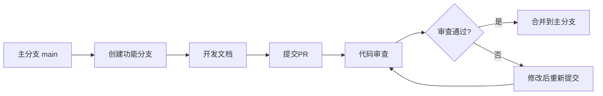

# Front前端文档协作规范指南

> **版本**：v1.0.0
> **更新日期**：2025-11-16
> **适用范围**：Front前端项目文档协作规范
> **关键词**：文档协作, Git工作流, 冲突解决, 代码审查

---

## 📋 目录

- [概述](#概述)
- [Git工作流规范](#git工作流规范)
- [分支管理策略](#分支管理策略)
- [提交规范](#提交规范)
- [Pull Request流程](#pull-request流程)
- [冲突解决机制](#冲突解决机制)
- [审查标准](#审查标准)
- [协作工具使用](#协作工具使用)
- [最佳实践](#最佳实践)

---

## 📖 概述

### 目的

建立规范化的文档协作流程，确保多人协作时的文档质量和一致性，提高团队协作效率，减少冲突和错误。

### 适用范围

- 所有Front前端文档的多人协作
- 跨部门文档协作
- 开源贡献和外部协作

### 基本原则

1. **透明协作**：所有变更都有迹可循
2. **质量优先**：协作不降低文档质量
3. **及时沟通**：主动沟通避免冲突
4. **持续改进**：从实践中优化流程

---

## 🌳 Git工作流规范

### 工作流类型

#### 1. 集中式工作流（主干开发）

**适用场景**：
- 小型团队
- 文档变更频率低
- 需要快速发布

**流程**：


#### 2. Git Flow工作流（多分支开发）

**适用场景**：
- 大型团队
- 文档变更频繁
- 需要版本控制

**分支结构**：
```
main (主分支)
├── develop (开发分支)
│   ├── feature/doc-xxx (功能分支)
│   ├── hotfix/doc-fix-xxx (热修复分支)
│   └── release/v1.1.0 (发布分支)
```

### 分支命名规范

#### 功能分支
```
feature/doc-[功能名称]-[作者缩写]
```
**示例**：
- `feature/doc-user-auth-guide-zhang`
- `feature/doc-api-documentation-li`

#### 修复分支
```
hotfix/doc-[问题描述]-[作者缩写]
```
**示例**：
- `feature/doc-fix-link-error-wang`
- `feature/doc-update-api-chen`

#### 发布分支
```
release/v[版本号]
```
**示例**：
- `release/v1.1.0`
- `release/v2.0.0`

---

## 🏗️ 分支管理策略

### 分支生命周期

#### 创建分支
```bash
# 从develop分支创建功能分支
git checkout develop
git pull origin develop
git checkout -b feature/doc-user-guide-zhang

# 推送到远程
git push -u origin feature/doc-user-guide-zhang
```

#### 分支合并
```bash
# 合并前先同步develop分支
git checkout develop
git pull origin develop

# 切换到功能分支
git checkout feature/doc-user-guide-zhang

# 合并develop分支
git merge develop

# 解决可能的冲突后推送
git push origin feature/doc-user-guide-zhang
```

#### 删除分支
```bash
# 删除本地分支
git branch -d feature/doc-user-guide-zhang

# 删除远程分支
git push origin --delete feature/doc-user-guide-zhang
```

### 分支保护规则

#### 主分支保护
- 禁止直接推送
- 必须通过Pull Request
- 需要至少1个审查通过
- 必须通过CI检查

#### 开发分支保护
- 允许直接推送（经验丰富的开发者）
- 建议通过Pull Request
- 需要通过基本质量检查

---

## 📝 提交规范

### 提交信息格式

```
<type>(<scope>): <subject>

<body>

<footer>
```

#### Type类型定义

| 类型 | 描述 | 示例 |
|------|------|------|
| `feat` | 新功能 | `feat: 添加用户认证文档` |
| `fix` | 修复错误 | `fix: 修复API文档链接错误` |
| `docs` | 文档变更 | `docs: 更新README安装说明` |
| `style` | 格式调整 | `style: 调整文档格式和排版` |
| `refactor` | 重构 | `refactor: 重构文档结构` |
| `test` | 测试相关 | `test: 添加文档示例测试` |
| `chore` | 构建工具 | `chore: 更新文档构建脚本` |

#### Scope范围定义

| 范围 | 描述 |
|------|------|
| `component` | 组件文档 |
| `api` | API文档 |
| `guide` | 指南文档 |
| `architecture` | 架构文档 |
| `tool` | 工具文档 |

#### Subject主题规范

- 使用中文，句首大写
- 简洁明了，不超过50字符
- 以动词开头，表示做了什么

**正确示例**：
```
feat(component): 添加用户登录组件文档
fix(api): 修复用户API参数说明错误
docs(guide): 更新开发环境搭建指南
```

**错误示例**：
```
修复bug（太简单）
feat: 用户登录组件文档添加（没有scope）
添加用户登录组件的文档（太长）
```

### Body内容规范

- 详细说明变更内容
- 解释变更原因
- 描述影响范围

**示例**：
```
添加用户登录组件的完整API文档

- 包含Props、Events、Slots说明
- 提供使用示例和最佳实践
- 更新相关组件索引

解决用户反馈的文档缺失问题
```

### Footer页脚规范

- 关联Issue：`Closes #123`
- 破坏性变更：`BREAKING CHANGE: 说明`
- 评审人：`Reviewed-by: 张三`

---

## 🔄 Pull Request流程

### PR创建规范

#### 标题格式
```
[类型] 简短描述
```

**示例**：
- `[feat] 添加用户管理组件文档`
- `[fix] 修复API文档格式错误`
- `[docs] 更新部署指南`

#### 描述模板
```markdown
## 📋 变更概述

简要描述本次变更的内容和目的

## 🔍 变更详情

### 主要变更
- [ ] 变更1的详细说明
- [ ] 变更2的详细说明

### 影响范围
- 影响的文档范围
- 相关的系统模块

## ✅ 检查清单

- [ ] 文档格式符合规范
- [ ] 链接有效性验证
- [ ] 示例代码可运行
- [ ] 更新了相关索引

## 🧪 测试验证

描述测试的方法和结果

## 📚 相关链接

- 相关Issue: #123
- 相关文档: [链接]
```

### PR审查流程

#### 自动检查
- CI质量检查通过
- 文档格式验证
- 链接有效性检查

#### 人工审查
1. **初步审查**（5-10分钟）
   - 检查基本格式和规范
   - 验证内容逻辑正确性

2. **详细审查**（15-30分钟）
   - 检查技术准确性
   - 验证示例有效性
   - 评估文档质量

3. **最终确认**（5分钟）
   - 确认所有问题已解决
   - 批准合并或要求修改

#### 审查要点

**内容质量**：
- [ ] 信息准确完整
- [ ] 逻辑结构清晰
- [ ] 语言表达规范

**技术规范**：
- [ ] 代码示例正确
- [ ] API说明准确
- [ ] 格式符合标准

**文档规范**：
- [ ] 头部信息完整
- [ ] 目录结构合理
- [ ] 链接引用正确

---

## ⚔️ 冲突解决机制

### 冲突识别

#### 常见冲突场景

1. **内容冲突**：同一文档的不同部分被同时修改
2. **结构冲突**：文档结构重组与内容修改冲突
3. **格式冲突**：格式规范更新与内容修改冲突

#### 冲突检测

```bash
# 检查分支是否有冲突
git checkout feature/doc-xxx
git merge develop

# 如果有冲突，Git会提示
# CONFLICT (content): Merge conflict in docs/xxx.md
```

### 冲突解决策略

#### 策略1：优先保留最新内容
```bash
# 查看冲突文件
git status

# 编辑冲突文件，选择保留的内容
# <<<<<<< HEAD
# 当前分支内容
# =======
# 合并分支内容
# >>>>>>> feature/doc-xxx

# 解决冲突后
git add docs/xxx.md
git commit -m "fix: 解决文档合并冲突"
```

#### 策略2：协商解决
1. 通知相关人员
2. 讨论冲突内容
3. 共同确定解决方案
4. 更新文档

#### 策略3：拆分提交
- 将大变更拆分为小提交
- 减少冲突概率
- 便于审查和回滚

### 冲突预防

#### 提前沟通
- 计划重大变更时提前通知
- 协调多人同时修改同一文档

#### 分工明确
- 按模块分工编写
- 避免多人同时修改同一部分

#### 定期同步
```bash
# 每天开始工作时同步develop分支
git checkout develop
git pull origin develop

# 定期推送自己的变更
git push origin feature/doc-xxx
```

---

## 🔍 审查标准

### 审查清单

#### 格式规范检查

**文档结构**：
- [ ] 头部信息完整（title, version, last_updated, status, category, tags）
- [ ] 目录结构合理
- [ ] 标题层级正确
- [ ] 段落结构清晰

**内容格式**：
- [ ] 中英文混用检查
- [ ] 标点符号规范
- [ ] 列表和表格格式
- [ ] 代码块语言标识

#### 内容质量检查

**准确性**：
- [ ] 技术信息准确
- [ ] 示例代码可运行
- [ ] API参数正确
- [ ] 链接有效

**完整性**：
- [ ] 覆盖所有必要内容
- [ ] 示例丰富全面
- [ ] 常见问题解答
- [ ] 相关链接完整

**可读性**：
- [ ] 语言通顺简洁
- [ ] 逻辑结构清晰
- [ ] 重点突出
- [ ] 易于理解

#### 技术规范检查

**代码质量**：
- [ ] 代码示例规范
- [ ] 错误处理完整
- [ ] 最佳实践遵循
- [ ] 注释详细

**文档规范**：
- [ ] 符合文档编写规范
- [ ] 模板使用正确
- [ ] 术语统一
- [ ] 格式一致

### 审查意见反馈

#### 意见分类

| 类型 | 描述 | 处理方式 |
|------|------|------|
| **Blocker** | 严重错误，必须修复 | 必须修复后才能合并 |
| **Major** | 重要问题，建议修复 | 建议修复，可协商 |
| **Minor** | 小问题，可选修复 | 可选修复，不影响合并 |
| **Info** | 信息提示和建议 | 参考建议，不强制 |

#### 反馈格式

```markdown
## 🔍 审查意见

### Blocker (必须修复)
1. **API参数错误**：第25行userId参数类型应为string
   - 建议修改为：`userId: string`

### Major (重要问题)
1. **示例不完整**：缺少错误处理示例
   - 建议添加try-catch块

### Minor (小问题)
1. **格式不一致**：代码缩进不统一
   - 建议使用2个空格缩进

### Info (建议)
1. **可读性改进**：可以添加更多注释
```

---

## 🛠️ 协作工具使用

### Git工具使用

#### 常用命令
```bash
# 创建和切换分支
git checkout -b feature/doc-xxx

# 查看分支状态
git branch -v

# 查看变更
git diff
git diff --cached

# 暂存和提交
git add docs/
git commit -m "feat: 添加新功能文档"

# 推送和拉取
git push origin feature/doc-xxx
git pull origin develop

# 合并和解决冲突
git merge develop
# 解决冲突后
git add <conflicted-file>
git commit
```

#### 高级工具

**Git Flow工具**：
```bash
# 安装git-flow
npm install -g git-flow

# 初始化
git flow init

# 创建功能分支
git flow feature start doc-xxx

# 完成功能分支
git flow feature finish doc-xxx
```

### 协作平台

#### GitHub协作

**Issue管理**：
- 使用Issue跟踪任务和问题
- 关联PR和Issue
- 使用标签分类

**Project管理**：
- 使用Project看板管理任务
- 跟踪文档编写进度
- 协调多人协作

#### 代码审查工具

**GitHub Review**：
- 逐行评论代码
- 建议具体修改
- 批准或拒绝PR

**第三方工具**：
- GitLab (自托管)
- Bitbucket
- Azure DevOps

---

## 💡 最佳实践

### 协作效率提升

#### 1. 提前规划
- 文档编写前进行需求讨论
- 明确分工和时间计划
- 预估可能的冲突点

#### 2. 及时同步
- 每天同步主分支
- 定期推送个人变更
- 及时处理审查意见

#### 3. 有效沟通
- 使用清晰的提交信息
- 详细的PR描述
- 及时响应审查意见

### 质量保证

#### 1. 小步快跑
- 将大文档拆分为小部分
- 频繁提交，便于审查
- 降低冲突风险

#### 2. 结对编程
- 重要文档考虑结对编写
- 互相审查，提高质量
- 知识共享和传承

#### 3. 自动化检查
- 使用工具自动检查格式
- CI/CD集成质量验证
- 减少人工检查负担

### 冲突管理

#### 1. 预防为主
- 明确文档所有权
- 建立修改通知机制
- 使用分支隔离变更

#### 2. 快速解决
- 冲突出现后立即处理
- 与相关人员及时沟通
- 记录解决方案供参考

#### 3. 经验总结
- 定期回顾冲突原因
- 优化协作流程
- 建立最佳实践库

---

## 📚 相关链接

- [文档生命周期管理流程](DOC_LIFECYCLE_MANAGEMENT.md)
- [文档版本管理规范](DOC_VERSION_MANAGEMENT.md)
- [Front前端文档编写规范](FRONTEND_DOCUMENTATION_STANDARDS.md)
- [Git工作流指南](https://www.atlassian.com/git/tutorials/comparing-workflows)

---

## 📝 更新日志

### v1.0.0 (2025-11-16)

- ✨ 初始版本发布
- ✨ 建立完整的Git工作流规范
- ✨ 定义分支管理和提交规范
- ✨ 制定PR流程和审查标准
- ✨ 提供冲突解决机制

---

**最后更新**：2025-11-16
**维护责任人**：文档工程团队
**联系方式**：docs-team@company.com
