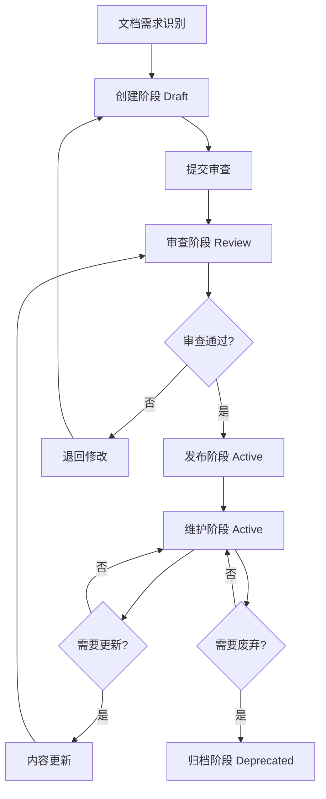

# Front前端文档生命周期管理流程

> **版本**：v1.0.0
> **更新日期**：2025-11-16
> **适用范围**：Front前端项目文档生命周期管理
> **关键词**：文档生命周期, 管理流程, 审查机制, 版本控制

---

## 📋 目录

- [概述](#概述)
- [文档状态定义](#文档状态定义)
- [生命周期阶段](#生命周期阶段)
- [责任矩阵](#责任矩阵)
- [流程图](#流程图)
- [时间节点要求](#时间节点要求)
- [异常处理](#异常处理)
- [质量保障](#质量保障)
- [工具支持](#工具支持)

---

## 📖 概述

### 目的

建立规范化的文档生命周期管理流程，确保文档从创建到废弃的全生命周期得到有效管理，提高文档质量、及时性和可维护性。

### 适用范围

- 所有Front前端技术文档
- 开发指南和规范文档
- API和组件使用文档
- 架构和设计文档

### 流程原则

1. **规范化**：遵循统一的标准和流程
2. **可追溯**：每个阶段都有明确的记录
3. **质量优先**：确保文档质量符合标准
4. **及时更新**：文档与代码保持同步
5. **持续改进**：定期评估和优化流程

---

## 🏷️ 文档状态定义

### 状态类型

| 状态 | 描述 | 可操作 | 可见性 |
|------|------|--------|--------|
| `draft` | 草稿状态，内容不完整 | 可编辑 | 仅作者可见 |
| `review` | 审查状态，等待审核 | 限编辑 | 审查人员可见 |
| `active` | 活跃状态，正式发布 | 限更新 | 全员可见 |
| `deprecated` | 废弃状态，不再维护 | 只读 | 保留历史 |

### 状态转换规则

```
draft → review → active → deprecated
   ↑           ↓
   └───── 拒绝 ───┘
```

---

## 🔄 生命周期阶段

### 阶段1：创建阶段（Draft）

#### 触发条件
- 新功能开发需要文档
- 现有文档缺失或不完整
- 技术方案变更需要更新文档

#### 具体流程

1. **需求识别**
   - 开发人员识别文档需求
   - 产品经理确认文档必要性
   - 技术负责人评估文档优先级

2. **文档规划**
   - 确定文档类型和位置
   - 定义文档范围和内容大纲
   - 分配文档编写责任人

3. **内容编写**
   - 基于模板创建文档
   - 编写文档内容和示例
   - 进行初步自查

#### 交付物
- 文档草稿（draft状态）
- 编写计划和时间表

#### 时间要求
- 简单文档：1-2天
- 复杂文档：3-5天

---

### 阶段2：审查阶段（Review）

#### 触发条件
- 作者完成文档初稿
- 文档状态从draft转换为review

#### 具体流程

1. **审查准备**
   - 自动分配审查人员
   - 发送审查通知
   - 准备审查清单

2. **技术审查**
   - 内容准确性检查
   - 技术规范符合性验证
   - 代码示例有效性测试

3. **质量审查**
   - 文档结构完整性检查
   - 格式规范符合性验证
   - 可读性和一致性评估

4. **最终审核**
   - 审查意见汇总和讨论
   - 审核人最终确认
   - 决定通过或退回修改

#### 审查人员分配

| 文档类型 | 主要审查人 | 辅助审查人 |
|----------|------------|------------|
| 组件文档 | 技术负责人 + 资深工程师 | 同组工程师 |
| API文档 | 后端负责人 + 前端负责人 | 相关开发人员 |
| 架构文档 | 架构师 + 技术总监 | 核心开发人员 |
| 指南文档 | 项目经理 + 技术写作 | 相关部门代表 |

#### 时间要求
- 技术审查：1-2天
- 质量审查：1天
- 最终审核：半天

---

### 阶段3：发布阶段（Active）

#### 触发条件
- 文档通过所有审查
- 状态转换为active

#### 具体流程

1. **发布准备**
   - 更新文档状态为active
   - 生成发布版本号
   - 更新文档索引

2. **正式发布**
   - 提交到主分支
   - 更新相关链接
   - 发送发布通知

3. **宣传推广**
   - 在团队渠道发布
   - 更新项目文档导航
   - 培训相关人员

#### 交付物
- 正式发布的文档
- 发布记录和变更日志
- 团队通知和培训材料

---

### 阶段4：维护阶段（Active）

#### 触发条件
- 代码变更影响文档
- 用户反馈发现问题
- 定期审查发现需要更新

#### 具体流程

1. **变更识别**
   - 监控代码变更
   - 收集用户反馈
   - 定期质量检查

2. **更新评估**
   - 评估变更影响程度
   - 确定更新优先级
   - 安排更新计划

3. **内容更新**
   - 更新相关内容
   - 保持版本一致性
   - 更新示例代码

4. **重新审查**
   - 进行变更审查
   - 验证更新正确性
   - 确认无副作用

#### 更新频率要求

| 文档类型 | 更新频率 | 触发条件 |
|----------|----------|----------|
| API文档 | 实时 | 代码变更时 |
| 组件文档 | 版本发布时 | 新版本发布 |
| 架构文档 | 季度 | 架构变更时 |
| 指南文档 | 半年 | 流程优化时 |

---

### 阶段5：归档阶段（Deprecated）

#### 触发条件
- 功能废弃或重构
- 文档内容完全过时
- 项目生命周期结束

#### 具体流程

1. **废弃评估**
   - 评估废弃影响
   - 确定替代方案
   - 制定迁移计划

2. **废弃处理**
   - 更新文档状态为deprecated
   - 添加废弃说明和替代链接
   - 保留历史版本

3. **清理工作**
   - 从活跃索引中移除
   - 更新相关引用
   - 归档历史数据

---

## 👥 责任矩阵

### 角色定义

| 角色 | 职责 | 权限 | 数量 |
|------|------|------|------|
| **文档作者** | 编写和维护文档内容 | 创建、编辑文档 | 所有开发人员 |
| **技术审查人** | 审查技术内容的准确性 | 批准技术变更 | 资深工程师 |
| **质量审查人** | 检查文档质量和规范 | 批准质量标准 | 技术写作或PM |
| **文档管理员** | 管理文档流程和工具 | 系统管理权限 | 1-2人 |
| **最终审核人** | 最终批准文档发布 | 发布权限 | 技术负责人 |

### 阶段责任分配

| 阶段 | 主要责任人 | 辅助人员 | 审批人 |
|------|------------|----------|--------|
| 创建 | 文档作者 | 产品经理 | 无 |
| 审查 | 技术审查人 | 质量审查人 | 审核人 |
| 发布 | 文档管理员 | 文档作者 | 技术负责人 |
| 维护 | 文档作者 | 相关人员 | 技术负责人 |
| 归档 | 文档管理员 | 技术负责人 | 项目经理 |

---

## 📊 流程图



---

## ⏰ 时间节点要求

### 各阶段时间限制

| 阶段 | 预期时长 | 最长时长 | 预警线 |
|------|----------|----------|--------|
| 创建 | 2-5天 | 7天 | 5天 |
| 审查 | 2-3天 | 5天 | 3天 |
| 发布 | 0.5天 | 1天 | 0.5天 |
| 维护 | 1-3天 | 5天 | 2天 |

### 整体流程时间要求

- **紧急文档**：3天内完成
- **重要文档**：1周内完成
- **普通文档**：2周内完成

### 超时处理

1. **预警通知**：超过预警线时自动提醒
2. **原因分析**：了解延误原因
3. **资源调整**：必要时增加资源投入
4. **流程优化**：总结经验改进流程

---

## ⚠️ 异常处理

### 常见异常情况

#### 1. 审查被退回

**处理流程**：
1. 分析退回原因
2. 作者修改文档
3. 补充必要信息
4. 重新提交审查

**预防措施**：
- 编写前与审查人沟通
- 提供完整的上下文信息
- 使用标准模板和规范

#### 2. 紧急需求冲突

**处理流程**：
1. 评估紧急程度
2. 调整优先级
3. 简化审查流程
4. 事后补全手续

#### 3. 技术争议

**处理流程**：
1. 组织技术讨论会
2. 邀请领域专家参与
3. 达成共识解决方案
4. 更新文档和规范

---

## 🔍 质量保障

### 质量检查点

#### 创建阶段
- [ ] 内容完整性检查
- [ ] 格式规范验证
- [ ] 基本信息填写

#### 审查阶段
- [ ] 技术准确性验证
- [ ] 逻辑一致性检查
- [ ] 示例有效性测试

#### 发布阶段
- [ ] 链接有效性检查
- [ ] 索引更新验证
- [ ] 通知发送确认

#### 维护阶段
- [ ] 变更影响评估
- [ ] 更新完整性验证
- [ ] 版本一致性检查

### 质量指标

| 指标 | 目标值 | 测量方法 |
|------|--------|----------|
| 文档完整率 | ≥95% | 必填项填写率 |
| 技术准确率 | ≥98% | 审查通过率 |
| 格式规范率 | ≥95% | 自动化检查通过率 |
| 更新及时率 | ≥90% | 变更响应时间 |

---

## 🛠️ 工具支持

### 自动化工具

#### 文档生命周期管理工具
```bash
# 初始化新文档
npm run docs:lifecycle -- --init --type component --name ComponentName

# 提交审查
npm run docs:lifecycle -- --review --file docs/technical/frontend/components/COMPONENT.md

# 发布文档
npm run docs:lifecycle -- --publish --file docs/technical/frontend/components/COMPONENT.md

# 检查状态
npm run docs:lifecycle -- --status --file docs/technical/frontend/components/COMPONENT.md
```

#### 文档审查工作流工具
```bash
# 分配审查人员
npm run docs:review -- --assign --file docs/technical/frontend/components/COMPONENT.md

# 收集审查意见
npm run docs:review -- --collect --pr 123

# 生成审查报告
npm run docs:review -- --report --file docs/technical/frontend/components/COMPONENT.md
```

### CI/CD集成

#### 质量检查工作流
- 提交时自动检查文档质量
- PR时生成文档变更报告
- 合并后自动更新索引

#### 发布工作流
- 版本发布时自动更新文档状态
- 生成文档快照和变更日志
- 发送发布通知

---

## 📚 相关链接

- [Front前端文档编写规范](../FRONTEND_DOCUMENTATION_STANDARDS.md)
- [文档协作规范](../DOC_COLLABORATION_GUIDE.md)
- [文档版本管理规范](../DOC_VERSION_MANAGEMENT.md)
- [文档质量改进流程](../DOC_QUALITY_IMPROVEMENT.md)

---

## 📝 更新日志

### v1.0.0 (2025-11-16)

- ✨ 初始版本发布
- ✨ 定义完整的文档生命周期流程
- ✨ 建立责任矩阵和时间要求
- ✨ 集成自动化工具支持

---

**最后更新**：2025-11-16
**维护责任人**：文档工程团队
**联系方式**：docs-team@company.com
