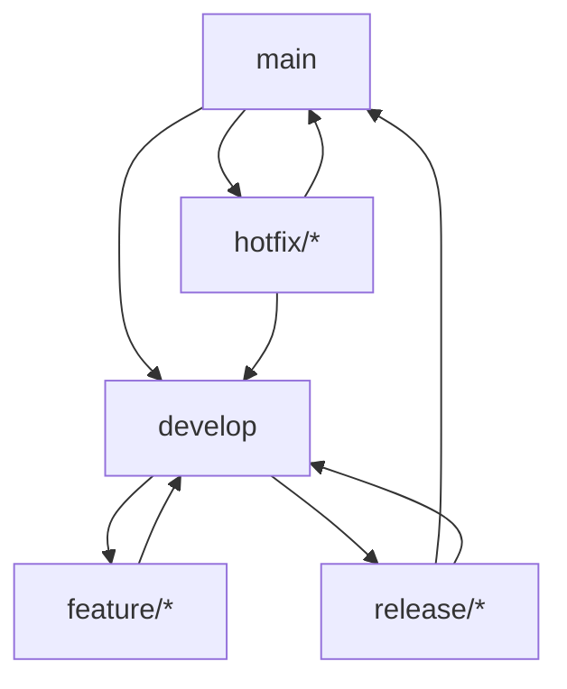

# Front前端文档版本管理规范

> **版本**：v1.0.0
> **更新日期**：2025-11-16
> **适用范围**：Front前端项目文档版本管理
> **关键词**：版本管理, 语义化版本, 变更日志, 兼容性

---

## 📋 目录

- [概述](#概述)
- [版本号规范](#版本号规范)
- [版本类型定义](#版本类型定义)
- [版本发布流程](#版本发布流程)
- [变更日志管理](#变更日志管理)
- [兼容性管理](#兼容性管理)
- [回滚机制](#回滚机制)
- [版本分支策略](#版本分支策略)
- [工具支持](#工具支持)

---

## 📖 概述

### 目的

建立规范化的文档版本管理体系，确保文档版本的可追溯性、一致性和兼容性，为团队提供清晰的版本演进路径。

### 适用范围

- 所有Front前端技术文档
- 文档模板和规范文档
- 自动化工具和脚本

### 基本原则

1. **语义化版本**：版本号体现变更性质和影响程度
2. **变更可追溯**：每个版本都有详细的变更记录
3. **向后兼容**：重要变更保持向后兼容
4. **自动化管理**：尽可能自动化版本管理流程

---

## 🔢 版本号规范

### 语义化版本格式

```
MAJOR.MINOR.PATCH[-PRE_RELEASE][+BUILD_METADATA]
```

#### 版本号组成部分

| 组成部分 | 描述 | 示例 |
|----------|------|------|
| **MAJOR** | 主版本号，破坏性变更 | `2.0.0` |
| **MINOR** | 次版本号，向后兼容的新功能 | `1.1.0` |
| **PATCH** | 修订版本号，向后兼容的修复 | `1.0.1` |
| **PRE_RELEASE** | 预发布标识符 | `1.0.0-alpha.1` |
| **BUILD_METADATA** | 构建元数据 | `1.0.0+20251116` |

### 版本号递增规则

#### 主版本号 (MAJOR)
- **何时递增**：有破坏性变更时
- **示例变更**：
  - 删除已发布的API
  - 改变现有API的行为
  - 重构文档结构导致链接失效

#### 次版本号 (MINOR)
- **何时递增**：添加向后兼容的新功能时
- **示例变更**：
  - 添加新的文档章节
  - 增加新的配置选项
  - 扩展现有功能说明

#### 修订版本号 (PATCH)
- **何时递增**：修复向后兼容的问题时
- **示例变更**：
  - 修复文档中的错误
  - 修正格式问题
  - 更新过时的信息
  - 改进说明的准确性

### 预发布版本

#### 预发布标识符

| 标识符 | 描述 | 示例 |
|--------|------|------|
| `alpha` | 内部测试版本 | `1.0.0-alpha.1` |
| `beta` | 外部测试版本 | `1.0.0-beta.2` |
| `rc` | 发布候选版本 | `1.0.0-rc.1` |

#### 预发布规则

- 预发布版本可以多次发布
- 预发布版本不稳定，可能包含错误
- 预发布版本可以有自己的PATCH版本

---

## 📊 版本类型定义

### 文档版本类型

#### 1. 正式版本 (Release)
- **标识**：标准版本号，如 `1.0.0`
- **特点**：
  - 经过完整测试和审查
  - 可以正式发布和使用
  - 具有向后兼容性保证

#### 2. 预发布版本 (Pre-release)
- **标识**：带预发布标识符，如 `1.0.0-beta.1`
- **特点**：
  - 用于测试和验证
  - 可能包含不完整的功能
  - 不保证API稳定性

#### 3. 开发版本 (Development)
- **标识**：通常为主分支最新版本
- **特点**：
  - 包含最新变更
  - 可能不稳定
  - 用于内部开发

### 版本状态

| 状态 | 描述 | 可发布 | 支持周期 |
|------|------|--------|----------|
| **Active** | 活跃版本，当前推荐使用 | ✅ | 长期支持 |
| **Maintenance** | 维护版本，只修复严重问题 | ✅ | 有限支持 |
| **Deprecated** | 废弃版本，不再维护 | ❌ | 不支持 |
| **End-of-Life** | 生命周期结束 | ❌ | 不支持 |

---

## 🚀 版本发布流程

### 发布准备阶段

#### 1. 版本规划
```markdown
## 版本规划清单

### 目标版本：v1.1.0

#### 计划包含的变更
- [ ] 新功能：用户认证文档完善
- [ ] 改进：API文档结构优化
- [ ] 修复：链接错误修正

#### 发布时间表
- 功能冻结：2025-11-15
- 测试完成：2025-11-16
- 正式发布：2025-11-17

#### 负责人
- 发布经理：张三
- 技术审查：李四
- 测试验证：王五
```

#### 2. 变更收集
```bash
# 查看自上次版本以来的变更
git log --oneline v1.0.0..HEAD -- docs/

# 生成变更摘要
npm run docs:changelog -- --since v1.0.0
```

#### 3. 兼容性评估
- 检查破坏性变更
- 评估影响范围
- 制定迁移计划

### 发布执行阶段

#### 1. 创建发布分支
```bash
# 从develop分支创建发布分支
git checkout develop
git pull origin develop
git checkout -b release/v1.1.0
```

#### 2. 最终测试
```bash
# 运行完整测试套件
npm run test:all

# 文档质量检查
npm run docs:check

# 链接有效性验证
npm run docs:validate-links
```

#### 3. 版本号更新
```bash
# 更新文档头部版本信息
npm run docs:update-version -- --version 1.1.0

# 生成新的CHANGELOG
npm run docs:changelog -- --release v1.1.0
```

#### 4. 标签和发布
```bash
# 创建Git标签
git tag -a v1.1.0 -m "Release version 1.1.0"

# 推送到远程
git push origin release/v1.1.0
git push origin v1.1.0

# 创建GitHub Release
# 在GitHub界面创建Release，附上CHANGELOG
```

### 发布后阶段

#### 1. 分支合并
```bash
# 合并到主分支
git checkout main
git merge release/v1.1.0

# 合并回开发分支
git checkout develop
git merge release/v1.1.0

# 删除发布分支
git branch -d release/v1.1.0
```

#### 2. 发布通知
- 更新项目文档索引
- 发送团队通知
- 更新相关系统

---

## 📝 变更日志管理

### CHANGELOG格式规范

#### 文件结构
```
# CHANGELOG

All notable changes to this project will be documented in this file.

The format is based on [Keep a Changelog](https://keepachangelog.com/en/1.0.0/),
and this project adheres to [Semantic Versioning](https://semver.org/spec/v2.0.0.html).

## [Unreleased]

### Added
- 新功能描述

### Changed
- 变更描述

### Deprecated
- 废弃功能描述

### Removed
- 删除功能描述

### Fixed
- 修复问题描述

### Security
- 安全相关变更

## [1.0.0] - 2025-11-16

### Added
- 初始版本发布
- 基础功能支持
```

#### 变更类型定义

| 类型 | 描述 | 版本影响 |
|------|------|----------|
| **Added** | 新增功能 | MINOR |
| **Changed** | 功能变更 | MINOR/MAJOR |
| **Deprecated** | 功能废弃 | MINOR |
| **Removed** | 功能删除 | MAJOR |
| **Fixed** | 问题修复 | PATCH |
| **Security** | 安全修复 | PATCH |

#### 编写规范

**变更条目格式**：
```
- [组件名] 具体变更描述 (关联Issue/PR)
```

**示例**：
```
### Added
- [UserAuth] 添加用户登录组件文档 (#123)
- [API] 新增用户管理API接口说明 (#124)

### Fixed
- [UserGuide] 修复开发环境搭建步骤错误 (#125)
- [Links] 修正文档内链接引用问题 (#126)
```

### 自动生成CHANGELOG

#### 工具使用
```bash
# 生成完整CHANGELOG
npm run docs:changelog

# 生成指定版本的变更
npm run docs:changelog -- --release v1.1.0

# 生成未发布变更
npm run docs:changelog -- --unreleased
```

#### 提交信息映射

| 提交类型 | CHANGELOG类型 | 示例 |
|----------|---------------|------|
| `feat` | Added | `feat: add user auth component` → Added |
| `fix` | Fixed | `fix: correct api parameter` → Fixed |
| `docs` | Changed | `docs: update installation guide` → Changed |
| `BREAKING CHANGE` | Changed/Removed | 破坏性变更 |

---

## 🔗 兼容性管理

### 向后兼容性保证

#### 兼容性级别

| 级别 | 描述 | 版本要求 |
|------|------|----------|
| **完全兼容** | 不影响现有使用 | PATCH/MINOR |
| **基本兼容** | 需要小幅调整 | MINOR |
| **不兼容** | 需要重大修改 | MAJOR |

#### 兼容性检查清单

**文档变更兼容性**：
- [ ] 链接地址是否改变
- [ ] API参数是否修改
- [ ] 配置文件格式是否变更
- [ ] 依赖版本是否升级

**用户影响评估**：
- [ ] 影响的用户数量
- [ ] 迁移难度评估
- [ ] 回滚方案准备

### 版本兼容性矩阵

| 当前版本 | 兼容版本 | 不兼容版本 |
|----------|----------|------------|
| v2.0.x | v2.0.x, v1.5.x+ | v1.0.x-v1.4.x |
| v1.5.x | v1.5.x, v1.4.x+ | v1.0.x-v1.3.x |
| v1.0.x | v1.0.x | 其他版本 |

### 迁移指南

#### 破坏性变更时的迁移文档

```markdown
# 版本升级指南：v1.x → v2.0

## 破坏性变更

### 1. API接口变更
**变更**：`getUser()` 方法参数调整
**影响**：所有调用该方法的地方

**迁移方式**：
```javascript
// 旧版本
const user = getUser(userId)

// 新版本
const user = await getUser({ id: userId, includeProfile: true })
```

### 2. 配置格式变更
**变更**：配置文件格式从JSON改为YAML
**影响**：所有配置文件

**迁移方式**：
```bash
# 使用迁移工具
npm run migrate-config -- --from config.json --to config.yaml
```
```

---

## 🔄 回滚机制

### 回滚场景

#### 1. 紧急回滚
- 发现严重错误
- 影响生产环境
- 用户无法正常使用

#### 2. 计划回滚
- 新版本表现不佳
- 发现设计缺陷
- 用户反馈问题较多

### 回滚流程

#### 1. 回滚评估
```markdown
## 回滚评估报告

### 回滚原因
- 发现严重文档错误
- 影响用户正常使用

### 影响范围
- 受影响的用户：50+
- 受影响的功能：用户认证

### 回滚方案
- 回滚到版本：v1.0.0
- 数据迁移：需要保留用户会话
- 通知计划：立即通知所有用户
```

#### 2. 执行回滚
```bash
# 创建回滚分支
git checkout -b rollback/v1.0.1-to-v1.0.0

# 回滚到指定版本
git reset --hard v1.0.0

# 推送回滚分支
git push origin rollback/v1.0.1-to-v1.0.0
```

#### 3. 验证回滚
- 功能验证
- 文档检查
- 用户反馈收集

#### 4. 问题修复
- 分析回滚原因
- 制定修复计划
- 准备新版本发布

### 回滚预防

#### 预发布测试
- Alpha版本内部测试
- Beta版本小范围发布
- RC版本完整验证

#### 金丝雀发布
- 逐步发布新版本
- 监控关键指标
- 准备快速回滚方案

---

## 🌿 版本分支策略

### 分支命名规范

#### 主分支 (Main)
```
main
```
- 生产环境代码
- 总是可部署状态
- 受保护分支

#### 开发分支 (Develop)
```
develop
```
- 最新开发代码
- 集成分支
- 可直接推送

#### 功能分支 (Feature)
```
feature/[功能名称]-[作者缩写]
```
- 新功能开发
- 从develop创建
- 完成后合并回develop

#### 发布分支 (Release)
```
release/v[版本号]
```
- 发布准备
- 从develop创建
- 发布后合并到main和develop

#### 热修复分支 (Hotfix)
```
hotfix/[问题描述]-[作者缩写]
```
- 紧急修复
- 从main创建
- 修复后合并到main和develop

### 分支生命周期



---

## 🛠️ 工具支持

### 版本管理工具

#### 自动化版本更新
```bash
# 自动递增版本号
npm run docs:version -- --increment minor

# 更新所有文档版本
npm run docs:update-versions -- --version 1.1.0

# 检查版本一致性
npm run docs:check-versions
```

#### CHANGELOG生成
```bash
# 生成CHANGELOG
npm run docs:changelog

# 预览变更
npm run docs:changelog -- --preview

# 验证CHANGELOG格式
npm run docs:changelog -- --validate
```

### 兼容性检查工具

#### 链接验证
```bash
# 检查所有内部链接
npm run docs:check-links

# 验证外部链接有效性
npm run docs:check-external-links

# 生成链接报告
npm run docs:link-report
```

#### 兼容性分析
```bash
# 分析版本兼容性
npm run docs:compatibility -- --from v1.0.0 --to v1.1.0

# 生成迁移指南
npm run docs:migration-guide -- --version v2.0.0
```

### 回滚工具

#### 快速回滚
```bash
# 回滚到指定版本
npm run docs:rollback -- --version v1.0.0 --reason "紧急修复"

# 查看回滚历史
npm run docs:rollback -- --history

# 验证回滚状态
npm run docs:rollback -- --verify
```

---

## 📚 相关链接

- [文档生命周期管理流程](DOC_LIFECYCLE_MANAGEMENT.md)
- [文档协作规范指南](DOC_COLLABORATION_GUIDE.md)
- [语义化版本规范](https://semver.org/)
- [保持变更日志](https://keepachangelog.com/)

---

## 📝 更新日志

### v1.0.0 (2025-11-16)

- ✨ 初始版本发布
- ✨ 定义语义化版本规范
- ✨ 建立版本发布流程
- ✨ 制定变更日志管理规范
- ✨ 设计兼容性和回滚机制

---

**最后更新**：2025-11-16
**维护责任人**：文档工程团队
**联系方式**：docs-team@company.com
