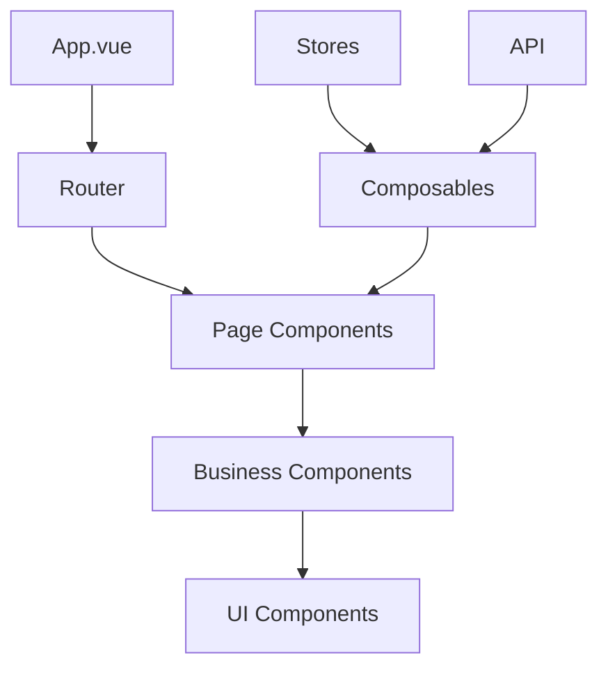
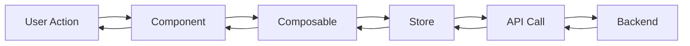

# Front前端文档模板集合

> **版本**：v1.0.0
> **更新日期**：2025-11-16
> **适用范围**：Front前端项目文档模板
> **关键词**：文档模板, 前端, 组件, 函数, 页面

---

## 📋 目录

- [概述](#概述)
- [组件文档模板](#组件文档模板)
- [组合式函数文档模板](#组合式函数文档模板)
- [页面文档模板](#页面文档模板)
- [架构文档模板](#架构文档模板)
- [API文档模板](#api文档模板)
- [使用指南](#使用指南)

---

## 📖 概述

### 模板目的

提供Front前端项目各类文档的标准模板，确保文档结构统一、内容完整、格式规范，提高文档编写效率和质量。

### 模板分类

1. **组件文档模板**：Vue组件的技术文档
2. **组合式函数文档模板**：Composition Function文档
3. **页面文档模板**：页面组件的使用文档
4. **架构文档模板**：系统架构和技术设计文档
5. **API文档模板**：接口和类型定义文档

### 使用方法

1. 复制相应模板到新文档
2. 根据实际内容填充模板
3. 遵循[文档编写规范](FRONTEND_DOCUMENTATION_STANDARDS.md)
4. 使用自动化工具检查质量

---

## 🧩 组件文档模板

### 模板用途

用于编写Vue组件的技术文档，包括组件功能、属性、事件、插槽等详细信息。

### 标准模板

```markdown
---
title: [COMPONENT NAME]
version: v1.0.0
last_updated: 2025-11-16
status: active
category: technical
tags: [vue, component, [component-type]]
---

# [组件名称]组件文档

> **版本**：v1.0.0
> **更新日期**：2025-11-16
> **适用范围**：[组件适用场景]
> **关键词**：[关键词列表]

---

## 📋 目录

- [概述](#概述)
- [功能特性](#功能特性)
- [安装使用](#安装使用)
- [API文档](#api文档)
- [示例代码](#示例代码)
- [注意事项](#注意事项)
- [更新日志](#更新日志)

---

## 📖 概述

### 组件介绍

[组件的详细介绍，包括主要功能和使用场景]

### 设计理念

[组件的设计理念和目标]

### 兼容性

- **Vue版本**：3.x
- **浏览器支持**：Chrome 80+, Firefox 75+, Safari 13+

---

## ✨ 功能特性

- [ ] **特性1**：特性描述
- [ ] **特性2**：特性描述
- [ ] **特性3**：特性描述

---

## 🚀 安装使用

### 基础用法

```vue
<template>
  <ComponentName
    v-model="value"
    :prop1="propValue1"
    @event1="handleEvent1"
  />
</template>

<script setup lang="ts">
import ComponentName from '@/components/ComponentName.vue'

const value = ref('')
const propValue1 = 'example'

const handleEvent1 = (data) => {
  console.log('Event data:', data)
}
</script>
```

### 高级用法

```vue
<template>
  <ComponentName
    v-model="value"
    :config="advancedConfig"
    @custom-event="handleCustomEvent"
  >
    <template #slot1>
      自定义插槽内容
    </template>
  </ComponentName>
</template>

<script setup lang="ts">
const advancedConfig = {
  option1: 'value1',
  option2: 'value2'
}

const handleCustomEvent = (payload) => {
  // 处理复杂事件
}
</script>
```

---

## 📚 API文档

### Props 属性

| 属性名 | 类型 | 默认值 | 必需 | 说明 |
|--------|------|--------|------|------|
| v-model | `string \| number` | `''` | 否 | 双向绑定值 |
| prop1 | `string` | `'default'` | 否 | 属性1说明 |
| prop2 | `boolean` | `false` | 否 | 属性2说明 |
| config | `object` | `{}` | 否 | 配置对象 |

### Events 事件

| 事件名 | 参数 | 说明 |
|--------|------|------|
| change | `(value: string \| number)` | 值改变时触发 |
| submit | `(data: object)` | 提交时触发 |
| custom-event | `(payload: any)` | 自定义事件 |

### Slots 插槽

| 插槽名 | 说明 | 作用域参数 |
|--------|------|------------|
| default | 默认插槽 | - |
| header | 头部插槽 | `{ title: string }` |
| footer | 底部插槽 | `{ actions: array }` |

### Methods 方法

| 方法名 | 参数 | 返回值 | 说明 |
|--------|------|--------|------|
| focus | `()` | `void` | 获取焦点 |
| validate | `()` | `boolean` | 验证表单 |
| reset | `()` | `void` | 重置组件状态 |

---

## 💡 示例代码

### 基础示例

```vue
<template>
  <div class="example-container">
    <ComponentName v-model="inputValue" />
    <p>当前值: {{ inputValue }}</p>
  </div>
</template>

<script setup lang="ts">
import { ref } from 'vue'

const inputValue = ref('Hello World')
</script>
```

### 完整示例

```vue
<template>
  <div class="full-example">
    <ComponentName
      v-model="formData.value"
      :config="componentConfig"
      @change="handleChange"
      @submit="handleSubmit"
    >
      <template #header="{ title }">
        <h3>{{ title }}</h3>
      </template>

      <template #footer="{ actions }">
        <div class="actions">
          <button
            v-for="action in actions"
            :key="action.key"
            @click="action.handler"
          >
            {{ action.label }}
          </button>
        </div>
      </template>
    </ComponentName>
  </div>
</template>

<script setup lang="ts">
import { ref, reactive } from 'vue'

const formData = reactive({
  value: '',
  config: {}
})

const componentConfig = {
  placeholder: '请输入内容',
  maxLength: 100
}

const handleChange = (value) => {
  console.log('Value changed:', value)
}

const handleSubmit = (data) => {
  console.log('Form submitted:', data)
}
</script>
```

---

## ⚠️ 注意事项

### 使用限制

- [ ] 组件必须在Vue 3.x环境中使用
- [ ] 需要正确配置TypeScript类型
- [ ] 某些属性在特定浏览器中可能表现不同

### 性能考虑

- [ ] 大数据量场景建议使用虚拟滚动
- [ ] 频繁更新时注意防抖处理
- [ ] 复杂组件建议使用异步加载

### 常见问题

**Q: 组件不显示？**
A: 检查是否正确导入和注册组件。

**Q: 样式错乱？**
A: 确认CSS作用域和样式隔离设置。

---

## 📝 更新日志

### v1.0.0 (2025-11-16)

- ✨ 初始版本发布
- ✨ 支持基础功能
- 🐛 修复已知问题

### 规划功能

- [ ] 国际化支持
- [ ] 主题定制
- [ ] 无障碍访问

---

## 📚 相关链接

- [组件源码](../../src/components/[ComponentName].vue)
- [使用示例](../../examples/[ComponentName]Example.vue)
- [测试用例](../../tests/components/[ComponentName].spec.ts)

---

**最后更新**：2025-11-16
**维护责任人**：[组件开发者]
**联系方式**：[开发者邮箱]
```

---

## 🔧 组合式函数文档模板

### 模板用途

用于编写Vue 3组合式函数（Composition Function）的技术文档。

### 标准模板

```markdown
---
title: USE [FUNCTION NAME]
version: v1.0.0
last_updated: 2025-11-16
status: active
category: technical
tags: [vue, composable, composition-function]
---

# use[FunctionName] 组合式函数文档

> **版本**：v1.0.0
> **更新日期**：2025-11-16
> **适用范围**：[函数适用场景]
> **关键词**：[关键词列表]

---

## 📋 目录

- [概述](#概述)
- [功能特性](#功能特性)
- [安装使用](#安装使用)
- [API文档](#api文档)
- [示例代码](#示例代码)
- [类型定义](#类型定义)
- [注意事项](#注意事项)
- [更新日志](#更新日志)

---

## 📖 概述

### 函数介绍

[函数的详细介绍，包括主要功能和使用场景]

### 设计理念

[函数的设计理念和目标]

### 依赖要求

- **Vue版本**：3.x
- **TypeScript**：4.0+
- **相关依赖**：[依赖列表]

---

## ✨ 功能特性

- [ ] **特性1**：特性描述
- [ ] **特性2**：特性描述
- [ ] **特性3**：特性描述

---

## 🚀 安装使用

### 基础用法

```typescript
import { useFunctionName } from '@/composables/useFunctionName'

export default {
  setup() {
    const { result, loading, error } = useFunctionName()

    return {
      result,
      loading,
      error
    }
  }
}
```

### 组合式API用法

```vue
<script setup lang="ts">
import { useFunctionName } from '@/composables/useFunctionName'

const { result, loading, error, execute } = useFunctionName({
  param1: 'value1',
  param2: 'value2'
})

// 执行函数
await execute()

// 处理结果
watch(result, (newResult) => {
  console.log('Result:', newResult)
})
</script>
```

---

## 📚 API文档

### 参数选项

| 参数名 | 类型 | 默认值 | 必需 | 说明 |
|--------|------|--------|------|------|
| param1 | `string` | `''` | 否 | 参数1说明 |
| param2 | `number` | `0` | 否 | 参数2说明 |
| options | `object` | `{}` | 否 | 配置选项 |

### 返回值

| 属性名 | 类型 | 说明 |
|--------|------|------|
| result | `T` | 执行结果 |
| loading | `boolean` | 加载状态 |
| error | `Error \| null` | 错误信息 |
| execute | `() => Promise<T>` | 执行函数 |

### 方法说明

#### execute()

执行主要逻辑的函数。

**参数**：无

**返回值**：`Promise<T>` - 执行结果

**示例**：
```typescript
const { execute } = useFunctionName()
const result = await execute()
```

---

## 💡 示例代码

### 基础示例

```vue
<template>
  <div>
    <button @click="execute" :disabled="loading">
      {{ loading ? '执行中...' : '执行' }}
    </button>

    <div v-if="result">
      结果: {{ result }}
    </div>

    <div v-if="error" class="error">
      错误: {{ error.message }}
    </div>
  </div>
</template>

<script setup lang="ts">
import { useFunctionName } from '@/composables/useFunctionName'

const { result, loading, error, execute } = useFunctionName({
  param1: 'example'
})
</script>
```

### 高级示例

```vue
<template>
  <div>
    <form @submit.prevent="handleSubmit">
      <input v-model="formData.param1" placeholder="参数1" />
      <input v-model="formData.param2" placeholder="参数2" type="number" />
      <button type="submit" :disabled="loading">
        提交
      </button>
    </form>

    <ResultDisplay
      :data="result"
      :loading="loading"
      :error="error"
      @retry="execute"
    />
  </div>
</template>

<script setup lang="ts">
import { ref, reactive } from 'vue'
import { useFunctionName } from '@/composables/useFunctionName'

const formData = reactive({
  param1: '',
  param2: 0
})

const { result, loading, error, execute } = useFunctionName()

const handleSubmit = async () => {
  await execute(formData)
}
</script>
```

---

## 📝 类型定义

```typescript
// 函数参数接口
interface UseFunctionNameOptions {
  /** 参数1说明 */
  param1?: string
  /** 参数2说明 */
  param2?: number
  /** 配置选项 */
  options?: {
    /** 是否启用缓存 */
    enableCache?: boolean
    /** 超时时间 */
    timeout?: number
  }
}

// 返回值接口
interface UseFunctionNameReturn<T = any> {
  /** 执行结果 */
  result: Ref<T | null>
  /** 加载状态 */
  loading: Ref<boolean>
  /** 错误信息 */
  error: Ref<Error | null>
  /** 执行函数 */
  execute: (params?: Partial<UseFunctionNameOptions>) => Promise<T>
}

// 错误类型
class FunctionNameError extends Error {
  constructor(message: string, public code: string) {
    super(message)
    this.name = 'FunctionNameError'
  }
}
```

---

## ⚠️ 注意事项

### 使用限制

- [ ] 必须在Vue 3 setup函数或`<script setup>`中使用
- [ ] 需要正确配置TypeScript类型支持
- [ ] 某些选项在服务端渲染中可能表现不同

### 性能考虑

- [ ] 避免在模板中直接调用execute方法
- [ ] 适当使用缓存选项减少重复请求
- [ ] 大数据量处理时注意内存使用

### 错误处理

```typescript
const { result, loading, error, execute } = useFunctionName()

try {
  await execute()
} catch (err) {
  if (err instanceof FunctionNameError) {
    // 处理特定错误
    console.error('Function error:', err.code)
  } else {
    // 处理通用错误
    console.error('Unknown error:', err)
  }
}
```

---

## 📝 更新日志

### v1.0.0 (2025-11-16)

- ✨ 初始版本发布
- ✨ 支持基础功能
- 🐛 修复已知问题

---

## 📚 相关链接

- [函数源码](../../src/composables/useFunctionName.ts)
- [使用示例](../../examples/useFunctionNameExample.vue)
- [测试用例](../../tests/composables/useFunctionName.spec.ts)

---

**最后更新**：2025-11-16
**维护责任人**：[函数开发者]
**联系方式**：[开发者邮箱]
```

---

## 📄 页面文档模板

### 模板用途

用于编写页面组件的使用文档，包括页面功能、路由配置、使用方法等。

### 标准模板

```markdown
---
title: [PAGE NAME] PAGE
version: v1.0.0
last_updated: 2025-11-16
status: active
category: technical
tags: [vue, page, [page-type]]
---

# [页面名称]页面文档

> **版本**：v1.0.0
> **更新日期**：2025-11-16
> **适用范围**：[页面适用场景]
> **关键词**：[关键词列表]

---

## 📋 目录

- [概述](#概述)
- [功能特性](#功能特性)
- [路由配置](#路由配置)
- [页面结构](#页面结构)
- [使用方法](#使用方法)
- [数据流](#数据流)
- [权限控制](#权限控制)
- [注意事项](#注意事项)
- [更新日志](#更新日志)

---

## 📖 概述

### 页面介绍

[页面的详细介绍，包括主要功能和业务场景]

### 设计目标

[页面的设计目标和用户价值]

### 技术栈

- **框架**：Vue 3 + TypeScript
- **UI库**：Element Plus
- **状态管理**：Pinia
- **路由**：Vue Router 4

---

## ✨ 功能特性

- [ ] **特性1**：特性描述
- [ ] **特性2**：特性描述
- [ ] **特性3**：特性描述

---

## 🛣️ 路由配置

### 路由信息

| 属性 | 值 |
|------|-----|
| 路径 | `/path/to/page` |
| 名称 | `PageName` |
| 组件 | `pages/pageName/index.vue` |
| 元信息 | `{ title: '页面标题', requiresAuth: true }` |

### 路由定义

```typescript
// router/index.ts
{
  path: '/page-name',
  name: 'PageName',
  component: () => import('@/pages/pageName/index.vue'),
  meta: {
    title: '页面标题',
    requiresAuth: true,
    roles: ['admin', 'user']
  }
}
```

### 导航守卫

```typescript
// 权限检查
if (route.meta.requiresAuth && !isAuthenticated()) {
  return { name: 'Login' }
}

// 角色检查
if (route.meta.roles && !hasRole(route.meta.roles)) {
  return { name: '403' }
}
```

---

## 🏗️ 页面结构

### 组件层次

```
PageName/
├── index.vue          # 主页面组件
├── components/        # 页面专用组件
│   ├── Header.vue     # 页面头部
│   ├── Content.vue    # 页面内容
│   └── Footer.vue     # 页面底部
├── composables/       # 页面组合式函数
│   └── usePageLogic.ts
├── types/            # 页面类型定义
│   └── index.ts
└── styles/           # 页面样式
    └── index.scss
```

### 主组件结构

```vue
<template>
  <div class="page-container">
    <!-- 页面头部 -->
    <PageHeader
      :title="pageTitle"
      @action="handleAction"
    />

    <!-- 页面内容 -->
    <div class="page-content">
      <PageContent
        :data="pageData"
        :loading="loading"
        @refresh="handleRefresh"
      />
    </div>

    <!-- 页面底部 -->
    <PageFooter
      :stats="pageStats"
    />
  </div>
</template>

<script setup lang="ts">
import PageHeader from './components/Header.vue'
import PageContent from './components/Content.vue'
import PageFooter from './components/Footer.vue'

// 页面逻辑
</script>
```

---

## 📖 使用方法

### 基础用法

```vue
<template>
  <PageName />
</template>

<script setup lang="ts">
// 页面会自动处理数据加载和状态管理
</script>
```

### 带参数使用

```vue
<template>
  <PageName
    :id="$route.params.id"
    :mode="editMode"
  />
</template>

<script setup lang="ts">
import { computed } from 'vue'
import { useRoute } from 'vue-router'

const route = useRoute()
const editMode = computed(() => route.query.mode === 'edit')
</script>
```

---

## 🔄 数据流

### 数据获取

```typescript
// 使用组合式函数管理数据
const { data, loading, error, loadData } = usePageData()

// 页面加载时获取数据
onMounted(() => {
  loadData()
})
```

### 数据更新

```typescript
// 更新数据
const updateData = async (newData) => {
  try {
    await api.updateData(newData)
    await loadData() // 重新加载
    showSuccess('更新成功')
  } catch (err) {
    showError('更新失败')
  }
}
```

### 状态管理

```typescript
// 使用Pinia管理页面状态
const pageStore = usePageStore()

// 响应式状态
const { currentView, filters } = storeToRefs(pageStore)

// 状态变更
const changeView = (view) => {
  pageStore.setCurrentView(view)
}
```

---

## 🔐 权限控制

### 页面权限

| 权限 | 说明 | 控制方式 |
|------|------|----------|
| 查看权限 | 可以访问页面 | 路由守卫 |
| 编辑权限 | 可以编辑内容 | 按钮显示 |
| 删除权限 | 可以删除数据 | 操作控制 |

### 权限检查

```typescript
// 在组件中使用权限检查
const { canEdit, canDelete } = usePermissions()

// 根据权限显示内容
<button v-if="canEdit" @click="editItem">
  编辑
</button>
```

---

## ⚠️ 注意事项

### 性能优化

- [ ] 列表页面使用虚拟滚动
- [ ] 大数据量分页加载
- [ ] 图片懒加载
- [ ] 防抖处理用户输入

### 用户体验

- [ ] 加载状态提示
- [ ] 错误处理和友好提示
- [ ] 操作确认对话框
- [ ] 无障碍访问支持

### 浏览器兼容性

- [ ] 移动端适配
- [ ] 低版本浏览器降级
- [ ] 网络异常处理

---

## 📝 更新日志

### v1.0.0 (2025-11-16)

- ✨ 初始版本发布
- ✨ 支持基础功能

---

## 📚 相关链接

- [页面源码](../../src/pages/pageName/index.vue)
- [页面组件](./components/)
- [页面样式](./styles/)

---

**最后更新**：2025-11-16
**维护责任人**：[页面开发者]
**联系方式**：[开发者邮箱]
```

---

## 🏛️ 架构文档模板

### 模板用途

用于编写系统架构和技术设计文档。

### 标准模板

```markdown
---
title: FRONTEND ARCHITECTURE OVERVIEW
version: v1.0.0
last_updated: 2025-11-16
status: active
category: technical
tags: [architecture, frontend, design]
---

# Front前端架构概览

> **版本**：v1.0.0
> **更新日期**：2025-11-16
> **适用范围**：Front前端系统架构设计
> **关键词**：架构, 前端, 设计, Vue

---

## 📋 目录

- [概述](#概述)
- [技术栈选择](#技术栈选择)
- [目录结构](#目录结构)
- [设计原则](#设计原则)
- [核心架构](#核心架构)
- [数据流设计](#数据流设计)
- [性能优化](#性能优化)
- [扩展性考虑](#扩展性考虑)

---

## 📖 概述

### 系统介绍

[系统整体介绍和业务背景]

### 架构目标

[架构设计的目标和原则]

### 设计理念

[整体的设计理念和技术思路]

---

## 🛠️ 技术栈选择

### 核心框架

| 技术 | 版本 | 说明 |
|------|------|------|
| Vue | 3.x | 渐进式前端框架 |
| TypeScript | 4.x | 类型安全 |
| Vite | 4.x | 构建工具 |
| Pinia | 2.x | 状态管理 |

### UI和样式

| 技术 | 版本 | 说明 |
|------|------|------|
| Element Plus | 2.x | UI组件库 |
| SCSS | 1.x | 样式预处理器 |
| Tailwind CSS | 3.x | 原子化CSS |

### 工具库

| 技术 | 版本 | 说明 |
|------|------|------|
| Vue Router | 4.x | 路由管理 |
| Axios | 1.x | HTTP客户端 |
| VueUse | 9.x | Vue组合式函数库 |

---

## 📁 目录结构

### 整体架构

```
src/
├── pages/              # 页面组件（路由级别）
├── components/         # 通用组件
├── composables/        # 组合式函数
├── stores/            # 状态管理
├── router/            # 路由配置
├── types/             # 类型定义
├── utils/             # 工具函数
├── styles/            # 全局样式
├── assets/            # 静态资源
├── config/            # 配置文件
└── api/               # API接口
```

### 组件组织

```
components/
├── common/            # 通用基础组件
├── business/          # 业务组件
├── layout/            # 布局组件
└── ui/                # UI组件
```

---

## 🎯 设计原则

### 1. 组件化原则

- [ ] 组件职责单一
- [ ] 可复用性强
- [ ] 易于测试和维护

### 2. 类型安全原则

- [ ] 使用TypeScript
- [ ] 完整的类型定义
- [ ] 编译时类型检查

### 3. 组合式API原则

- [ ] 使用Composition API
- [ ] 逻辑复用和组合
- [ ] 响应式数据管理

### 4. 性能优化原则

- [ ] 懒加载和代码分割
- [ ] 虚拟滚动和大列表优化
- [ ] 缓存策略和防抖节流

---

## 🏗️ 核心架构

### 组件架构



### 数据流架构



---

## 🔄 数据流设计

### 单向数据流

1. **用户交互** → 组件事件触发
2. **组件** → 调用组合式函数
3. **组合式函数** → 更新Store状态
4. **Store** → 触发API调用
5. **API** → 返回数据更新Store
6. **Store** → 响应式更新组件

### 状态管理

```typescript
// Store定义
export const useAppStore = defineStore('app', {
  state: () => ({
    user: null,
    loading: false,
    error: null
  }),

  getters: {
    isAuthenticated: (state) => !!state.user
  },

  actions: {
    async login(credentials) {
      this.loading = true
      try {
        const user = await api.login(credentials)
        this.user = user
      } catch (error) {
        this.error = error
      } finally {
        this.loading = false
      }
    }
  }
})
```

---

## ⚡ 性能优化

### 构建优化

- [ ] 代码分割和懒加载
- [ ] Tree Shaking
- [ ] 压缩和混淆

### 运行时优化

- [ ] 虚拟滚动
- [ ] 图片懒加载
- [ ] 防抖和节流
- [ ] 内存泄漏防范

### 缓存策略

- [ ] API响应缓存
- [ ] 组件状态缓存
- [ ] 静态资源缓存

---

## 🔧 扩展性考虑

### 插件系统

- [ ] 组件插件化
- [ ] 功能模块插件
- [ ] 第三方集成插件

### 配置化

- [ ] 路由配置化
- [ ] 组件配置化
- [ ] 主题配置化

### 国际化

- [ ] 多语言支持
- [ ] 动态语言切换
- [ ] 语言包管理

---

## 📚 相关文档

- [组件文档](../components/)
- [组合式函数文档](../composables/)
- [API文档](../api/)

---

**最后更新**：2025-11-16
**维护责任人**：架构师
**联系方式**：architect@company.com
```

---

## 🔌 API文档模板

### 模板用途

用于编写API接口和类型定义的文档。

### 标准模板

```markdown
---
title: [API NAME] API
version: v1.0.0
last_updated: 2025-11-16
status: active
category: technical
tags: [api, [api-type]]
---

# [API名称]接口文档

> **版本**：v1.0.0
> **更新日期**：2025-11-16
> **适用范围**：[API适用场景]
> **关键词**：[关键词列表]

---

## 📋 目录

- [概述](#概述)
- [接口列表](#接口列表)
- [数据模型](#数据模型)
- [错误处理](#错误处理)
- [使用示例](#使用示例)
- [版本历史](#版本历史)

---

## 📖 概述

### API介绍

[API的详细介绍和功能说明]

### 基础信息

| 属性 | 值 |
|------|-----|
| 基础URL | `https://api.company.com/v1` |
| 认证方式 | Bearer Token |
| 数据格式 | JSON |
| 字符编码 | UTF-8 |

---

## 📋 接口列表

### 用户管理API

#### 1. 获取用户列表

**接口地址**：`GET /users`

**功能说明**：获取系统用户列表

**请求参数**：

| 参数名 | 类型 | 必需 | 说明 |
|--------|------|------|------|
| page | number | 否 | 页码，默认1 |
| size | number | 否 | 每页数量，默认10 |
| keyword | string | 否 | 搜索关键词 |

**响应示例**：

```json
{
  "code": 200,
  "message": "success",
  "data": {
    "list": [
      {
        "id": 1,
        "name": "用户1",
        "email": "user1@example.com",
        "status": "active"
      }
    ],
    "total": 100,
    "page": 1,
    "size": 10
  }
}
```

---

## 📊 数据模型

### 用户模型

```typescript
interface User {
  /** 用户ID */
  id: number
  /** 用户名 */
  name: string
  /** 邮箱 */
  email: string
  /** 状态 */
  status: 'active' | 'inactive'
  /** 创建时间 */
  createdAt: string
  /** 更新时间 */
  updatedAt: string
}
```

### 响应模型

```typescript
interface ApiResponse<T = any> {
  /** 状态码 */
  code: number
  /** 消息 */
  message: string
  /** 数据 */
  data: T
}
```

---

## ❌ 错误处理

### 错误码说明

| 错误码 | 说明 | 处理方式 |
|--------|------|----------|
| 400 | 请求参数错误 | 检查参数格式 |
| 401 | 未授权 | 重新登录 |
| 403 | 权限不足 | 联系管理员 |
| 404 | 资源不存在 | 检查URL |
| 500 | 服务器错误 | 重试或联系技术支持 |

### 错误响应格式

```json
{
  "code": 400,
  "message": "请求参数错误",
  "data": {
    "field": "email",
    "message": "邮箱格式不正确"
  }
}
```

---

## 💡 使用示例

### JavaScript示例

```javascript
// 获取用户列表
const getUsers = async (params = {}) => {
  try {
    const response = await fetch('/api/users?' + new URLSearchParams(params), {
      headers: {
        'Authorization': `Bearer ${token}`,
        'Content-Type': 'application/json'
      }
    })

    if (!response.ok) {
      throw new Error(`HTTP error! status: ${response.status}`)
    }

    const result = await response.json()
    return result
  } catch (error) {
    console.error('获取用户列表失败:', error)
    throw error
  }
}
```

### Vue组合式函数示例

```typescript
// composables/useUsers.ts
import { ref } from 'vue'

export const useUsers = () => {
  const users = ref([])
  const loading = ref(false)
  const error = ref(null)

  const fetchUsers = async (params = {}) => {
    loading.value = true
    error.value = null

    try {
      const response = await $api.get('/users', { params })
      users.value = response.data.list
    } catch (err) {
      error.value = err.message
    } finally {
      loading.value = false
    }
  }

  return {
    users,
    loading,
    error,
    fetchUsers
  }
}
```

---

## 📝 版本历史

### v1.0.0 (2025-11-16)

- ✨ 初始版本发布
- ✨ 支持基础CRUD操作

---

## 📚 相关链接

- [API源码](../../src/api/)
- [类型定义](../../src/types/)

---

**最后更新**：2025-11-16
**维护责任人**：后端开发团队
**联系方式**：api-team@company.com
```

---

## 🛠️ 使用指南

### 模板使用流程

1. **选择模板**：根据文档类型选择相应模板
2. **复制内容**：复制模板到新文档文件
3. **填充内容**：根据实际需求填充具体内容
4. **格式检查**：使用文档检查工具验证格式
5. **审查发布**：提交代码审查后发布

### 自动化工具

使用提供的自动化工具快速生成文档：

```bash
# 生成组件文档
npm run docs:generate -- --type component --name ComponentName

# 生成组合式函数文档
npm run docs:generate -- --type composable --name useFunctionName

# 生成页面文档
npm run docs:generate -- --type page --name PageName
```

### 质量检查

```bash
# 检查文档质量
npm run docs:check

# 检查特定文档
npm run docs:check -- docs/path/to/document.md
```

---

**最后更新**：2025-11-16
**维护责任人**：文档工程团队
**联系方式**：docs-team@company.com
