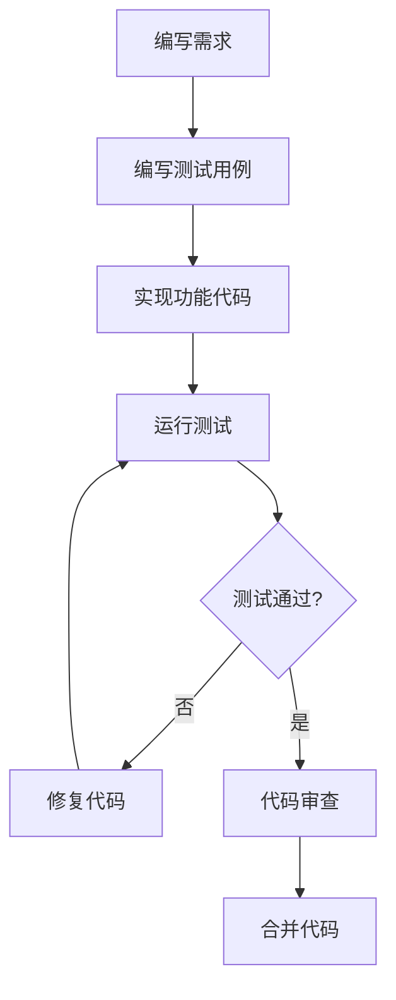

# Front前端测试策略

> **版本**：v1.0.0
> **更新日期**：2025-11-16
> **适用范围**：Front前端项目测试策略和实施指南
> **关键词**：测试策略, 前端测试, 质量保证, 自动化测试

---

## 📋 目录

- [概述](#概述)
- [测试类型](#测试类型)
- [测试金字塔](#测试金字塔)
- [测试覆盖率目标](#测试覆盖率目标)
- [测试环境](#测试环境)
- [测试流程](#测试流程)
- [测试工具](#测试工具)
- [CI/CD集成](#cicd集成)
- [质量指标](#质量指标)

---

## 📖 概述

### 策略目标

建立全面的测试体系，确保代码质量、提高开发效率、降低生产环境风险。

### 测试原则

1. **测试驱动开发**：优先编写测试，再实现功能
2. **自动化优先**：最大化自动化测试覆盖范围
3. **持续集成**：测试集成到CI/CD流程
4. **分层测试**：建立完整的测试金字塔
5. **质量内建**：测试贯穿整个开发过程

### 测试范围

- **单元测试**：函数和组件的独立测试
- **集成测试**：模块间的交互测试
- **端到端测试**：完整用户流程测试
- **性能测试**：响应时间和资源使用测试
- **可访问性测试**：无障碍访问测试

---

## 🧪 测试类型

### 1. 单元测试 (Unit Tests)

#### 定义

测试最小可测试单元（函数、组件、工具）的功能正确性。

#### 测试对象

- **组合式函数**：业务逻辑函数
- **工具函数**：数据处理、格式化函数
- **组件逻辑**：组件的计算属性和方法
- **类型守卫**：TypeScript类型检查函数

#### 示例

```typescript
// composables/useUser.test.ts
import { describe, it, expect } from 'vitest'
import { useUser } from './useUser'

describe('useUser', () => {
  it('should initialize with null user', () => {
    const { user } = useUser()
    expect(user.value).toBeNull()
  })

  it('should fetch user data successfully', async () => {
    const { user, fetchUser } = useUser()
    await fetchUser('123')
    expect(user.value).not.toBeNull()
    expect(user.value?.id).toBe('123')
  })
})
```

### 2. 组件测试 (Component Tests)

#### 定义

测试Vue组件的渲染、交互和状态管理。

#### 测试内容

- **组件渲染**：正确渲染DOM结构
- **Props传递**：属性正确传递和响应
- **事件触发**：用户交互正确触发事件
- **插槽渲染**：插槽内容正确渲染
- **样式应用**：CSS类名正确应用

#### 示例

```typescript
// components/Button.test.ts
import { describe, it, expect } from 'vitest'
import { mount } from '@vue/test-utils'
import Button from './Button.vue'

describe('Button', () => {
  it('renders correctly', () => {
    const wrapper = mount(Button, {
      props: { type: 'primary' }
    })
    expect(wrapper.classes()).toContain('button--primary')
  })

  it('emits click event', async () => {
    const wrapper = mount(Button)
    await wrapper.trigger('click')
    expect(wrapper.emitted('click')).toBeTruthy()
  })
})
```

### 3. 集成测试 (Integration Tests)

#### 定义

测试多个组件或模块间的交互和数据流。

#### 测试场景

- **页面导航**：路由跳转和页面加载
- **数据流转**：API调用和数据更新
- **状态同步**：Pinia store状态同步
- **表单提交**：完整表单提交流程

#### 示例

```typescript
// views/Login.test.ts
describe('Login Page', () => {
  it('completes login flow', async () => {
    // 模拟完整登录流程
    const wrapper = mount(LoginPage)
    const emailInput = wrapper.find('input[type="email"]')
    const passwordInput = wrapper.find('input[type="password"]')

    await emailInput.setValue('user@example.com')
    await passwordInput.setValue('password123')
    await wrapper.find('button[type="submit"]').trigger('click')

    // 验证登录成功
    expect(mockRouter.push).toHaveBeenCalledWith('/dashboard')
  })
})
```

### 4. 端到端测试 (E2E Tests)

#### 定义

模拟真实用户操作，测试完整应用功能。

#### 测试工具

使用Playwright进行E2E测试：

```typescript
// e2e/login.spec.ts
import { test, expect } from '@playwright/test'

test('user can log in successfully', async ({ page }) => {
  await page.goto('/login')

  // 填写登录表单
  await page.fill('input[type="email"]', 'user@example.com')
  await page.fill('input[type="password"]', 'password123')
  await page.click('button[type="submit"]')

  // 验证登录成功
  await expect(page).toHaveURL('/dashboard')
  await expect(page.locator('.user-name')).toContainText('John Doe')
})
```

---

## 🏗️ 测试金字塔

### 金字塔结构

```
     E2E Tests (端到端测试)
         ▲
         │ 20%
         │
   Integration Tests (集成测试)
         ▲
         │ 30%
         │
    Component Tests (组件测试)
         ▲
         │ 40%
         │
     Unit Tests (单元测试)
         ▲
         │ 10%
```

### 测试分布

| 测试类型 | 数量比例 | 执行频率 | 执行时间 |
|----------|----------|----------|----------|
| 单元测试 | 40% | 每次提交 | < 1分钟 |
| 组件测试 | 30% | 每次提交 | 2-5分钟 |
| 集成测试 | 20% | 每日 | 5-10分钟 |
| E2E测试 | 10% | 部署前 | 10-30分钟 |

---

## 🎯 测试覆盖率目标

### 覆盖率指标

| 指标类型 | 当前目标 | 最终目标 | 说明 |
|----------|----------|----------|------|
| 语句覆盖率 | 80% | 90% | 执行到的代码行数比例 |
| 分支覆盖率 | 75% | 85% | 条件分支覆盖比例 |
| 函数覆盖率 | 85% | 95% | 函数调用覆盖比例 |
| 行覆盖率 | 80% | 90% | 代码行覆盖比例 |

### 覆盖范围

#### 必须覆盖

- ✅ **核心业务逻辑**：用户认证、课程预约、支付流程
- ✅ **工具函数**：数据处理、格式化、验证函数
- ✅ **组合式函数**：所有自定义hooks
- ✅ **错误处理**：异常情况和边界条件

#### 建议覆盖

- 🔶 **UI组件**：核心交互组件
- 🔶 **路由守卫**：权限检查逻辑
- 🔶 **状态管理**：Pinia store mutations
- 🔶 **API调用**：网络请求和响应处理

#### 可选覆盖

- ❌ **纯展示组件**：无逻辑的展示性组件
- ❌ **第三方库**：外部依赖的包装函数
- ❌ **样式代码**：CSS/SCSS样式定义

---

## 🖥️ 测试环境

### 本地开发环境

```bash
# 安装依赖
npm install

# 运行单元测试
npm run test:unit

# 运行组件测试
npm run test:component

# 运行所有测试
npm run test

# 生成覆盖率报告
npm run test:coverage
```

### CI/CD环境

#### GitHub Actions配置

```yaml
# .github/workflows/test.yml
name: Test
on: [push, pull_request]
jobs:
  test:
    runs-on: ubuntu-latest
    steps:
      - uses: actions/checkout@v3
      - uses: actions/setup-node@v3
        with:
          node-version: '18'
      - run: npm ci
      - run: npm run test:coverage
      - run: npm run test:e2e
```

### 测试数据管理

#### Mock数据策略

```typescript
// __mocks__/api.ts
export const mockUser = {
  id: '123',
  name: 'John Doe',
  email: 'john@example.com',
  role: 'user'
}

export const mockCourses = [
  { id: '1', title: '瑜伽课程', instructor: 'Alice' },
  { id: '2', title: '普拉提课程', instructor: 'Bob' }
]
```

#### 测试数据库

```typescript
// 测试数据库配置
export const testDbConfig = {
  host: 'localhost',
  port: 5432,
  database: 'gym_test',
  username: 'test_user',
  password: 'test_password'
}
```

---

## 🔄 测试流程

### 开发流程中的测试



### TDD开发流程

1. **Red**：编写失败的测试
2. **Green**：编写刚好通过测试的代码
3. **Refactor**：重构代码，保持测试通过

### 测试用例编写

```typescript
describe('Course Booking', () => {
  describe('when user is logged in', () => {
    describe('and course has available slots', () => {
      it('should successfully book the course', async () => {
        // Arrange
        const user = createMockUser()
        const course = createMockCourse({ availableSlots: 5 })

        // Act
        const result = await bookCourse(user.id, course.id)

        // Assert
        expect(result.success).toBe(true)
        expect(result.bookingId).toBeDefined()
      })
    })

    describe('and course is full', () => {
      it('should reject booking with error message', async () => {
        // Arrange
        const user = createMockUser()
        const course = createMockCourse({ availableSlots: 0 })

        // Act & Assert
        await expect(bookCourse(user.id, course.id))
          .rejects
          .toThrow('Course is full')
      })
    })
  })
})
```

---

## 🛠️ 测试工具

### 测试框架

| 工具 | 用途 | 配置 |
|------|------|------|
| **Vitest** | 单元测试框架 | `vitest.config.ts` |
| **Vue Test Utils** | Vue组件测试 | `@vue/test-utils` |
| **Playwright** | E2E测试 | `playwright.config.ts` |
| **Happy DOM** | DOM模拟 | 测试环境配置 |

### Mock和Stub

```typescript
// 使用msw进行API Mock
import { rest } from 'msw'
import { setupServer } from 'msw/node'

const server = setupServer(
  rest.get('/api/user', (req, res, ctx) => {
    return res(ctx.json(mockUser))
  })
)

// 测试前启动Mock服务器
beforeAll(() => server.listen())
afterEach(() => server.resetHandlers())
afterAll(() => server.close())
```

### 测试辅助工具

```typescript
// 自定义测试工具
export const renderWithProviders = (component: Component) => {
  const pinia = createPinia()
  const router = createRouter({
    history: createMemoryHistory(),
    routes: []
  })

  return mount(component, {
    global: {
      plugins: [pinia, router],
      stubs: ['router-link', 'router-view']
    }
  })
}
```

---

## 🔄 CI/CD集成

### 自动化测试流程

```yaml
# 完整的CI/CD测试流程
name: CI/CD Pipeline
on: [push, pull_request]

jobs:
  test:
    runs-on: ubuntu-latest
    steps:
      - name: Checkout code
        uses: actions/checkout@v3

      - name: Setup Node.js
        uses: actions/setup-node@v3
        with:
          node-version: '18'
          cache: 'npm'

      - name: Install dependencies
        run: npm ci

      - name: Run linting
        run: npm run lint

      - name: Run type checking
        run: npm run type-check

      - name: Run unit tests
        run: npm run test:unit

      - name: Run component tests
        run: npm run test:component

      - name: Run integration tests
        run: npm run test:integration

      - name: Run E2E tests
        run: npm run test:e2e

      - name: Generate coverage report
        run: npm run test:coverage

      - name: Upload coverage reports
        uses: codecov/codecov-action@v3
```

### 质量门禁

```yaml
# 质量检查配置
- name: Quality Gate
  run: |
    # 覆盖率检查
    if [ $(jq '.total.lines.pct' coverage/coverage-summary.json) -lt 80 ]; then
      echo "Coverage too low"
      exit 1
    fi

    # ESLint检查
    if [ $? -ne 0 ]; then
      echo "Linting failed"
      exit 1
    fi
```

---

## 📊 质量指标

### 测试质量指标

| 指标 | 目标值 | 当前值 | 状态 |
|------|--------|--------|------|
| 单元测试覆盖率 | ≥80% | - | 📝 待测量 |
| 组件测试覆盖率 | ≥70% | - | 📝 待测量 |
| E2E测试通过率 | ≥95% | - | 📝 待测量 |
| 测试执行时间 | <5分钟 | - | 📝 待测量 |

### 缺陷发现指标

| 指标 | 计算方法 | 目标值 |
|------|----------|--------|
| 缺陷发现率 | 生产缺陷 / 总缺陷 | <20% |
| 缺陷修复时间 | 缺陷发现到修复时间 | <24小时 |
| 回归缺陷率 | 回归缺陷 / 总缺陷 | <5% |

### 持续改进

#### 每月质量评审

- 分析测试覆盖率趋势
- 识别测试薄弱环节
- 制定改进计划

#### 测试效果评估

- 生产环境缺陷统计
- 用户反馈分析
- 开发效率影响评估

---

## 📚 相关链接

- [开发环境搭建](../guides/DEVELOPMENT_SETUP.md)
- [代码规范](../guides/CODING_STANDARDS.md)
- [CI/CD指南](../guides/CI_CD_GUIDE.md)

---

**最后更新**：2025-11-16
**维护责任人**：测试团队
**联系方式**：qa-team@company.com

