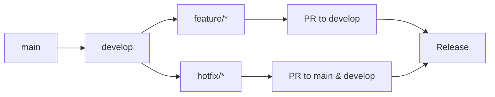

## 开发者指南

本文帮助新成员在本地搭建完整的开发环境，并说明常用脚本、调试技巧与常见问题。

### 1. 环境要求

| 依赖 | 版本要求 | 说明 |
| --- | --- | --- |
| Git | 2.40+ | 推荐启用 LFS（如需上传素材） |
| Node.js | 18 LTS+ | 前端（front/admin）依赖 |
| npm | 9+ | 与 Node 同步升级 |
| Java | 21+ | Spring Boot 主工程 |
| Maven | 3.9+ | 后端构建/测试 |
| Docker & Docker Compose | 最新稳定版 | 本地 PostgreSQL |

### 2. 仓库克隆与依赖安装

```bash
git clone <repo-url> safe-room
cd safe-room

# 安装后端依赖
cd springboot1ngh61a2
mvn -q -DskipTests package   # 首次可跳过测试以下载依赖

# 安装前台依赖
cd src/main/resources/front/front
npm install

# 安装管理后台依赖
cd ../admin/admin
npm install
```

> 提示：前台与后台两套 npm 依赖相互独立，修改其中任意一套时需在对应目录运行脚本。

### 3. 本地运行流程

#### 3.1 启动数据库

```powershell
.\start-db.ps1     # Windows
./start-db.sh      # macOS/Linux
# 或
docker-compose up -d
```

数据库启动后，会自动执行 `schema-postgresql.sql` 与 `data.sql`。

#### 3.2 启动后端

```bash
cd springboot1ngh61a2
mvn spring-boot:run
# 指定环境
mvn spring-boot:run -Dspring-boot.run.profiles=prod
```

服务默认监听 `http://localhost:8080/springboot1ngh61a2`。

#### 3.3 启动前台 / 后台

```bash
# 前台
cd springboot1ngh61a2/src/main/resources/front/front
npm run dev

# 管理后台
cd springboot1ngh61a2/src/main/resources/admin/admin
npm run dev
```

### 4. 常用脚本

| 场景 | 命令 |
| --- | --- |
| 后端测试 | `mvn test` |
| 生成覆盖率报告 | `mvn test && open target/site/jacoco/index.html` |
| 前端单元测试 | `npm run test:unit` |
| 前端 E2E 测试 | `npm run test:e2e` / `npm run test:e2e:ui` |
| Lint & Format（前端） | `npm run check:all` / `npm run check:all:fix` |
| TypeScript 类型检查 | `npm run type-check` |

> 每个前端子项目都包含同名脚本，请在对应目录执行。

### 5. 调试建议

1. **后端**：使用 IDE（IntelliJ IDEA）附加到 `SpringbootSchemaApplication`，结合 `application.yml`/`application-prod.yml` 切换配置。
2. **前端**：Vite Dev Server 自带 HMR；如需后端代理，可在 `vite.config.ts` 中配置 `server.proxy`。
3. **Mock 数据**：后端测试使用 `test-schema.sql` 与 `test-data.sql`，前端可使用 `axios-mock-adapter` 快速拦截请求。
4. **日志**：后端输出在控制台与 `logs/` 目录；前端可在浏览器 DevTools 中查看 `localStorage/sessionStorage` 状态。

### 6. 常见问题

| 问题 | 排查步骤 |
| --- | --- |
| 无法连接数据库 | 确认 `docker-compose up -d` 已启动；`docker-compose logs postgres` 查看错误；检查 `.env`/`application.yml` 中的端口与密码 |
| Maven 下载缓慢 | 配置国内镜像或使用公司 Nexus；`mvn -U clean install` 触发更新 |
| npm install 失败 | 删除 `node_modules` + `package-lock.json`；切换更快的 registry（如 `npm config set registry https://registry.npmmirror.com`） |
| 前端接口 404 | 确认后端启动路径设置为 `/springboot1ngh61a2`; 检查 `.env` 或 `src/common/http.ts` 中的 baseURL |
| Playwright 浏览器缺失 | 运行 `npx playwright install` |

### 7. 代码规范与提交

1. 在对应前端目录运行 `npm run check:all:fix`，确保 ESLint/Prettier/Stylelint 通过。
2. Husky + lint-staged 会在 `git commit` 前自动执行 lint。
3. 后端提交前至少运行 `mvn test -DskipITs`（如有集成测试耗时，可按需跳过）。

### 8. CI/CD 集成开发

#### 8.1 GitHub Actions 工作流

项目配置了完整的CI/CD流水线，支持：

- **代码质量检查**: 自动化lint、格式化、类型检查
- **测试执行**: 单元测试、集成测试、E2E测试
- **安全扫描**: 依赖漏洞扫描、容器镜像安全检查
- **自动化部署**: 支持多环境自动部署
- **文档发布**: 自动生成和发布技术文档

#### 8.2 分支策略



**分支命名规范**:
- `main`: 生产环境代码
- `develop`: 开发主分支
- `feature/xxx`: 新功能开发
- `hotfix/xxx`: 紧急修复
- `release/v1.x.x`: 发布分支

#### 8.3 提交规范

采用 [Conventional Commits](https://conventionalcommits.org/) 规范：

```bash
# 功能提交
feat: 添加用户注册功能
feat(auth): 实现JWT令牌验证

# 修复提交
fix: 修复登录页面样式问题
fix(api): 解决用户数据同步bug

# 文档提交
docs: 更新API文档
docs(readme): 添加安装说明

# 样式提交
style: 格式化代码风格
style(components): 重构按钮组件样式

# 重构提交
refactor: 重构用户服务架构
refactor(db): 优化数据库查询性能

# 测试提交
test: 添加用户API测试用例
test(e2e): 实现登录流程端到端测试

# 构建提交
build: 更新依赖版本
build(ci): 优化CI构建配置

# 其他提交
chore: 更新package.json
chore(deps): 升级Spring Boot版本
```

#### 8.4 代码审查流程

1. **创建功能分支**
   ```bash
   git checkout develop
   git pull origin develop
   git checkout -b feature/user-registration
   ```

2. **开发与测试**
   ```bash
   # 运行本地测试
   npm run test        # 前端测试
   mvn test           # 后端测试

   # 代码检查
   npm run check:all  # 前端代码检查
   mvn compile        # 后端编译检查
   ```

3. **提交代码**
   ```bash
   git add .
   git commit -m "feat: 实现用户注册功能

   - 添加注册表单组件
   - 实现后端注册API
   - 添加表单验证逻辑
   - 编写单元测试用例"
   ```

4. **推送分支**
   ```bash
   git push origin feature/user-registration
   ```

5. **创建Pull Request**
   - 在GitHub上创建PR
   - 填写PR描述，包括功能说明、测试情况、相关截图
   - 请求团队成员审查

6. **代码审查**
   - 审查者检查代码质量、逻辑正确性、测试覆盖率
   - 提供建设性反馈和建议
   - 通过审查后合并到develop分支

### 9. 开发工具与环境

#### 9.1 推荐IDE配置

**Visual Studio Code 插件**:
- **前端开发**: ES7+ React/Redux/React-Native snippets, Prettier, ESLint
- **后端开发**: Extension Pack for Java, Spring Boot Extension Pack
- **数据库**: PostgreSQL, Database Client
- **Docker**: Docker extension
- **文档**: Markdown All in One, GitLens

**IntelliJ IDEA 设置**:
- 启用 Maven 自动导入
- 配置 Spring Boot 运行配置
- 设置代码模板和实时模板
- 启用保存时自动格式化

#### 9.2 开发环境配置

**环境变量配置**:

创建 `.env.local` 文件（不会提交到Git）:

```bash
# 数据库配置
DB_HOST=localhost
DB_PORT=5432
DB_NAME=fitness_gym
DB_USER=fitness_user
DB_PASSWORD=your_password

# 应用配置
NODE_ENV=development
JWT_SECRET=your_jwt_secret
API_BASE_URL=http://localhost:8080/springboot1ngh61a2

# 邮件配置（可选）
SMTP_HOST=smtp.gmail.com
SMTP_PORT=587
SMTP_USER=your_email@gmail.com
SMTP_PASS=your_app_password
```

**VS Code 设置**:

```json
// .vscode/settings.json
{
  "editor.formatOnSave": true,
  "editor.codeActionsOnSave": {
    "source.fixAll.eslint": true,
    "source.organizeImports": true
  },
  "typescript.preferences.importModuleSpecifier": "relative",
  "emmet.includeLanguages": {
    "typescript": "html",
    "typescriptreact": "html"
  },
  "files.associations": {
    "*.css": "tailwindcss"
  }
}
```

#### 9.3 数据库开发工具

**推荐工具**:
- **pgAdmin**: PostgreSQL官方管理工具
- **DBeaver**: 通用数据库客户端
- **TablePlus**: 现代化数据库客户端

**数据库迁移**:

```bash
# 创建迁移脚本
cd scripts/database
./create-migration.sh add_user_preferences_table

# 执行迁移
mvn flyway:migrate

# 回滚迁移（开发环境）
mvn flyway:repair
```

### 10. 性能优化与调试

#### 10.1 前端性能优化

**开发阶段优化**:
```bash
# 分析包大小
npm run build:analyze

# 检查性能指标
npm run lighthouse

# 内存泄漏检查
npm run heapdump
```

**代码优化技巧**:
- 使用React.memo()避免不必要的重渲染
- 实现虚拟滚动处理大数据列表
- 使用React.lazy()实现代码分割
- 优化图片加载和缓存策略

#### 10.2 后端性能优化

**JVM调优配置**:

```properties
# application-dev.yml
spring:
  jpa:
    hibernate:
      ddl-auto: validate
    properties:
      hibernate:
        dialect: org.hibernate.dialect.PostgreSQLDialect
        jdbc:
          batch_size: 25
        order_inserts: true
        order_updates: true

# JVM参数
java -Xms512m -Xmx1024m -XX:+UseG1GC -XX:MaxGCPauseMillis=200
```

**数据库查询优化**:
- 使用数据库索引
- 避免N+1查询问题
- 实现分页查询
- 使用数据库连接池

#### 10.3 调试技巧

**前端调试**:
```javascript
// React组件调试
const DebugComponent = ({ data }) => {
  console.log('Debug data:', data);
  useEffect(() => {
    console.log('Component mounted');
    return () => console.log('Component unmounted');
  }, []);

  return <div>{/* 组件内容 */}</div>;
};
```

**后端调试**:
```java
// Spring Boot Actuator端点
@RestController
public class DebugController {

    @GetMapping("/debug/cache")
    public Map<String, Object> debugCache() {
        // 缓存状态调试
    }

    @GetMapping("/debug/db-connections")
    public Map<String, Object> debugDbConnections() {
        // 数据库连接池状态
    }
}
```

### 11. 测试策略

#### 11.1 测试金字塔

```
E2E测试 (端到端)    ████░░░░  (20%)
集成测试 (Integration) ████████  (35%)
单元测试 (Unit)       ██████████ (45%)
```

#### 11.2 测试最佳实践

**单元测试**:
```javascript
// 前端单元测试示例
import { render, screen } from '@testing-library/react';
import UserProfile from './UserProfile';

test('renders user name', () => {
  const user = { name: 'John Doe', email: 'john@example.com' };
  render(<UserProfile user={user} />);
  expect(screen.getByText('John Doe')).toBeInTheDocument();
});
```

```java
// 后端单元测试示例
@SpringBootTest
class UserServiceTest {

    @Autowired
    private UserService userService;

    @Test
    void shouldCreateUserSuccessfully() {
        // Given
        CreateUserRequest request = new CreateUserRequest("john@example.com", "password");

        // When
        User user = userService.createUser(request);

        // Then
        assertThat(user.getEmail()).isEqualTo("john@example.com");
        assertThat(user.getId()).isNotNull();
    }
}
```

**集成测试**:
```java
@SpringBootTest(webEnvironment = SpringBootTest.WebEnvironment.RANDOM_PORT)
class UserApiIntegrationTest {

    @Autowired
    private TestRestTemplate restTemplate;

    @Test
    void shouldRegisterUserViaApi() {
        // Given
        UserRegistrationRequest request = new UserRegistrationRequest(
            "john@example.com", "password123", "John", "Doe");

        // When
        ResponseEntity<UserResponse> response = restTemplate.postForEntity(
            "/api/users/register", request, UserResponse.class);

        // Then
        assertThat(response.getStatusCode()).isEqualTo(HttpStatus.CREATED);
        assertThat(response.getBody().getEmail()).isEqualTo("john@example.com");
    }
}
```

### 12. 安全开发实践

#### 12.1 前端安全

```javascript
// 输入验证
const validateEmail = (email) => {
  const emailRegex = /^[^\s@]+@[^\s@]+\.[^\s@]+$/;
  return emailRegex.test(email);
};

// XSS防护
const sanitizeInput = (input) => {
  return DOMPurify.sanitize(input);
};

// CSRF保护
const getCsrfToken = () => {
  return document.querySelector('meta[name="csrf-token"]').getAttribute('content');
};
```

#### 12.2 后端安全

```java
@Configuration
public class SecurityConfig {

    @Bean
    public SecurityFilterChain filterChain(HttpSecurity http) throws Exception {
        http
            .csrf(csrf -> csrf.csrfTokenRepository(CookieCsrfTokenRepository.withHttpOnlyFalse()))
            .authorizeHttpRequests(authz -> authz
                .requestMatchers("/api/public/**").permitAll()
                .requestMatchers("/api/admin/**").hasRole("ADMIN")
                .anyRequest().authenticated()
            )
            .sessionManagement(session -> session
                .sessionCreationPolicy(SessionCreationPolicy.STATELESS)
            );

        return http.build();
    }
}
```

#### 12.3 密码安全

```java
@Service
public class PasswordService {

    @Autowired
    private PasswordEncoder passwordEncoder;

    public String encodePassword(String rawPassword) {
        return passwordEncoder.encode(rawPassword);
    }

    public boolean matches(String rawPassword, String encodedPassword) {
        return passwordEncoder.matches(rawPassword, encodedPassword);
    }
}
```

### 13. 参考文档

- `CI_CD_GUIDE.md`：CI/CD流水线详细配置
- `TESTING_STRATEGY.md`：测试策略和最佳实践
- `SECURITY.md`：安全开发指南
- `PERFORMANCE_ENGINEERING.md`：性能优化指南
- `ARCHITECTURE.md`：系统架构设计
- `API_REFERENCE.md`：API接口文档
- `DATABASE_SCHEMA.md`：数据库设计文档

