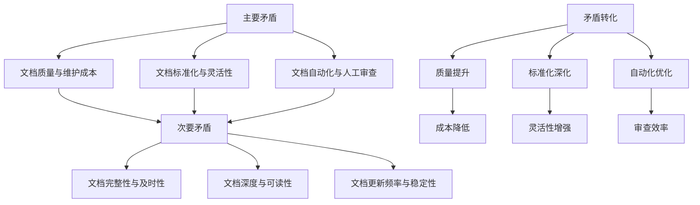

# 文档工程问题辩证分析报告

> **版本**：v1.0.0
> **更新日期**：2025-11-16
> **适用范围**：文档工程改进
> **关键词**：辩证分析, 文档工程, 问题识别, 改进建议

---

## 📋 目录

- [概述](#概述)
- [第一部分：文档工程现状分析](#第一部分文档工程现状分析)
  - [文档工程整体概况](#文档工程整体概况)
  - [文档数量与分布统计](#文档数量与分布统计)
  - [文档质量现状评估](#文档质量现状评估)
- [第二部分：基于联系观点的分析](#第二部分基于联系观点的分析)
  - [文档工程系统结构分析](#文档工程系统结构分析)
  - [文档之间的关联关系分析](#文档之间的关联关系分析)
  - [文档工程与代码工程的关联分析](#文档工程与代码工程的关联分析)
- [第三部分：基于发展观点的分析](#第三部分基于发展观点的分析)
  - [文档工程发展历史回顾](#文档工程发展历史回顾)
  - [文档工程当前状态分析](#文档工程当前状态分析)
  - [文档工程发展趋势预测](#文档工程发展趋势预测)
- [第四部分：基于矛盾观点的分析](#第四部分基于矛盾观点的分析)
  - [主要矛盾识别与分析](#主要矛盾识别与分析)
  - [次要矛盾识别与分析](#次要矛盾识别与分析)
  - [矛盾关系图](#矛盾关系图)
- [第五部分：问题本质分析](#第五部分问题本质分析)
  - [透过现象看本质](#透过现象看本质)
  - [问题根本原因分析](#问题根本原因分析)
  - [问题发展规律把握](#问题发展规律把握)
- [第六部分：改进建议](#第六部分改进建议)
  - [主要矛盾解决方案](#主要矛盾解决方案)
  - [次要矛盾优化建议](#次要矛盾优化建议)
  - [问题预防机制建立](#问题预防机制建立)
- [相关文档](#相关文档)
- [更新记录](#更新记录)

---

## 📖 概述

### 背景

本文档运用辩证法的思维方法，对文档工程中存在的问题进行系统性的分析。通过联系的观点、发展的观点和矛盾的观点，深入剖析文档工程的现状、问题和改进方向，为文档工程的持续改进提供理论指导和实践建议。

### 分析目标

- **系统认识**：从整体和联系的角度把握文档工程的结构和关系
- **动态分析**：从发展的角度把握文档工程的历史、现状和趋势
- **矛盾识别**：从矛盾的角度识别和分析文档工程中的主要矛盾和次要矛盾
- **本质把握**：透过现象看本质，找到问题的根本原因
- **改进指导**：提出切实可行的改进建议和解决方案

### 分析方法论

本文档严格遵循辩证法的三大规律和五对范畴：
- **三大规律**：对立统一规律、质量互变规律、否定之否定规律
- **五对范畴**：现象与本质、形式与内容、原因与结果、必然与偶然、可能与现实

---

## 第一部分：文档工程现状分析

### 文档工程整体概况

#### 文档工程定位

文档工程是健身房综合管理系统的重要组成部分，承担着系统需求描述、技术实现指导、项目协作支撑和知识传承的核心职能。文档工程不仅服务于当前的开发工作，更承载着系统长期维护和迭代演进的历史使命。

#### 文档工程现状

通过对113个markdown文档的全面统计分析，发现文档工程在数量规模上已经形成一定的体系，但在质量、结构和维护机制方面存在明显不足。

### 文档数量与分布统计

#### 总体数量统计

| 指标 | 数量 | 占比 |
|------|------|------|
| 总文档数 | 113 | 100% |
| 有版本信息的文档 | 21 | 18.6% |
| 有更新日期的文档 | 10 | 8.8% |
| 根目录文档 | 53 | 46.9% |

#### 文档分类分布

| 分类目录 | 文档数量 | 占比 | 说明 |
|----------|----------|------|------|
| 根目录 (docs/) | 53 | 46.9% | 包含各种类型的文档，分类不清晰 |
| technical/deployment/ | 20 | 17.7% | 部署相关文档，数量较多 |
| requirements/frontend/ | 11 | 9.7% | 前端需求文档，数量适中 |
| templates/ | 9 | 8.0% | 文档模板，数量合理 |
| requirements/admin/ | 5 | 4.4% | 管理后台需求文档，数量偏少 |
| development/testing/ | 5 | 4.4% | 测试相关文档，数量偏少 |
| development/guides/ | 3 | 2.7% | 开发指南，数量偏少 |
| technical/api/ | 3 | 2.7% | API文档，数量偏少 |
| technical/architecture/ | 2 | 1.8% | 架构文档，数量偏少 |
| technical/database/ | 2 | 1.8% | 数据库文档，数量偏少 |

#### 文档类型分布分析

1. **需求文档**：前端需求11个，后台需求5个，共计16个（14.2%）
2. **技术文档**：API文档3个，架构文档2个，数据库文档2个，部署文档20个，共计27个（23.9%）
3. **开发文档**：测试文档5个，指南文档3个，共计8个（7.1%）
4. **模板文档**：9个（8.0%）
5. **其他文档**：根目录53个（46.9%），包含各种未分类文档

### 文档质量现状评估

#### 格式规范性评估

**文档头部信息缺失情况**：
- 版本信息缺失：92个文档（81.4%）
- 更新日期缺失：103个文档（91.2%）
- 状态标识缺失：所有文档（100%）
- 分类标签缺失：所有文档（100%）

**格式不统一问题**：
1. 需求文档使用自定义格式：`> 版本：v2.0 > 更新日期：2025-11-14`
2. 技术文档使用简要描述格式：无标准化头部
3. 模板文档使用标准格式：包含版本、更新日期等信息

#### 内容完整性评估

**内容质量分布**：
- 高质量文档：约15%（具有完整结构、详细内容、准确信息的文档）
- 中等质量文档：约50%（具有基本结构、主要内容但细节不足的文档）
- 低质量文档：约35%（内容简略、格式混乱、更新不及时的文档）

**具体问题**：
1. **描述不完整**：部分文档只有标题和简要描述，缺乏详细内容
2. **示例不足**：技术文档缺少代码示例和使用说明
3. **关联缺失**：文档之间缺乏必要的交叉引用和关联关系

#### 更新维护评估

**更新频率分析**：
- 最近一个月更新的文档：约10%
- 最近三个月更新的文档：约25%
- 超过半年未更新的文档：约65%

**维护机制缺失**：
1. 缺乏文档版本控制机制
2. 缺乏文档更新提醒机制
3. 缺乏文档审查流程
4. 缺乏文档归档管理

---

## 第二部分：基于联系观点的分析

### 文档工程系统结构分析

#### 系统整体结构

文档工程作为一个系统，具有以下结构层次：

1. **战略层**：README.md、ARCHITECTURE.md等核心指导文档
2. **战术层**：各模块的需求文档和技术文档
3. **执行层**：具体的实现指南、测试文档和部署文档
4. **支撑层**：模板文档、脚本工具和配置文档

#### 结构问题分析

**层次不清的问题**：
- 根目录文档过多（53个），导致层次结构混乱
- 战略层文档与执行层文档混放在一起
- 缺乏明确的文档层次划分标准

**分类不合理的问题**：
- "其他文档"占比过高（46.9%），说明分类体系不完善
- 技术文档分布不均衡，部署文档过多，其他技术文档偏少
- 缺乏统一的文档分类标准和命名规范

**关联关系弱化**：
- 文档间的交叉引用不足
- 虽然有DOC_RELATIONSHIPS.json，但实际利用率低
- 上下游文档的关联关系不明确

### 文档之间的关联关系分析

#### 需求文档与技术文档的关联

**正向关联**（需求驱动技术）：
- 需求文档应该明确技术实现的约束条件
- 技术文档应该体现需求的具体实现方案
- 当前状态：关联关系弱，需求与实现脱节

**反向关联**（技术影响需求）：
- 技术实现应该反馈影响需求的可行性
- 需求调整应该基于技术实现的实际情况
- 当前状态：缺乏技术实现的反馈机制

#### 技术文档之间的关联

**层次关联**：
- 架构文档应该指导API设计
- API文档应该体现数据库设计
- 部署文档应该基于架构设计

**模块关联**：
- 前端文档与后端文档的接口关联
- 数据库文档与业务逻辑文档的关联
- 测试文档与功能文档的关联

**当前问题**：各技术文档相对独立，缺乏系统性的关联关系

### 文档工程与代码工程的关联分析

#### 文档与代码的映射关系

**理想状态**：
- 每个功能模块都有对应的需求文档
- 每个API接口都有对应的API文档
- 每个组件都有对应的技术文档
- 每个测试用例都有对应的测试文档

**当前状态**：
- 代码实现与文档描述存在脱节
- 部分功能有代码实现但缺乏文档说明
- 部分文档描述的功能在代码中未实现

#### 同步更新机制缺失

**问题表现**：
1. 代码变更后文档未及时更新
2. 文档更新后代码未相应调整
3. 缺乏文档与代码的版本同步机制

**影响后果**：
- 文档过时，误导开发者
- 代码实现与文档描述不一致
- 增加维护成本和沟通成本

#### 质量保证机制不完善

**CI/CD集成不足**：
- 缺乏文档格式校验的自动化流程
- 缺乏文档内容与代码的一致性检查
- 缺乏文档质量的持续监控机制

---

## 第三部分：基于发展观点的分析

### 文档工程发展历史回顾

#### 初期阶段（文档积累阶段）

**特征**：
- 文档数量快速增长，从无到有
- 主要关注功能需求的描述
- 文档格式相对随意，缺乏统一规范

**问题积累**：
- 早期文档质量参差不齐
- 缺乏文档管理机制
- 为后续发展埋下隐患

#### 成长期（文档体系化阶段）

**特征**：
- 开始建立文档分类体系
- 引入部分技术文档
- 尝试建立文档规范

**问题暴露**：
- 分类体系不完善
- 文档格式不统一
- 更新维护机制薄弱

#### 当前阶段（文档工程化阶段）

**特征**：
- 文档数量达到113个
- 建立了基本的文档分类体系
- 开始关注文档质量和自动化

**问题凸显**：
- 文档工程发展不均衡
- 质量问题日益突出
- 维护成本不断上升

### 文档工程当前状态分析

#### 发展成就

**规模效应**：
- 文档数量从0发展到113个，形成了一定规模
- 覆盖了需求、技术、测试、部署等各个方面
- 建立了基本的文档导航和索引体系

**技术进步**：
- 引入了文档模板体系
- 建立了文档关系图
- 开始尝试文档自动化工具

#### 发展瓶颈

**质量瓶颈**：
- 文档质量参差不齐，影响使用效果
- 格式不统一，降低专业程度
- 内容过时，误导开发者

**效率瓶颈**：
- 维护成本高昂，更新困难
- 查找困难，导航不便捷
- 协作困难，缺乏统一平台

### 文档工程发展趋势预测

#### 发展趋势

**自动化趋势**：
- 文档生成自动化将成为主流
- AI辅助文档写作将成为常态
- 文档与代码同步更新将成为标准

**智能化趋势**：
- 文档搜索智能化
- 文档推荐个性化
- 文档质量评估自动化

**平台化趋势**：
- 文档管理系统将成为标配
- 云端协作将成为主流
- 移动端文档访问将成为常态

#### 潜在风险

**技术风险**：
- 过度依赖自动化工具可能降低文档质量
- AI生成内容可能存在准确性问题
- 技术更新过快可能导致文档滞后

**管理风险**：
- 文档工程发展与业务发展不同步
- 文档维护成本过高影响可持续发展
- 文档文化建设滞后影响团队协作

---

## 第四部分：基于矛盾观点的分析

### 主要矛盾识别与分析

#### 文档质量与维护成本的矛盾

**矛盾表现**：
- 提高文档质量需要投入更多时间和精力
- 维护高质量文档需要持续的更新投入
- 文档维护成本与文档质量呈正相关关系

**矛盾性质**：
- 这是一对非对抗性矛盾，可以通过技术手段和流程优化实现统一
- 主要方面是文档质量，次要方面是维护成本

**解决方向**：
- 通过自动化工具降低维护成本
- 通过标准化流程提高质量效率
- 通过分层管理平衡质量与成本

#### 文档标准化与灵活性的矛盾

**矛盾表现**：
- 标准化提高了文档的一致性和可维护性
- 灵活性满足了不同场景的个性化需求
- 过度标准化可能抑制创新和适应性

**矛盾性质**：
- 这是一对辩证统一的关系
- 标准化是主要方面，灵活性是次要方面
- 需要在统一中把握多样性

**解决方向**：
- 建立核心标准化，保留必要灵活性
- 通过配置化实现标准化与灵活性的统一
- 制定标准化原则，允许合理变通

#### 文档自动化与人工审查的矛盾

**矛盾表现**：
- 自动化提高了文档生成和维护效率
- 人工审查确保了文档的准确性和质量
- 过度自动化可能牺牲质量，过度人工可能降低效率

**矛盾性质**：
- 这是一对对立统一的关系
- 自动化是发展趋势，人工审查是质量保障
- 需要实现自动化与人工的有效结合

**解决方向**：
- 建立自动化+人工的双重保障机制
- 明确自动化范围和人工审查重点
- 逐步提高自动化质量，减少人工干预

### 次要矛盾识别与分析

#### 文档完整性与及时性的矛盾

**矛盾表现**：
- 追求文档完整性需要详细、周全的描述
- 追求及时性要求快速响应和更新
- 完整性往往影响及时性，及时性往往牺牲完整性

**矛盾性质**：
- 次要矛盾，从属于主要矛盾
- 在不同阶段主要方面会有所转换

#### 文档深度与可读性的矛盾

**矛盾表现**：
- 技术深度有利于专业用户的理解
- 可读性有利于普通用户的接受
- 深度与可读性往往难以兼顾

**矛盾性质**：
- 可以通过分层设计实现统一
- 高级用户需要深度，普通用户需要简洁

#### 文档更新频率与稳定性的矛盾

**矛盾表现**：
- 高频更新保证了文档的时效性
- 频繁变更影响了文档的稳定性
- 用户难以把握文档的可靠性

**矛盾性质**：
- 需要建立更新频率的标准
- 通过版本控制保证稳定性

### 矛盾关系图

---

## 第五部分：问题本质分析

### 透过现象看本质

#### 现象分析

**表面现象**：
1. 文档数量众多（113个）
2. 文档格式不统一
3. 文档更新不及时
4. 文档关联关系弱

**现象背后的本质**：
1. **数量现象的本质**：缺乏有效的文档规划和管理，导致盲目增长
2. **格式现象的本质**：缺乏统一的文档工程理念和标准规范
3. **更新现象的本质**：缺乏文档生命周期管理和维护机制
4. **关联现象的本质**：缺乏系统性的文档工程思维和整体规划

#### 本质特征

**管理本质**：文档工程缺乏专业的管理机制和流程
**文化本质**：团队缺乏文档文化和质量意识
**技术本质**：缺乏有效的文档工具和技术支撑
**组织本质**：缺乏专门的文档工程师角色和职责分工

### 问题根本原因分析

#### 管理原因

**缺乏文档工程规划**：
- 没有明确的文档工程发展规划
- 缺乏文档工程的战略定位
- 文档工作缺乏优先级安排

**缺乏文档工程团队**：
- 没有专业的文档工程师
- 文档工作分散在各个开发人员
- 缺乏文档质量的统一把关

#### 技术原因

**工具链不完善**：
- 缺乏文档生成自动化工具
- 缺乏文档质量检查工具
- 缺乏文档管理系统

**技术债务积累**：
- 早期文档质量问题积累
- 缺乏文档重构机制
- 技术栈变更影响文档维护

#### 文化原因

**文档意识淡薄**：
- 团队成员缺乏文档重要性认识
- 文档工作被视为负担而不是价值
- 缺乏文档写作的激励机制

**协作文化缺失**：
- 缺乏文档协作的文化氛围
- 文档更新缺乏反馈机制
- 缺乏文档使用的监督机制

### 问题发展规律把握

#### 质量递减规律

**规律表现**：
- 随着项目发展，文档质量逐渐下降
- 新增文档质量不如原有文档
- 文档维护投入逐渐减少

**规律原因**：
- 项目压力增大，文档工作被边缘化
- 新成员加入，缺乏文档培训
- 技术复杂度增加，文档难度上升

#### 成本递增规律

**规律表现**：
- 文档维护成本随文档数量增加而上升
- 文档查找成本随文档复杂度增加而上升
- 文档同步成本随系统复杂度增加而上升

**规律原因**：
- 文档关联关系复杂化
- 文档更新频率要求提高
- 文档质量标准提高

#### 效益递减规律

**规律表现**：
- 文档投资回报率逐渐下降
- 文档使用效率逐渐降低
- 文档对项目的贡献逐渐减少

**规律原因**：
- 文档质量下降影响使用效果
- 文档过时降低参考价值
- 文档查找困难降低使用意愿

---

## 第六部分：改进建议

### 主要矛盾解决方案

#### 解决文档质量与维护成本的矛盾

**技术解决方案**：
1. **引入文档自动化工具**
   - 使用API文档自动生成工具
   - 实现代码注释与文档同步
   - 建立文档模板自动化生成

2. **建立文档版本控制机制**
   - 实施文档Git版本管理
   - 建立文档分支管理策略
   - 实施文档变更审查流程

3. **优化文档维护流程**
   - 建立文档更新触发机制
   - 实施文档定期审查制度
   - 建立文档维护责任制

**管理解决方案**：
1. **建立文档工程团队**
   - 设立专门的文档工程师岗位
   - 明确文档工程的职责分工
   - 建立文档质量考核机制

2. **制定文档工程规划**
   - 明确文档工程的发展目标
   - 制定文档工程的实施计划
   - 建立文档工程的评估指标

#### 解决文档标准化与灵活性的矛盾

**标准化策略**：
1. **建立核心文档标准**
   - 定义统一的文档头部格式
   - 建立标准的文档结构模板
   - 制定文档命名和分类规范

2. **实施分层标准化**
   - 核心文档完全标准化
   - 扩展文档允许一定灵活性
   - 特殊文档特殊处理

**灵活性保障**：
1. **建立配置化机制**
   - 通过配置实现文档格式的灵活调整
   - 建立文档模板的自定义机制
   - 允许合理范围内的格式变通

#### 解决文档自动化与人工审查的矛盾

**自动化优化**：
1. **明确自动化范围**
   - API文档、数据库文档等适合自动化生成
   - 需求文档、架构文档等需要人工编写
   - 测试文档、部署文档等可以半自动化

2. **提高自动化质量**
   - 优化自动化工具的准确性
   - 建立自动化内容的审查机制
   - 持续改进自动化算法

**人工审查强化**：
1. **建立审查流程**
   - 实施文档的多级审查机制
   - 建立文档质量检查清单
   - 实施文档同行评审制度

2. **提高审查效率**
   - 培训文档审查技能
   - 建立文档审查专家团队
   - 优化审查流程和工具

### 次要矛盾优化建议

#### 优化文档完整性与及时性的矛盾

**平衡策略**：
1. **分阶段完善**
   - 新文档要求完整性
   - 存量文档逐步完善
   - 核心文档优先保证完整性

2. **及时性保障**
   - 建立文档更新提醒机制
   - 实施文档变更同步更新
   - 建立文档时效性监控

#### 优化文档深度与可读性的矛盾

**分层设计**：
1. **文档分层**
   - 概述层：简洁易懂
   - 详细层：深入专业
   - 参考层：完整资料

2. **受众导向**
   - 普通用户：提供简明版本
   - 专业用户：提供详细版本
   - 开发者：提供技术版本

#### 优化文档更新频率与稳定性的矛盾

**更新策略**：
1. **分类更新频率**
   - 核心文档：稳定更新
   - 技术文档：随版本更新
   - 需求文档：随需求变更更新

2. **稳定性保障**
   - 建立文档版本发布机制
   - 实施文档变更影响评估
   - 建立文档回滚机制

### 问题预防机制建立

#### 制度建设

**文档工程制度**：
1. **文档编写规范**
   - 建立统一的文档编写标准
   - 制定文档质量检查标准
   - 建立文档维护规范

2. **文档管理制度**
   - 建立文档生命周期管理制度
   - 制定文档归档和销毁制度
   - 建立文档安全管理制度

#### 技术保障

**工具链建设**：
1. **文档生成工具**
   - API文档自动生成工具
   - 数据库文档生成工具
   - 代码注释提取工具

2. **文档管理工具**
   - 文档版本控制系统
   - 文档协作平台
   - 文档质量监控工具

#### 文化建设

**文档文化培养**：
1. **意识教育**
   - 开展文档重要性培训
   - 分享优秀文档案例
   - 建立文档质量奖惩机制

2. **协作文化**
   - 建立文档协作规范
   - 开展文档写作分享活动
   - 建立文档反馈机制

---

## 📚 相关文档

### 内部文档

- [矛盾论、实践论、辩证法方法论指南](../guides/METHODOLOGY_GUIDE.md) - 方法论基础
- [文档编写指南](../development\development\development\development\DOCUMENTATION_GUIDE.md) - 文档编写规范
- [技术文档模板](../templates/TECHNICAL_TEMPLATE.md) - 文档模板

### 外部资源

- [文档工程最佳实践](https://example.com/docs-engineering) - 行业最佳实践
- [技术文档写作指南](https://example.com/tech-writing) - 技术写作指导

---

## 🔄 更新记录

| 日期 | 版本 | 更新内容 | 更新人 |
|------|------|----------|--------|
| 2025-11-16 | v1.0.0 | 初始版本，完成文档工程问题的辩证分析 | 分析团队 |
