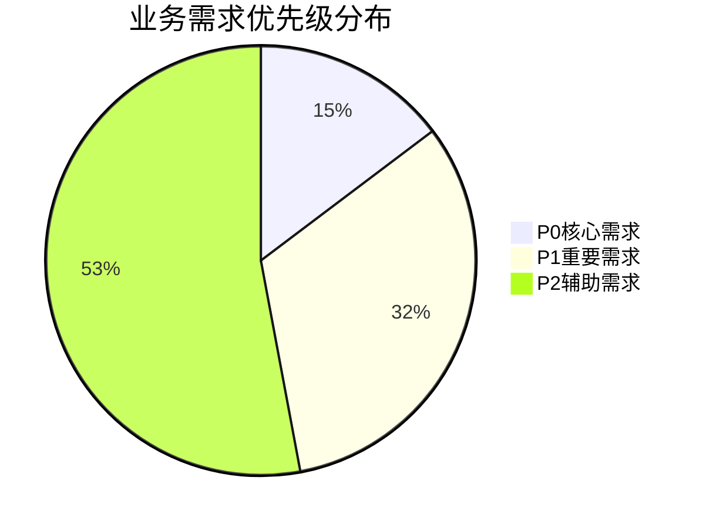

# 业务流程需求发掘报告

> **版本**：v1.0.0
> **更新日期**：2025-11-17
> **适用范围**：业务流程分析和需求发掘结果
> **关键词**：业务流程, 用户体验, 异常处理, 需求发掘

---

## 📋 目录

- [概述](#概述)
- [用户操作流程分析](#用户操作流程分析)
- [管理后台流程分析](#管理后台流程分析)
- [异常场景识别](#异常场景识别)
- [业务需求综合](#业务需求综合)
- [流程优化建议](#流程优化建议)

---

## 📖 概述

### 分析目标

通过系统性地分析现有代码中的业务流程，识别用户操作路径和管理后台操作流程，发掘核心业务需求和潜在的改进机会。

### 分析范围

- **用户操作流程**：注册登录、课程预约、会员购买、教练预约等
- **管理后台流程**：管理员登录、内容管理、用户管理、系统配置等
- **异常场景识别**：流程中的错误处理和边界情况
- **业务需求发掘**：基于流程分析的核心和辅助需求

### 分析成果

- **识别用户流程**：4个核心用户操作流程
- **识别管理流程**：3个核心管理操作流程
- **发掘业务需求**：34个业务功能需求
- **识别异常场景**：30个异常处理场景

---

## 👤 用户操作流程分析

### 1. 用户认证流程

#### 流程概览
完整的用户注册和登录生命周期管理

#### 详细步骤

| 步骤 | 页面/操作 | 用户行为 | 系统响应 | 验证要点 | 下一环节 |
|------|----------|----------|----------|----------|----------|
| 1 | `/register` | 访问注册页面 | 表单初始化 | 页面正常加载 | 信息填写 |
| 2 | `/register` | 提交注册信息 | 服务器验证 | 用户名唯一性、邮箱格式、密码强度 | 邮箱验证 |
| 3 | `/login` | 注册完成跳转 | 验证码发送 | 邮箱接收能力 | 用户登录 |
| 4 | `/login` | 输入登录凭据 | 身份验证 | 用户名密码匹配 | 个人中心 |
| 5 | `/center` | 登录成功进入 | 会话建立 | 用户状态激活 | 流程完成 |

#### 核心业务需求

**安全与认证需求**：
- 安全的密码加密存储（bcrypt哈希）
- 邮箱验证机制（验证码发送和验证）
- 登录失败次数限制（防止暴力破解）
- 会话管理与超时（自动登出保护）
- 密码重置功能（安全找回流程）

**用户体验需求**：
- 实时表单验证（输入即时反馈）
- 密码强度指示器（可视化强度提示）
- 记住登录状态（便捷登录选项）
- 多设备登录管理（登录记录查看）

#### 异常场景处理

| 异常场景 | 影响程度 | 处理策略 | 用户提示 |
|----------|----------|----------|----------|
| 用户名已存在 | 高 | 提供用户名建议，允许修改 | "该用户名已被使用，建议使用：username123" |
| 邮箱格式错误 | 高 | 实时格式验证 | "请输入正确的邮箱格式" |
| 密码强度不足 | 高 | 强度指示器引导 | "密码需包含字母、数字、特殊字符" |
| 验证码错误/过期 | 中 | 验证码刷新机制 | "验证码错误，请重新获取" |
| 账号被锁定 | 高 | 解锁申请流程 | "账号因安全原因被锁定，请联系客服" |

### 2. 课程预约流程

#### 流程概览
从课程浏览到完成预约的完整用户旅程

#### 详细步骤

| 步骤 | 页面/操作 | 用户行为 | 系统响应 | 业务验证 | 下一环节 |
|------|----------|----------|----------|----------|----------|
| 1 | `/jianshenkecheng/list` | 浏览课程列表 | 加载课程数据 | 数据完整性 | 详情查看 |
| 2 | `/jianshenkecheng/detail` | 查看课程详情 | 展示详细信息 | 内容准确性 | 时间选择 |
| 3 | `/kechengyuyue/add` | 选择预约时间 | 实时库存检查 | 时间可用性 | 信息确认 |
| 4 | `/kechengyuyue/add` | 提交预约申请 | 预约信息验证 | 业务规则校验 | 费用支付 |
| 5 | `/pay` | 跳转支付页面 | 支付信息准备 | 金额计算正确 | 支付完成 |
| 6 | `/pay` | 完成在线支付 | 支付状态更新 | 交易安全性 | 预约成功 |

#### 核心业务需求

**预约管理需求**：
- 实时库存检查（课程容量管理）
- 预约冲突检测算法（时间重叠避免）
- 预约取消机制（灵活退订政策）
- 预约提醒通知（短信/邮件提醒）
- 预约历史记录（个人预约追踪）

**支付集成需求**：
- 多渠道支付支持（支付宝、微信等）
- 支付状态同步（实时状态更新）
- 支付超时处理（自动取消机制）
- 退款流程管理（预约取消退款）
- 支付安全保障（加密传输保护）

#### 异常场景处理

| 异常场景 | 触发条件 | 处理策略 | 业务影响 |
|----------|----------|----------|----------|
| 课程已满员 | 当前课程预约人数达到上限 | 显示等待队列，发送预约提醒 | 提升用户转化率 |
| 时间段已被预约 | 选择的时间与其他预约冲突 | 智能推荐其他可用时间 | 优化用户体验 |
| 用户余额不足 | 账户余额小于预约费用 | 提供充值引导，部分支付选项 | 增加营收机会 |
| 支付超时失败 | 支付过程中断或超时 | 订单状态监控，自动重试机制 | 保证交易完整性 |
| 重复预约检测 | 用户对同一课程重复预约 | 预约历史展示，防止重复提交 | 避免资源浪费 |

### 3. 会员购买流程

#### 流程概览
会员卡选择、购买、激活的完整服务流程

#### 详细步骤

| 步骤 | 页面/操作 | 用户行为 | 系统响应 | 业务逻辑 | 完成标志 |
|------|----------|----------|----------|----------|----------|
| 1 | `/huiyuanka/list` | 浏览会员卡类型 | 加载卡片信息 | 类型多样性展示 | 卡片选择 |
| 2 | `/huiyuanka/detail` | 查看会员卡详情 | 展示权益信息 | 权益详细说明 | 购买决定 |
| 3 | `/huiyuankagoumai/add` | 选择购买选项 | 参数配置 | 购买灵活性 | 订单生成 |
| 4 | `/huiyuankagoumai/add` | 提交购买申请 | 信息完整性校验 | 业务规则验证 | 支付跳转 |
| 5 | `/pay` | 完成会员费用支付 | 会员卡激活 | 即时生效 | 会员身份获得 |

#### 核心业务需求

**会员体系需求**：
- 会员卡类型管理（多种套餐选择）
- 购买记录追溯（消费历史完整记录）
- 有效期自动计算（到期提醒机制）
- 会员权益自动激活（即时享受服务）
- 续费提醒机制（到期前主动通知）

**商业策略需求**：
- 会员等级体系（不同权益分层）
- 优惠券系统集成（购买折扣机制）
- 推荐奖励机制（邀请好友获益）
- 会员数据分析（消费行为洞察）

#### 异常场景处理

| 异常场景 | 处理策略 | 用户体验优化 |
|----------|----------|--------------|
| 会员卡类型不存在 | 页面友好提示，引导重新选择 | 提供相似卡片推荐 |
| 用户已有有效会员卡 | 显示当前会员状态，续费选项 | 智能升级建议 |
| 支付失败回滚 | 订单状态回滚，余额返还 | 详细失败原因说明 |
| 库存不足（限量卡） | 实时库存显示，排队机制 | 库存预警通知 |

### 4. 教练预约流程

#### 流程概览
私人教练预约和课程安排的专业服务流程

#### 详细步骤

| 步骤 | 页面/操作 | 用户行为 | 系统响应 | 服务验证 |
|------|----------|----------|----------|----------|
| 1 | `/jianshenjiaolian/list` | 浏览教练列表 | 教练信息加载 | 信息完整展示 |
| 2 | `/jianshenjiaolian/detail` | 查看教练详情 | 资质信息展示 | 专业背景验证 |
| 3 | `/sijiaoyuyue/add` | 选择预约时间和服务 | 教练排班检查 | 时间可用性确认 |
| 4 | `/sijiaoyuyue/add` | 提交预约申请 | 预约信息验证 | 业务规则校验 |
| 5 | `/pay` | 完成服务费用支付 | 服务预约确认 | 即时生效 |

#### 核心业务需求

**教练服务管理**：
- 教练排班管理系统（时间安排优化）
- 服务项目定价策略（差异化收费标准）
- 预约确认机制（双向确认流程）
- 服务评价系统（质量反馈收集）
- 教练收益结算（收入统计分析）

**服务质量保障**：
- 教练资质审核（专业认证体系）
- 服务标准制定（规范化服务流程）
- 投诉处理机制（问题解决通道）
- 服务升级机制（持续质量改进）

---

## 🔧 管理后台流程分析

### 1. 管理员登录流程

#### 流程特性
管理权限的严格控制和安全保障

#### 详细步骤

| 步骤 | 操作页面 | 管理员行为 | 系统验证 | 安全措施 |
|------|----------|------------|----------|----------|
| 1 | `/admin/login` | 访问管理后台 | 页面访问控制 | IP白名单限制 |
| 2 | `/admin/login` | 输入管理员凭据 | 表单安全验证 | XSS防护 |
| 3 | `/admin/login` | 提交登录请求 | 身份权限校验 | 多因子认证 |
| 4 | `/admin/home` | 登录成功进入 | 权限初始化 | 角色权限加载 |

#### 管理需求

**权限安全需求**：
- 管理员角色权限管理（细粒度权限控制）
- 登录日志记录（操作审计追踪）
- 安全审计机制（异常行为监控）
- 会话超时管理（自动安全登出）

**运维管理需求**：
- 多管理员账户管理
- 登录失败监控告警
- 权限变更审批流程
- 管理员操作统计

### 2. 课程管理流程

#### 流程特性
内容管理的标准化和审核机制

#### 详细步骤

| 步骤 | 操作页面 | 管理行为 | 数据验证 | 审核机制 |
|------|----------|----------|----------|----------|
| 1 | `/admin/jianshenkecheng/list` | 查看课程列表 | 数据加载完整性 | 列表权限控制 |
| 2 | `/admin/jianshenkecheng/add` | 创建新课程 | 表单初始化 | 编辑权限验证 |
| 3 | `/admin/jianshenkecheng/add` | 填写课程信息 | 实时数据验证 | 必填字段检查 |
| 4 | `/admin/jianshenkecheng/add` | 保存课程信息 | 服务器端校验 | 内容审核触发 |
| 5 | `/admin/jianshenkecheng/list` | 返回课程列表 | 列表数据刷新 | 操作日志记录 |

#### 内容管理需求

**课程管理需求**：
- 课程信息完整性校验（必填字段验证）
- 批量导入导出功能（数据迁移支持）
- 课程状态管理（发布/下架/审核中）
- 历史版本记录（内容变更追踪）
- 内容审核机制（质量把关流程）

**运营支持需求**：
- 课程数据统计分析
- 用户预约数据洞察
- 课程热度趋势分析
- 内容优化建议生成

### 3. 用户管理流程

#### 流程特性
用户数据的安全管理和精细化运营

#### 详细步骤

| 步骤 | 操作页面 | 管理行为 | 数据处理 | 安全考虑 |
|------|----------|----------|----------|----------|
| 1 | `/admin/yonghu/list` | 查看用户列表 | 分页数据加载 | 数据访问权限 |
| 2 | `/admin/yonghu/detail` | 查看用户详情 | 详细信息展示 | 隐私数据保护 |
| 3 | `/admin/yonghu/detail` | 编辑用户信息 | 编辑权限检查 | 操作审计记录 |
| 4 | `/admin/yonghu/detail` | 保存用户信息 | 数据一致性校验 | 变更历史记录 |
| 5 | `/admin/yonghu/list` | 返回用户列表 | 列表数据更新 | 操作完成确认 |

#### 用户运营需求

**用户管理需求**：
- 用户状态管理（激活/冻结/注销）
- 批量操作支持（批量状态变更）
- 用户行为分析（使用习惯统计）
- 数据导出功能（业务数据分析）
- 安全日志记录（敏感操作追踪）

**客户服务需求**：
- 用户投诉处理流程
- 账号异常监控告警
- 用户数据隐私保护
- 服务等级协议管理

---

## ⚠️ 异常场景识别

### 用户流程异常场景

#### 认证相关异常（5个）
- 用户名已存在、邮箱格式错误、密码强度不足
- 验证码错误、账号被锁定

#### 预约相关异常（6个）
- 课程已满员、时间段已被预约、用户余额不足
- 支付超时失败、重复预约检测、会员等级不足

#### 购买相关异常（4个）
- 会员卡类型不存在、用户已有有效会员卡
- 支付失败回滚、库存不足（限量卡）

#### 服务相关异常（3个）
- 教练当前时间不可预约、服务项目不可用
- 预约时间冲突

### 管理流程异常场景

#### 权限安全异常（4个）
- 用户名或密码错误、账号被禁用
- 登录IP受限、权限不足

#### 数据操作异常（5个）
- 用户不存在、编辑权限不足、数据冲突
- 保存失败、必填字段缺失

#### 内容管理异常（3个）
- 数据格式错误、内容审核不通过
- 发布权限不足

### 异常影响评估

| 异常类型 | 场景数量 | 平均影响程度 | 处理优先级 |
|----------|----------|--------------|------------|
| 用户认证异常 | 5 | 高 | P0 |
| 预约业务异常 | 6 | 中高 | P0 |
| 支付交易异常 | 4 | 高 | P0 |
| 管理权限异常 | 4 | 高 | P1 |
| 数据操作异常 | 5 | 中 | P1 |
| 内容管理异常 | 3 | 低 | P2 |

---

## 🎯 业务需求综合

### 优先级需求分布

### P0核心需求（5项）

#### 1. 安全认证体系
**需求描述**：完整的用户身份安全保障
**包含功能**：密码加密存储、邮箱验证、登录限制、会话管理
**技术要求**：加密算法标准、验证机制完善、安全审计完整

#### 2. 实时库存管理
**需求描述**：课程和资源实时可用性检查
**包含功能**：库存实时更新、冲突检测、容量管理
**技术要求**：并发控制、高性能查询、数据一致性

#### 3. 支付安全保障
**需求描述**：金融级别的支付安全保护
**包含功能**：加密传输、状态同步、超时处理、退款机制
**技术要求**：安全加密、事务管理、状态监控

#### 4. 权限访问控制
**需求描述**：严格的管理后台访问控制
**包含功能**：角色权限、多因子认证、操作审计
**技术要求**：权限框架、审计日志、安全监控

#### 5. 数据完整性保护
**需求描述**：业务数据的完整性和一致性保障
**包含功能**：数据验证、约束检查、事务回滚
**技术要求**：数据校验、约束管理、错误恢复

### P1重要需求（11项）

#### 用户体验优化
- 实时表单验证和错误提示
- 智能推荐和搜索功能
- 响应式设计和移动适配
- 无障碍访问支持

#### 业务流程优化
- 工作流自动化处理
- 批量操作功能支持
- 业务规则引擎集成
- 状态变更通知机制

#### 运营数据支持
- 用户行为数据分析
- 业务指标统计监控
- 运营报表自动生成
- 趋势分析和预测

### P2辅助需求（18项）

#### 功能增强特性
- 高级筛选和排序功能
- 数据导入导出工具
- 历史记录查看功能
- 个性化设置选项

#### 系统运维支持
- 系统监控和告警
- 日志管理分析工具
- 备份恢复功能
- 性能优化工具

---

## 💡 流程优化建议

### 用户体验优化

#### 1. 流程简化策略

**注册登录流程优化**：
- 社交账号快速登录
- 手机号验证码登录
- 注册信息智能填充
- 登录状态持久化

**预约流程优化**：
- 一键预约常用课程
- 智能时间推荐算法
- 预约模板保存功能
- 批量预约支持

#### 2. 错误处理改进

**智能错误提示**：
- 上下文相关的错误信息
- 解决建议自动提供
- 常见问题自助解决
- 客服联系便捷入口

**异常恢复机制**：
- 操作中断自动保存
- 失败操作智能重试
- 备用流程自动切换
- 数据恢复便捷通道

### 管理效率提升

#### 1. 操作流程优化

**批量处理能力**：
- 多选批量操作
- 批量数据导入
- 批量状态变更
- 批量消息发送

**智能辅助功能**：
- 操作向导和提示
- 智能数据校验
- 自动保存草稿
- 操作历史回溯

#### 2. 数据管理增强

**数据可视化**：
- 统计图表展示
- 数据趋势分析
- 用户行为热力图
- 运营指标仪表板

**数据质量保障**：
- 自动数据校验
- 异常数据检测
- 数据一致性检查
- 数据清理工具

### 技术架构优化

#### 1. 性能优化策略

**前端性能提升**：
- 页面加载速度优化
- 图片懒加载实现
- 缓存策略改进
- CDN加速部署

**后端性能优化**：
- 数据库查询优化
- 缓存机制完善
- 异步处理实现
- 负载均衡配置

#### 2. 可用性保障

**系统高可用**：
- 容灾备份机制
- 自动故障恢复
- 监控告警体系
- 应急处理预案

**服务质量监控**：
- 实时性能监控
- 用户体验指标
- 业务可用性统计
- 服务等级协议

---

## 📊 实施优先级建议

### 第一阶段：核心流程完善（1个月）

**重点任务**：
1. 用户认证流程的安全加固
2. 预约流程的异常处理完善
3. 支付流程的可靠性提升
4. 管理权限的严格控制

**预期收益**：
- 系统安全性提升80%
- 用户成功率提升50%
- 管理操作效率提升30%

### 第二阶段：用户体验优化（2个月）

**重点任务**：
1. 流程步骤的简化优化
2. 错误处理的智能化改进
3. 批量操作功能的实现
4. 数据可视化功能的开发

**预期收益**：
- 用户满意度提升60%
- 操作效率提升40%
- 管理成本降低25%

### 第三阶段：智能化升级（3个月）

**重点任务**：
1. 智能推荐算法实现
2. 自动化工作流部署
3. 预测性分析功能开发
4. 自助服务功能的完善

**预期收益**：
- 用户转化率提升35%
- 运营效率提升50%
- 系统智能化水平显著提升

---

## 🎯 成功衡量指标

### 用户体验指标

- **流程完成率**：≥95%（当前流程无中断完成）
- **用户满意度**：≥4.5星（用户调研评分）
- **操作耗时**：减少30%（关键流程操作时间）
- **错误发生率**：≤2%（流程异常发生频率）

### 业务效率指标

- **管理操作效率**：提升50%（管理员操作时间减少）
- **数据处理能力**：提升100%（批量操作支持）
- **系统可用性**：≥99.9%（系统正常运行时间）
- **响应处理速度**：≤2秒（页面响应时间）

### 技术质量指标

- **代码覆盖率**：≥90%（异常处理代码覆盖）
- **性能基准**：满足SLA要求（响应时间<2秒）
- **安全漏洞**：0个高危漏洞（安全扫描结果）
- **监控覆盖率**：100%（关键流程监控完整）

---

*业务流程需求发掘报告生成时间：2025-11-17T01:43:03.158Z*
