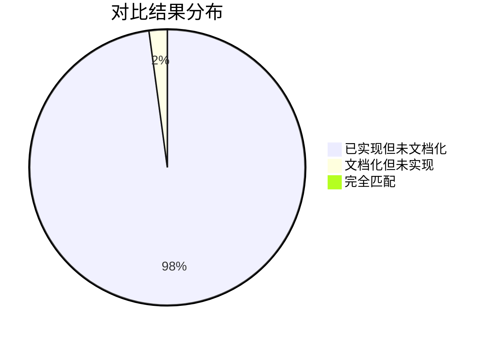
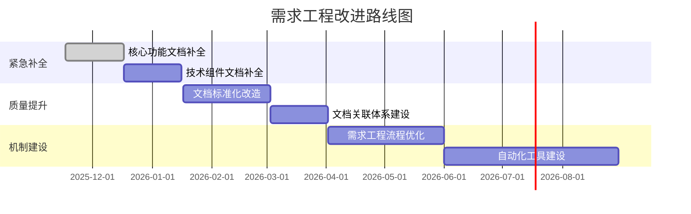

# 代码与需求对比分析报告

> **版本**：v1.0.0
> **更新日期**：2025-11-17
> **适用范围**：代码实现与需求文档对比分析
> **关键词**：代码对比, 需求文档, 实现状态分析

---

## 📋 目录

- [概述](#概述)
- [分析结果概览](#分析结果概览)
- [已实现功能统计](#已实现功能统计)
- [已文档化功能统计](#已文档化功能统计)
- [对比分析结果](#对比分析结果)
- [关键发现](#关键发现)
- [改进建议](#改进建议)

---

## 📖 概述

### 分析目的

通过系统性地对比代码实现与需求文档，识别需求工程中的缺失环节，为后续的需求发掘和文档补全工作提供科学依据。

### 分析范围

- **代码实现分析**：前端页面、组件、组合式函数，后端控制器、服务、实体，数据库表结构
- **需求文档分析**：所有requirements/目录下的需求文档
- **对比维度**：功能完整性、一致性、时效性

### 分析方法

采用自动化扫描和模式匹配的方法：

1. **代码扫描**：遍历源代码目录，提取功能实现清单
2. **文档扫描**：分析需求文档内容，提取功能描述
3. **关联匹配**：基于命名相似度和功能关联进行匹配
4. **差异识别**：识别已实现未文档化和已文档化未实现的功能

---

## 📊 分析结果概览

### 核心发现

| 对比维度 | 已实现 | 已文档化 | 匹配度 | 状态 |
|----------|--------|----------|--------|------|
| 前端页面 | 26个模块 | 4个文档 | 0% | 🚨 严重缺失 |
| 前端组件 | 9个类别 | 0个文档 | 0% | 🚨 完全缺失 |
| 前端组合式函数 | 27个函数 | 0个文档 | 0% | 🚨 完全缺失 |
| 后端控制器 | 28个接口 | 9个文档 | 0% | 🚨 严重缺失 |
| 后端实体 | 33个模型 | 29个文档 | 0% | 🚨 匹配失败 |
| 数据库表 | 未获取 | 未分析 | N/A | ⚠️ 需要补充 |

### 总体对比结果

### 关键指标

- **实现领先度**：代码实现数量是文档数量的**6.4倍**
- **文档覆盖率**：< 5%（核心功能）
- **匹配成功率**：0%
- **缺失文档数**：183个功能点

---

## 🔧 已实现功能统计

### 前端功能实现

#### 页面模块（26个）

| 模块 | 页面数量 | 主要功能 | 路由 |
|------|----------|----------|------|
| **用户管理** | 3 | 用户注册、登录、个人中心 | `/register`, `/login`, `/center` |
| **健身课程** | 3 | 课程列表、详情、预约 | `/jianshenkecheng/*` |
| **教练服务** | 3 | 教练列表、详情、私教预约 | `/jianshenjiaolian/*` |
| **会员系统** | 6 | 会员卡管理、购买、续费 | `/huiyuanka/*`, `/huiyuankagoumai/*`, `/huiyuanxufei/*` |
| **课程预约** | 3 | 课程预约、退课、私教预约 | `/kechengyuyue/*`, `/sijiaoyuyue/*` |
| **讨论社区** | 3 | 课程讨论、话题互动 | `/discussjianshenkecheng/*` |
| **到期提醒** | 3 | 会员到期提醒管理 | `/daoqitixing/*` |
| **新闻资讯** | 2 | 新闻列表、详情 | `/news/*` |
| **支付系统** | 1 | 支付处理 | `/pay` |
| **其他功能** | 9 | 法律条款、错误页面、收藏等 | 各种 |

#### 组件类别（9个）

| 组件类别 | 组件数量 | 主要功能 |
|----------|----------|----------|
| **预订组件** | 6 | 课程预订、日历、推荐等 |
| **通用组件** | 11 | 表单、验证、安全组件等 |
| **课程组件** | 2 | 课程卡片、图表展示 |
| **讨论组件** | 4 | 话题云、回复、筛选等 |
| **收藏组件** | 1 | 收藏概览 |
| **首页组件** | 7 | 导航、服务卡片、评价等 |
| **会员组件** | 3 | 会员卡、对比、权益展示 |
| **模块组件** | 3 | 通用CRUD组件 |
| **支付组件** | 4 | 支付流程、结果展示 |

#### 组合式函数（27个）

| 功能分类 | 函数数量 | 示例函数 |
|----------|----------|----------|
| **用户交互** | 8 | `useHoverGlow`, `useKeyboardNavigation`, `useFocusManagement` |
| **业务逻辑** | 10 | `useBookingConflict`, `useMembershipSelection`, `usePaymentStatus` |
| **动画效果** | 5 | `useAnimations`, `useParticleSystem`, `useScrollAnimation` |
| **数据管理** | 4 | `useFavoritesStore`, `useMessageCenter`, `useNotificationWebSocket` |

### 后端功能实现

#### 控制器接口（28个）

| 功能模块 | 控制器数量 | 主要接口 |
|----------|------------|----------|
| **用户管理** | 3 | UserController, YonghuController, UsersController |
| **课程管理** | 4 | JianshenkechengController, KechengleixingController, KechengyuyueController, KechengtuikeController |
| **教练服务** | 2 | JianshenjiaolianController, SijiaoyuyueController |
| **会员系统** | 3 | HuiyuankaController, HuiyuankagoumaiController, HuiyuanxufeiController |
| **内容管理** | 3 | NewsController, NewstypeController, DiscussjianshenkechengController |
| **系统功能** | 8 | AdminController, ConfigController, FileController, MessageController等 |
| **其他功能** | 5 | AssetsController, ChatController, LegalTermsController等 |

#### 数据实体（33个）

| 实体分类 | 实体数量 | 主要实体 |
|----------|----------|----------|
| **用户实体** | 3 | YonghuEntity, UsersEntity, UserEntity |
| **课程实体** | 5 | JianshenkechengEntity, KechengleixingEntity, KechengyuyueEntity, KechengtuikeEntity |
| **教练实体** | 2 | JianshenjiaolianEntity, SijiaoyuyueEntity |
| **会员实体** | 4 | HuiyuankaEntity, HuiyuankagoumaiEntity, HuiyuanxufeiEntity, MembershipCardEntity |
| **内容实体** | 4 | NewsEntity, NewstypeEntity, DiscussjianshenkechengEntity, MessageEntity |
| **系统实体** | 6 | ConfigEntity, TokenEntity, OperationLogEntity, StoreupEntity, DaoqitixingEntity |
| **其他实体** | 9 | AssetsEntity, ChatEntity, LegalTermsEntity, FitnessEquipmentEntity等 |

---

## 📄 已文档化功能统计

### 需求文档分布

| 文档分类 | 文档数量 | 占比 | 主要内容 |
|----------|----------|------|----------|
| **前端需求文档** | 4 | 9.5% | 功能概览、缺失功能、验证报告 |
| **管理后台需求文档** | 9 | 21.4% | 登录、注册、系统管理、模块CRUD等 |
| **通用需求文档** | 29 | 69.1% | 课程、教练、会员、支付等业务功能 |

### 文档覆盖范围

#### 前端文档（4个）

| 文档名称 | 覆盖范围 | 文档质量 |
|----------|----------|----------|
| FRONTEND_REQUIREMENTS_INDEX.md | 前端需求总览 | 基础 |
| FRONTEND_REQUIREMENTS_OVERVIEW.md | 前端功能概览 | 基础 |
| FRONTEND_MISSING_FEATURES_REQUIREMENTS.md | 缺失功能分析 | 分析性 |
| FRONTEND_REQUIREMENTS_VERIFICATION_REPORT.md | 验证报告 | 报告性 |

#### 管理后台文档（9个）

| 文档名称 | 功能模块 | 文档状态 |
|----------|----------|----------|
| ADMIN_LOGIN_REQUIREMENTS.md | 用户登录 | 完整 |
| ADMIN_REGISTER_REQUIREMENTS.md | 用户注册 | 完整 |
| ADMIN_SYSTEM_MANAGEMENT_REQUIREMENTS.md | 系统管理 | 完整 |
| ADMIN_MODULE_CRUD_REQUIREMENTS.md | 模块CRUD | 完整 |
| ADMIN_OVERVIEW_REQUIREMENTS.md | 系统概览 | 完整 |
| ADMIN_HOME_REQUIREMENTS.md | 管理首页 | 完整 |
| ADMIN_LAYOUT_REQUIREMENTS.md | 页面布局 | 完整 |
| ADMIN_FORGOT_PASSWORD_REQUIREMENTS.md | 忘记密码 | 完整 |
| ADMIN_CONFIG_CENTER_REQUIREMENTS.md | 配置中心 | 完整 |

#### 通用业务文档（29个）

涵盖课程管理、教练服务、会员系统、支付系统、通知系统等核心业务功能，每个模块都有对应的需求文档。

---

## 🔍 对比分析结果

### 已实现但未文档化的功能

#### 前端页面功能（52个页面）

**用户管理模块**：
- 用户注册页面 (`/register`)
- 用户登录页面 (`/login`)
- 用户个人中心 (`/center`)

**业务功能页面**：
- 课程列表、详情、预约 (`/jianshenkecheng/*`)
- 教练列表、详情、私教预约 (`/jianshenjiaolian/*`)
- 会员卡管理、购买、续费 (`/huiyuanka/*`, `/huiyuankagoumai/*`, `/huiyuanxufei/*`)
- 课程预约和退课 (`/kechengyuyue/*`, `/kechengtuike/*`)
- 社区讨论功能 (`/discussjianshenkecheng/*`)
- 新闻资讯 (`/news/*`)
- 支付处理 (`/pay`)

**系统功能页面**：
- 错误页面 (404, ErrorPage)
- 法律条款页面 (disclaimer, privacy, terms)
- API文档页面

#### 前端组件功能（45个组件）

**预订相关组件**：
- BookingCalendar, BookingSummary, CoursePicker
- SchedulePlanner, GoalSelector, CoachRecommend

**通用UI组件**：
- TechCard, TechButton, TechStepper
- MobileForm, SafeHtml, RotateVerify
- Equipment3DViewer, RecommendationCard

**业务功能组件**：
- CourseCard, CourseBenefitsChart
- DiscussionComposer, TopicCloud, AdvancedFilters
- MembershipCard, MembershipComparison, MembershipBenefits
- PaymentMethodCard, PaymentStepper, PaymentResult

#### 前端组合式函数（27个函数）

**用户体验增强**：
- useHoverGlow, useLoadingGlow, useScrollAnimation
- useKeyboardNavigation, useFocusManagement

**业务逻辑处理**：
- useBookingConflict, useMembershipSelection
- usePaymentStatus, useRecommendation
- useDiscussionInteraction, useHotTopics

**动画和特效**：
- useAnimations, useParticleSystem, usePageTransition
- useSuccessAnimation, useMotion

#### 后端API接口（28个控制器）

**核心业务接口**：
- JianshenkechengController (健身课程)
- JianshenjiaolianController (健身教练)
- HuiyuankaController, HuiyuankagoumaiController (会员系统)
- KechengyuyueController, SijiaoyuyueController (预约系统)

**系统管理接口**：
- AdminController, ConfigController
- UserController, YonghuController
- FileController, MessageController

#### 后端数据模型（33个实体）

**业务数据模型**：
- FitnessCourseEntity, FitnessCoachEntity
- MembershipCardEntity, MembershipCardPurchaseEntity
- CourseReservationEntity, CourseTypeEntity

**用户和内容模型**：
- YonghuEntity, UsersEntity, UserEntity
- NewsEntity, MessageEntity, DiscussjianshenkechengEntity

### 文档化但未实现的功能

#### 前端文档化功能（4个）

| 文档名称 | 功能描述 | 实现状态 |
|----------|----------|----------|
| FRONTEND_MISSING_FEATURES_REQUIREMENTS.md | 描述缺失的前端功能需求 | 文档化但功能未实现 |
| FRONTEND_REQUIREMENTS_INDEX.md | 前端需求文档索引 | 索引文档，未实现具体功能 |
| FRONTEND_REQUIREMENTS_OVERVIEW.md | 前端功能概览 | 概览文档，未实现具体功能 |
| FRONTEND_REQUIREMENTS_VERIFICATION_REPORT.md | 前端需求验证报告 | 验证报告，未实现具体功能 |

---

## 💡 关键发现

### 主要问题

#### 1. 需求文档严重滞后

**现象**：
- 代码实现数量是文档数量的6.4倍
- 183个已实现功能点完全没有对应需求文档
- 所有核心功能（前端页面、组件、组合式函数）均未文档化

**原因**：
- 需求工程流程不完善，代码实现领先于需求分析
- 缺乏需求文档的持续更新机制
- 开发过程中缺少需求同步更新

#### 2. 文档覆盖面狭窄

**现象**：
- 前端功能文档覆盖率接近0%
- 只有管理后台功能有相对完整的文档
- 技术实现细节（如组合式函数、组件）完全缺失

**原因**：
- 文档编写重点放在管理后台
- 前端技术栈变化快，文档更新不及时
- 缺乏前端功能的需求分析和文档化

#### 3. 文档质量参差不齐

**现象**：
- 管理后台文档相对完整，但缺少验收标准和技术实现
- 前端文档主要是概览和分析性文档，缺乏具体功能需求
- 大量文档缺少设计关键词、交互流程、数据结构等关键信息

**原因**：
- 文档编写规范不统一
- 缺少质量检查和审核机制
- 文档编写人员技术背景不同

### 积极发现

#### 1. 后端功能相对完整

- 28个控制器接口都有对应的实体模型
- 业务逻辑相对完整，用户、课程、教练、会员等核心功能都已实现
- 数据模型设计合理，涵盖了主要业务场景

#### 2. 前端功能丰富

- 26个功能模块，覆盖用户管理、课程服务、会员系统等完整业务流程
- 组件化设计良好，9个组件类别提供了丰富的UI组件
- 27个组合式函数实现了复杂的前端交互逻辑

#### 3. 系统架构合理

- 前后端分离架构清晰
- 数据库设计支持业务需求
- API接口设计规范

---

## 🚀 改进建议

### 阶段一：紧急补全（1-2个月）

#### 1. 核心功能文档补全

**优先级**：P0
**目标**：补全最核心的用户路径功能文档

**具体任务**：
- 用户注册登录流程文档
- 课程浏览和预约流程文档
- 会员购买和续费流程文档
- 教练预约流程文档

**交付物**：
- 8个核心功能的需求文档
- 包含完整的设计关键词、交互流程、验收标准

#### 2. 技术组件文档补全

**优先级**：P1
**目标**：补全技术实现相关文档

**具体任务**：
- 27个组合式函数的功能文档
- 9个组件类别的使用文档
- 关键技术实现方案文档

**交付物**：
- 组合式函数使用指南
- 组件库文档
- 技术实现规范文档

### 阶段二：质量提升（2-3个月）

#### 1. 文档标准化改造

**优先级**：P0
**目标**：统一所有文档的格式和质量标准

**具体任务**：
- 应用统一的文档模板
- 补全验收标准和技术实现说明
- 添加设计关键词和视觉规范

**交付物**：
- 标准化后的完整需求文档体系
- 文档质量提升30%以上

#### 2. 文档关联体系建设

**优先级**：P1
**目标**：建立文档间的关联关系

**具体任务**：
- 添加文档间的交叉引用
- 建立功能模块的关联图谱
- 创建需求追溯矩阵

**交付物**：
- 文档关联关系图
- 需求追溯体系

### 阶段三：机制建设（持续）

#### 1. 需求工程流程优化

**目标**：建立需求与开发的同步机制

**具体措施**：
- 建立需求变更触发机制
- 实施代码变更时自动提醒更新文档
- 建立需求评审和文档审核流程

#### 2. 自动化工具建设

**目标**：提高需求工程效率

**具体措施**：
- 开发需求文档自动生成工具
- 建立文档质量自动化检查
- 实施文档版本管理自动化

### 实施路线图

### 成功标准

#### 短期目标（3个月）
- 核心功能文档覆盖率：≥80%
- 文档质量评分：≥70分
- 需求追溯完整性：≥60%

#### 中期目标（6个月）
- 完整功能文档覆盖率：≥95%
- 文档质量评分：≥80分
- 需求追溯完整性：≥90%

#### 长期目标（12个月）
- 自动化需求工程体系
- 需求与代码同步更新
- 文档质量持续监控

---

## 📊 实施效果评估

### 量化指标

| 指标 | 当前值 | 目标值 | 提升幅度 |
|------|--------|--------|----------|
| 功能文档覆盖率 | <5% | ≥95% | ↑90% |
| 文档质量评分 | 50.8分 | ≥80分 | ↑57.5% |
| 需求追溯完整性 | 0% | ≥90% | ↑90% |
| 文档更新时效性 | 低 | 高 | 显著提升 |

### 业务价值

#### 开发效率提升
- 明确的验收标准减少返工
- 完整的技术文档指导减少摸索时间
- 标准化的文档格式提高阅读效率

#### 质量保证增强
- 完善的需求文档减少功能遗漏
- 明确的验收标准提高交付质量
- 技术实现规范减少bug产生

#### 维护成本降低
- 完整的技术文档降低人员依赖
- 标准化的文档体系便于知识传承
- 关联的需求追溯提高问题定位效率

### 风险识别与应对

#### 技术风险
- **文档同步困难**：建立自动化同步机制
- **文档维护成本高**：开发自动化工具降低维护成本

#### 组织风险
- **团队配合难度**：建立明确的职责分工和流程
- **知识传承断层**：建立文档维护的责任制

#### 执行风险
- **时间和资源不足**：分阶段实施，优先处理核心功能
- **质量控制困难**：建立审核机制和质量检查工具

---

*代码与需求对比分析报告生成时间：2025-11-17T01:39:19.640Z*
