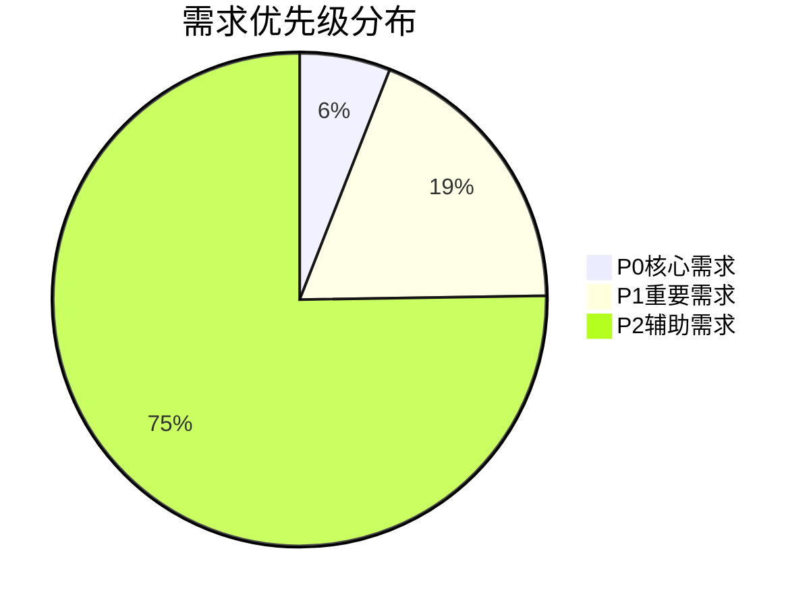

# 代码需求发掘报告

> **版本**：v1.0.0
> **更新日期**：2025-11-17
> **适用范围**：代码逆向需求发掘结果分析
> **关键词**：需求发掘, 代码分析, 功能清单, 业务需求

---

## 📋 目录

- [概述](#概述)
- [前端功能发掘](#前端功能发掘)
- [后端功能发掘](#后端功能发掘)
- [数据库需求发掘](#数据库需求发掘)
- [业务需求综合](#业务需求综合)
- [技术需求识别](#技术需求识别)
- [需求优先级分析](#需求优先级分析)

---

## 📖 概述

### 发掘目标

通过深入分析现有代码实现，逆向发掘系统已实现的功能需求，为后续需求文档补全和完善提供完整的功能清单和需求规格。

### 分析范围

- **前端代码**：Vue组件、组合式函数、页面逻辑
- **后端代码**：Controller接口、Service业务逻辑、Entity数据模型
- **数据库结构**：表结构、约束关系、数据关系

### 发掘方法

1. **静态代码分析**：解析源代码结构和功能实现
2. **功能推导**：基于代码逻辑推导业务需求
3. **依赖分析**：分析组件和服务间的依赖关系
4. **需求合成**：综合各层面的功能形成完整需求体系

---

## 🔍 前端功能发掘

### 组件功能分析

#### 预订相关组件（6个）

| 组件名称 | 功能定位 | 业务价值 | 技术实现 |
|----------|----------|----------|----------|
| **BookingCalendar** | 课程预约日历 | 提供可视化预约界面，支持时间选择 | 时间槽管理、冲突检测 |
| **BookingSummary** | 预约摘要展示 | 显示预约详情和确认信息 | 数据格式化、状态展示 |
| **CoachRecommend** | 教练推荐 | 基于用户偏好推荐教练 | 评分算法、交互反馈 |
| **CoursePicker** | 课程选择器 | 提供课程筛选和选择功能 | 多条件筛选、实时搜索 |
| **GoalSelector** | 目标选择器 | 用户健身目标选择和配置 | 交互式选择、视觉反馈 |
| **SchedulePlanner** | 日程规划器 | 智能课程安排和时间规划 | 算法优化、约束处理 |

#### 通用UI组件（11个）

| 组件名称 | 功能定位 | 业务价值 | 技术特点 |
|----------|----------|----------|----------|
| **TechCard** | 科技风格卡片 | 统一的设计语言和视觉体验 | 玻璃拟物、渐变效果 |
| **TechButton** | 科技风格按钮 | 增强的用户交互反馈 | 动画效果、状态管理 |
| **TechStepper** | 步骤指示器 | 引导用户完成多步骤流程 | 进度可视化、状态同步 |
| **MobileForm** | 移动端表单 | 优化移动设备的表单体验 | 响应式设计、触摸优化 |
| **SafeHtml** | 安全HTML渲染 | 防止XSS攻击的安全内容展示 | HTML清理、内容过滤 |
| **RotateVerify** | 旋转验证码 | 增强的安全验证机制 | 人机验证、行为分析 |
| **Stepper** | 通用步骤组件 | 多场景的步骤引导功能 | 灵活配置、状态管理 |
| **VerifyCode** | 验证码组件 | 用户身份验证和安全保障 | 多类型验证码、自动刷新 |
| **Equipment3DViewer** | 3D设备查看器 | 沉浸式的设备展示体验 | Three.js集成、交互控制 |
| **RecommendationCard** | 推荐卡片 | 个性化内容推荐展示 | 算法驱动、动态更新 |
| **MobilePaymentConfirm** | 移动支付确认 | 移动端的支付流程优化 | 安全验证、快速确认 |

#### 课程相关组件（2个）

| 组件名称 | 功能定位 | 业务价值 |
|----------|----------|----------|
| **CourseBenefitsChart** | 课程收益图表 | 可视化展示课程效果和收益 | 数据可视化、对比分析 |
| **CourseCard** | 课程信息卡片 | 标准化课程信息展示 | 信息聚合、快速预览 |

#### 讨论社区组件（4个）

| 组件名称 | 功能定位 | 业务价值 |
|----------|----------|----------|
| **AdvancedFilters** | 高级筛选器 | 支持多维度内容筛选 | 灵活查询、精准定位 |
| **DiscussionComposer** | 讨论编辑器 | 富文本讨论内容创建 | 格式支持、媒体插入 |
| **DiscussionReplies** | 回复展示组件 | 结构化讨论回复管理 | 嵌套回复、互动统计 |
| **TopicCloud** | 话题云可视化 | 热门话题和趋势展示 | 动态生成、交互探索 |

#### 其他业务组件

**会员相关组件（3个）**：
- MembershipBenefits：会员权益展示
- MembershipCard：会员卡信息管理
- MembershipComparison：会员套餐对比

**首页组件（7个）**：
- CoachNetwork：教练网络展示
- FloatingServiceButton：悬浮服务按钮
- Footer：页面底部信息
- HeroSection：英雄区域展示
- ServiceCards：服务卡片网格
- SmartHeader：智能导航栏
- Testimonials：用户评价展示

**模块通用组件（3个）**：
- ModuleDetail：通用详情页
- ModuleForm：通用表单组件
- ModuleList：通用列表组件

**支付相关组件（4个）**：
- PaymentMethodCard：支付方式选择
- PaymentStepper：支付步骤引导
- PaymentResult：支付结果展示
- MobilePaymentConfirm：移动支付确认

### 组合式函数功能分析

#### 用户交互增强（8个）

| 函数名称 | 功能定位 | 技术实现 | 业务价值 |
|----------|----------|----------|----------|
| **useHoverGlow** | 悬停发光效果 | CSS变量操作、过渡动画 | 提升交互反馈质量 |
| **useKeyboardNavigation** | 键盘导航支持 | 事件监听、焦点管理 | 无障碍访问支持 |
| **useFocusManagement** | 焦点管理 | DOM操作、状态同步 | 表单可用性优化 |
| **useLoadingGlow** | 加载发光动画 | 动画序列、状态绑定 | 提升加载体验 |
| **useScrollAnimation** | 滚动动画触发 | 交集观察器、动画库集成 | 页面动效增强 |
| **usePageTransition** | 页面过渡效果 | 路由监听、动画编排 | 流畅的页面切换 |
| **useStepTransition** | 步骤过渡动画 | 状态机、缓动函数 | 多步骤流程优化 |
| **useSuccessAnimation** | 成功反馈动画 | 粒子系统、音效配合 | 正向反馈强化 |

#### 业务逻辑处理（10个）

| 函数名称 | 功能定位 | 业务价值 | 技术特点 |
|----------|----------|----------|----------|
| **useBookingConflict** | 预约冲突检测 | 避免重复预约和资源冲突 | 实时验证、用户提示 |
| **useMembershipSelection** | 会员选择逻辑 | 智能会员套餐推荐 | 个性化算法、权益计算 |
| **usePaymentStatus** | 支付状态管理 | 完整的支付流程跟踪 | 多渠道支持、状态同步 |
| **useDiscussionInteraction** | 讨论互动管理 | 社区功能的核心逻辑 | 实时更新、权限控制 |
| **useMessageCenter** | 消息中心管理 | 统一的消息处理机制 | 分类管理、读取状态 |
| **useNotificationWebSocket** | WebSocket通知 | 实时消息推送服务 | 双向通信、连接管理 |
| **useAdvancedSearch** | 高级搜索功能 | 多条件复杂查询支持 | 索引优化、结果排序 |
| **useHotTopics** | 热门话题分析 | 内容热度计算和展示 | 趋势分析、缓存优化 |
| **useRecommendation** | 个性化推荐 | 基于用户行为的智能推荐 | 机器学习、A/B测试 |
| **usePricingEngine** | 定价引擎 | 动态价格计算和优惠策略 | 规则引擎、实时调整 |

#### 动画和特效（5个）

| 函数名称 | 功能定位 | 技术实现 |
|----------|----------|----------|
| **useAnimations** | 通用动画库 | GSAP集成、缓动函数 |
| **useParticleSystem** | 粒子效果系统 | Canvas渲染、物理引擎 |
| **useMotion** | 运动控制 | 补间动画、时间轴控制 |
| **useTheme** | 主题管理系统 | CSS变量、动态切换 |
| **useModuleCrud** | 模块CRUD操作 | 通用数据操作、状态管理 |

### 页面功能分析

#### 用户管理模块（3个页面）

- **注册页面**：新用户注册流程
- **登录页面**：用户身份验证
- **个人中心**：用户信息管理和设置

#### 课程服务模块（3个页面）

- **课程列表**：课程浏览和筛选
- **课程详情**：课程详细信息展示
- **课程预约**：预约流程和时间选择

#### 教练服务模块（3个页面）

- **教练列表**：教练信息浏览
- **教练详情**：教练详细介绍和服务
- **私教预约**：私人教练预约流程

#### 会员服务模块（6个页面）

- **会员卡列表**：会员卡类型展示
- **会员卡详情**：会员卡权益说明
- **会员卡购买**：在线购买流程
- **会员卡续费**：续费操作和支付
- **到期提醒**：会员到期提醒管理

#### 社区功能模块（3个页面）

- **讨论列表**：课程讨论话题列表
- **讨论详情**：话题详情和回复
- **讨论发布**：发布新讨论话题

#### 其他功能页面

**内容管理（2个页面）**：
- 新闻列表页
- 新闻详情页

**系统功能（5个页面）**：
- 支付页面
- 错误页面（404/ErrorPage）
- 法律条款页面（disclaimer/privacy/terms/requirements）

---

## 🔧 后端功能发掘

### API接口分析

#### 用户管理接口（3个控制器）

| 控制器 | 主要接口 | 功能定位 | 业务价值 |
|--------|----------|----------|----------|
| **UserController** | 用户CRUD操作、权限管理 | 系统用户基础管理 | 用户生命周期管理 |
| **UsersController** | 用户列表、分页查询 | 用户数据批量处理 | 数据统计和分析 |
| **YonghuController** | 前端用户业务接口 | 前端用户服务支撑 | 用户体验保障 |

#### 课程服务接口（4个控制器）

| 控制器 | 主要接口 | 功能定位 |
|--------|----------|----------|
| **JianshenkechengController** | 课程CRUD、搜索筛选 | 课程信息管理 |
| **KechengleixingController** | 课程类型管理 | 课程分类体系 |
| **KechengyuyueController** | 课程预约管理 | 预约流程处理 |
| **KechengtuikeController** | 课程退课管理 | 退课业务处理 |

#### 教练服务接口（2个控制器）

| 控制器 | 主要接口 | 功能定位 |
|--------|----------|----------|
| **JianshenjiaolianController** | 教练CRUD操作 | 教练信息管理 |
| **SijiaoyueController** | 私教预约管理 | 私人教练服务 |

#### 会员服务接口（3个控制器）

| 控制器 | 主要接口 | 功能定位 |
|--------|----------|----------|
| **HuiyuankaController** | 会员卡管理 | 会员卡类型和权益 |
| **HuiyuankagoumaiController** | 会员卡购买 | 购买流程处理 |
| **HuiyuanxufeiController** | 会员卡续费 | 续费业务处理 |

#### 内容管理接口（3个控制器）

| 控制器 | 主要接口 | 功能定位 |
|--------|----------|----------|
| **NewsController** | 新闻资讯管理 | 内容发布和展示 |
| **NewstypeController** | 新闻类型管理 | 内容分类管理 |
| **DiscussjianshenkechengController** | 课程讨论管理 | 社区互动功能 |

#### 系统功能接口（13个控制器）

| 控制器 | 功能定位 | 业务价值 |
|--------|----------|----------|
| **AdminController** | 管理员功能 | 系统管理入口 |
| **ConfigController** | 系统配置管理 | 配置中心服务 |
| **FileController** | 文件上传下载 | 文件管理服务 |
| **MessageController** | 消息通知管理 | 通信服务 |
| **OperationLogController** | 操作日志记录 | 审计追踪 |
| **StoreupController** | 收藏管理 | 用户偏好存储 |
| **AssetsController** | 资源管理 | 静态资源服务 |
| **ChatController** | 聊天功能 | 实时通信 |
| **CommonController** | 通用功能 | 公共服务接口 |
| **DaoqitixingController** | 到期提醒 | 定时任务服务 |
| **ErrorReportController** | 错误上报 | 异常监控 |
| **LegalTermsController** | 法律条款 | 合规服务 |
| **JianshenqicaiController** | 健身器材 | 设备管理 |

### 业务逻辑分析

#### 服务层功能（29个服务类）

**核心业务服务**：
- YonghuService：用户业务逻辑
- JianshenkechengService：课程业务逻辑
- HuiyuankaService：会员业务逻辑
- JianshenjiaolianService：教练业务逻辑

**技术支撑服务**：
- 数据查询服务（分页、筛选、排序）
- 数据持久化服务（增删改查）
- 事务管理服务（数据一致性）
- 缓存管理服务（性能优化）

### 数据模型分析

#### 实体分类（33个实体）

| 实体类型 | 数量 | 主要实体 | 数据特点 |
|----------|------|----------|----------|
| **用户实体** | 3 | YonghuEntity, UsersEntity, UserEntity | 用户基础信息、认证信息 |
| **课程实体** | 5 | JianshenkechengEntity, KechengleixingEntity等 | 课程信息、类型、预约数据 |
| **教练实体** | 2 | JianshenjiaolianEntity, SijiaoyueEntity | 教练信息、服务预约 |
| **会员实体** | 4 | HuiyuankaEntity, HuiyuankagoumaiEntity等 | 会员卡、购买、续费记录 |
| **内容实体** | 4 | NewsEntity, NewstypeEntity, DiscussjianshenkechengEntity | 资讯、讨论、分类数据 |
| **系统实体** | 6 | ConfigEntity, TokenEntity, OperationLogEntity等 | 配置、令牌、日志数据 |
| **其他实体** | 9 | AssetsEntity, ChatEntity, LegalTermsEntity等 | 资源、聊天、法律数据 |

---

## 💾 数据库需求发掘

### 表结构分析

基于实体模型推导的数据库需求：

#### 用户数据表
- **用户信息表**：存储用户基本信息、注册时间、状态等
- **用户认证表**：存储登录凭据、安全信息
- **用户偏好表**：存储个性化设置、收藏信息

#### 业务数据表
- **课程信息表**：课程详情、教练信息、时间安排
- **预约记录表**：用户预约历史、状态跟踪
- **会员信息表**：会员卡类型、有效期、权益信息
- **支付记录表**：交易流水、支付状态、退款信息

#### 内容数据表
- **新闻资讯表**：文章内容、发布时间、阅读统计
- **讨论话题表**：用户发布的内容、回复关系
- **评论回复表**：嵌套评论结构、点赞统计

#### 系统数据表
- **配置参数表**：系统设置、业务规则
- **操作日志表**：用户操作记录、审计追踪
- **消息通知表**：系统消息、用户通知

### 数据关系分析

#### 主数据关系
- 用户与课程：多对多（预约关系）
- 用户与教练：多对多（私教关系）
- 用户与会员：一对一（会员卡关系）
- 课程与教练：多对一（授课关系）
- 新闻与用户：多对一（发布关系）

#### 业务约束
- 预约时间冲突检测
- 会员卡有效期管理
- 支付状态一致性
- 用户权限分级控制

---

## 🎯 业务需求综合

### 核心业务需求（P0级，6项）

#### 1. 用户认证与管理
**需求描述**：完整的用户生命周期管理
**功能范围**：注册、登录、信息管理、权限控制
**技术要求**：安全认证、数据保护、会话管理

#### 2. 课程预约系统
**需求描述**：智能课程预约和时间管理
**功能范围**：课程浏览、时间选择、冲突检测、预约确认
**技术要求**：实时库存、并发控制、取消机制

#### 3. 支付处理系统
**需求描述**：安全可靠的在线支付服务
**功能范围**：多种支付方式、状态跟踪、退款处理
**技术要求**：支付网关集成、安全加密、事务一致性

#### 4. 会员服务管理
**需求描述**：会员卡生命周期和权益管理
**功能范围**：卡类型管理、购买流程、续费提醒、权益使用
**技术要求**：有效期计算、自动提醒、权益校验

#### 5. 教练服务预约
**需求描述**：私人教练预约和课程安排
**功能范围**：教练选择、时间预约、服务记录、评价反馈
**技术要求**：排班管理、预约冲突检测、服务质量跟踪

#### 6. 内容发布与管理
**需求描述**：新闻资讯和社区讨论功能
**功能范围**：内容发布、评论互动、内容审核、热门推荐
**技术要求**：富文本编辑、内容过滤、互动统计

### 重要业务需求（P1级，19项）

#### 用户体验优化
- 响应式设计和移动端适配
- 无障碍访问支持
- 个性化推荐服务
- 多语言国际化

#### 业务流程优化
- 智能搜索和筛选
- 批量操作支持
- 工作流自动化
- 业务规则引擎

#### 数据分析与统计
- 用户行为分析
- 业务指标监控
- 运营数据报表
- 趋势预测分析

### 辅助业务需求（P2级，76项）

#### 前端交互增强
- 动画效果和过渡
- 实时数据更新
- 离线功能支持
- 性能优化

#### 后端服务扩展
- API版本管理
- 第三方集成
- 缓存策略优化
- 监控和告警

#### 数据管理功能
- 数据导入导出
- 备份恢复机制
- 数据清理任务
- 审计日志管理

---

## 🛠️ 技术需求识别

### 前端技术需求

#### 1. 用户界面框架
- Vue 3 + TypeScript现代化前端架构
- Element Plus组件库深度定制
- 响应式设计和移动端优先策略
- 无障碍访问（WCAG 2.1 AA标准）

#### 2. 交互体验优化
- GSAP动画库集成和性能优化
- 粒子系统和视觉效果实现
- WebSocket实时通信支持
- PWA离线功能和安装支持

#### 3. 状态管理和数据流
- Pinia状态管理最佳实践
- 组合式API设计模式
- 响应式数据流处理
- 缓存策略和性能优化

### 后端技术需求

#### 1. API服务架构
- RESTful API设计规范
- GraphQL查询语言支持
- API版本控制和兼容性
- OpenAPI规范文档生成

#### 2. 业务逻辑处理
- 事务管理和数据一致性
- 业务规则引擎集成
- 工作流自动化处理
- 事件驱动架构设计

#### 3. 安全与性能
- JWT身份认证和授权
- 请求频率限制和DDoS防护
- 数据加密和隐私保护
- 缓存策略和性能监控

### 数据层技术需求

#### 1. 数据库设计
- 关系型数据库规范化设计
- 索引优化和查询性能
- 数据分区和分表策略
- 读写分离架构支持

#### 2. 数据管理
- 数据库迁移和版本控制
- 备份恢复和高可用性
- 数据审计和合规性
- ETL数据处理流程

#### 3. 数据服务
- ORM框架集成优化
- 连接池管理和监控
- 查询优化和慢查询分析
- 数据缓存和预加载

---

## 📊 需求优先级分析

### 优先级判断标准

#### P0（核心需求）
- 影响系统核心业务流程
- 用户使用频率极高
- 缺失会导致业务无法开展
- 技术风险和复杂度适中

#### P1（重要需求）
- 支持重要业务场景
- 用户体验影响较大
- 缺失会影响用户满意度
- 需要一定技术投入

#### P2（辅助需求）
- 锦上添花的功能特性
- 用户体验优化点
- 技术债务和优化需求
- 可以逐步实现

### 优先级分布统计

### 实施建议

#### 第一阶段：核心功能完善（1-2个月）
**重点**：实现P0级需求的完整文档化
**目标**：确保核心业务流程有完整的需求支撑
**成果**：用户认证、预约、支付、会员服务需求文档完善

#### 第二阶段：重要功能扩展（2-3个月）
**重点**：补全P1级需求文档
**目标**：提升用户体验和业务效率
**成果**：搜索推荐、数据分析、流程优化需求文档

#### 第三阶段：辅助功能优化（持续改进）
**重点**：完善P2级需求文档
**目标**：持续优化用户体验和技术架构
**成果**：动画效果、性能优化、监控告警需求文档

---

## 📋 实施路线图

### 阶段一：核心需求文档化（第1-4周）

**目标**：补全6个P0级核心需求文档
**任务**：
1. 用户认证与管理需求文档
2. 课程预约系统需求文档
3. 支付处理系统需求文档
4. 会员服务管理需求文档
5. 教练服务预约需求文档
6. 内容发布与管理需求文档

**交付物**：6个完整的业务需求文档

### 阶段二：重要需求文档化（第5-12周）

**目标**：补全19个P1级重要需求文档
**任务**：
1. 用户体验优化需求文档
2. 业务流程优化需求文档
3. 数据分析与统计需求文档
4. 前端技术组件需求文档
5. 后端服务扩展需求文档

**交付物**：19个功能需求文档

### 阶段三：技术需求体系化（第13-16周）

**目标**：建立完整的技术需求体系
**任务**：
1. 前端技术需求文档
2. 后端技术需求文档
3. 数据层技术需求文档
4. 系统架构需求文档

**交付物**：技术需求白皮书

### 阶段四：需求验证与优化（第17-20周）

**目标**：验证需求完整性和准确性
**任务**：
1. 需求文档交叉验证
2. 与现有代码的一致性检查
3. 需求优先级重新评估
4. 文档质量优化

**交付物**：需求工程完整报告

---

## 🎯 成功标准

### 文档完整性
- **P0需求覆盖率**：100%（6/6）
- **P1需求覆盖率**：≥80%（≥15/19）
- **代码实现对应率**：≥95%

### 文档质量
- **格式规范性**：100%
- **内容完整性**：≥85%
- **可读性评分**：≥80分

### 业务价值
- **需求追溯性**：支持从需求到代码的完整追溯
- **开发指导性**：需求文档能有效指导开发实现
- **维护便利性**：文档结构清晰，易于更新维护

---

*代码需求发掘报告生成时间：2025-11-17T01:41:08.719Z*
