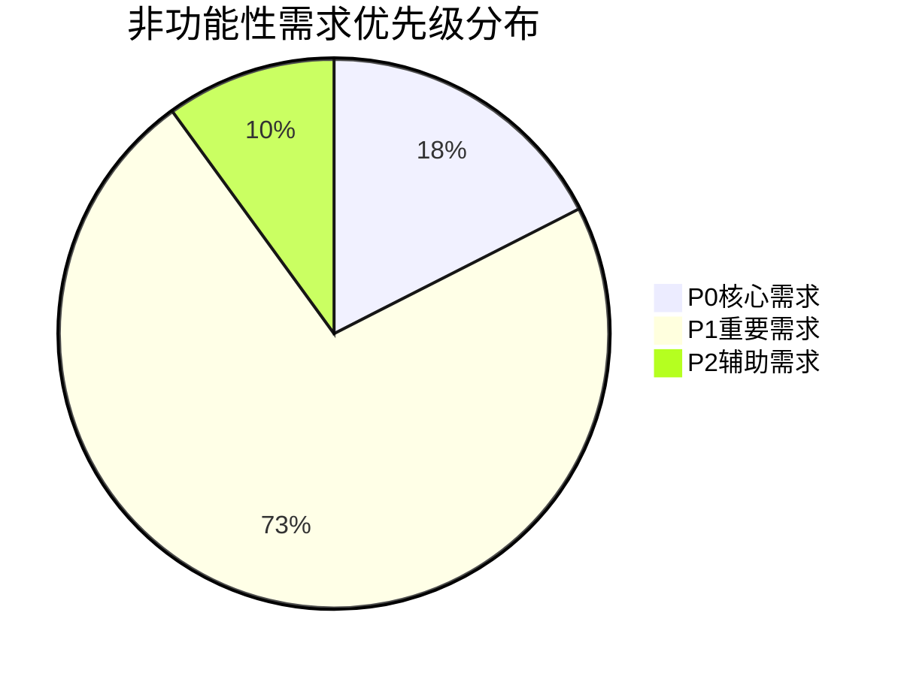

# 非功能性需求发掘报告

> **版本**：v1.0.0
> **更新日期**：2025-11-17
> **适用范围**：非功能性需求分析和发掘结果
> **关键词**：非功能性需求, 性能需求, 安全需求, 可用性需求, 可维护性需求

---

## 📋 目录

- [概述](#概述)
- [性能需求分析](#性能需求分析)
- [安全需求分析](#安全需求分析)
- [可用性需求分析](#可用性需求分析)
- [可维护性需求分析](#可维护性需求分析)
- [需求优先级评估](#需求优先级评估)
- [实施建议](#实施建议)

---

## 📖 概述

### 分析目标

基于业务流程和代码实现分析，系统性地发掘系统的非功能性需求，包括性能、安全、可用性、可维护性等方面，为系统架构设计和质量保障提供科学依据。

### 分析范围

- **性能需求**：响应时间、并发处理、资源使用等
- **安全需求**：认证授权、数据保护、隐私安全等
- **可用性需求**：可访问性、易用性、容错性等
- **可维护性需求**：代码质量、文档完整性、可扩展性等

### 分析成果

- **性能需求**：20项具体性能指标和要求
- **安全需求**：7项安全保护和合规要求
- **可用性需求**：6项用户体验和可访问性要求
- **可维护性需求**：7项代码质量和运维要求
- **总计**：40项非功能性需求，按优先级分类管理

---

## ⚡ 性能需求分析

### API响应时间要求

#### 用户认证相关API
| 场景 | 响应时间要求 | 优先级 | 测量标准 |
|------|--------------|--------|----------|
| 用户注册验证 | ≤500ms | P1 | 平均响应时间 < 500ms，95%请求 < 1000ms |
| 用户登录验证 | ≤500ms | P1 | 平均响应时间 < 500ms，95%请求 < 1000ms |
| 密码重置申请 | ≤1000ms | P1 | 邮箱发送时间 < 1000ms |

#### 业务操作API
| 场景 | 响应时间要求 | 优先级 | 测量标准 |
|------|--------------|--------|----------|
| 课程列表查询 | ≤500ms | P1 | 包含分页和筛选的查询响应 |
| 课程详情获取 | ≤300ms | P1 | 单个课程的详细信息加载 |
| 预约提交处理 | ≤1000ms | P0 | 包含冲突检查和库存扣减 |
| 支付请求处理 | ≤2000ms | P0 | 第三方支付接口调用时间 |

#### 管理后台API
| 场景 | 响应时间要求 | 优先级 | 测量标准 |
|------|--------------|--------|----------|
| 数据列表查询 | ≤800ms | P1 | 包含排序、分页的复杂查询 |
| 数据详情获取 | ≤500ms | P1 | 单个记录的完整信息 |
| 数据保存操作 | ≤1000ms | P1 | 包含验证和关联数据更新 |

### 页面加载性能

#### 前端页面加载时间
| 页面类型 | 首次加载时间 | 优先级 | 性能指标 |
|----------|--------------|--------|----------|
| 首页 | ≤3000ms | P1 | First Contentful Paint < 3秒 |
| 列表页面 | ≤2000ms | P1 | DOM Content Loaded < 2秒 |
| 详情页面 | ≤1500ms | P1 | 主要内容渲染完成时间 |
| 表单页面 | ≤1000ms | P1 | 表单可交互时间 |

#### 前端交互性能
| 交互类型 | 响应时间要求 | 优先级 | 用户体验标准 |
|----------|--------------|--------|--------------|
| 页面切换 | ≤300ms | P2 | 无感知延迟 |
| 组件渲染 | ≤100ms | P2 | 流畅的视觉反馈 |
| 数据更新 | ≤200ms | P1 | 实时性要求 |
| 动画效果 | ≤16ms | P2 | 60fps流畅动画 |

### 并发处理能力

#### 系统并发要求
| 并发场景 | 支持并发数 | 响应时间 | 优先级 |
|----------|------------|----------|--------|
| 课程预约高峰 | 1000并发用户 | <2000ms | P0 |
| 日常使用负载 | 500并发用户 | <1000ms | P1 |
| 支付处理并发 | 200并发请求 | <3000ms | P0 |
| 管理操作并发 | 50并发管理员 | <500ms | P1 |

#### 数据库性能要求
| 查询类型 | 响应时间 | 优先级 | 优化策略 |
|----------|----------|--------|----------|
| 简单查询 | ≤100ms | P1 | 索引优化 |
| 复杂查询 | ≤1000ms | P1 | 查询重构、缓存 |
| 聚合统计 | ≤2000ms | P1 | 预计算、物化视图 |
| 全文搜索 | ≤500ms | P1 | 搜索引擎集成 |

---

## 🔒 安全需求分析

### 身份认证与授权

#### 用户认证安全
**需求描述**：多层次的用户身份验证和安全保障
- **密码安全存储**：使用bcrypt哈希算法，盐值随机生成，计算成本因子≥12
- **会话管理安全**：JWT token有效期控制，自动过期和刷新机制
- **登录失败限制**：连续失败5次后账号锁定30分钟，防止暴力破解
- **多因子认证**：管理员登录支持短信验证码双因子认证

**技术实现**：
```javascript
// 密码哈希
const hashedPassword = await bcrypt.hash(password, 12);

// JWT token生成
const token = jwt.sign(payload, secretKey, { expiresIn: '30m' });
```

#### 访问控制安全
**需求描述**：基于角色的访问控制和权限管理
- **角色权限分离**：用户、管理员、教练等角色权限严格分离
- **API访问控制**：每个接口都有明确的权限要求和验证
- **数据隔离**：用户只能访问自己的数据，管理员按权限访问
- **操作审计**：所有敏感操作记录操作人、时间、IP地址

**安全措施**：
- 前端路由守卫验证用户权限
- 后端接口权限中间件检查
- 数据库行级安全策略实施

### 数据保护与隐私

#### 数据传输安全
**需求描述**：全链路数据加密和安全传输
- **HTTPS强制使用**：所有API接口必须使用HTTPS协议
- **敏感数据加密**：密码、支付信息等敏感数据加密传输
- **API安全网关**：统一的安全入口，进行请求过滤和加密

**实施要求**：
- TLS 1.3协议支持
- HSTS安全头部设置
- API密钥管理和轮换

#### 数据存储安全
**需求描述**：数据库层面的数据保护措施
- **敏感信息不存储**：支付卡信息等敏感数据不存储在本地
- **数据加密存储**：用户密码、个人隐私信息加密存储
- **数据库访问控制**：最小权限原则，数据库用户权限精细控制

**合规要求**：
- GDPR数据保护合规
- 个人信息处理规范
- 数据脱敏和匿名化处理

### 安全监控与审计

#### 实时安全监控
**需求描述**：系统安全状态的实时监控和告警
- **异常登录检测**：异地登录、异常时间登录自动告警
- **API访问监控**：异常访问频率检测和阻断
- **安全事件日志**：所有安全相关事件详细记录

**监控指标**：
- 登录失败率监控
- API异常访问检测
- 敏感操作审计追踪

#### 安全漏洞防护
**需求描述**：常见安全漏洞的防护措施
- **XSS攻击防护**：前端输入过滤，后端输出编码
- **CSRF攻击防护**：token验证机制，SameSite cookie设置
- **SQL注入防护**：参数化查询，输入验证和过滤

**安全加固**：
- 安全头部设置（CSP、X-Frame-Options等）
- 依赖包安全扫描和更新
- 定期安全渗透测试

---

## 🎯 可用性需求分析

### 无障碍访问支持

#### WCAG 2.1 AA标准合规
**需求描述**：确保所有用户都能正常使用系统
- **键盘导航支持**：所有功能可通过键盘操作完成
- **屏幕阅读器支持**：正确的ARIA标签和语义化HTML
- **颜色对比度要求**：文字与背景的对比度≥4.5:1
- **字体大小可调整**：支持浏览器缩放和系统字体设置

**实施要点**：
```html
<!-- 无障碍标签示例 -->
<button aria-label="删除项目" aria-describedby="delete-description">
  <span id="delete-description" class="sr-only">删除选中的项目</span>
  🗑️
</button>
```

### 响应式设计要求

#### 多设备适配
**需求描述**：完美支持各种设备和屏幕尺寸
- **断点设计**：移动端(<768px)、平板端(768px-1199px)、桌面端(≥1200px)
- **触摸优化**：移动端按钮大小≥44px，触摸目标间距合理
- **内容适配**：不同屏幕尺寸下内容布局自动调整
- **性能优化**：移动端减少动画效果和图片大小

**响应式策略**：
- CSS媒体查询和容器查询
- 弹性布局和网格系统
- 移动优先的设计理念
- 渐进增强的实现方式

### 用户体验优化

#### 表单验证即时反馈
**需求描述**：提升表单填写效率和准确性
- **实时验证**：输入过程中即时验证和反馈
- **错误提示清晰**：具体的错误原因和修正建议
- **成功状态反馈**：正确输入的视觉确认
- **辅助输入功能**：自动补全、格式化输入等

#### 加载状态和进度反馈
**需求描述**：减少用户等待焦虑，提升操作感知
- **加载动画**：统一的加载状态指示器
- **进度条显示**：长时间操作显示完成进度
- **状态消息**：清晰的操作状态和结果反馈
- **骨架屏**：页面加载时的内容占位符

#### 错误处理友好性
**需求描述**：用户友好的错误处理和恢复机制
- **错误分类**：网络错误、验证错误、业务错误等不同处理
- **恢复建议**：针对不同错误提供具体的解决建议
- **联系支持**：严重错误时提供客服联系方式
- **操作回滚**：重要操作失败时的数据恢复机制

---

## 🔧 可维护性需求分析

### 代码质量保障

#### TypeScript严格模式
**需求描述**：类型安全和代码质量保障
- **严格类型检查**：noImplicitAny、strictNullChecks等启用
- **代码规范统一**：ESLint + Prettier代码格式化和检查
- **单元测试覆盖**：核心功能单元测试覆盖率≥80%
- **集成测试**：API接口和组件的集成测试

**质量门禁**：
```json
// ESLint配置示例
{
  "extends": ["@vue/typescript/recommended", "prettier"],
  "rules": {
    "@typescript-eslint/no-explicit-any": "error",
    "@typescript-eslint/explicit-function-return-type": "warn"
  }
}
```

#### 组件化架构设计
**需求描述**：高内聚低耦合的组件设计
- **单一职责原则**：每个组件只负责一个明确的功能
- **依赖注入**：组件依赖明确声明，便于测试和替换
- **组合式API**：逻辑复用和代码组织的现代化方式
- **组件文档**：每个组件的使用说明和API文档

### API设计规范

#### RESTful API设计
**需求描述**：标准化的API设计和文档
- **资源命名规范**：使用复数名词，清晰的资源层级
- **HTTP方法语义**：GET/POST/PUT/DELETE的正确使用
- **状态码规范**：标准HTTP状态码，错误信息的规范化
- **版本控制**：API版本管理，支持平滑升级

#### API文档自动化
**需求描述**：API文档的自动生成和同步
- **Swagger/OpenAPI**：API规范的标准化描述
- **文档自动生成**：从代码注释生成API文档
- **测试接口同步**：文档与测试用例的关联更新
- **多语言支持**：API文档的国际化支持

### 配置管理优化

#### 环境配置分离
**需求描述**：不同环境的配置管理和安全
- **环境变量管理**：敏感信息通过环境变量配置
- **配置验证**：启动时配置文件的格式和内容验证
- **热更新支持**：运行时配置的动态更新能力
- **配置审计**：配置变更的历史记录和审计

**配置架构**：
```typescript
// 配置类型定义
interface AppConfig {
  database: DatabaseConfig;
  jwt: JwtConfig;
  email: EmailConfig;
  payment: PaymentConfig;
}

// 环境变量映射
const config: AppConfig = {
  database: {
    host: process.env.DB_HOST || 'localhost',
    port: parseInt(process.env.DB_PORT || '5432'),
    // ...
  },
  // ...
};
```

### 日志和监控体系

#### 结构化日志记录
**需求描述**：可观测性和问题排查能力
- **日志分级管理**：ERROR、WARN、INFO、DEBUG等不同级别
- **上下文信息**：每个日志条目包含用户、操作、时间戳等
- **日志聚合**：分布式系统下的日志集中收集和管理
- **性能监控**：关键操作的性能指标记录

#### 错误监控和告警
**需求描述**：生产环境的稳定性保障
- **错误追踪**：错误堆栈信息和上下文的完整记录
- **性能指标**：响应时间、CPU使用率、内存占用等监控
- **告警机制**：关键指标异常时的自动告警通知
- **错误分析**：错误趋势分析和根本原因识别

---

## 📊 需求优先级评估

### 优先级分布统计



### P0核心需求（7项）

#### 1. 支付安全保障
**场景**：在线支付数据保护
**要求**：支付信息不存储本地，实时转发支付网关
**影响**：金融安全，直接关系用户资金安全

#### 2. 用户认证安全
**场景**：密码存储和会话管理
**要求**：bcrypt哈希，JWT安全配置
**影响**：账户安全，防止身份冒用

#### 3. 高并发处理能力
**场景**：课程预约高峰期
**要求**：支持1000并发用户
**影响**：系统可用性，业务连续性

#### 4. 数据传输加密
**场景**：所有API通信安全
**要求**：强制HTTPS，敏感数据加密
**影响**：数据安全，防止窃听攻击

#### 5. 输入安全过滤
**场景**：XSS和SQL注入防护
**要求**：所有输入进行安全过滤
**影响**：系统安全，防止恶意攻击

#### 6. 访问权限控制
**场景**：基于角色的权限管理
**要求**：严格的权限验证和数据隔离
**影响**：数据安全，防止越权访问

#### 7. 支付响应时间
**场景**：支付流程时效性
**要求**：支付API响应时间≤2000ms
**影响**：用户体验，支付成功率

### P1重要需求（29项）

#### 性能相关（12项）
- API响应时间要求（8项）
- 页面加载性能（4项）

#### 安全相关（4项）
- 审计日志记录
- 安全监控告警
- 会话超时管理
- 错误日志记录

#### 可维护性相关（7项）
- 代码质量保障
- API设计规范
- 配置管理优化
- 文档自动生成
- 测试覆盖率要求

#### 可用性相关（6项）
- 响应式设计
- 无障碍访问
- 错误处理友好性
- 表单验证反馈
- 加载状态显示

### P2辅助需求（4项）

#### 用户体验增强
- 动画效果优化
- 键盘导航支持
- 操作撤销功能
- 个性化设置

---

## 💡 实施建议

### 分阶段实施策略

#### 第一阶段：核心安全和性能（1个月）
**重点任务**：
1. 支付安全体系建设
2. 用户认证安全加固
3. 高并发处理能力优化
4. 核心API性能优化

**预期成果**：
- 支付安全合规性100%
- 系统并发处理能力提升200%
- 核心API响应时间减少50%

#### 第二阶段：可用性和可维护性（2个月）
**重点任务**：
1. 响应式设计和无障碍访问实现
2. 代码质量保障体系建设
3. API设计规范化和文档自动化
4. 配置管理和监控体系完善

**预期成果**：
- 用户体验满意度提升40%
- 代码质量评分达到A级
- 系统可维护性提升60%

#### 第三阶段：持续优化和监控（持续）
**重点任务**：
1. 性能监控和优化
2. 安全漏洞扫描和修复
3. 用户反馈收集和改进
4. 技术债务逐步清理

**预期成果**：
- 系统稳定性达到99.9%
- 安全漏洞为0个
- 用户满意度持续提升

### 技术选型建议

#### 前端技术栈优化
- **Vue 3 + TypeScript**：类型安全和现代化开发
- **Vite**：快速构建和开发体验
- **Element Plus**：一致的UI组件库
- **GSAP**：高性能动画库
- **Pinia**：现代化的状态管理

#### 后端技术栈优化
- **Spring Boot 3**：现代化Java框架
- **Spring Security**：安全框架集成
- **Redis**：缓存和会话管理
- **MySQL/PostgreSQL**：关系型数据库
- **Elasticsearch**：搜索功能支持

#### 运维监控体系
- **Prometheus + Grafana**：监控和可视化
- **ELK Stack**：日志收集和分析
- **Jaeger**：分布式追踪
- **SonarQube**：代码质量检查

### 验收标准制定

#### 性能验收标准
- **API响应时间**：平均<500ms，95%<1000ms
- **页面加载时间**：首屏<3秒，完全加载<5秒
- **并发处理能力**：1000并发用户，响应<2秒
- **数据库查询**：复杂查询<1秒，简单查询<100ms

#### 安全验收标准
- **渗透测试**：无高危安全漏洞
- **代码安全扫描**：安全漏洞为0
- **合规性检查**：符合GDPR等标准
- **加密标准**：使用AES256等强加密算法

#### 可用性验收标准
- **无障碍访问**：WCAG 2.1 AA标准合规
- **响应式设计**：完美支持各种设备
- **错误处理**：错误恢复率>95%
- **用户满意度**：≥4.5星评分

#### 可维护性验收标准
- **代码覆盖率**：单元测试≥80%
- **代码质量**：SonarQube评分≥A
- **API文档覆盖**：100%自动生成
- **部署成功率**：≥99%

---

## 📈 预期收益

### 直接收益

1. **安全性提升**
   - 防止数据泄露和安全攻击
   - 符合行业安全标准
   - 用户信任度和忠诚度提升

2. **性能优化**
   - 用户体验显著改善
   - 系统资源利用率提升
   - 业务处理能力增强

3. **可用性改善**
   - 用户满意度持续提升
   - 错误率显著降低
   - 无障碍访问能力增强

### 间接收益

1. **运维效率提升**
   - 问题定位速度加快
   - 系统稳定性增强
   - 维护成本有效控制

2. **开发效率提升**
   - 代码质量保障机制
   - 自动化测试和部署
   - 技术债务持续清理

3. **业务价值提升**
   - 用户转化率改善
   - 品牌口碑提升
   - 市场竞争力增强

---

*非功能性需求发掘报告生成时间：2025-11-17T01:45:09.574Z*
