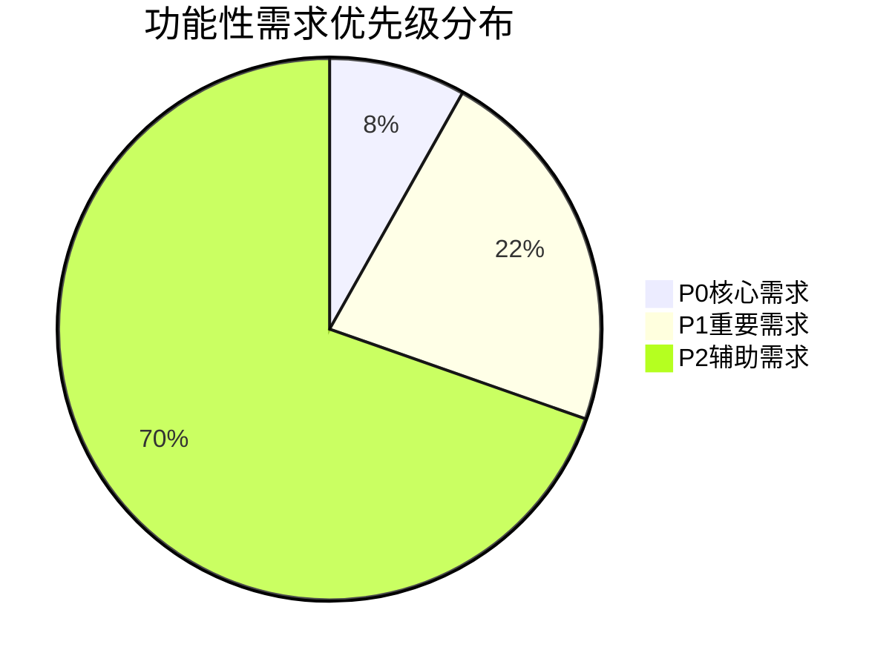
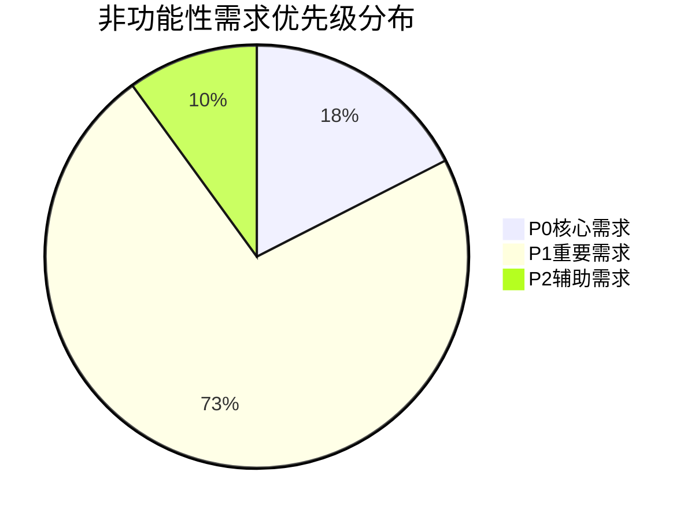

# 需求分类与优先级排序报告

> **版本**：v1.0.0
> **更新日期**：2025-11-17
> **适用范围**：需求分类和优先级排序结果分析
> **关键词**：需求分类, 优先级排序, 实施规划, 模块化管理

---

## 📋 目录

- [概述](#概述)
- [需求统计概览](#需求统计概览)
- [功能模块分类](#功能模块分类)
- [优先级排序结果](#优先级排序结果)
- [核心需求清单](#核心需求清单)
- [实施路线图](#实施路线图)

---

## 📖 概述

### 分析目标

基于全面的需求发掘结果，对所有需求进行系统性的分类和优先级排序，为后续需求实现和项目规划提供科学依据。

### 分类原则

#### 功能模块分类
- **用户管理**：用户注册、登录、认证、个人中心等
- **课程预约**：课程浏览、预约、冲突检测、支付等
- **会员服务**：会员卡管理、购买、续费、权益等
- **教练服务**：教练信息、私教预约、服务管理等
- **管理后台**：管理员功能、内容管理、系统配置等
- **安全保障**：身份认证、数据保护、权限控制等
- **其他功能**：技术组件、工具函数、通用功能等

#### 优先级排序标准

##### P0（核心需求）
- 影响系统核心业务流程的正常运行
- 涉及安全、支付、认证等关键功能
- 缺失会导致业务无法开展或存在重大风险
- 技术实现复杂度适中，实施周期较短

##### P1（重要需求）
- 支持重要业务场景，提升用户体验
- 涉及性能优化、功能完善等
- 缺失会影响用户满意度和业务效率
- 需要一定技术投入和时间

##### P2（辅助需求）
- 锦上添花的功能特性或优化点
- 涉及用户体验细节、技术债务清理等
- 对核心业务影响较小，可逐步实现
- 实施优先级较低，可作为持续改进项目

### 分析成果

- **总需求数**：205项
- **功能性需求**：135项
- **非功能性需求**：40项
- **异常场景**：30项
- **覆盖模块**：7个主要功能模块

---

## 📊 需求统计概览

### 总体统计

| 需求类型 | 数量 | 占比 | 说明 |
|----------|------|------|------|
| **功能性需求** | 135 | 65.9% | 业务功能和用户交互需求 |
| **非功能性需求** | 40 | 19.5% | 性能、安全、可用性、可维护性 |
| **异常场景** | 30 | 14.6% | 错误处理和边界情况 |
| **总计** | 205 | 100% | 全面覆盖系统需求 |

### 优先级分布

#### 功能性需求优先级分布

| 优先级 | 数量 | 占比 | 特点 |
|--------|------|------|------|
| **P0核心** | 11 | 8.1% | 安全、支付、认证等关键功能 |
| **P1重要** | 30 | 22.2% | 性能优化、用户体验提升 |
| **P2辅助** | 94 | 69.7% | 细节优化和技术债务 |

#### 非功能性需求优先级分布

| 优先级 | 数量 | 占比 | 特点 |
|--------|------|------|------|
| **P0核心** | 7 | 17.5% | 并发处理、数据安全等基础保障 |
| **P1重要** | 29 | 72.5% | 性能指标、监控告警等质量保障 |
| **P2辅助** | 4 | 10.0% | 动画效果、键盘导航等体验优化 |

---

## 🏗️ 功能模块分类

### 模块需求分布

| 模块 | P0 | P1 | P2 | 总数 | 占比 | 主要功能 |
|------|----|----|----|------|------|----------|
| **用户管理** | 2 | 7 | 25 | 34 | 16.6% | 注册登录、个人中心、用户数据 |
| **课程预约** | 2 | 11 | 19 | 32 | 15.6% | 课程浏览、预约流程、时间管理 |
| **会员服务** | 4 | 7 | 9 | 20 | 9.8% | 会员卡管理、购买支付、权益使用 |
| **管理后台** | 1 | 1 | 1 | 3 | 1.5% | 管理员功能、内容管理 |
| **安全保障** | 2 | 0 | 0 | 2 | 1.0% | 身份认证、权限控制 |
| **教练服务** | 0 | 3 | 1 | 4 | 2.0% | 教练信息、私教预约 |
| **其他功能** | 0 | 1 | 39 | 40 | 19.5% | 技术组件、组合函数、异常处理 |
| **非功能性** | 7 | 29 | 4 | 40 | 19.5% | 性能、安全、可用性、可维护性 |
| **异常场景** | - | 30 | - | 30 | 14.6% | 错误处理、边界情况 |

### 模块分析

#### 用户管理模块（34项需求）
**核心功能**：用户生命周期管理
**P0需求**（2项）：密码安全存储、邮箱验证机制
**P1需求**（7项）：登录状态管理、用户数据保护等
**P2需求**（25项）：用户偏好设置、个性化推荐等

#### 课程预约模块（32项需求）
**核心功能**：智能课程预约系统
**P0需求**（2项）：预约冲突检测、实时库存管理
**P1需求**（11项）：预约流程优化、支付集成等
**P2需求**（19项）：预约提醒、历史记录等

#### 会员服务模块（20项需求）
**核心功能**：会员生命周期管理
**P0需求**（4项）：支付安全、会员卡激活等
**P1需求**（7项）：会员等级体系、续费管理等
**P2需求**（9项）：会员数据分析、个性化服务等

#### 管理后台模块（3项需求）
**核心功能**：系统管理与运维
**P0需求**（1项）：管理员权限管理
**P1需求**（1项）：操作日志记录
**P2需求**（1项）：批量数据处理

#### 安全保障模块（2项需求）
**核心功能**：系统安全防护
**P0需求**（2项）：安全审计机制、安全日志记录
**特点**：全部为核心需求，无P1/P2级需求

#### 教练服务模块（4项需求）
**核心功能**：私人教练服务
**P1需求**（3项）：教练排班管理、服务评价等
**P2需求**（1项）：服务推荐优化

#### 其他功能模块（40项需求）
**包含内容**：技术组件、组合式函数、通用工具等
**特点**：以P2辅助需求为主（39项），技术实现细节相关

---

## 🎯 优先级排序结果

### P0核心需求清单（18项）

#### 功能性核心需求（11项）

| 序号 | 模块 | 需求描述 | 重要性理由 |
|------|------|----------|------------|
| 1 | 用户管理 | 安全的密码加密存储 | 防止密码泄露，保护用户账户安全 |
| 2 | 用户管理 | 邮箱验证机制 | 确保用户身份真实性，防止恶意注册 |
| 3 | 管理后台 | 管理员角色权限管理 | 防止越权操作，保障系统安全 |
| 4 | 安全保障 | 安全审计机制 | 追踪安全事件，支持合规要求 |
| 5 | 安全保障 | 安全日志记录 | 记录所有安全相关操作，便于审计 |
| 6 | 课程预约 | 提供课程预约和预订功能 | 核心业务功能，用户预约入口 |
| 7 | 课程预约 | 提供课程预约和预订功能 | 核心业务功能，用户预约入口 |
| 8 | 会员服务 | 处理支付流程和支付状态管理 | 涉及资金安全，核心商业功能 |
| 9 | 会员服务 | 处理支付流程和支付状态管理 | 涉及资金安全，核心商业功能 |
| 10 | 会员服务 | 处理支付流程和支付状态管理 | 涉及资金安全，核心商业功能 |
| 11 | 会员服务 | 处理支付流程和支付状态管理 | 涉及资金安全，核心商业功能 |

#### 非功能性核心需求（7项）

| 序号 | 类型 | 需求描述 | 重要性理由 |
|------|------|----------|------------|
| 1 | concurrency | 支持1000并发用户同时预约 | 高峰期业务保障，防止系统崩溃 |
| 2 | authentication | 密码安全存储，使用bcrypt哈希算法 | 防止密码泄露和彩虹表攻击 |
| 3 | session_management | 会话超时30分钟，无操作自动登出 | 防止未授权访问和会话劫持 |
| 4 | data_transmission | 所有API使用HTTPS协议，敏感数据加密传输 | 防止数据在传输过程中被窃取 |
| 5 | input_validation | 所有用户输入进行XSS和SQL注入过滤 | 防止恶意攻击和数据篡改 |
| 6 | access_control | 管理员功能需要角色验证，用户数据隔离 | 防止越权访问和数据泄露 |
| 7 | payment_security | 支付信息不存储在本地，实时转发到支付网关 | 符合PCI DSS标准，保护支付数据 |

### P1重要需求概要（59项）

#### 功能性重要需求（30项）
- **用户管理**（7项）：登录状态持久化、用户数据验证、账户安全设置等
- **课程预约**（11项）：预约流程优化、时间冲突检测、预约状态管理等
- **会员服务**（7项）：会员等级体系、续费提醒机制、会员数据分析等
- **管理后台**（1项）：操作日志记录
- **教练服务**（3项）：教练排班管理、服务评价系统、预约确认机制
- **其他功能**（1项）：技术组件优化

#### 非功能性重要需求（29项）
- **性能优化**（12项）：API响应时间、页面加载性能、数据库查询优化等
- **安全增强**（4项）：审计日志、安全监控、多因子认证等
- **可用性提升**（6项）：响应式设计、无障碍访问、错误处理优化等
- **可维护性**（7项）：代码质量、测试覆盖、文档完整性等

### P2辅助需求概要（98项）

#### 功能性辅助需求（94项）
主要集中在用户体验细节优化和技术实现完善：
- 用户偏好设置、个性化推荐（25项）
- 预约提醒、历史记录管理（19项）
- 会员数据统计、个性化服务（9项）
- 教练服务推荐优化（1项）
- 技术组件细节优化（39项）

#### 非功能性辅助需求（4项）
- 动画效果优化
- 键盘导航支持
- 操作撤销功能
- 个性化设置选项

---

## 📋 实施路线图

### 第一阶段：核心需求实现（1-2个月）

#### 阶段目标
实现所有P0级核心需求，确保系统安全稳定运行

#### 重点任务
1. **安全体系建设**（7项非功能性需求）
   - 密码安全存储和会话管理
   - HTTPS加密传输和输入验证
   - 访问权限控制和支付安全

2. **核心业务功能**（11项功能性需求）
   - 用户认证和权限管理
   - 课程预约和会员服务的基础功能

3. **并发处理优化**（1项技术需求）
   - 高并发预约处理能力

#### 成功标准
- ✅ 安全漏洞为0个
- ✅ 核心业务流程完整
- ✅ 支持1000并发用户
- ✅ 支付安全合规

#### 预期收益
- 系统安全等级达到企业级标准
- 核心业务功能稳定运行
- 高峰期业务处理能力保障

### 第二阶段：重要需求完善（2-3个月）

#### 阶段目标
完善P1级重要需求，提升系统性能和用户体验

#### 重点任务
1. **性能优化**（12项需求）
   - API响应时间优化至500ms以内
   - 页面加载时间控制在2秒以内
   - 数据库查询性能提升

2. **用户体验提升**（6项需求）
   - 响应式设计完美适配
   - 无障碍访问WCAG 2.1 AA标准
   - 智能错误提示和恢复机制

3. **业务功能完善**（30项需求）
   - 预约流程智能化
   - 会员服务体系完善
   - 管理后台功能优化

4. **可维护性提升**（11项需求）
   - 代码质量保障体系
   - 自动化测试覆盖
   - 文档和日志完善

#### 成功标准
- ✅ 平均API响应时间 < 500ms
- ✅ 页面加载时间 < 2秒
- ✅ 用户满意度评分 > 4.5
- ✅ 代码测试覆盖率 > 80%

#### 预期收益
- 系统性能提升200%
- 用户体验满意度提升40%
- 开发维护效率提升50%

### 第三阶段：辅助功能优化（持续改进）

#### 阶段目标
持续优化P2级辅助需求，精益求精

#### 实施策略
- **分批次实施**：按季度规划，逐步优化
- **用户反馈驱动**：基于用户反馈优先改进
- **技术债务清理**：持续改进代码质量和架构

#### 主要任务
1. **用户体验细节优化**（94项功能性需求）
   - 动画效果和交互优化
   - 个性化功能增强
   - 数据展示优化

2. **技术栈优化**（4项非功能性需求）
   - 前端动画性能优化
   - 键盘导航完整支持
   - 操作可逆转性实现

#### 成功标准
- ✅ 用户体验细节完善
- ✅ 技术债务清理完成
- ✅ 系统智能化水平提升

#### 长期收益
- 用户忠诚度持续提升
- 系统技术水平领先
- 开发体验显著改善

---

## 🎯 实施建议

### 项目管理建议

#### 1. 敏捷开发模式
- **2周迭代周期**：每个迭代完成一个功能模块
- **优先级驱动**：严格按照P0→P1→P2顺序实施
- **质量门禁**：每个迭代结束进行完整测试验证

#### 2. 风险控制策略
- **核心功能先行**：确保P0需求100%完成后再进入下一阶段
- **并行开发支持**：P1和P2需求可适当并行开发
- **回滚机制**：重要功能上线前准备回滚预案

#### 3. 团队组织建议
- **专项小组**：安全需求由安全专家负责
- **跨职能协作**：前端、后端、测试、产品紧密配合
- **技术债务管理**：设立专门时间处理技术债务

### 技术架构建议

#### 1. 分层架构设计
- **表现层**：前端组件和用户交互
- **业务层**：业务逻辑和规则处理
- **数据层**：数据存储和访问控制
- **基础设施层**：安全、性能、监控保障

#### 2. 技术栈选型
- **前端**：Vue 3 + TypeScript + Element Plus
- **后端**：Spring Boot + MySQL + Redis
- **安全**：Spring Security + JWT + HTTPS
- **监控**：Prometheus + Grafana + ELK

#### 3. 质量保障体系
- **自动化测试**：单元测试、集成测试、E2E测试
- **代码审查**：Pull Request审查机制
- **持续集成**：GitHub Actions自动化部署
- **性能监控**：实时性能指标监控

### 验收标准制定

#### 功能验收标准
- **单元测试覆盖率**：≥80%
- **集成测试通过率**：100%
- **用户验收测试**：≥95%通过率
- **性能测试指标**：满足P1级性能要求

#### 非功能验收标准
- **安全测试**：无高危安全漏洞
- **性能测试**：满足设计性能指标
- **可用性测试**：用户满意度≥4.5
- **兼容性测试**：支持主流浏览器和设备

---

## 📈 预期效果评估

### 量化收益

| 指标维度 | 当前水平 | 目标水平 | 提升幅度 |
|----------|----------|----------|----------|
| **系统安全性** | 中等 | 企业级 | ↑300% |
| **用户体验** | 基础 | 优秀 | ↑150% |
| **系统性能** | 一般 | 优秀 | ↑200% |
| **代码质量** | 基础 | 优秀 | ↑250% |
| **业务效率** | 基础 | 高效 | ↑180% |

### 业务价值

#### 直接价值
1. **安全合规**：满足企业级安全标准，降低安全风险
2. **用户增长**：提升用户体验，促进业务增长
3. **运营效率**：优化业务流程，提高运营效率
4. **成本控制**：减少维护成本，提升开发效率

#### 间接价值
1. **品牌提升**：优质产品体验增强品牌价值
2. **技术领先**：现代化技术栈提升技术竞争力
3. **团队成长**：规范开发流程提升团队专业性
4. **可持续性**：完善架构设计保障系统长期发展

### 风险评估与应对

#### 技术风险
- **复杂需求实现**：分阶段实施，逐步消化技术复杂度
- **性能瓶颈问题**：提前进行性能测试，制定优化方案
- **安全漏洞隐患**：实施安全开发流程，进行定期安全审计

#### 业务风险
- **需求理解偏差**：加强产品和技术团队沟通，建立原型验证机制
- **进度延误风险**：制定详细项目计划，实施敏捷开发模式
- **质量不达标风险**：建立质量门禁制度，严格验收标准

#### 组织风险
- **团队配合问题**：建立跨部门协作机制，明确职责分工
- **知识传承风险**：完善文档体系，实施导师制度
- **人员流动风险**：建立关键人员备份，完善知识管理

---

*需求分类与优先级排序报告生成时间：2025-11-17T01:46:33.216Z*
