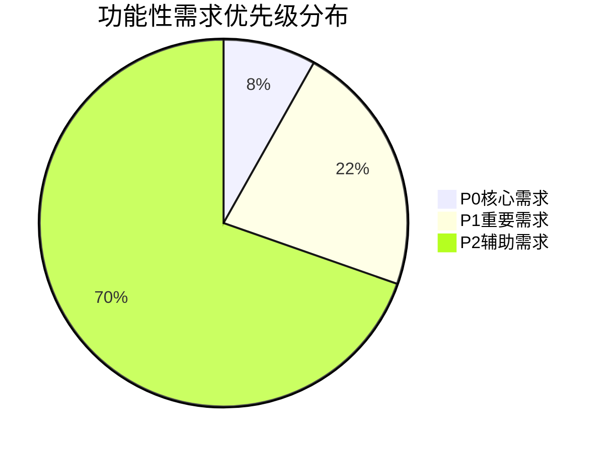
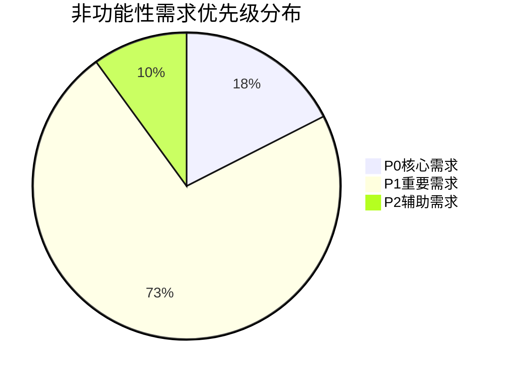

# 需求分类与优先级可视化报告

## 📊 需求优先级分布

### 功能性需求优先级分布

### 非功能性需求优先级分布

## 🏗️ 模块需求分布

| 模块 | P0 | P1 | P2 | 总数 | 占比 |
|------|----|----|----|------|------|
| 用户管理 | 2 | 7 | 25 | 34 | 16.6% |
| 课程预约 | 2 | 11 | 19 | 32 | 15.6% |
| 会员服务 | 4 | 7 | 9 | 20 | 9.8% |
| 管理后台 | 1 | 1 | 1 | 3 | 1.5% |
| 安全保障 | 2 | 0 | 0 | 2 | 1.0% |
| 其他功能 | 0 | 1 | 39 | 40 | 19.5% |
| 教练服务 | 0 | 3 | 1 | 4 | 2.0% |

## 🎯 P0核心需求清单

### 功能性核心需求
1. **用户管理** - 安全的密码加密存储
2. **用户管理** - 邮箱验证机制
3. **管理后台** - 管理员角色权限管理
4. **安全保障** - 安全审计机制
5. **安全保障** - 安全日志记录
6. **课程预约** - 提供课程预约和预订功能
7. **课程预约** - 提供课程预约和预订功能
8. **会员服务** - 处理支付流程和支付状态管理
9. **会员服务** - 处理支付流程和支付状态管理
10. **会员服务** - 处理支付流程和支付状态管理
11. **会员服务** - 处理支付流程和支付状态管理

### 非功能性核心需求
1. **concurrency** - 支持1000并发用户同时预约
2. **authentication** - 密码安全存储，使用bcrypt哈希算法，盐值随机生成
3. **session_management** - 会话超时30分钟，无操作自动登出
4. **data_transmission** - 所有API使用HTTPS协议，敏感数据加密传输
5. **input_validation** - 所有用户输入进行XSS和SQL注入过滤
6. **access_control** - 管理员功能需要角色验证，用户数据隔离
7. **payment_security** - 支付信息不存储在本地，实时转发到支付网关

## 📋 实施建议

### 第一阶段：核心需求实现（P0）
**时间**: 1-2个月
**重点**: 安全、支付、认证核心功能
**需求数量**: 18项

### 第二阶段：重要需求完善（P1）
**时间**: 2-3个月
**重点**: 性能优化、用户体验提升
**需求数量**: 59项

### 第三阶段：辅助功能优化（P2）
**时间**: 持续改进
**重点**: 细节优化和体验提升
**需求数量**: 98项

---

*报告生成时间: 2025-11-17T05:21:04.526Z*
