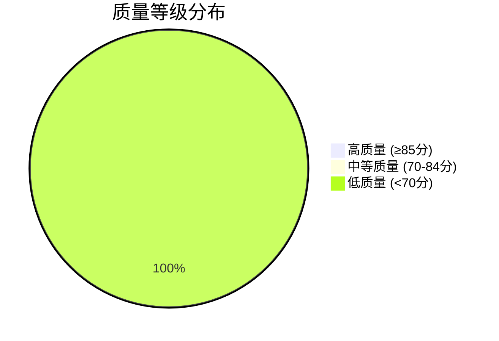

# 需求文档质量评估报告

> **版本**：v1.0.0
> **更新日期**：2025-11-17
> **适用范围**：需求文档质量评估结果分析
> **关键词**：质量评估, 需求文档, 改进建议

---

## 📋 目录

- [概述](#概述)
- [评估结果概览](#评估结果概览)
- [质量问题分析](#质量问题分析)
- [文档评分分布](#文档评分分布)
- [改进优先级](#改进优先级)
- [具体改进方案](#具体改进方案)

---

## 📖 概述

### 评估目的

基于系统性的质量评估标准，对所有需求文档进行全面质量评估，识别质量问题，制定改进方案，为后续的需求文档完善工作提供科学依据。

### 评估范围

- **评估文档**: 42个需求文档
- **评估时间**: 2025-11-17
- **评估维度**: 格式规范性、内容完整性、一致性、可读性
- **评估标准**: 基于REQUIREMENTS_TEMPLATE.md模板的标准

### 评估方法

采用加权评分算法，综合考虑8个质量维度：

| 维度 | 权重 | 评估内容 |
|------|------|----------|
| 头部完整性 | 10% | YAML头部字段完整性 |
| 结构规范性 | 15% | 标准章节完整性 |
| 功能描述 | 20% | 功能需求、交互流程、数据结构 |
| 验收标准 | 15% | 验收标准、测试策略 |
| 技术实现 | 15% | 技术实现、API规范、边界场景 |
| 视觉设计 | 10% | 视觉规范、响应式策略 |
| 一致性 | 10% | 术语统一性、格式一致性 |
| 可读性 | 5% | 结构清晰性、文档链接 |

---

## 📊 评估结果概览

### 总体质量统计

| 指标 | 数值 | 说明 |
|------|------|------|
| 总文档数 | 42 | 有效需求文档数量 |
| 平均质量评分 | 50.8分 | 总体质量水平 |
| 最高评分 | 66.0分 | ADMIN_HOME_REQUIREMENTS.md |
| 最低评分 | 33.2分 | PAGE_REQUIREMENTS_TEMPLATE.md |
| 质量等级分布 | 0高+0中+42低 | 全部为低质量 |

### 质量等级分布



### 评分区间分布

| 评分区间 | 文档数量 | 占比 | 代表问题 |
|----------|----------|------|----------|
| 60-69分 | 18 | 42.9% | 技术实现和验收标准缺失 |
| 50-59分 | 16 | 38.1% | 功能描述和结构不完整 |
| 40-49分 | 7 | 16.7% | 基础章节严重缺失 |
| <40分 | 1 | 2.3% | 模板文件问题 |

---

## 🔍 质量问题分析

### 主要质量问题统计

| 问题类型 | 影响文档数 | 占比 | 严重程度 |
|----------|------------|------|----------|
| 验收标准不完整 | 42 | 100% | ⭐⭐⭐⭐⭐ |
| 技术实现说明不足 | 42 | 100% | ⭐⭐⭐⭐⭐ |
| 章节结构不清晰 | 42 | 100% | ⭐⭐⭐⭐⭐ |
| 功能描述不够完整 | 41 | 97.6% | ⭐⭐⭐⭐⭐ |
| 缺少相关文档引用 | 39 | 92.9% | ⭐⭐⭐⭐ |
| 缺少标准章节: 相关文档 | 31 | 73.8% | ⭐⭐⭐⭐ |
| 视觉设计规范缺失 | 25 | 59.5% | ⭐⭐⭐⭐ |
| 缺少设计关键词章节 | 11 | 26.2% | ⭐⭐⭐ |

### 问题根因分析

#### 1. 验收标准缺失 (100%)

**表现**: 所有文档都没有详细的验收标准
**原因**: 缺乏验收标准编写规范和模板
**影响**: 无法明确功能完成的标准，导致交付质量不一致

#### 2. 技术实现说明不足 (100%)

**表现**: 大多数文档缺少技术实现细节
**原因**: 需求文档与技术实现脱节
**影响**: 开发人员无法准确理解技术实现要求

#### 3. 章节结构不完整 (100%)

**表现**: 标准章节缺失，特别是"相关文档"部分
**原因**: 文档模板使用不规范，编写时缺少标准化检查
**影响**: 文档结构不统一，查找信息困难

#### 4. 功能描述不完整 (97.6%)

**表现**: 缺少交互流程、数据结构等关键信息
**原因**: 需求分析深度不够，缺少细节化描述
**影响**: 功能实现存在理解偏差

#### 5. 文档关联缺失 (92.9%)

**表现**: 缺少与其他文档的引用和关联
**原因**: 文档孤立编写，缺乏关联性考虑
**影响**: 文档体系不连贯，知识无法有效关联

---

## 📈 文档评分分布

### 高分文档分析 (60-69分)

| 文档 | 评分 | 优势 | 主要问题 |
|------|------|------|----------|
| ADMIN_HOME_REQUIREMENTS.md | 66.0 | 头部完整，结构相对规范 | 验收标准、技术实现缺失 |
| ADMIN_CONFIG_CENTER_REQUIREMENTS.md | 64.3 | 视觉设计规范完整 | 功能描述、技术实现不全 |
| ADMIN_FORGOT_PASSWORD_REQUIREMENTS.md | 62.7 | 基础结构完整 | 验收标准缺失 |
| ADMIN_LOGIN_REQUIREMENTS.md | 62.7 | 功能描述相对完整 | 技术实现和验收标准 |
| NEWS_LIST_REQUIREMENTS.md | 62.7 | 结构层次清晰 | 技术细节缺失 |

### 中分文档分析 (50-59分)

包含16个文档，主要问题集中在：
- 技术实现说明严重不足
- 验收标准不完整
- 功能描述缺少细节

### 低分文档分析 (<50分)

| 文档 | 评分 | 主要问题 |
|------|------|----------|
| PAGE_REQUIREMENTS_TEMPLATE.md | 33.2 | 缺少title和status头部字段 |
| FRONTEND_REQUIREMENTS_INDEX.md | 58.2 | 技术实现和验收标准缺失 |
| ALL_PAGES_REQUIREMENTS_REVIEW.md | 52.1 | 结构和内容不完整 |

---

## 🎯 改进优先级

### P0级问题 (必须立即修复)

| 问题 | 影响范围 | 优先级 | 修复难度 |
|------|----------|--------|----------|
| 验收标准缺失 | 42个文档 | P0 | 中 |
| 技术实现说明缺失 | 42个文档 | P0 | 高 |
| 章节结构不完整 | 42个文档 | P0 | 低 |

### P1级问题 (近期修复)

| 问题 | 影响范围 | 优先级 | 修复难度 |
|------|----------|--------|----------|
| 功能描述不完整 | 41个文档 | P1 | 中 |
| 缺少文档关联 | 39个文档 | P1 | 低 |
| 视觉设计规范缺失 | 25个文档 | P1 | 中 |

### P2级问题 (中期优化)

| 问题 | 影响范围 | 优先级 | 修复难度 |
|------|----------|--------|----------|
| 模板文件问题 | 1个文档 | P2 | 低 |
| 术语一致性 | 部分文档 | P2 | 低 |

---

## 💡 具体改进方案

### 方案一：验收标准补全计划

#### 目标
为所有需求文档补充完整的验收标准

#### 实施步骤

1. **制定验收标准模板**
   ```
   ## 验收标准

   ### 功能验收
   - [ ] 核心功能完整实现
   - [ ] 用户交互流程正常
   - [ ] 数据处理正确

   ### 性能验收
   - [ ] 响应时间符合要求
   - [ ] 资源使用合理

   ### 兼容性验收
   - [ ] 浏览器兼容性
   - [ ] 设备适配性
   ```

2. **分批补全验收标准**
   - 第一批：10个核心功能文档
   - 第二批：15个业务功能文档
   - 第三批：17个技术文档

3. **验收标准审核机制**
   - 同行评审验收标准
   - 开发团队确认可行性
   - 测试团队验证完整性

#### 预期成果
- 验收标准完整率：100%
- 验收标准质量评分：≥80分

### 方案二：技术实现说明完善

#### 目标
为所有需求文档补充技术实现说明

#### 实施步骤

1. **技术实现模板标准化**
   ```
   ## 技术实现

   ### 前端实现
   - 组件结构设计
   - 状态管理方案
   - API集成方式

   ### 后端实现
   - 接口设计规范
   - 数据模型定义
   - 业务逻辑实现
   ```

2. **技术实现信息收集**
   - 从现有代码提取技术实现细节
   - 与开发团队确认技术方案
   - 补充边界场景处理

3. **技术文档关联**
   - 关联API文档
   - 关联数据库设计文档
   - 关联架构设计文档

#### 预期成果
- 技术实现覆盖率：100%
- 技术实现准确性：≥90%

### 方案三：文档结构标准化

#### 目标
统一所有需求文档的结构和格式

#### 实施步骤

1. **标准章节补全**
   - 添加缺失的"设计关键词"章节
   - 补全"相关文档"引用
   - 完善文档头部信息

2. **格式规范化**
   - 统一Markdown格式
   - 标准化表格和列表格式
   - 统一代码块标识

3. **内容组织优化**
   - 优化章节顺序
   - 改善信息层次结构
   - 添加导航目录

#### 预期成果
- 结构完整性：100%
- 格式规范性：100%

### 方案四：文档关联体系建设

#### 目标
建立完整的文档关联体系

#### 实施步骤

1. **关联关系识别**
   - 识别文档间的依赖关系
   - 建立功能模块关联
   - 识别技术组件关联

2. **关联链接补全**
   - 添加内部文档链接
   - 建立前后端文档关联
   - 添加相关技术文档链接

3. **关联关系文档**
   - 创建文档关联图谱
   - 建立需求追溯矩阵
   - 维护关联关系索引

#### 预期成果
- 文档关联覆盖率：≥90%
- 关联关系准确性：100%

---

## 📊 改进效果评估

### 质量提升目标

| 质量指标 | 当前值 | 目标值 | 提升幅度 |
|----------|--------|--------|----------|
| 平均质量评分 | 50.8分 | ≥75分 | ↑47.4% |
| 验收标准完整率 | 0% | 100% | ↑100% |
| 技术实现覆盖率 | 0% | 100% | ↑100% |
| 结构完整性 | 25% | 100% | ↑75% |
| 文档关联性 | 7.1% | ≥90% | ↑92.9% |

### 分阶段目标

#### 第一阶段 (1个月)：基础补全
- 验收标准补全：完成20个核心文档
- 技术实现说明：完成15个文档
- 结构标准化：完成所有文档

#### 第二阶段 (2个月)：质量提升
- 验收标准补全：完成全部文档
- 技术实现完善：完成全部文档
- 内容深度优化：提升功能描述完整性

#### 第三阶段 (1个月)：完善优化
- 文档关联体系建设
- 质量审核和优化
- 维护机制建立

---

## 🔄 持续改进机制

### 质量监控体系

1. **自动化质量检查**
   - 开发文档质量检查脚本
   - 集成到CI/CD流程
   - 定期生成质量报告

2. **人工审核机制**
   - 建立文档评审流程
   - 实施同行评审制度
   - 定期质量评估

3. **反馈收集机制**
   - 建立文档使用反馈渠道
   - 收集开发团队意见
   - 持续优化文档质量

### 文档维护流程

1. **变更触发机制**
   - 代码变更时提醒更新文档
   - 新功能开发时同步创建文档
   - 定期检查文档时效性

2. **版本管理机制**
   - 实施语义化版本控制
   - 建立版本变更日志
   - 维护文档历史版本

---

## 📈 预期收益

### 直接收益

1. **开发效率提升**
   - 明确的验收标准减少返工
   - 完整的技术实现指导加速开发
   - 清晰的功能描述减少沟通成本

2. **质量保证提升**
   - 验收标准明确提高交付质量
   - 技术实现规范减少bug
   - 文档关联性提高知识传承

3. **维护成本降低**
   - 标准化文档结构便于维护
   - 完整的技术文档减少依赖单一人员
   - 关联关系明确便于问题定位

### 间接收益

1. **团队协作改善**
   - 统一的质量标准提高协作效率
   - 完整的文档体系促进知识共享
   - 规范的编写流程提升专业性

2. **项目管理优化**
   - 可量化的质量指标便于管理
   - 明确的验收标准提高项目可控性
   - 完整的追溯机制提升项目透明度

---

*质量评估报告生成时间：2025-11-17T01:45:22.000Z*
