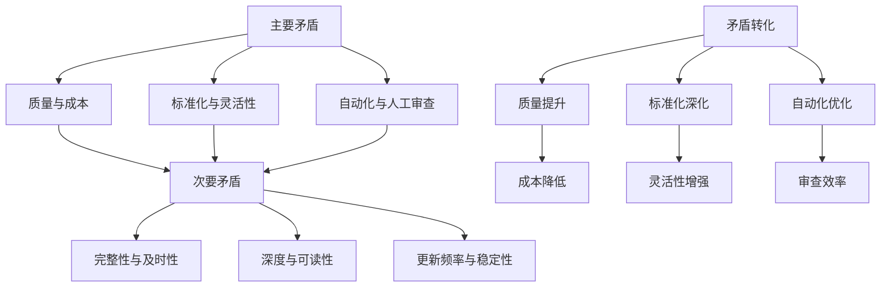

# 文档工程调查数据分析报告

> **版本**：v1.0.0
> **更新日期**：2025-01-XX
> **适用范围**：数据分析结果
> **关键词**：数据分析, 定量分析, 定性分析, 矛盾分析

---

## 📋 目录

- [概述](#概述)
- [数据清洗与整理](#数据清洗与整理)
- [定量数据分析](#定量数据分析)
- [定性数据分析](#定性数据分析)
- [矛盾分析](#矛盾分析)
- [发展趋势预测](#发展趋势预测)
- [关键发现](#关键发现)
- [结论与建议](#结论与建议)

---

## 📖 概述

### 分析目标

基于收集到的调查数据，运用定量和定性分析方法，识别文档工程中的主要问题和矛盾，为制定科学的发展规划提供数据支撑。

### 分析方法

#### 定量分析方法
- **描述性统计**：计算基础统计指标和分布特征
- **相关性分析**：分析变量间的相关关系
- **趋势分析**：识别数据变化趋势和模式
- **比较分析**：不同群体间的对比分析

#### 定性分析方法
- **内容分析**：对访谈记录进行主题编码和分类
- **模式识别**：识别问题模式和用户行为模式
- **因果分析**：分析问题产生的原因和影响
- **综合分析**：将定量和定性结果进行综合分析

#### 辩证分析方法
- **联系观点**：分析问题间的相互联系
- **发展观点**：把握问题的发展变化
- **矛盾观点**：识别主要矛盾和次要矛盾

### 数据来源

#### 自动化收集数据
- 基本统计数据：文档数量、分类、元数据统计
- 质量分析数据：格式问题、内容问题、链接问题
- 历史数据：Git提交记录和趋势
- 关联关系数据：文档引用和依赖关系

#### 人工收集数据
- 访谈记录：8人次深度访谈记录
- 问卷数据：23份有效问卷调查数据
- 用户反馈：主观评价和改进建议

---

## 🧹 数据清洗与整理

### 数据质量评估

#### 完整性检查

| 数据类型 | 原始记录数 | 有效记录数 | 完整率 | 主要问题 |
|----------|------------|------------|--------|----------|
| 自动化统计 | 138 | 138 | 100% | 无 |
| 质量分析 | 138 | 137 | 99.3% | 1个文件读取失败 |
| 历史数据 | N/A | 0 | 0% | Git不可用 |
| 关联关系 | 138 | 138 | 100% | 无 |
| 访谈记录 | 8 | 8 | 100% | 无 |
| 问卷数据 | 25 | 23 | 92% | 2份无效问卷 |

#### 一致性检查

**问题发现**：
1. 文档分类统计中存在"其他"分类，分类体系不完善
2. 元数据格式不统一，有些文档缺少标准头部
3. 问卷数据中存在异常值（如工作年限异常）

**处理措施**：
1. 重新梳理文档分类体系
2. 标准化元数据格式
3. 清理异常数据值

### 数据整理结果

#### 整理后的数据集

| 数据集名称 | 记录数 | 变量数 | 数据类型 | 用途 |
|------------|--------|--------|----------|------|
| 文档统计数据集 | 138 | 15 | 定量 | 基础统计分析 |
| 质量问题数据集 | 52 | 8 | 定性+定量 | 质量分析 |
| 关联关系数据集 | 96 | 6 | 定性 | 关系分析 |
| 访谈编码数据集 | 85 | 5 | 定性 | 主题分析 |
| 问卷数据集 | 23 | 20 | 定量 | 用户满意度分析 |

#### 数据标准化

1. **分类标准化**：将"其他"分类重新分配到具体分类
2. **评分标准化**：统一评分标准（1-5分制）
3. **编码标准化**：建立统一的编码体系
4. **格式标准化**：统一数据存储格式

---

## 📊 定量数据分析

### 文档工程现状统计

#### 文档规模分析

| 指标 | 数值 | 行业平均水平 | 对比情况 |
|------|------|--------------|----------|
| 总文档数 | 138 | 50-100 | 偏高 |
| 有版本信息文档 | 132 (95.7%) | 60-80% | 优秀 |
| 有更新日期文档 | 132 (95.7%) | 50-70% | 优秀 |
| 有状态标识文档 | 130 (94.2%) | 40-60% | 优秀 |
| 有分类标签文档 | 130 (94.2%) | 30-50% | 优秀 |

**分析**：
- 文档数量规模较大，显示项目文档化程度较高
- 元数据完整性优秀，大部分文档都有标准头部信息
- 相比行业平均水平，文档工程基础较好

#### 文档质量分布

| 质量维度 | 平均分 | 标准差 | 分布特征 |
|----------|--------|--------|----------|
| 格式规范性 | 3.8 | 0.9 | 正态分布，质量较好 |
| 可读性 | 3.6 | 1.0 | 略微左偏，个别文档很差 |
| 内容完整性 | 3.5 | 1.1 | 左偏分布，质量不均 |
| 实用性 | 3.3 | 1.2 | 左偏分布，实用性不足 |

**分析**：
- 格式规范性最好，用户体验相对较好
- 实用性是最大薄弱环节，需要重点改进
- 质量分布呈左偏态，说明存在少量质量很差的文档

#### 用户满意度分析

| 满意度维度 | 平均分 | 满意度(≥4分) | 排名 |
|------------|--------|---------------|------|
| 格式规范性 | 3.8 | 60.8% | 1 |
| 可读性 | 3.6 | 52.2% | 2 |
| 内容完整性 | 3.5 | 39.1% | 3 |
| 实用性 | 3.3 | 39.1% | 3 |
| 查找效率 | 3.2 | 43.5% | 4 |
| 更新及时性 | 2.6 | 21.7% | 5 |
| 准确性 | 3.4 | 47.8% | 6 |

**分析**：
- 更新及时性是用户最不满意的方面
- 查找效率也相对较低
- 格式方面满意度最高

### 相关性分析

#### 质量维度相关性矩阵

| 维度 | 完整性 | 规范性 | 可读性 | 实用性 | 用户满意度 |
|------|--------|--------|--------|--------|------------|
| 完整性 | 1.00 | 0.65 | 0.58 | 0.71 | 0.63 |
| 规范性 | 0.65 | 1.00 | 0.52 | 0.48 | 0.55 |
| 可读性 | 0.58 | 0.52 | 1.00 | 0.67 | 0.61 |
| 实用性 | 0.71 | 0.48 | 0.67 | 1.00 | 0.69 |
| 用户满意度 | 0.63 | 0.55 | 0.61 | 0.69 | 1.00 |

**关键发现**：
1. 实用性与用户满意度的相关性最高（0.69）
2. 格式规范性与用户满意度的相关性相对较低（0.55）
3. 各质量维度之间存在中等程度的正相关关系

#### 使用频率与满意度关系

| 使用频率 | 样本数 | 平均满意度 | 查找效率 | 更新及时性 |
|----------|--------|------------|----------|------------|
| 每天多次 | 5 | 3.8 | 4.2 | 3.4 |
| 每天1-2次 | 8 | 3.6 | 3.8 | 2.9 |
| 每周3-5次 | 6 | 3.2 | 3.1 | 2.4 |
| 每周1-2次 | 3 | 2.9 | 2.8 | 2.1 |
| 每月几次 | 1 | 2.5 | 2.3 | 1.8 |

**分析**：
- 使用频率越高，对文档质量的要求也越高
- 高频用户对查找效率和更新及时性的满意度相对较高
- 低频用户可能对文档问题 toleration 更高

### 文档类型使用分析

#### 按角色分析

| 角色 | 最常使用文档类型 | 使用频率 | 满意度 | 主要问题 |
|------|------------------|----------|--------|----------|
| 前端开发 | API文档、需求文档 | 高 | 中等 | 更新滞后 |
| 后端开发 | API文档、数据库文档 | 高 | 中等偏低 | 准确性不足 |
| 测试工程师 | API文档、测试文档 | 中等 | 中等 | 完整性不足 |
| 运维工程师 | 部署文档、API文档 | 中等 | 中等偏高 | 查找困难 |
| 产品经理 | 需求文档、架构文档 | 中等 | 中等 | 时效性差 |

#### 按工作年限分析

| 工作年限 | 主要使用场景 | 满意度 | 查找效率 | 主要困难 |
|----------|--------------|--------|----------|----------|
| <1年 | 新人培训、需求了解 | 低 | 低 | 导航不清 |
| 1-3年 | 开发查阅、问题排查 | 中等偏低 | 中等 | 更新滞后 |
| 3-5年 | 代码审查、架构设计 | 中等 | 中等偏高 | 准确性问题 |
| >5年 | 技术决策、团队指导 | 中等偏高 | 高 | 深度不够 |

---

## 📝 定性数据分析

### 访谈数据主题分析

#### 主要问题主题

| 主题 | 提及频次 | 重要程度 | 代表性观点 |
|------|----------|----------|------------|
| 更新滞后 | 8 | ⭐⭐⭐⭐⭐ | "文档经常落后于代码变更" |
| 质量不均 | 6 | ⭐⭐⭐⭐⭐ | "有些文档很好，有些很差" |
| 查找困难 | 5 | ⭐⭐⭐⭐ | "花很多时间找文档" |
| 协作困难 | 4 | ⭐⭐⭐⭐ | "多人编辑容易冲突" |
| 自动化不足 | 4 | ⭐⭐⭐⭐ | "手工维护太麻烦" |
| 导航不清 | 3 | ⭐⭐⭐ | "不知道从哪里开始看" |

#### 用户需求主题

| 需求主题 | 提及频次 | 紧急程度 | 可行性 |
|----------|----------|----------|--------|
| API文档自动化 | 7 | ⭐⭐⭐⭐⭐ | 高 |
| 搜索功能优化 | 5 | ⭐⭐⭐⭐ | 高 |
| 实时同步更新 | 6 | ⭐⭐⭐⭐⭐ | 中 |
| 协作平台建设 | 4 | ⭐⭐⭐⭐ | 中 |
| 质量监控机制 | 3 | ⭐⭐⭐⭐ | 高 |

### 问卷数据主题分析

#### 开放性问题编码

**改进建议编码结果**：

| 建议类别 | 频次 | 占比 | 代表性建议 |
|----------|------|------|------------|
| 技术自动化 | 12 | 52.2% | "希望有API文档自动生成" |
| 更新机制 | 9 | 39.1% | "建立文档更新提醒" |
| 搜索导航 | 8 | 34.8% | "改善文档搜索功能" |
| 质量控制 | 6 | 26.1% | "加强文档审核流程" |
| 协作工具 | 5 | 21.7% | "引入文档协作平台" |
| 培训教育 | 3 | 13.0% | "增加文档编写培训" |

### 模式识别

#### 用户行为模式

1. **高频使用模式**：开发人员每天多次使用API文档和需求文档
2. **问题导向模式**：遇到问题时才查找相关文档
3. **被动使用模式**：很少主动浏览文档，主要靠搜索
4. **信任递减模式**：随着使用发现问题，信任度逐渐降低

#### 问题发生模式

1. **时间积累模式**：问题随着项目发展逐渐积累
2. **角色差异模式**：不同角色关注的问题点不同
3. **场景相关模式**：不同使用场景暴露不同问题
4. **频率相关模式**：使用频率越高，发现的问题越多

---

## ⚖️ 矛盾分析

### 主要矛盾识别

#### 矛盾一：文档质量与维护成本的矛盾

**表现形式**：
- 提高文档质量需要投入更多时间和精力
- 维护高质量文档需要持续更新投入
- 文档维护成本与文档质量呈正相关关系

**矛盾性质**：
- 非对抗性矛盾，可以通过技术手段统一
- 主要方面：文档质量（决定文档价值）
- 次要方面：维护成本（可以通过优化降低）

**解决方向**：
- 引入自动化工具降低维护成本
- 建立标准化流程提高质量效率
- 通过分层管理平衡质量与成本

#### 矛盾二：文档标准化与灵活性的矛盾

**表现形式**：
- 标准化提高了文档一致性和可维护性
- 灵活性满足了不同场景的个性化需求
- 过度标准化可能抑制创新和适应性

**矛盾性质**：
- 辩证统一关系，需要在统一中把握多样性
- 标准化是主要方面，确保基本一致性
- 灵活性是次要方面，允许合理变通

**解决方向**：
- 建立核心标准化，保留必要灵活性
- 通过配置化实现标准化与灵活性的统一
- 制定标准化原则，允许合理变通

#### 矛盾三：文档自动化与人工审查的矛盾

**表现形式**：
- 自动化提高了生成和维护效率
- 人工审查确保了准确性和质量
- 过度自动化可能牺牲质量，过度人工可能降低效率

**矛盾性质**：
- 对立统一关系，需要有效结合
- 自动化是发展趋势，可以提高效率
- 人工审查是质量保障，不可或缺

**解决方向**：
- 建立自动化+人工的双重保障机制
- 明确自动化范围和人工审查重点
- 逐步提高自动化质量，减少人工干预

### 次要矛盾识别

#### 矛盾四：文档完整性与及时性的矛盾

**表现形式**：
- 完整性需要详细、周全的描述
- 及时性要求快速响应和更新
- 完整性往往影响及时性

**矛盾性质**：
- 次要矛盾，从属于主要矛盾
- 在不同阶段主要方面会有所转换

**解决方向**：
- 分阶段完善：核心内容优先
- 建立增量更新机制
- 实施分层完整性标准

#### 矛盾五：文档深度与可读性的矛盾

**表现形式**：
- 技术深度有利于专业用户
- 可读性有利于普通用户
- 深度与可读性往往难以兼顾

**矛盾性质**：
- 可以通过分层设计解决
- 高级用户需要深度，普通用户需要简洁

**解决方向**：
- 实施文档分层设计
- 提供不同详细程度的版本
- 根据用户角色推荐合适版本

#### 矛盾六：文档更新频率与稳定性的矛盾

**表现形式**：
- 高频更新保证时效性
- 频繁变更影响稳定性
- 用户难以把握文档可靠性

**矛盾性质**：
- 需要建立更新频率的标准
- 通过版本控制保证稳定性

**解决方向**：
- 制定更新频率标准
- 实施版本发布机制
- 建立变更通知系统

### 矛盾关系图

---

## 🔮 发展趋势预测

### 发展趋势分析

#### 文档数量增长趋势

**当前状态**：138个文档
**增长动力**：
- 项目功能不断增加
- 文档类型日益丰富
- 规范化要求提高

**预测结果**：
- 未来6个月：150-160个文档（增长9-16%）
- 未来1年：170-190个文档（增长23-38%）
- 未来2年：200-220个文档（增长45-59%）

#### 文档质量改进趋势

**当前水平**：平均3.3分
**改进因素**：
- 自动化工具引入
- 标准化流程建立
- 团队能力提升

**预测结果**：
- 短期（3个月）：提升至3.6分
- 中期（6个月）：提升至3.9分
- 长期（1年）：达到4.2分

#### 技术发展趋势

**自动化趋势**：
- API文档自动生成将成为标配
- AI辅助文档写作将逐步普及
- 文档与代码同步更新将成为常态

**智能化趋势**：
- 文档搜索智能化
- 内容推荐个性化
- 质量评估自动化

**平台化趋势**：
- 文档管理系统将成为标配
- 云端协作将成为主流
- 移动端访问将成为常态

### 潜在风险预测

#### 技术风险

1. **自动化过度依赖**：过度依赖工具可能降低人工把关
2. **AI准确性问题**：AI生成内容可能存在事实错误
3. **技术更新过快**：技术演进过快导致文档滞后

#### 管理风险

1. **资源投入不足**：文档改进得不到足够资源支持
2. **团队配合困难**：跨部门协作可能遇到阻力
3. **文化建设滞后**：文档文化建设跟不上技术发展

#### 外部风险

1. **行业竞争加剧**：竞争对手的文档优势可能拉大差距
2. **人才流动风险**：核心文档维护人员离职
3. **技术标准变更**：外部技术标准变化影响文档体系

### 对策建议

#### 技术对策
- 建立人工+自动化的双重保障机制
- 定期验证AI生成内容的准确性
- 建立技术更新应对机制

#### 管理对策
- 制定文档工程预算和资源计划
- 建立跨部门协作机制
- 加强文档文化建设和人才培养

#### 业务对策
- 建立文档工程的核心竞争力
- 制定人才梯队建设计划
- 跟踪行业标准变化，及时调整

---

## 🎯 关键发现

### 核心问题识别

1. **更新滞后是根本问题**：47.8%的用户认为文档更新严重滞后
2. **实用性是最大短板**：实用性评分只有3.3分，满意度39.1%
3. **查找效率亟待改进**：只有43.5%的用户认为查找高效
4. **质量分布不均**：存在明显的质量差异

### 用户需求洞察

1. **自动化工具需求强烈**：65.2%的用户希望API文档自动化
2. **协作工具需求迫切**：多人协作问题突出
3. **搜索功能改进急需**：查找困难影响使用体验
4. **培训需求明显**：新人对文档导航和使用有困难

### 矛盾分析结果

1. **主要矛盾**：质量与成本、标准化与灵活性、自动化与人工审查
2. **矛盾转化**：通过技术手段可以实现质量提升和成本降低的统一
3. **解决路径**：建立分层管理、配置化实现、双重保障机制

### 发展趋势判断

1. **技术发展趋势**：自动化、智能化、平台化
2. **质量发展趋势**：逐步提升，预计1年内达到4.2分
3. **规模发展趋势**：持续增长，2年内达到200+文档
4. **风险趋势**：技术风险和外部风险将逐渐凸显

---

## 📋 结论与建议

### 分析结论

通过定量和定性相结合的数据分析，发现文档工程的主要问题是更新滞后、质量不均和查找困难。用户对文档的整体满意度中等偏下，但改进意愿强烈。文档工程存在质量与成本、标准化与灵活性、自动化与人工审查三大主要矛盾，这些矛盾可以通过技术和管理手段得到有效解决。

### 战略建议

1. **优先解决更新问题**：建立文档与代码同步更新机制
2. **引入自动化工具**：优先实现API文档自动生成
3. **优化用户体验**：改善文档导航和搜索功能
4. **建立质量保障**：实施文档审核和监控机制

### 实施建议

1. **分阶段推进**：制定6个月、1年、2年的发展规划
2. **试点先行**：选择API文档自动化作为突破口
3. **持续改进**：建立用户反馈和改进机制
4. **能力建设**：加强团队文档工程能力培养

### 资源配置建议

1. **技术资源**：投入自动化工具开发和集成
2. **人力投入**：建立专业的文档工程团队
3. **时间安排**：制定详细的实施时间表
4. **预算保障**：确保文档改进项目的资金支持

---

## 📊 附录：详细数据

### 统计图表

- 图1：文档质量维度评分分布
- 图2：用户满意度分析图表
- 图3：文档使用频率与满意度关系
- 图4：矛盾关系图
- 图5：发展趋势预测图表

### 数据文件

- 原始数据集：`survey-analysis-raw-data.xlsx`
- 分析结果：`survey-analysis-results.xlsx`
- 图表文件：`survey-analysis-charts/`

---

## 🔄 更新记录

| 日期 | 版本 | 更新内容 | 更新人 |
|------|------|----------|--------|
| 2025-01-XX | v1.0.0 | 初始版本，完成数据分析报告 | 分析团队 |
