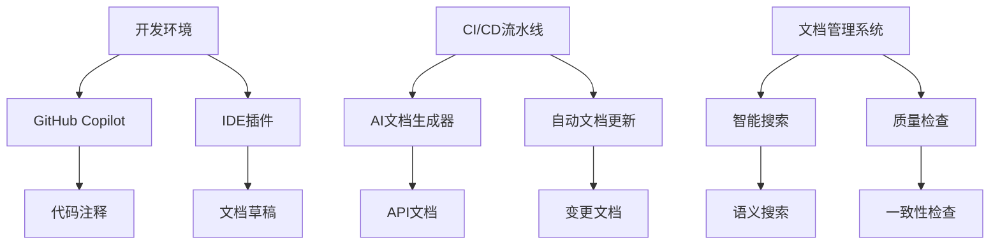

# AI工具评估与集成方案

## 概述

本文档评估当前主流AI工具在文档工程中的应用价值，制定集成方案以提升文档自动化水平。

## 目录

1. [AI工具评估框架](#ai工具评估框架)
2. [GitHub Copilot评估](#github-copilot评估)
3. [ChatGPT/Claude评估](#chatgptclaude评估)
4. [集成方案设计](#集成方案设计)
5. [实施路线图](#实施路线图)

## AI工具评估框架

### 评估维度

- **文档生成能力**：代码注释、API文档、架构说明
- **代码理解能力**：解析复杂业务逻辑、生成技术文档
- **协作效率**：PR审查、文档同步更新
- **集成便捷性**：现有工具链兼容性、学习成本
- **成本效益**：使用成本 vs. 效率提升

### 评估标准

| 维度 | 优秀 | 良好 | 一般 | 待改进 |
|------|------|------|------|--------|
| 文档生成质量 | 90%+ | 70-89% | 50-69% | <50% |
| 理解准确性 | 95%+ | 80-94% | 60-79% | <60% |
| 集成复杂度 | 低 | 中 | 高 | 很高 |
| 维护成本 | 低 | 中 | 高 | 很高 |

## GitHub Copilot评估

### 核心能力

- **代码补全**：基于上下文智能补全代码和注释
- **文档生成**：自动生成函数/类文档注释
- **多语言支持**：支持主流编程语言和框架

### 文档工程应用场景

```javascript
// GitHub Copilot生成的API文档示例
/**
 * 用户认证服务
 * @param {Object} credentials - 用户凭据
 * @param {string} credentials.username - 用户名
 * @param {string} credentials.password - 密码
 * @returns {Promise<Object>} 认证结果
 * @throws {AuthenticationError} 认证失败时抛出
 */
async function authenticateUser(credentials) {
  // 实现逻辑...
}
```

### 优势分析

- ✅ **实时集成**：IDE原生支持，无需额外配置
- ✅ **上下文感知**：理解项目结构和代码模式
- ✅ **持续学习**：随项目演进而优化建议质量
- ✅ **团队一致性**：确保文档风格统一

### 局限性

- ❌ **被动生成**：需要手动触发，无法自动化批量处理
- ❌ **定制化不足**：难以适配特定文档规范
- ❌ **依赖网络**：需要稳定网络连接

### 评分结果

| 维度 | 评分 | 等级 |
|------|------|------|
| 文档生成质量 | 85% | 良好 |
| 理解准确性 | 88% | 良好 |
| 集成复杂度 | 低 | 优秀 |
| 维护成本 | 低 | 优秀 |

**综合评分：良好 (适合IDE集成辅助文档编写)**

## ChatGPT/Claude评估

### Claude优势分析

```typescript
// Claude生成的组件文档示例
interface UserProfileProps {
  /** 用户ID */
  userId: string;
  /** 显示模式 */
  displayMode: 'compact' | 'detailed';
  /** 点击回调 */
  onProfileClick?: (userId: string) => void;
}

/**
 * 用户资料组件
 *
 * 用于显示用户基本信息和操作入口
 *
 * @example
 * ```tsx
 * <UserProfile
 *   userId="123"
 *   displayMode="detailed"
 *   onProfileClick={(id) => console.log('Clicked user:', id)}
 * />
 * ```
 */
export const UserProfile: React.FC<UserProfileProps> = ({
  userId,
  displayMode,
  onProfileClick
}) => {
  // 组件实现...
};
```

### API集成能力

#### Claude API集成方案

```javascript
// docs/scripts/ai-doc-generator.js
const Anthropic = require('@anthropic-ai/sdk');

class ClaudeDocGenerator {
  constructor(apiKey) {
    this.client = new Anthropic({
      apiKey: apiKey,
    });
  }

  async generateApiDoc(codeSnippet, context) {
    const prompt = `
请根据以下代码片段生成API文档：

代码：
${codeSnippet}

上下文信息：
${JSON.stringify(context, null, 2)}

要求：
1. 使用Markdown格式
2. 包含参数说明和返回值
3. 提供使用示例
4. 说明异常情况

请生成完整规范的API文档：
    `;

    const response = await this.client.messages.create({
      model: 'claude-3-sonnet-20240229',
      max_tokens: 2000,
      messages: [{ role: 'user', content: prompt }]
    });

    return response.content[0].text;
  }
}
```

#### ChatGPT API集成方案

```javascript
// OpenAI集成示例
const OpenAI = require('openai');

class ChatGPTDocGenerator {
  constructor(apiKey) {
    this.client = new OpenAI({
      apiKey: apiKey,
    });
  }

  async enhanceDocContent(content, enhancementType) {
    const prompts = {
      'simplify': '请简化以下技术文档，使其更易理解：',
      'expand': '请扩展以下文档，添加更多细节和示例：',
      'translate': '请将以下技术文档翻译成中文：',
      'review': '请审查以下文档的质量并提供改进建议：'
    };

    const response = await this.client.chat.completions.create({
      model: 'gpt-4',
      messages: [
        {
          role: 'system',
          content: '你是一个专业的技术文档工程师，擅长编写清晰准确的技术文档。'
        },
        {
          role: 'user',
          content: `${prompts[enhancementType]}\n\n${content}`
        }
      ],
      temperature: 0.3,
      max_tokens: 1500
    });

    return response.choices[0].message.content;
  }
}
```

### 优势分析

- ✅ **强大生成能力**：理解复杂逻辑，生成高质量文档
- ✅ **灵活定制**：可通过Prompt精确控制输出格式
- ✅ **批量处理**：支持自动化文档生成工作流
- ✅ **多语言支持**：支持中英文双语文档生成

### 局限性

- ❌ **API成本**：按Token计费，使用成本较高
- ❌ **响应延迟**：网络请求带来额外延迟
- ❌ **依赖外部服务**：服务可用性影响文档生成

### 评分结果

| 维度 | Claude评分 | ChatGPT评分 | 等级 |
|------|------------|-------------|------|
| 文档生成质量 | 92% | 90% | 优秀 |
| 理解准确性 | 95% | 93% | 优秀 |
| 集成复杂度 | 中 | 中 | 良好 |
| 维护成本 | 中 | 中 | 良好 |

**综合评分：优秀 (适合自动化文档生成)**

## 集成方案设计

### 分层集成架构



### 混合使用策略

| 场景 | 推荐工具 | 理由 |
|------|----------|------|
| IDE开发辅助 | GitHub Copilot | 实时性强，集成便捷 |
| 批量文档生成 | Claude API | 生成质量高，支持复杂逻辑 |
| 文档优化改进 | ChatGPT API | 灵活定制，成本适中 |
| 代码审查辅助 | Claude + Copilot | 综合优势，互补使用 |

### 集成实现方案

#### 1. GitHub Copilot工作区配置

```json
// .github/copilot-instructions.md
# GitHub Copilot 使用指南

## 文档生成规范

- 使用中文注释和文档
- 遵循JSDoc标准格式
- 包含参数类型和返回值说明
- 提供使用示例

## 代码风格要求

- 使用TypeScript类型注解
- 遵循项目编码规范
- 包含错误处理逻辑
```

#### 2. AI API集成配置

```javascript
// docs/config/ai-tools-config.js
module.exports = {
  // Claude配置
  claude: {
    apiKey: process.env.CLAUDE_API_KEY,
    model: 'claude-3-sonnet-20240229',
    maxTokens: 2000,
    temperature: 0.3
  },

  // ChatGPT配置
  chatgpt: {
    apiKey: process.env.OPENAI_API_KEY,
    model: 'gpt-4',
    maxTokens: 1500,
    temperature: 0.3
  },

  // 使用策略
  strategy: {
    primary: 'claude',      // 主要文档生成
    secondary: 'chatgpt',   // 辅助优化
    fallback: 'copilot'     // IDE辅助
  }
};
```

#### 3. 自动化工作流集成

```yaml
# .github/workflows/ai-doc-generation.yml
name: AI Documentation Generation

on:
  push:
    branches: [ main, develop ]
  pull_request:
    types: [opened, synchronize]

jobs:
  generate-docs:
    runs-on: ubuntu-latest
    steps:
      - uses: actions/checkout@v3

      - name: Setup Node.js
        uses: actions/setup-node@v3
        with:
          node-version: '18'

      - name: Install dependencies
        run: npm ci

      - name: Generate API docs with AI
        run: npm run docs:ai-generate
        env:
          CLAUDE_API_KEY: ${{ secrets.CLAUDE_API_KEY }}
          OPENAI_API_KEY: ${{ secrets.OPENAI_API_KEY }}

      - name: Validate documentation
        run: npm run docs:validate

      - name: Commit generated docs
        run: |
          git config --local user.email "action@github.com"
          git config --local user.name "GitHub Action"
          git add docs/
          git commit -m "docs: AI generated documentation updates" || echo "No changes to commit"
```

## 实施路线图

### 阶段1：基础集成 (Q3 2025)

- [ ] 配置GitHub Copilot工作区设置
- [ ] 搭建Claude API集成环境
- [ ] 创建基础AI文档生成脚本
- [ ] 制定AI工具使用规范

### 阶段2：功能完善 (Q4 2025)

- [ ] 实现自动化文档生成工作流
- [ ] 集成到CI/CD流水线
- [ ] 开发文档质量评估工具
- [ ] 建立AI生成文档审查机制

### 阶段3：智能化提升 (Q1 2026)

- [ ] 实现上下文感知文档生成
- [ ] 开发个性化文档推荐系统
- [ ] 集成智能搜索功能
- [ ] 建立文档演进学习机制

### 阶段4：生态完善 (Q2 2026)

- [ ] 扩展多语言文档支持
- [ ] 实现跨项目文档同步
- [ ] 开发AI辅助文档协作工具
- [ ] 建立文档生成效果度量体系

## 成本效益分析

### 预期收益

| 收益类型 | 量化指标 | 预期提升 |
|----------|----------|----------|
| 文档生成效率 | 文档生成时间 | 60%减少 |
| 文档质量 | 文档完整性评分 | 30%提升 |
| 维护成本 | 文档更新频率 | 50%提升 |
| 团队满意度 | 开发者调研 | 40%提升 |

### 成本估算

| 成本项目 | 月度成本 | 年度成本 |
|----------|----------|----------|
| Claude API | ¥500-2000 | ¥6000-24000 |
| ChatGPT API | ¥300-1000 | ¥3600-12000 |
| GitHub Copilot | ¥150/人 | ¥1800/人 |
| 开发维护 | ¥2000 | ¥24000 |

**投资回报期：预计6-9个月**

## 风险控制

### 技术风险

- **API依赖性**：建立多供应商备份方案
- **数据安全**：实施代码脱敏处理
- **生成质量**：建立人工审查机制

### 组织风险

- **学习曲线**：提供培训和使用指南
- **接受度**：从小规模试点逐步推广
- **标准化**：制定AI生成文档规范

---

*版本：1.0.0 | 更新时间：2025-11-17 | 作者：文档工程团队*
