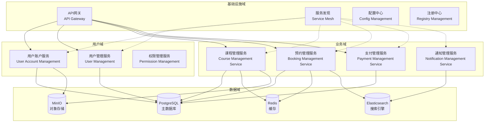
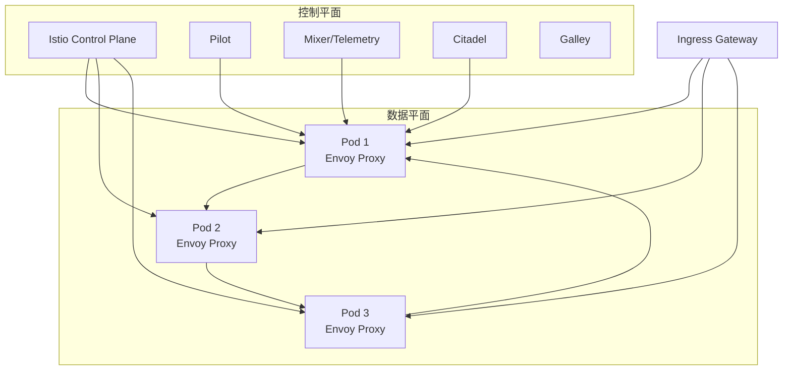
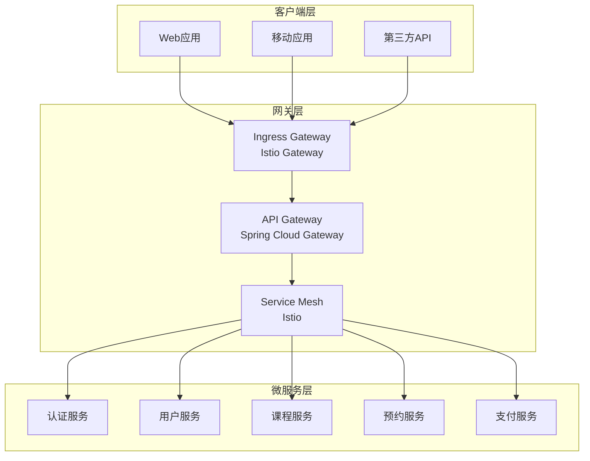
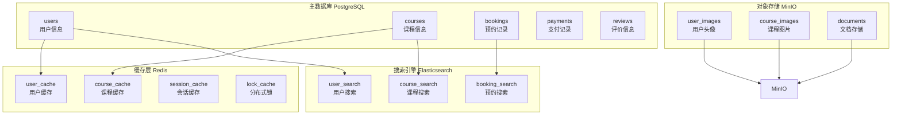
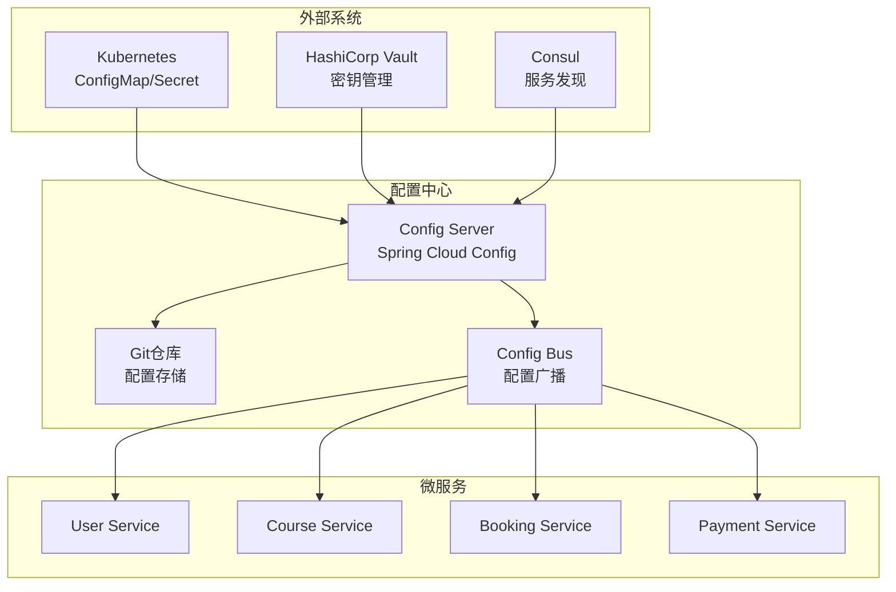
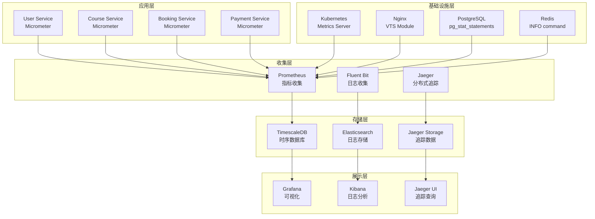
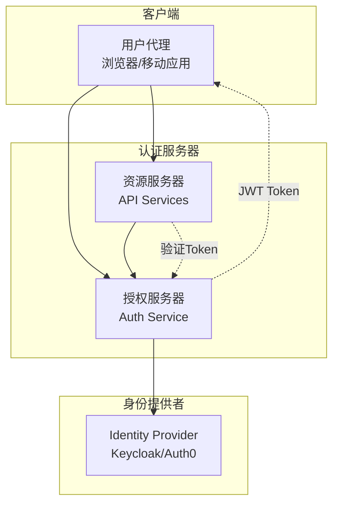
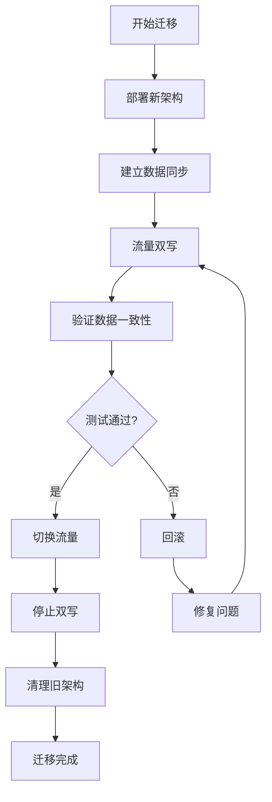

# 云原生架构设计

> **版本**: v1.0
> **最后更新**: 2025-11-16
> **维护者**: 架构团队

## 概述

本文档详细介绍健身房综合管理系统的云原生架构设计，包括微服务架构、容器编排、服务网格、API网关、数据管理、安全架构等核心组件，为构建可扩展、高可用、易维护的现代化应用系统提供指导。

## 目录

- [1. 架构设计原则](#1-架构设计原则)
- [2. 微服务架构](#2-微服务架构)
- [3. 容器化策略](#3-容器化策略)
- [4. 服务网格架构](#4-服务网格架构)
- [5. API网关设计](#5-api网关设计)
- [6. 数据架构](#6-数据架构)
- [7. 配置管理](#7-配置管理)
- [8. 可观测性架构](#8-可观测性架构)
- [9. 安全架构](#9-安全架构)
- [10. 部署和运维](#10-部署和运维)
- [11. 性能优化](#11-性能优化)
- [12. 迁移策略](#12-迁移策略)

---

## 1. 架构设计原则

### 1.1 云原生十二要素

健身房管理系统遵循云原生十二要素应用（12-Factor App）设计原则：

| 要素 | 实现方式 | 说明 |
|------|----------|------|
| **代码库** | Git 单一代码库 | 每个微服务一个Git仓库 |
| **依赖** | 容器化依赖管理 | Dockerfile声明所有依赖 |
| **配置** | 环境变量配置 | 运行时配置与代码分离 |
| **后端服务** | 服务发现 | Kubernetes Service和DNS |
| **构建、发布、运行** | CI/CD流水线 | 自动化构建和部署 |
| **进程** | 无状态进程 | 容器化无状态应用 |
| **端口绑定** | 端口绑定 | 服务监听端口，由平台路由 |
| **并发** | 水平扩展 | 通过副本实现扩展 |
| **可处置性** | 快速启动和停止 | 容器快速启动，优雅关闭 |
| **开发/生产对等** | 环境一致性 | Docker镜像保证环境一致 |
| **日志** | 事件流 | 日志作为事件流处理 |
| **管理进程** | 一次性管理任务 | Job和CronJob处理管理任务 |

### 1.2 架构设计原则

#### 微服务设计原则

- **单一职责**: 每个服务负责一个明确的业务领域
- **松耦合**: 服务间通过API通信，减少依赖
- **独立部署**: 每个服务可独立部署和扩展
- **容错性**: 单个服务失败不影响整个系统
- **可观测性**: 每个服务都有完善的监控和日志

#### 云原生设计原则

- **声明式配置**: 使用YAML描述期望状态
- **不可变基础设施**: 基础设施通过代码定义
- **自动化**: 构建、测试、部署完全自动化
- **可观测性**: 全面的监控、日志、追踪
- **弹性设计**: 自动扩缩容和故障恢复

---

## 2. 微服务架构

### 2.1 微服务拆分

健身房管理系统按照业务领域进行微服务拆分：



### 2.2 服务职责划分

#### 用户账户服务 (UAM)

**职责范围**:
- 用户注册和登录
- 身份验证和授权
- 用户档案管理
- 密码重置和安全设置

**API接口**:
```yaml
POST   /api/auth/register     # 用户注册
POST   /api/auth/login        # 用户登录
POST   /api/auth/logout       # 用户登出
GET    /api/users/profile     # 获取用户资料
PUT    /api/users/profile     # 更新用户资料
POST   /api/auth/password     # 修改密码
```

#### 课程管理服务 (CMS)

**职责范围**:
- 课程信息管理
- 课程安排和排期
- 教练信息管理
- 课程评价和反馈

**API接口**:
```yaml
GET    /api/courses           # 获取课程列表
POST   /api/courses           # 创建课程
GET    /api/courses/{id}      # 获取课程详情
PUT    /api/courses/{id}      # 更新课程
DELETE /api/courses/{id}      # 删除课程
GET    /api/coaches           # 获取教练列表
POST   /api/courses/{id}/rate # 课程评价
```

#### 预约管理服务 (BMS)

**职责范围**:
- 课程预约和取消
- 预约状态管理
- 预约冲突检测
- 等待列表管理

**API接口**:
```yaml
POST   /api/bookings           # 创建预约
GET    /api/bookings           # 获取预约列表
GET    /api/bookings/{id}      # 获取预约详情
DELETE /api/bookings/{id}      # 取消预约
GET    /api/bookings/available # 获取可用时段
POST   /api/bookings/{id}/confirm # 确认预约
```

#### 支付管理服务 (PMS)

**职责范围**:
- 支付处理集成
- 订单管理和账单
- 退款处理
- 支付记录查询

**API接口**:
```yaml
POST   /api/payments           # 创建支付
GET    /api/payments/{id}      # 获取支付状态
POST   /api/payments/{id}/refund # 退款
GET    /api/payments/history   # 支付历史
POST   /api/webhooks/stripe    # 支付回调
```

### 2.3 服务间通信

#### 同步通信

**RESTful API**:
```yaml
# 服务间调用示例
# BMS -> CMS: 检查课程可用性
GET /api/courses/{courseId}/availability?date={date}&time={time}

# PMS -> BMS: 更新支付状态
PUT /api/bookings/{bookingId}/payment-status
  body: { "status": "paid", "transactionId": "txn_123" }
```

**gRPC通信** (性能关键路径):
```protobuf
// 课程可用性检查
service CourseService {
  rpc CheckAvailability(CheckAvailabilityRequest) returns (CheckAvailabilityResponse);
}

message CheckAvailabilityRequest {
  string course_id = 1;
  string date = 2;
  string time = 3;
}

message CheckAvailabilityResponse {
  bool available = 1;
  int32 available_slots = 2;
  string message = 3;
}
```

#### 异步通信

**事件驱动架构**:
```yaml
# 预约成功事件
event:
  type: "booking.confirmed"
  data:
    bookingId: "bk_123"
    userId: "user_456"
    courseId: "course_789"
    timestamp: "2024-01-15T10:00:00Z"

# 支付完成事件
event:
  type: "payment.completed"
  data:
    paymentId: "pay_123"
    bookingId: "bk_123"
    amount: 50.00
    currency: "CNY"
```

**消息队列** (RabbitMQ/Kafka):
```yaml
# 通知队列
queue: "notification-queue"
message:
  type: "email"
  recipient: "user@example.com"
  subject: "预约确认"
  template: "booking-confirmation"
  data:
    courseName: "瑜伽课程"
    dateTime: "2024-01-20 14:00"
```

---

## 3. 容器化策略

### 3.1 容器镜像设计

#### 多阶段构建

```dockerfile
# 多阶段构建Dockerfile
FROM maven:3.9.4-openjdk-21-slim AS builder

WORKDIR /app
COPY pom.xml .
RUN mvn dependency:go-offline -B

COPY src ./src
RUN mvn clean package -DskipTests

FROM openjdk:21-jre-slim

RUN addgroup --system spring && adduser --system spring --ingroup spring
USER spring:spring

WORKDIR /app
COPY --from=builder /app/target/*.jar app.jar

EXPOSE 8080
HEALTHCHECK --interval=30s --timeout=3s --start-period=60s --retries=3 \
  CMD curl -f http://localhost:8080/actuator/health || exit 1

ENTRYPOINT ["java", "-jar", "app.jar"]
```

#### 镜像分层策略

```dockerfile
# 基础层：系统依赖
FROM openjdk:21-jre-slim AS base
RUN apt-get update && apt-get install -y \
    curl \
    jq \
    && rm -rf /var/lib/apt/lists/*

# 依赖层：应用依赖
FROM base AS dependencies
COPY target/lib /app/lib
COPY target/classes /app/classes

# 应用层：应用代码
FROM dependencies AS application
COPY target/*.jar /app/app.jar
WORKDIR /app
EXPOSE 8080
ENTRYPOINT ["java", "-jar", "app.jar"]
```

### 3.2 容器编排策略

#### Kubernetes资源配置

```yaml
# Deployment 配置
apiVersion: apps/v1
kind: Deployment
metadata:
  name: user-service
spec:
  replicas: 3
  strategy:
    type: RollingUpdate
    rollingUpdate:
      maxUnavailable: 1
      maxSurge: 1
  selector:
    matchLabels:
      app: user-service
  template:
    metadata:
      labels:
        app: user-service
    spec:
      containers:
      - name: user-service
        image: fitness-gym/user-service:v1.0.0
        ports:
        - containerPort: 8080
        resources:
          requests:
            cpu: 500m
            memory: 512Mi
          limits:
            cpu: 1000m
            memory: 1024Mi
        livenessProbe:
          httpGet:
            path: /actuator/health
            port: 8080
          initialDelaySeconds: 60
          periodSeconds: 30
        readinessProbe:
          httpGet:
            path: /actuator/health
            port: 8080
          initialDelaySeconds: 30
          periodSeconds: 10
```

#### 自动扩缩容配置

```yaml
# HorizontalPodAutoscaler
apiVersion: autoscaling/v2
kind: HorizontalPodAutoscaler
metadata:
  name: user-service-hpa
spec:
  scaleTargetRef:
    apiVersion: apps/v1
    kind: Deployment
    name: user-service
  minReplicas: 3
  maxReplicas: 10
  metrics:
  - type: Resource
    resource:
      name: cpu
      target:
        type: Utilization
        averageUtilization: 70
  - type: Resource
    resource:
      name: memory
      target:
        type: Utilization
        averageUtilization: 80
  behavior:
    scaleDown:
      stabilizationWindowSeconds: 300
      policies:
      - type: Percent
        value: 10
        periodSeconds: 60
```

### 3.3 容器安全策略

#### 安全上下文配置

```yaml
apiVersion: v1
kind: Pod
metadata:
  name: secure-pod
spec:
  securityContext:
    runAsUser: 1001
    runAsGroup: 1001
    runAsNonRoot: true
    fsGroup: 1001
  containers:
  - name: app
    image: fitness-gym/user-service:v1.0.0
    securityContext:
      allowPrivilegeEscalation: false
      readOnlyRootFilesystem: true
      runAsNonRoot: true
      runAsUser: 1001
      capabilities:
        drop:
        - ALL
    volumeMounts:
    - name: tmp
      mountPath: /tmp
  volumes:
  - name: tmp
    emptyDir: {}
```

#### 镜像安全扫描

```yaml
# CI/CD 中的镜像扫描
- name: Scan container image
  uses: aquasecurity/trivy-action@master
  with:
    scan-type: 'image'
    scan-ref: 'fitness-gym/user-service:latest'
    format: 'sarif'
    output: 'trivy-results.sarif'
    severity: 'CRITICAL,HIGH'

- name: Upload scan results
  uses: github/codeql-action/upload-sarif@v2
  if: always()
  with:
    sarif_file: 'trivy-results.sarif'
```

---

## 4. 服务网格架构

### 4.1 Istio 服务网格

#### 网格架构



#### 服务网格配置

```yaml
# Gateway 配置
apiVersion: networking.istio.io/v1beta1
kind: Gateway
metadata:
  name: fitness-gym-gateway
spec:
  selector:
    istio: ingressgateway
  servers:
  - port:
      number: 80
      name: http
      protocol: HTTP
    hosts:
    - "*.fitness-gym.com"
  - port:
      number: 443
      name: https
      protocol: HTTPS
    tls:
      mode: SIMPLE
      credentialName: fitness-gym-tls
    hosts:
    - "*.fitness-gym.com"
```

```yaml
# VirtualService 配置
apiVersion: networking.istio.io/v1beta1
kind: VirtualService
metadata:
  name: user-service
spec:
  hosts:
  - user.fitness-gym.com
  gateways:
  - fitness-gym-gateway
  http:
  - match:
    - uri:
        prefix: "/api"
    route:
    - destination:
        host: user-service
        port:
          number: 8080
    timeout: 30s
    retries:
      attempts: 3
      perTryTimeout: 10s
    corsPolicy:
      allowOrigins:
      - exact: "https://www.fitness-gym.com"
      allowMethods:
      - GET
      - POST
      - PUT
      - DELETE
      allowHeaders:
      - "authorization"
      - "content-type"
```

### 4.2 流量管理

#### 金丝雀发布

```yaml
# 金丝雀发布配置
apiVersion: networking.istio.io/v1beta1
kind: VirtualService
metadata:
  name: booking-service-canary
spec:
  hosts:
  - booking.fitness-gym.com
  http:
  - match:
    - headers:
        user-agent:
          regex: ".*Chrome.*"
    route:
    - destination:
        host: booking-service
        subset: v2
      weight: 20
    - destination:
        host: booking-service
        subset: v1
      weight: 80
  - route:
    - destination:
        host: booking-service
        subset: v1
---
apiVersion: networking.istio.io/v1beta1
kind: DestinationRule
metadata:
  name: booking-service
spec:
  host: booking-service
  subsets:
  - name: v1
    labels:
      version: v1
  - name: v2
    labels:
      version: v2
```

#### 熔断和限流

```yaml
# 熔断配置
apiVersion: networking.istio.io/v1beta1
kind: DestinationRule
metadata:
  name: payment-service-circuit-breaker
spec:
  host: payment-service
  trafficPolicy:
    connectionPool:
      tcp:
        maxConnections: 100
      http:
        http1MaxPendingRequests: 10
        maxRequestsPerConnection: 10
    outlierDetection:
      consecutive5xxErrors: 3
      interval: 10s
      baseEjectionTime: 30s
      maxEjectionPercent: 50
```

### 4.3 安全策略

#### mTLS 配置

```yaml
# PeerAuthentication - 服务间mTLS
apiVersion: security.istio.io/v1beta1
kind: PeerAuthentication
metadata:
  name: default
  namespace: fitness-prod
spec:
  mtls:
    mode: STRICT
---
# RequestAuthentication - JWT验证
apiVersion: security.istio.io/v1beta1
kind: RequestAuthentication
metadata:
  name: jwt-auth
  namespace: fitness-prod
spec:
  selector:
    matchLabels:
      app: api-gateway
  jwtRules:
  - issuer: "fitness-gym-auth-service"
    jwksUri: "https://auth.fitness-gym.com/.well-known/jwks.json"
    forwardOriginalToken: true
---
# AuthorizationPolicy - 访问控制
apiVersion: security.istio.io/v1beta1
kind: AuthorizationPolicy
metadata:
  name: booking-service-authz
  namespace: fitness-prod
spec:
  selector:
    matchLabels:
      app: booking-service
  action: ALLOW
  rules:
  - from:
    - source:
        principals: ["cluster.local/ns/fitness-prod/sa/user-service"]
    to:
    - operation:
        methods: ["GET", "POST"]
        paths: ["/api/bookings/*"]
```

---

## 5. API网关设计

### 5.1 网关架构



### 5.2 网关功能

#### 路由和负载均衡

```yaml
# Spring Cloud Gateway 配置
spring:
  cloud:
    gateway:
      routes:
      - id: user-service
        uri: lb://user-service
        predicates:
        - Path=/api/users/**
        filters:
        - RewritePath=/api/users/(?<path>.*), /${path}
        - RequestRateLimiter=args:
            redis-rate-limiter.replenishRate: 10
            redis-rate-limiter.burstCapacity: 20
            redis-rate-limiter.requestedTokens: 1

      - id: booking-service
        uri: lb://booking-service
        predicates:
        - Path=/api/bookings/**
        filters:
        - RewritePath=/api/bookings/(?<path>.*), /${path}
        - CircuitBreaker=args:
            name: bookingCircuitBreaker
            fallbackUri: forward:/fallback/booking

      - id: course-service
        uri: lb://course-service
        predicates:
        - Path=/api/courses/**
        filters:
        - RewritePath=/api/courses/(?<path>.*), /${path}
        - RequestSize=10MB
```

#### 认证和授权

```java
@Configuration
public class GatewaySecurityConfig {

    @Bean
    public SecurityWebFilterChain securityWebFilterChain(ServerHttpSecurity http) {
        return http
            .authorizeExchange()
                .pathMatchers("/api/auth/**").permitAll()
                .pathMatchers("/api/public/**").permitAll()
                .pathMatchers("/api/admin/**").hasRole("ADMIN")
                .anyExchange().authenticated()
            .and()
            .oauth2Login()
            .and()
            .oauth2ResourceServer()
                .jwt()
            .and()
            .build();
    }
}
```

#### 限流和熔断

```yaml
# Redis Rate Limiter 配置
@Bean
public RedisRateLimiter redisRateLimiter() {
    return new RedisRateLimiter(10, 20, 1); // replenishRate, burstCapacity, requestedTokens
}

# 熔断器配置
@Bean
public Customizer<ReactiveResilience4JCircuitBreakerFactory> circuitBreakerCustomizer() {
    return factory -> factory.configure(builder ->
        builder
            .circuitBreakerConfig(CircuitBreakerConfig.custom()
                .failureRateThreshold(50)
                .waitDurationInOpenState(Duration.ofMillis(1000))
                .slidingWindowSize(2)
                .build())
            .timeLimiterConfig(TimeLimiterConfig.custom()
                .timeoutDuration(Duration.ofSeconds(4))
                .build()), "bookingCircuitBreaker");
}
```

### 5.3 网关监控

#### 指标收集

```yaml
# Micrometer 指标配置
management:
  endpoints:
    web:
      exposure:
        include: health,info,metrics,prometheus
  metrics:
    export:
      prometheus:
        enabled: true
  tracing:
    sampling:
      probability: 0.1
```

#### 分布式追踪

```yaml
# Jaeger 分布式追踪
opentracing:
  jaeger:
    enabled: true
    service-name: api-gateway
    udp-sender:
      host: jaeger-agent
      port: 6831
    sampler:
      type: probabilistic
      param: 0.1
```

---

## 6. 数据架构

### 6.1 数据存储策略

#### 数据库设计



#### 数据分片策略

```sql
-- PostgreSQL 分表策略
-- 按月份分表：bookings_2024_01, bookings_2024_02
CREATE TABLE bookings_2024_01 PARTITION OF bookings
    FOR VALUES FROM ('2024-01-01') TO ('2024-02-01');

-- 按哈希分表：users_0, users_1, users_2, users_3
CREATE TABLE users_0 PARTITION OF users
    FOR VALUES WITH (modulus 4, remainder 0);
```

### 6.2 数据一致性

#### Saga 模式

```java
// 预约流程 Saga 实现
@Component
public class BookingSaga {

    @Saga
    public void bookCourse(BookCourseCommand command) {
        // 1. 创建预约记录
        Booking booking = createBooking(command);

        // 2. 预扣库存
        reserveCourseSlot(command.getCourseId(), command.getTimeSlot());

        // 3. 处理支付
        processPayment(command.getPaymentInfo());

        // 4. 发送通知
        sendBookingConfirmation(booking);
    }

    @Compensating
    public void cancelBooking(CancelBookingCommand command) {
        // 补偿操作：取消预约
        cancelBooking(command.getBookingId());

        // 补偿操作：释放库存
        releaseCourseSlot(command.getCourseId(), command.getTimeSlot());

        // 补偿操作：退款
        refundPayment(command.getPaymentId());
    }
}
```

#### 事件溯源

```java
// 事件溯源实现
@Entity
public class BookingAggregate {

    @Id
    private String bookingId;

    @ElementCollection
    private List<DomainEvent> events = new ArrayList<>();

    public void bookCourse(BookCourseCommand command) {
        // 验证业务规则
        validateBooking(command);

        // 生成领域事件
        CourseBookedEvent event = new CourseBookedEvent(
            bookingId,
            command.getUserId(),
            command.getCourseId(),
            command.getTimeSlot()
        );

        // 应用事件
        apply(event);

        // 存储事件
        events.add(event);
    }

    private void apply(CourseBookedEvent event) {
        this.status = BookingStatus.CONFIRMED;
        this.lastModified = event.getTimestamp();
    }
}
```

### 6.3 数据迁移策略

#### 零停机迁移

```bash
#!/bin/bash
# 数据迁移脚本

# 1. 创建新数据库
createdb fitness_gym_v2

# 2. 运行迁移脚本
psql -d fitness_gym_v2 -f migration_v1_to_v2.sql

# 3. 启动双写模式
# 应用同时写入新旧数据库

# 4. 数据同步验证
./verify-data-sync.sh

# 5. 切换读取源
# 更新配置指向新数据库

# 6. 停止双写
# 关闭对旧数据库的写入

# 7. 清理旧数据
dropdb fitness_gym_v1
```

---

## 7. 配置管理

### 7.1 配置中心架构



### 7.2 配置层次结构

```yaml
# 全局配置 (config/application.yml)
spring:
  profiles:
    active: ${SPRING_PROFILES_ACTIVE:prod}

logging:
  level:
    com.fitness.gym: INFO

management:
  endpoints:
    web:
      exposure:
        include: health,info,metrics

# 环境配置 (config/application-prod.yml)
spring:
  datasource:
    url: jdbc:postgresql://${DB_HOST:localhost}:${DB_PORT:5432}/${DB_NAME:fitness_gym}
    username: ${DB_USER:fitness_user}
    password: ${DB_PASSWORD}
  redis:
    host: ${REDIS_HOST:localhost}
    port: ${REDIS_PORT:6379}
    password: ${REDIS_PASSWORD}

# 服务配置 (config/user-service.yml)
server:
  port: 8081

fitness:
  user:
    default-role: MEMBER
    password-policy:
      min-length: 8
      require-special-char: true

# 环境特定覆盖 (config/user-service-prod.yml)
fitness:
  user:
    cache:
      enabled: true
      ttl: 3600
```

### 7.3 动态配置更新

```java
// 配置更新监听
@Component
@ConfigurationProperties(prefix = "fitness.user")
public class UserServiceConfig {

    private boolean cacheEnabled = false;
    private int cacheTtl = 300;

    // getters and setters

    @PostConstruct
    public void init() {
        log.info("User service config loaded: cacheEnabled={}, cacheTtl={}",
                cacheEnabled, cacheTtl);
    }

    // 配置变更回调
    @RefreshScope
    @ConfigurationProperties(prefix = "fitness.user")
    public void onConfigUpdate() {
        // 重新初始化缓存等
        if (cacheEnabled) {
            initUserCache();
        }
    }
}
```

---

## 8. 可观测性架构

### 8.1 监控架构



### 8.2 指标收集

#### 应用指标

```java
@Configuration
public class MetricsConfig {

    @Bean
    public MeterRegistry meterRegistry() {
        return new PrometheusMeterRegistry(PrometheusConfig.DEFAULT);
    }

    @Bean
    public TimedAspect timedAspect(MeterRegistry registry) {
        return new TimedAspect(registry);
    }
}

// 业务指标
@Service
public class BookingService {

    private final Counter bookingCreatedCounter;
    private final Timer bookingProcessTimer;

    public BookingService(MeterRegistry registry) {
        this.bookingCreatedCounter = registry.counter("fitness.booking.created");
        this.bookingProcessTimer = registry.timer("fitness.booking.process");
    }

    @Timed(value = "fitness.booking.create", description = "Time taken to create booking")
    public Booking createBooking(CreateBookingRequest request) {
        return bookingProcessTimer.recordCallable(() -> {
            // 业务逻辑
            Booking booking = createBookingInternal(request);
            bookingCreatedCounter.increment();
            return booking;
        });
    }
}
```

#### 系统指标

```yaml
# Prometheus 配置
global:
  scrape_interval: 15s
  evaluation_interval: 15s

rule_files:
  - "alert_rules.yml"

scrape_configs:
  - job_name: 'kubernetes-apiservers'
    kubernetes_sd_configs:
    - role: endpoints
    relabel_configs:
    - source_labels: [__meta_kubernetes_namespace, __meta_kubernetes_service_name, __meta_kubernetes_endpoint_port_name]
      action: keep
      regex: default;kubernetes;https

  - job_name: 'fitness-services'
    kubernetes_sd_configs:
    - role: pod
    relabel_configs:
    - source_labels: [__meta_kubernetes_pod_annotation_prometheus_io_scrape]
      action: keep
      regex: true
    - source_labels: [__meta_kubernetes_pod_annotation_prometheus_io_path]
      action: keep
      regex: /actuator/prometheus
    - source_labels: [__meta_kubernetes_namespace]
      action: replace
      target_label: namespace
    - source_labels: [__meta_kubernetes_pod_label_app]
      action: replace
      target_label: app
```

### 8.3 分布式追踪

#### Jaeger 配置

```yaml
# Jaeger 配置
opentracing:
  jaeger:
    enabled: true
    service-name: ${spring.application.name}
    udp-sender:
      host: jaeger-agent
      port: 6831
    sampler:
      type: probabilistic
      param: 0.1
```

```java
// 分布式追踪实现
@Service
public class BookingService {

    @Autowired
    private Tracer tracer;

    public Booking createBooking(CreateBookingRequest request) {
        Span span = tracer.buildSpan("createBooking").start();

        try (Scope scope = tracer.scopeManager().activate(span)) {
            span.setTag("user.id", request.getUserId());
            span.setTag("course.id", request.getCourseId());

            // 调用用户服务验证用户
            span.log("Verifying user");
            verifyUser(request.getUserId());

            // 调用课程服务检查可用性
            span.log("Checking course availability");
            checkCourseAvailability(request.getCourseId(), request.getTimeSlot());

            // 创建预约
            span.log("Creating booking");
            Booking booking = createBookingRecord(request);

            span.setTag("booking.id", booking.getId());
            return booking;

        } catch (Exception e) {
            span.setTag("error", true);
            span.log(Map.of("error.message", e.getMessage()));
            throw e;
        } finally {
            span.finish();
        }
    }
}
```

### 8.4 日志管理

#### 结构化日志

```java
// 结构化日志实现
@Slf4j
@Service
public class BookingService {

    public Booking createBooking(CreateBookingRequest request) {
        log.info("Creating booking",
            kv("userId", request.getUserId()),
            kv("courseId", request.getCourseId()),
            kv("timeSlot", request.getTimeSlot()),
            kv("operation", "create_booking")
        );

        try {
            Booking booking = createBookingInternal(request);

            log.info("Booking created successfully",
                kv("bookingId", booking.getId()),
                kv("status", booking.getStatus()),
                kv("operation", "create_booking")
            );

            return booking;

        } catch (Exception e) {
            log.error("Failed to create booking",
                kv("userId", request.getUserId()),
                kv("courseId", request.getCourseId()),
                kv("error", e.getMessage()),
                kv("operation", "create_booking")
            );
            throw e;
        }
    }
}
```

#### 日志聚合

```yaml
# Fluent Bit 配置
apiVersion: v1
kind: ConfigMap
metadata:
  name: fluent-bit-config
  namespace: logging
data:
  fluent-bit.conf: |
    [SERVICE]
        Flush         5
        Log_Level     info
        Daemon        off

    [INPUT]
        Name              tail
        Path              /var/log/containers/*fitness*.log
        Parser            docker
        Tag               fitness.*
        Refresh_Interval  5

    [FILTER]
        Name                kubernetes
        Match               fitness.*
        Kube_URL            https://kubernetes.default.svc:443
        Kube_CA_File        /var/run/secrets/kubernetes.io/serviceaccount/ca.crt
        Kube_Token_File     /var/run/secrets/kubernetes.io/serviceaccount/token

    [FILTER]
        Name                grep
        Match               fitness.*
        Regex               log ^\{.*\}$

    [OUTPUT]
        Name  es
        Match fitness.*
        Host  elasticsearch
        Port  9200
        Index fitness-{%Y.%m.%d}
        Type  flb_type
```

---

## 9. 安全架构

### 9.1 身份认证和授权

#### OAuth 2.0 / OIDC



#### JWT 令牌管理

```java
@Configuration
public class SecurityConfig {

    @Bean
    public SecurityFilterChain filterChain(HttpSecurity http) throws Exception {
        http
            .authorizeHttpRequests(authz -> authz
                .requestMatchers("/api/auth/**").permitAll()
                .requestMatchers("/api/public/**").permitAll()
                .requestMatchers("/api/admin/**").hasRole("ADMIN")
                .anyRequest().authenticated()
            )
            .oauth2ResourceServer(oauth2 -> oauth2
                .jwt(jwt -> jwt
                    .decoder(jwtDecoder())
                    .jwtAuthenticationConverter(jwtAuthenticationConverter())
                )
            );

        return http.build();
    }

    @Bean
    public JwtDecoder jwtDecoder() {
        return NimbusJwtDecoder.withJwkSetUri("https://auth.fitness-gym.com/.well-known/jwks.json").build();
    }

    @Bean
    public JwtAuthenticationConverter jwtAuthenticationConverter() {
        JwtGrantedAuthoritiesConverter converter = new JwtGrantedAuthoritiesConverter();
        converter.setAuthoritiesClaimName("roles");
        converter.setAuthorityPrefix("ROLE_");

        JwtAuthenticationConverter jwtConverter = new JwtAuthenticationConverter();
        jwtConverter.setJwtGrantedAuthoritiesConverter(converter);
        return jwtConverter;
    }
}
```

### 9.2 API 安全

#### 速率限制

```java
@Configuration
public class RateLimitConfig {

    @Bean
    public RateLimiterRegistry rateLimiterRegistry() {
        return RateLimiterRegistry.ofDefaults();
    }

    @Bean
    public RateLimiterAspect rateLimiterAspect(RateLimiterRegistry registry) {
        return new RateLimiterAspect(registry);
    }
}

@RestController
public class BookingController {

    @RateLimiter(name = "booking", fallbackMethod = "bookingFallback")
    @PostMapping("/api/bookings")
    public ResponseEntity<Booking> createBooking(@RequestBody CreateBookingRequest request) {
        // 业务逻辑
        return ResponseEntity.ok(bookingService.createBooking(request));
    }

    public ResponseEntity<String> bookingFallback(CreateBookingRequest request, Throwable throwable) {
        return ResponseEntity.status(HttpStatus.TOO_MANY_REQUESTS)
            .body("Too many requests. Please try again later.");
    }
}
```

#### 输入验证和防护

```java
@RestController
@Validated
public class UserController {

    @PostMapping("/api/users")
    public ResponseEntity<User> createUser(@Valid @RequestBody CreateUserRequest request) {
        // XSS防护：请求体会被自动清理
        User user = userService.createUser(request);
        return ResponseEntity.created(URI.create("/api/users/" + user.getId())).body(user);
    }
}

public class CreateUserRequest {

    @NotBlank(message = "Username is required")
    @Size(min = 3, max = 50, message = "Username must be between 3 and 50 characters")
    @Pattern(regexp = "^[a-zA-Z0-9_]+$", message = "Username can only contain letters, numbers, and underscores")
    private String username;

    @NotBlank(message = "Email is required")
    @Email(message = "Email should be valid")
    private String email;

    @NotBlank(message = "Password is required")
    @Size(min = 8, message = "Password must be at least 8 characters")
    @Pattern(regexp = "^(?=.*[a-z])(?=.*[A-Z])(?=.*\\d)(?=.*[@$!%*?&])[A-Za-z\\d@$!%*?&]+$",
            message = "Password must contain at least one uppercase letter, one lowercase letter, one number and one special character")
    private String password;
}
```

### 9.3 数据安全

#### 数据加密

```java
@Configuration
public class EncryptionConfig {

    @Bean
    public StringEncryptor stringEncryptor() {
        PooledPBEStringEncryptor encryptor = new PooledPBEStringEncryptor();
        SimpleStringPBEConfig config = new SimpleStringPBEConfig();
        config.setPassword(System.getenv("ENCRYPTION_PASSWORD"));
        config.setAlgorithm("PBEWITHHMACSHA512ANDAES_256");
        config.setKeyObtentionIterations(1000);
        config.setPoolSize(1);
        config.setProviderName("SunJCE");
        config.setSaltGeneratorClassName("org.jasypt.salt.RandomSaltGenerator");
        config.setIvGeneratorClassName("org.jasypt.salt.NoOpIVGenerator");
        config.setStringOutputType("base64");
        encryptor.setConfig(config);
        return encryptor;
    }
}

@Entity
public class Payment {

    @Column(name = "card_number")
    @Convert(converter = EncryptedStringConverter.class)
    private String cardNumber;

    @Column(name = "card_holder")
    @Convert(converter = EncryptedStringConverter.class)
    private String cardHolder;
}
```

#### 数据脱敏

```java
@Component
public class DataMaskingAspect {

    @Around("@annotation(com.fitness.gym.annotation.MaskSensitiveData)")
    public Object maskSensitiveData(ProceedingJoinPoint joinPoint) throws Throwable {
        Object result = joinPoint.proceed();

        if (result instanceof User) {
            User user = (User) result;
            user.setEmail(maskEmail(user.getEmail()));
            user.setPhone(maskPhone(user.getPhone()));
        }

        return result;
    }

    private String maskEmail(String email) {
        if (email == null) return null;
        int atIndex = email.indexOf('@');
        if (atIndex <= 2) return email;
        return email.charAt(0) + "***" + email.charAt(atIndex - 1) + email.substring(atIndex);
    }

    private String maskPhone(String phone) {
        if (phone == null || phone.length() < 7) return phone;
        return phone.substring(0, 3) + "****" + phone.substring(phone.length() - 4);
    }
}
```

---

## 10. 部署和运维

### 10.1 CI/CD 流水线

```yaml
# GitHub Actions 完整流水线
name: Fitness Gym CI/CD

on:
  push:
    branches: [ main, develop ]
  pull_request:
    branches: [ main ]

env:
  REGISTRY: ghcr.io
  IMAGE_NAME: ${{ github.repository }}

jobs:
  test:
    runs-on: ubuntu-latest
    services:
      postgres:
        image: postgres:14
        env:
          POSTGRES_DB: fitness_test
          POSTGRES_USER: test_user
          POSTGRES_PASSWORD: test_password
        ports:
          - 5432:5432
        options: >-
          --health-cmd pg_isready
          --health-interval 10s
          --health-timeout 5s
          --health-retries 5

    steps:
      - uses: actions/checkout@v4

      - name: Setup Java
        uses: actions/setup-java@v4
        with:
          java-version: '21'
          distribution: 'temurin'
          cache: maven

      - name: Run tests
        run: mvn test

      - name: Upload coverage
        uses: codecov/codecov-action@v3

  security:
    runs-on: ubuntu-latest
    steps:
      - uses: actions/checkout@v4

      - name: Run Trivy
        uses: aquasecurity/trivy-action@master
        with:
          scan-type: 'fs'
          scan-ref: '.'

  build:
    needs: [test, security]
    runs-on: ubuntu-latest
    steps:
      - uses: actions/checkout@v4

      - name: Build JAR
        run: mvn clean package -DskipTests

      - name: Build Docker image
        run: docker build -t ${{ env.REGISTRY }}/${{ env.IMAGE_NAME }}:${{ github.sha }} .

      - name: Push image
        run: |
          echo ${{ secrets.GITHUB_TOKEN }} | docker login ${{ env.REGISTRY }} -u ${{ github.actor }} --password-stdin
          docker push ${{ env.REGISTRY }}/${{ env.IMAGE_NAME }}:${{ github.sha }}

  deploy:
    needs: build
    runs-on: ubuntu-latest
    environment: production
    if: github.ref == 'refs/heads/main'
    steps:
      - uses: actions/checkout@v4

      - name: Deploy to Kubernetes
        run: |
          # 更新镜像版本
          sed -i 's|fitness-gym:.*|fitness-gym:${{ github.sha }}|' k8s/deployment.yaml

          # 部署到Kubernetes
          kubectl apply -f k8s/
          kubectl rollout status deployment/fitness-gym
```

### 10.2 部署策略

#### 蓝绿部署

```bash
#!/bin/bash
# 蓝绿部署脚本

ENVIRONMENT=$1
NEW_VERSION=$2

# 确定颜色
if [ "$(kubectl get service fitness-gym -o jsonpath='{.spec.selector.color}')" = "blue" ]; then
    OLD_COLOR="blue"
    NEW_COLOR="green"
else
    OLD_COLOR="green"
    NEW_COLOR="blue"
fi

echo "🚀 开始蓝绿部署: $OLD_COLOR -> $NEW_COLOR"

# 部署新版本
kubectl set image deployment/fitness-gym-$NEW_COLOR fitness-gym=$REGISTRY/fitness-gym:$NEW_VERSION

# 等待部署完成
kubectl rollout status deployment/fitness-gym-$NEW_COLOR

# 运行冒烟测试
if smoke_test $NEW_COLOR; then
    echo "✅ 冒烟测试通过"

    # 切换流量
    kubectl patch service fitness-gym -p "{\"spec\":{\"selector\":{\"color\":\"$NEW_COLOR\"}}}"

    echo "🎉 部署成功"

    # 清理旧版本
    kubectl delete deployment fitness-gym-$OLD_COLOR
else
    echo "❌ 冒烟测试失败"

    # 回滚
    kubectl rollout undo deployment/fitness-gym-$NEW_COLOR
fi
```

#### 金丝雀部署

```bash
#!/bin/bash
# 金丝雀部署脚本

SERVICE_NAME=$1
NEW_VERSION=$2
CANARY_PERCENTAGE=${3:-10}

echo "🐦 开始金丝雀部署: $NEW_VERSION ($CANARY_PERCENTAGE%)"

# 部署金丝雀版本
kubectl apply -f - <<EOF
apiVersion: apps/v1
kind: Deployment
metadata:
  name: $SERVICE_NAME-canary
spec:
  replicas: 1
  selector:
    matchLabels:
      app: $SERVICE_NAME
      track: canary
  template:
    metadata:
      labels:
        app: $SERVICE_NAME
        track: canary
        version: $NEW_VERSION
    spec:
      containers:
      - name: $SERVICE_NAME
        image: $REGISTRY/$SERVICE_NAME:$NEW_VERSION
        # 配置
EOF

# 等待金丝雀启动
kubectl wait --for=condition=available --timeout=300s deployment/$SERVICE_NAME-canary

# 监控金丝雀表现
monitor_canary $SERVICE_NAME 300

# 如果表现良好，逐步增加流量
if [ $? -eq 0 ]; then
    echo "✅ 金丝雀测试通过，开始全量部署"

    # 增加副本数
    kubectl scale deployment $SERVICE_NAME --replicas=3

    # 更新镜像
    kubectl set image deployment/$SERVICE_NAME $SERVICE_NAME=$REGISTRY/$SERVICE_NAME:$NEW_VERSION

    # 等待部署完成
    kubectl rollout status deployment/$SERVICE_NAME

    # 清理金丝雀
    kubectl delete deployment $SERVICE_NAME-canary
else
    echo "❌ 金丝雀测试失败"

    # 清理金丝雀
    kubectl delete deployment $SERVICE_NAME-canary
fi
```

---

## 11. 性能优化

### 11.1 应用性能优化

#### JVM 调优

```bash
# 生产环境 JVM 参数
JAVA_OPTS="
-Xms2g
-Xmx4g
-XX:+UseG1GC
-XX:MaxGCPauseMillis=200
-XX:G1HeapRegionSize=16m
-XX:+PrintGCDetails
-XX:+PrintGCTimeStamps
-XX:+PrintGCApplicationStoppedTime
-Xloggc:/app/logs/gc.log
-XX:+UseGCLogFileRotation
-XX:NumberOfGCLogFiles=5
-XX:GCLogFileSize=10m
"

# 内存分析
JAVA_OPTS="$JAVA_OPTS -XX:+HeapDumpOnOutOfMemoryError -XX:HeapDumpPath=/app/logs/"
```

#### 缓存策略

```java
@Configuration
@EnableCaching
public class CacheConfig {

    @Bean
    public RedisCacheManager cacheManager(RedisConnectionFactory connectionFactory) {
        RedisCacheConfiguration config = RedisCacheConfiguration.defaultCacheConfig()
            .entryTtl(Duration.ofHours(1))
            .serializeKeysWith(RedisSerializationContext.SerializationPair.fromSerializer(new StringRedisSerializer()))
            .serializeValuesWith(RedisSerializationContext.SerializationPair.fromSerializer(new GenericJackson2JsonRedisSerializer()));

        return RedisCacheManager.builder(connectionFactory)
            .cacheDefaults(config)
            .build();
    }

    @Bean
    public CacheManager caffeineCacheManager() {
        CaffeineCacheManager cacheManager = new CaffeineCacheManager();
        cacheManager.setCaffeine(Caffeine.newBuilder()
            .initialCapacity(100)
            .maximumSize(1000)
            .expireAfterWrite(Duration.ofMinutes(10))
            .weakKeys()
            .recordStats());
        return cacheManager;
    }
}

// 缓存使用
@Service
@CacheConfig(cacheNames = "courses")
public class CourseService {

    @Cacheable(key = "#courseId")
    public Course getCourse(Long courseId) {
        return courseRepository.findById(courseId).orElse(null);
    }

    @CachePut(key = "#course.id")
    public Course updateCourse(Course course) {
        return courseRepository.save(course);
    }

    @CacheEvict(key = "#courseId")
    public void deleteCourse(Long courseId) {
        courseRepository.deleteById(courseId);
    }
}
```

### 11.2 数据库性能优化

#### 连接池配置

```yaml
# HikariCP 连接池配置
spring:
  datasource:
    hikari:
      maximum-pool-size: 20
      minimum-idle: 5
      idle-timeout: 300000
      max-lifetime: 1200000
      connection-timeout: 20000
      leak-detection-threshold: 60000
      validation-timeout: 5000
      keepalive-time: 0
```

#### 查询优化

```java
@Repository
public class BookingRepository {

    @Query("""
        SELECT b FROM Booking b
        LEFT JOIN FETCH b.user
        LEFT JOIN FETCH b.course
        WHERE b.user.id = :userId
        AND b.status IN :statuses
        ORDER BY b.createdAt DESC
        """)
    @QueryHints(@QueryHint(name = "org.hibernate.fetchSize", value = "50"))
    Page<Booking> findBookingsByUserIdWithDetails(
        @Param("userId") Long userId,
        @Param("statuses") List<BookingStatus> statuses,
        Pageable pageable);
}
```

### 11.3 网络性能优化

#### HTTP/2 配置

```yaml
# Nginx HTTP/2 配置
server {
    listen 443 ssl http2;
    server_name api.fitness-gym.com;

    ssl_certificate /etc/ssl/certs/fitness-gym.crt;
    ssl_certificate_key /etc/ssl/private/fitness-gym.key;

    # HTTP/2 优化
    http2_max_concurrent_streams 128;
    http2_max_field_size 4k;
    http2_max_header_size 16k;

    location /api/ {
        proxy_pass http://backend-service;
        proxy_http_version 1.1;
        proxy_set_header Connection "";
        proxy_set_header Host $host;
        proxy_set_header X-Real-IP $remote_addr;
        proxy_set_header X-Forwarded-For $proxy_add_x_forwarded_for;
        proxy_set_header X-Forward-Proto $scheme;
    }
}
```

#### CDN 配置

```yaml
# CDN 配置示例 (Cloudflare)
# 静态资源缓存
location ~* \.(js|css|png|jpg|jpeg|gif|ico|svg|woff|woff2|ttf|eot)$ {
    expires 1y;
    add_header Cache-Control "public, immutable";
    add_header X-Cache-Status $upstream_cache_status;

    # CDN 回源
    proxy_pass https://cdn.fitness-gym.com;
    proxy_cache_bypass $http_upgrade;
}
```

---

## 12. 迁移策略

### 12.1 单体到微服务迁移

#### 迁移步骤

1. **识别服务边界**
   - 分析业务领域和依赖关系
   - 确定服务拆分粒度
   - 评估拆分复杂度

2. **数据迁移准备**
   - 设计新的数据模型
   - 准备数据迁移脚本
   - 建立数据同步机制

3. **服务拆分实施**
   - 创建新的微服务
   - 实现服务间通信
   - 配置服务发现

4. **流量切换**
   - 实现蓝绿部署
   - 逐步切换流量
   - 监控系统表现

#### 迁移脚本

```bash
#!/bin/bash
# 微服务迁移脚本

# 1. 备份数据
pg_dump -U postgres fitness_gym > backup_$(date +%Y%m%d_%H%M%S).sql

# 2. 创建新数据库结构
psql -U postgres -d fitness_gym -f schema-v2.sql

# 3. 数据迁移
python migrate_data.py

# 4. 启动新服务
kubectl apply -f user-service/
kubectl apply -f course-service/
kubectl apply -f booking-service/

# 5. 流量切换
kubectl patch ingress fitness-gym -p '{
  "spec": {
    "rules": [{
      "host": "api.fitness-gym.com",
      "http": {
        "paths": [{
          "path": "/api/v2",
          "pathType": "Prefix",
          "backend": {
            "service": {
              "name": "api-gateway",
              "port": {"number": 80}
            }
          }
        }]
      }
    }]
  }
}'

# 6. 监控迁移效果
monitor_migration_health
```

### 12.2 云迁移策略

#### 评估阶段

```bash
#!/bin/bash
# 云迁移评估脚本

# 1. 应用依赖分析
./analyze-dependencies.sh

# 2. 资源使用评估
./assess-resource-usage.sh

# 3. 成本估算
./estimate-cloud-costs.sh

# 4. 合规性检查
./check-compliance.sh

# 生成迁移报告
./generate-migration-report.sh
```

#### 迁移执行

```bash
#!/bin/bash
# 云迁移执行脚本

# 1. 创建云资源
terraform apply -auto-approve

# 2. 配置网络
./setup-network.sh

# 3. 迁移数据
./migrate-database.sh

# 4. 部署应用
./deploy-applications.sh

# 5. 配置监控
./setup-monitoring.sh

# 6. 验证迁移
./validate-migration.sh
```

### 12.3 零停机迁移

#### 迁移流程



#### 双写实现

```java
@Service
public class DualWriteBookingService {

    @Autowired
    private BookingServiceV1 bookingServiceV1;

    @Autowired
    private BookingServiceV2 bookingServiceV2;

    @Transactional
    public Booking createBooking(CreateBookingRequest request) {
        Booking booking = null;

        try {
            // 写入新版本
            booking = bookingServiceV2.createBooking(request);

            // 写入旧版本（异步）
            CompletableFuture.runAsync(() ->
                bookingServiceV1.createBookingLegacy(request)
            );

        } catch (Exception e) {
            // 如果新版本失败，回滚
            log.error("Failed to create booking in new system", e);
            throw e;
        }

        return booking;
    }
}
```

---

## 总结

本文档详细介绍了健身房综合管理系统云原生架构的设计和实现，包括：

1. **架构设计原则**：遵循云原生十二要素和设计原则
2. **微服务架构**：业务领域驱动的服务拆分和服务间通信
3. **容器化策略**：多阶段构建和容器编排优化
4. **服务网格架构**：Istio服务网格的流量管理和安全策略
5. **API网关设计**：Spring Cloud Gateway的路由、认证、限流实现
6. **数据架构**：多存储策略和数据一致性保证
7. **配置管理**：配置中心和动态配置更新
8. **可观测性架构**：监控、日志、追踪的完整实现
9. **安全架构**：身份认证、API安全、数据加密
10. **部署和运维**：CI/CD流水线和自动化部署策略
11. **性能优化**：应用、数据库、网络层面的性能调优
12. **迁移策略**：单体到微服务、传统到云原生的迁移路径

通过实施这些云原生架构设计，可以构建高可用、可扩展、易维护的现代化健身房管理系统。

---

*最后更新: 2025-11-16*  
*版本: v1.0*  
*维护者: 架构团队*
