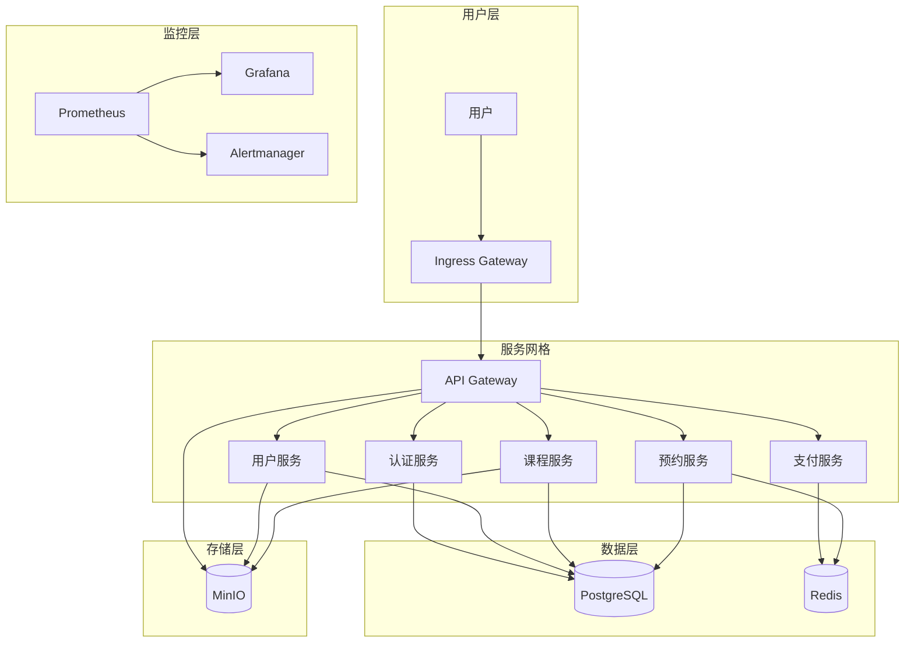

# Kubernetes 部署指南

> **版本**: v1.0
> **最后更新**: 2025-11-16
> **维护者**: DevOps团队

## 概述

本文档详细介绍如何在Kubernetes集群中部署健身房综合管理系统，包括集群搭建、资源配置、存储管理、监控告警等完整的生产环境部署方案。

## 目录

- [1. Kubernetes 架构概述](#1-kubernetes-架构概述)
- [2. 集群搭建](#2-集群搭建)
- [3. 核心资源配置](#3-核心资源配置)
- [4. 存储管理](#4-存储管理)
- [5. 配置管理](#5-配置管理)
- [6. 网络配置](#6-网络配置)
- [7. 监控和日志](#7-监控和日志)
- [8. 部署策略](#8-部署策略)
- [9. 故障排查](#9-故障排查)
- [10. 最佳实践](#10-最佳实践)

---

## 1. Kubernetes 架构概述

### 1.1 系统架构



### 1.2 命名空间规划

| 命名空间 | 用途 | 资源类型 |
|---------|------|----------|
| `fitness-prod` | 生产环境应用 | Deployment, Service, ConfigMap |
| `fitness-staging` | 预发布环境 | Deployment, Service, ConfigMap |
| `fitness-dev` | 开发环境 | Deployment, Service, ConfigMap |
| `kube-system` | Kubernetes系统组件 | 系统组件 |
| `monitoring` | 监控组件 | Prometheus, Grafana |
| `ingress-nginx` | 入口控制器 | Ingress Controller |

### 1.3 环境要求

#### 最低硬件要求

| 组件 | CPU | 内存 | 存储 | 网络 |
|------|-----|------|------|------|
| **Master节点** | 2核心 | 4GB | 50GB | 1Gbps |
| **Worker节点** | 4核心 | 8GB | 100GB | 1Gbps |
| **数据库节点** | 4核心 | 16GB | 200GB SSD | 1Gbps |

#### 软件版本要求

| 组件 | 版本 | 说明 |
|------|------|------|
| **Kubernetes** | v1.28+ | 生产环境推荐最新稳定版 |
| **Docker** | 24.0+ | 容器运行时 |
| **Helm** | v3.12+ | 包管理器 |
| **kubectl** | v1.28+ | Kubernetes命令行工具 |

---

## 2. 集群搭建

### 2.1 单节点集群（开发环境）

#### 使用 Minikube

```bash
# 安装 Minikube
curl -LO https://storage.googleapis.com/minikube/releases/latest/minikube-linux-amd64
sudo install minikube-linux-amd64 /usr/local/bin/minikube

# 启动单节点集群
minikube start --driver=docker --memory=4096 --cpus=2

# 验证集群状态
kubectl get nodes
kubectl get pods -A
```

#### 使用 Kind (Kubernetes in Docker)

```yaml
# kind-config.yaml
kind: Cluster
apiVersion: kind.x-k8s.io/v1alpha4
nodes:
- role: control-plane
  kubeadmConfigPatches:
  - |
    kind: InitConfiguration
    nodeRegistration:
      kubeletExtraArgs:
        node-labels: "ingress-ready=true"
  extraPortMappings:
  - containerPort: 80
    hostPort: 80
    protocol: TCP
  - containerPort: 443
    hostPort: 443
    protocol: TCP
```

```bash
# 创建 Kind 集群
kind create cluster --config kind-config.yaml --name fitness-dev

# 验证集群
kubectl cluster-info --context kind-fitness-dev
```

### 2.2 多节点集群（生产环境）

#### 使用 kubeadm

```bash
# 在所有节点上执行：初始化集群
# Master 节点
sudo kubeadm init --pod-network-cidr=10.244.0.0/16

# 配置 kubectl
mkdir -p $HOME/.kube
sudo cp -i /etc/kubernetes/admin.conf $HOME/.kube/config
sudo chown $(id -u):$(id -g) $HOME/.kube/config

# 安装网络插件 (Calico)
kubectl apply -f https://docs.projectcalico.org/manifests/calico.yaml

# 加入工作节点
# 在 Worker 节点上执行
sudo kubeadm join <master-ip>:6443 --token <token> --discovery-token-ca-cert-hash <hash>
```

#### 高可用集群

```bash
# 创建多 Master 节点集群
# 节点1: 控制平面 + etcd
sudo kubeadm init --control-plane-endpoint "LOAD_BALANCER_IP:6443" --upload-certs

# 节点2: 控制平面 + etcd
sudo kubeadm join LOAD_BALANCER_IP:6443 --token TOKEN --discovery-token-ca-cert-hash HASH --control-plane --certificate-key KEY

# 节点3: 控制平面 + etcd
sudo kubeadm join LOAD_BALANCER_IP:6443 --token TOKEN --discovery-token-ca-cert-hash HASH --control-plane --certificate-key KEY
```

### 2.3 集群验证

```bash
# 检查节点状态
kubectl get nodes -o wide

# 检查系统 Pod
kubectl get pods -n kube-system

# 检查集群健康
kubectl cluster-info
kubectl get componentstatuses

# 网络连通性测试
kubectl run test-pod --image=busybox --rm -it --restart=Never -- wget -O- http://kubernetes.io
```

---

## 3. 核心资源配置

### 3.1 Namespace 配置

```yaml
# fitness-prod-namespace.yaml
apiVersion: v1
kind: Namespace
metadata:
  name: fitness-prod
  labels:
    name: fitness-prod
    environment: production
spec: {}
---
# 资源配额
apiVersion: v1
kind: ResourceQuota
metadata:
  name: fitness-prod-quota
  namespace: fitness-prod
spec:
  hard:
    requests.cpu: "10"
    requests.memory: 20Gi
    limits.cpu: "20"
    limits.memory: 40Gi
    persistentvolumeclaims: "10"
    pods: "50"
    services: "20"
```

### 3.2 ConfigMap 配置

```yaml
# fitness-configmap.yaml
apiVersion: v1
kind: ConfigMap
metadata:
  name: fitness-config
  namespace: fitness-prod
data:
  # 应用配置
  APP_NAME: "Fitness Gym Management System"
  APP_VERSION: "1.0.0"
  SPRING_PROFILES_ACTIVE: "prod"

  # 数据库配置
  DB_HOST: "postgres-service"
  DB_PORT: "5432"
  DB_NAME: "fitness_gym"
  DB_MAX_CONNECTIONS: "50"

  # 缓存配置
  REDIS_HOST: "redis-service"
  REDIS_PORT: "6379"
  REDIS_MAX_CONNECTIONS: "100"

  # 文件存储配置
  MINIO_ENDPOINT: "http://minio-service:9000"
  MINIO_BUCKET_NAME: "fitness-gym-files"

  # 日志配置
  LOG_LEVEL: "INFO"
  LOG_MAX_SIZE: "100MB"
  LOG_MAX_FILES: "30"
```

### 3.3 Secret 配置

```yaml
# fitness-secrets.yaml
apiVersion: v1
kind: Secret
metadata:
  name: fitness-secrets
  namespace: fitness-prod
type: Opaque
data:
  # 数据库密码 (base64编码)
  db-password: cG9zdGdyZXNfcGFzc3dvcmQ=  # postgres_password

  # JWT密钥
  jwt-secret: eW91cl9qd3Rfc2VjcmV0X2tleQ==  # your_jwt_secret_key

  # MinIO访问密钥
  minio-access-key: bWluaW9hZG1pbg==  # minioadmin
  minio-secret-key: bWluaW9hZG1pbg==  # minioadmin

  # 邮件服务配置
  smtp-password: eW91cl9zbXRwX3Bhc3N3b3Jk  # your_smtp_password
```

### 3.4 Deployment 配置

```yaml
# fitness-api-deployment.yaml
apiVersion: apps/v1
kind: Deployment
metadata:
  name: fitness-api
  namespace: fitness-prod
  labels:
    app: fitness-api
    version: v1.0.0
spec:
  replicas: 3
  strategy:
    type: RollingUpdate
    rollingUpdate:
      maxUnavailable: 1
      maxSurge: 1
  selector:
    matchLabels:
      app: fitness-api
  template:
    metadata:
      labels:
        app: fitness-api
        version: v1.0.0
    spec:
      containers:
      - name: api
        image: fitness-gym-backend:latest
        ports:
        - containerPort: 8080
          name: http
          protocol: TCP
        env:
        - name: SPRING_PROFILES_ACTIVE
          valueFrom:
            configMapKeyRef:
              name: fitness-config
              key: SPRING_PROFILES_ACTIVE
        - name: DB_PASSWORD
          valueFrom:
            secretKeyRef:
              name: fitness-secrets
              key: db-password
        envFrom:
        - configMapRef:
            name: fitness-config
        livenessProbe:
          httpGet:
            path: /springboot1ngh61a2/health
            port: 8080
          initialDelaySeconds: 60
          periodSeconds: 30
          timeoutSeconds: 5
          failureThreshold: 3
        readinessProbe:
          httpGet:
            path: /springboot1ngh61a2/health
            port: 8080
          initialDelaySeconds: 30
          periodSeconds: 10
          timeoutSeconds: 3
          failureThreshold: 3
        resources:
          requests:
            cpu: 500m
            memory: 1Gi
          limits:
            cpu: 1000m
            memory: 2Gi
        volumeMounts:
        - name: logs
          mountPath: /app/logs
        - name: uploads
          mountPath: /app/static/upload
      volumes:
      - name: logs
        emptyDir: {}
      - name: uploads
        emptyDir: {}
```

### 3.5 Service 配置

```yaml
# fitness-api-service.yaml
apiVersion: v1
kind: Service
metadata:
  name: fitness-api-service
  namespace: fitness-prod
  labels:
    app: fitness-api
spec:
  type: ClusterIP
  ports:
  - port: 8080
    targetPort: 8080
    protocol: TCP
    name: http
  selector:
    app: fitness-api
---
# fitness-frontend-service.yaml
apiVersion: v1
kind: Service
metadata:
  name: fitness-frontend-service
  namespace: fitness-prod
  labels:
    app: fitness-frontend
spec:
  type: ClusterIP
  ports:
  - port: 80
    targetPort: 80
    protocol: TCP
    name: http
  selector:
    app: fitness-frontend
```

---

## 4. 存储管理

### 4.1 PersistentVolume 配置

```yaml
# postgres-pv.yaml
apiVersion: v1
kind: PersistentVolume
metadata:
  name: postgres-pv
  labels:
    type: local
    app: postgres
spec:
  capacity:
    storage: 50Gi
  volumeMode: Filesystem
  accessModes:
    - ReadWriteOnce
  persistentVolumeReclaimPolicy: Retain
  storageClassName: local-storage
  local:
    path: /data/postgres
  nodeAffinity:
    required:
      nodeSelectorTerms:
      - matchExpressions:
        - key: kubernetes.io/os
          operator: In
          values:
          - linux
---
# minio-pv.yaml
apiVersion: v1
kind: PersistentVolume
metadata:
  name: minio-pv
  labels:
    type: local
    app: minio
spec:
  capacity:
    storage: 100Gi
  volumeMode: Filesystem
  accessModes:
    - ReadWriteOnce
  persistentVolumeReclaimPolicy: Retain
  storageClassName: local-storage
  local:
    path: /data/minio
  nodeAffinity:
    required:
      nodeSelectorTerms:
      - matchExpressions:
        - key: kubernetes.io/os
          operator: In
          values:
          - linux
```

### 4.2 PersistentVolumeClaim 配置

```yaml
# postgres-pvc.yaml
apiVersion: v1
kind: PersistentVolumeClaim
metadata:
  name: postgres-pvc
  namespace: fitness-prod
spec:
  accessModes:
    - ReadWriteOnce
  storageClassName: local-storage
  resources:
    requests:
      storage: 50Gi
---
# minio-pvc.yaml
apiVersion: v1
kind: PersistentVolumeClaim
metadata:
  name: minio-pvc
  namespace: fitness-prod
spec:
  accessModes:
    - ReadWriteOnce
  storageClassName: local-storage
  resources:
    requests:
      storage: 100Gi
```

### 4.3 StorageClass 配置

```yaml
# local-storage-class.yaml
apiVersion: storage.k8s.io/v1
kind: StorageClass
metadata:
  name: local-storage
provisioner: kubernetes.io/no-provisioner
volumeBindingMode: WaitForFirstConsumer
reclaimPolicy: Retain
---
# nfs-storage-class.yaml
apiVersion: storage.k8s.io/v1
kind: StorageClass
metadata:
  name: nfs-storage
provisioner: kubernetes.io/no-provisioner
parameters:
  type: nfs
volumeBindingMode: Immediate
reclaimPolicy: Retain
```

---

## 5. 配置管理

### 5.1 Ingress 配置

```yaml
# fitness-ingress.yaml
apiVersion: networking.k8s.io/v1
kind: Ingress
metadata:
  name: fitness-ingress
  namespace: fitness-prod
  annotations:
    nginx.ingress.kubernetes.io/rewrite-target: /
    nginx.ingress.kubernetes.io/ssl-redirect: "true"
    nginx.ingress.kubernetes.io/force-ssl-redirect: "true"
    cert-manager.io/cluster-issuer: "letsencrypt-prod"
spec:
  ingressClassName: nginx
  tls:
  - hosts:
    - api.fitness-gym.com
    - www.fitness-gym.com
    secretName: fitness-gym-tls
  rules:
  - host: api.fitness-gym.com
    http:
      paths:
      - path: /springboot1ngh61a2
        pathType: Prefix
        backend:
          service:
            name: fitness-api-service
            port:
              number: 8080
  - host: www.fitness-gym.com
    http:
      paths:
      - path: /
        pathType: Prefix
        backend:
          service:
            name: fitness-frontend-service
            port:
              number: 80
```

### 5.2 NetworkPolicy 配置

```yaml
# fitness-network-policy.yaml
apiVersion: networking.k8s.io/v1
kind: NetworkPolicy
metadata:
  name: fitness-api-policy
  namespace: fitness-prod
spec:
  podSelector:
    matchLabels:
      app: fitness-api
  policyTypes:
  - Ingress
  - Egress
  ingress:
  - from:
    - podSelector:
        matchLabels:
          app: fitness-frontend
    ports:
    - protocol: TCP
      port: 8080
  - from:
    - namespaceSelector:
        matchLabels:
          name: ingress-nginx
    ports:
    - protocol: TCP
      port: 8080
  egress:
  - to:
    - podSelector:
        matchLabels:
          app: postgres
    ports:
    - protocol: TCP
      port: 5432
  - to:
    - podSelector:
        matchLabels:
          app: redis
    ports:
    - protocol: TCP
      port: 6379
  - to:
    - podSelector:
        matchLabels:
          app: minio
    ports:
    - protocol: TCP
      port: 9000
  - to: []
    ports:
    - protocol: TCP
      port: 53
    - protocol: UDP
      port: 53
```

---

## 6. 网络配置

### 6.1 Service Mesh (Istio)

```yaml
# istio-gateway.yaml
apiVersion: networking.istio.io/v1beta1
kind: Gateway
metadata:
  name: fitness-gateway
  namespace: fitness-prod
spec:
  selector:
    istio: ingressgateway
  servers:
  - port:
      number: 80
      name: http
      protocol: HTTP
    hosts:
    - api.fitness-gym.com
  - port:
      number: 443
      name: https
      protocol: HTTPS
    tls:
      mode: SIMPLE
      credentialName: fitness-gym-tls
    hosts:
    - api.fitness-gym.com
---
# istio-virtualservice.yaml
apiVersion: networking.istio.io/v1beta1
kind: VirtualService
metadata:
  name: fitness-api
  namespace: fitness-prod
spec:
  hosts:
  - api.fitness-gym.com
  gateways:
  - fitness-gateway
  http:
  - match:
    - uri:
        prefix: /springboot1ngh61a2
    route:
    - destination:
        host: fitness-api-service
        port:
          number: 8080
    timeout: 30s
    retries:
      attempts: 3
      perTryTimeout: 10s
```

### 6.2 LoadBalancer Service

```yaml
# fitness-loadbalancer.yaml
apiVersion: v1
kind: Service
metadata:
  name: fitness-external-lb
  namespace: fitness-prod
  annotations:
    service.beta.kubernetes.io/aws-load-balancer-type: nlb
    service.beta.kubernetes.io/aws-load-balancer-cross-zone-load-balancing-enabled: 'true'
    service.beta.kubernetes.io/aws-load-balancer-ssl-cert: arn:aws:acm:region:account:certificate/cert-id
spec:
  type: LoadBalancer
  selector:
    app: fitness-frontend
  ports:
  - name: http
    port: 80
    targetPort: 80
    protocol: TCP
  - name: https
    port: 443
    targetPort: 80
    protocol: TCP
```

---

## 7. 监控和日志

### 7.1 Prometheus 监控

```yaml
# fitness-service-monitor.yaml
apiVersion: monitoring.coreos.com/v1
kind: ServiceMonitor
metadata:
  name: fitness-api-monitor
  namespace: monitoring
  labels:
    app: fitness-api
spec:
  selector:
    matchLabels:
      app: fitness-api
  endpoints:
  - port: http
    path: /springboot1ngh61a2/actuator/prometheus
    interval: 30s
  namespaceSelector:
    matchNames:
    - fitness-prod
---
# fitness-prometheus-rules.yaml
apiVersion: monitoring.coreos.com/v1
kind: PrometheusRule
metadata:
  name: fitness-alerts
  namespace: monitoring
spec:
  groups:
  - name: fitness.rules
    rules:
    - alert: FitnessAPIHighCPU
      expr: rate(container_cpu_usage_seconds_total{pod=~"fitness-api-.*"}[5m]) > 0.8
      for: 5m
      labels:
        severity: warning
      annotations:
        summary: "Fitness API High CPU usage"
        description: "CPU usage is {{ $value }}% for pod {{ $labels.pod }}"
    - alert: FitnessAPIDown
      expr: up{job="fitness-api"} == 0
      for: 2m
      labels:
        severity: critical
      annotations:
        summary: "Fitness API is down"
        description: "Fitness API has been down for more than 2 minutes"
```

### 7.2 EFK 日志栈

```yaml
# fitness-fluent-bit-config.yaml
apiVersion: v1
kind: ConfigMap
metadata:
  name: fluent-bit-config
  namespace: logging
  labels:
    k8s-app: fluent-bit
data:
  fluent-bit.conf: |
    [SERVICE]
        Flush         5
        Log_Level     info
        Daemon        off

    [INPUT]
        Name              tail
        Path              /var/log/containers/*fitness*.log
        Parser            docker
        Tag               fitness.*
        Refresh_Interval  5

    [FILTER]
        Name                kubernetes
        Match               fitness.*
        Kube_URL            https://kubernetes.default.svc:443
        Kube_CA_File        /var/run/secrets/kubernetes.io/serviceaccount/ca.crt
        Kube_Token_File     /var/run/secrets/kubernetes.io/serviceaccount/token

    [OUTPUT]
        Name  es
        Match fitness.*
        Host  elasticsearch
        Port  9200
        Index fitness-logs
        Type  flb_type
```

---

## 8. 部署策略

### 8.1 滚动更新

```yaml
# fitness-rolling-update.yaml
apiVersion: apps/v1
kind: Deployment
metadata:
  name: fitness-api-v2
  namespace: fitness-prod
spec:
  replicas: 3
  strategy:
    type: RollingUpdate
    rollingUpdate:
      maxUnavailable: 1
      maxSurge: 1
  selector:
    matchLabels:
      app: fitness-api
  template:
    metadata:
      labels:
        app: fitness-api
        version: v2.0.0
    spec:
      containers:
      - name: api
        image: fitness-gym-backend:v2.0.0
        # ... 其他配置
```

### 8.2 蓝绿部署

```yaml
# fitness-blue-deployment.yaml
apiVersion: apps/v1
kind: Deployment
metadata:
  name: fitness-api-blue
  namespace: fitness-prod
spec:
  replicas: 3
  selector:
    matchLabels:
      app: fitness-api
      color: blue
  template:
    metadata:
      labels:
        app: fitness-api
        color: blue
        version: v1.0.0
    spec:
      containers:
      - name: api
        image: fitness-gym-backend:v1.0.0
        # ... 配置
---
# fitness-green-deployment.yaml
apiVersion: apps/v1
kind: Deployment
metadata:
  name: fitness-api-green
  namespace: fitness-prod
spec:
  replicas: 3
  selector:
    matchLabels:
      app: fitness-api
      color: green
  template:
    metadata:
      labels:
        app: fitness-api
        color: green
        version: v2.0.0
    spec:
      containers:
      - name: api
        image: fitness-gym-backend:v2.0.0
        # ... 配置
---
# fitness-blue-service.yaml
apiVersion: v1
kind: Service
metadata:
  name: fitness-api-blue
  namespace: fitness-prod
spec:
  selector:
    app: fitness-api
    color: blue
  ports:
  - port: 8080
    targetPort: 8080
---
# fitness-green-service.yaml
apiVersion: v1
kind: Service
metadata:
  name: fitness-api-green
  namespace: fitness-prod
spec:
  selector:
    app: fitness-api
    color: green
  ports:
  - port: 8080
    targetPort: 8080
```

### 8.3 金丝雀部署

```yaml
# fitness-canary-deployment.yaml
apiVersion: apps/v1
kind: Deployment
metadata:
  name: fitness-api-canary
  namespace: fitness-prod
spec:
  replicas: 1  # 只部署一个副本用于测试
  selector:
    matchLabels:
      app: fitness-api
      track: canary
  template:
    metadata:
      labels:
        app: fitness-api
        track: canary
        version: v2.0.0
    spec:
      containers:
      - name: api
        image: fitness-gym-backend:v2.0.0
        # ... 配置
---
# fitness-canary-service.yaml
apiVersion: v1
kind: Service
metadata:
  name: fitness-api-canary
  namespace: fitness-prod
spec:
  selector:
    app: fitness-api
    track: canary
  ports:
  - port: 8080
    targetPort: 8080
```

### 8.4 回滚策略

```bash
# 回滚到上一版本
kubectl rollout undo deployment/fitness-api --namespace=fitness-prod

# 回滚到指定版本
kubectl rollout undo deployment/fitness-api --to-revision=2 --namespace=fitness-prod

# 查看回滚历史
kubectl rollout history deployment/fitness-api --namespace=fitness-prod

# 暂停/恢复滚动更新
kubectl rollout pause deployment/fitness-api --namespace=fitness-prod
kubectl rollout resume deployment/fitness-api --namespace=fitness-prod
```

---

## 9. 故障排查

### 9.1 集群问题排查

```bash
# 检查集群状态
kubectl get nodes
kubectl get pods -A
kubectl cluster-info

# 检查API服务器状态
kubectl get componentstatuses

# 查看集群事件
kubectl get events --sort-by=.metadata.creationTimestamp

# 检查网络插件状态
kubectl get pods -n kube-system -l k8s-app=calico-node
```

### 9.2 应用问题排查

```bash
# 查看Pod状态
kubectl get pods -n fitness-prod
kubectl describe pod <pod-name> -n fitness-prod

# 查看应用日志
kubectl logs -f <pod-name> -n fitness-prod
kubectl logs -f deployment/fitness-api -n fitness-prod --tail=100

# 检查服务端点
kubectl get endpoints -n fitness-prod
kubectl describe service fitness-api-service -n fitness-prod

# 进入容器调试
kubectl exec -it <pod-name> -n fitness-prod -- /bin/bash
```

### 9.3 存储问题排查

```bash
# 检查PV/PVC状态
kubectl get pv,pvc -n fitness-prod
kubectl describe pv <pv-name>
kubectl describe pvc <pvc-name> -n fitness-prod

# 检查存储类
kubectl get storageclass
kubectl describe storageclass <storage-class-name>

# 验证挂载
kubectl exec -it <pod-name> -n fitness-prod -- df -h
```

### 9.4 网络问题排查

```bash
# 检查网络策略
kubectl get networkpolicies -n fitness-prod
kubectl describe networkpolicy <policy-name> -n fitness-prod

# 测试服务连通性
kubectl run test-pod --image=busybox --rm -it --restart=Never -- nslookup fitness-api-service.fitness-prod.svc.cluster.local

# 检查Ingress
kubectl get ingress -n fitness-prod
kubectl describe ingress fitness-ingress -n fitness-prod
```

### 9.5 性能问题排查

```bash
# 检查资源使用
kubectl top nodes
kubectl top pods -n fitness-prod

# 查看Pod资源限制
kubectl describe pod <pod-name> -n fitness-prod | grep -A 10 "Limits\|Requests"

# 检查事件
kubectl get events -n fitness-prod --sort-by=.metadata.creationTimestamp | tail -20

# 分析Pod重启原因
kubectl describe pod <pod-name> -n fitness-prod | grep -A 5 "Containers.*State"
```

---

## 10. 最佳实践

### 10.1 安全最佳实践

#### RBAC 配置

```yaml
# fitness-rbac.yaml
apiVersion: rbac.authorization.k8s.io/v1
kind: Role
metadata:
  name: fitness-deployer
  namespace: fitness-prod
rules:
- apiGroups: ["apps"]
  resources: ["deployments"]
  verbs: ["get", "list", "watch", "create", "update", "patch", "delete"]
- apiGroups: [""]
  resources: ["pods", "services", "configmaps", "secrets"]
  verbs: ["get", "list", "watch", "create", "update", "patch", "delete"]
---
apiVersion: rbac.authorization.k8s.io/v1
kind: RoleBinding
metadata:
  name: fitness-deployer-binding
  namespace: fitness-prod
subjects:
- kind: User
  name: fitness-deployer
  apiGroup: rbac.authorization.k8s.io
roleRef:
  kind: Role
  name: fitness-deployer
  apiGroup: rbac.authorization.k8s.io
```

#### Pod 安全策略

```yaml
# fitness-pod-security.yaml
apiVersion: policy/v1beta1
kind: PodSecurityPolicy
metadata:
  name: fitness-restricted
spec:
  privileged: false
  allowPrivilegeEscalation: false
  requiredDropCapabilities:
    - ALL
  runAsUser:
    rule: MustRunAsNonRoot
  seLinux:
    rule: RunAsAny
  supplementalGroups:
    rule: MustRunAs
    ranges:
    - min: 1
      max: 65535
  fsGroup:
    rule: MustRunAs
    ranges:
    - min: 1
      max: 65535
  volumes:
    - 'configMap'
    - 'downwardAPI'
    - 'emptyDir'
    - 'persistentVolumeClaim'
    - 'secret'
    - 'projected'
```

### 10.2 性能优化实践

#### 资源优化

```yaml
# 优化的Deployment配置
apiVersion: apps/v1
kind: Deployment
metadata:
  name: fitness-api-optimized
  namespace: fitness-prod
spec:
  replicas: 3
  template:
    spec:
      containers:
      - name: api
        resources:
          requests:
            cpu: 500m
            memory: 1Gi
          limits:
            cpu: 1000m
            memory: 2Gi
        env:
        - name: JAVA_OPTS
          value: "-Xmx1g -Xms512m -XX:+UseG1GC -XX:MaxGCPauseMillis=200"
        livenessProbe:
          httpGet:
            path: /springboot1ngh61a2/health
            port: 8080
          initialDelaySeconds: 60
          periodSeconds: 30
          timeoutSeconds: 5
        readinessProbe:
          httpGet:
            path: /springboot1ngh61a2/health
            port: 8080
          initialDelaySeconds: 30
          periodSeconds: 10
```

#### HPA 配置

```yaml
# fitness-hpa.yaml
apiVersion: autoscaling/v2
kind: HorizontalPodAutoscaler
metadata:
  name: fitness-api-hpa
  namespace: fitness-prod
spec:
  scaleTargetRef:
    apiVersion: apps/v1
    kind: Deployment
    name: fitness-api
  minReplicas: 3
  maxReplicas: 10
  metrics:
  - type: Resource
    resource:
      name: cpu
      target:
        type: Utilization
        averageUtilization: 70
  - type: Resource
    resource:
      name: memory
      target:
        type: Utilization
        averageUtilization: 80
  behavior:
    scaleDown:
      stabilizationWindowSeconds: 300
      policies:
      - type: Percent
        value: 10
        periodSeconds: 60
    scaleUp:
      stabilizationWindowSeconds: 60
      policies:
      - type: Percent
        value: 50
        periodSeconds: 60
      - type: Pods
        value: 2
        periodSeconds: 60
```

### 10.3 维护最佳实践

#### 集群升级

```bash
# 升级控制平面
kubectl drain <master-node> --ignore-daemonsets
sudo apt-get update && sudo apt-get upgrade kubelet kubeadm kubectl
sudo systemctl restart kubelet
kubectl uncordon <master-node>

# 升级工作节点
kubectl drain <worker-node> --ignore-daemonsets
# 在节点上升级kubelet
kubectl uncordon <worker-node>
```

#### 备份策略

```bash
# etcd 备份
ETCDCTL_API=3 etcdctl --endpoints=https://127.0.0.1:2379 \
  --cacert=/etc/kubernetes/pki/etcd/ca.crt \
  --cert=/etc/kubernetes/pki/etcd/server.crt \
  --key=/etc/kubernetes/pki/etcd/server.key \
  snapshot save /opt/etcd-backup.db

# 应用数据备份
kubectl exec -it postgres-pod -- pg_dump -U postgres fitness_gym > backup.sql

# 配置备份
kubectl get all -n fitness-prod -o yaml > fitness-prod-backup.yaml
```

---

## 总结

本文档提供了在Kubernetes中部署健身房综合管理系统的完整指南，包括：

1. **集群搭建**：单节点和多节点集群的搭建方法
2. **核心资源配置**：Namespace、ConfigMap、Secret、Deployment、Service的详细配置
3. **存储管理**：PV、PVC、StorageClass的配置和管理
4. **网络配置**：Ingress、NetworkPolicy、Service Mesh的实现
5. **监控和日志**：Prometheus、EFK栈的集成配置
6. **部署策略**：滚动更新、蓝绿部署、金丝雀部署的实现
7. **故障排查**：常见问题的诊断和解决方法
8. **最佳实践**：安全、性能、维护等方面的建议

通过遵循这些指南，可以在Kubernetes环境中构建稳定、高可用、可扩展的健身房管理系统。

---

*最后更新: 2025-11-16*  
*版本: v1.0*  
*维护者: DevOps团队*
