# 部署与运维文档

> 版本：v2.0
> 更新日期：2025-11-16
> 适用范围：多平台部署环境

---

## 文档概述

健身房综合管理系统部署与运维文档体系提供了完整的系统部署、配置、监控、维护和故障处理指南。本文档体系采用模块化设计，涵盖从初次部署到长期运维的各个方面，支持多种部署平台，帮助运维人员和开发人员高效管理生产环境。

## 核心文档导航

### 🚀 快速开始

| 场景 | 推荐文档 | 说明 |
|------|----------|------|
| **初次部署** | [`DEPLOYMENT.md`](../../DEPLOYMENT.md) | 生产环境部署指南 |
| **Docker部署** | [`DOCKER.md`](../../DOCKER.md) | Docker环境配置和使用 |
| **Kubernetes部署** | [`KUBERNETES.md`](KUBERNETES.md) | K8s集群部署和配置 |
| **云平台部署** | [`CLOUD_PLATFORMS.md`](CLOUD_PLATFORMS.md) | AWS/Azure/阿里云/腾讯云集成 |
| **开发环境** | [`SCRIPTS_REFERENCE.md`](SCRIPTS_REFERENCE.md) | 开发环境启动脚本 |
| **紧急故障** | [`TROUBLESHOOTING.md`](TROUBLESHOOTING.md) | 故障排查指南 |

### 📋 日常运维

| 任务类型 | 文档 | 关键内容 |
|---------|------|----------|
| **服务管理** | [`DEPLOYMENT_OPERATIONS.md`](DEPLOYMENT_OPERATIONS.md) | 启动/停止/重启、健康检查 |
| **监控告警** | [`MONITORING.md`](MONITORING.md) | 系统监控、性能指标、告警配置 |
| **日志管理** | [`LOGGING.md`](LOGGING.md) | 日志查看、分析、轮转策略 |
| **备份恢复** | [`BACKUP_RECOVERY.md`](BACKUP_RECOVERY.md) | 数据备份、灾难恢复 |

### 🔧 性能与优化

| 优化方向 | 文档 | 优化内容 |
|---------|------|----------|
| **性能调优** | [`PERFORMANCE_TUNING.md`](PERFORMANCE_TUNING.md) | JVM、数据库、缓存优化 |
| **容量规划** | [`PERFORMANCE_TUNING.md`](PERFORMANCE_TUNING.md) | 扩展策略、性能测试 |
| **故障排查** | [`TROUBLESHOOTING.md`](TROUBLESHOOTING.md) | 问题诊断、应急处理 |

### ☁️ 云原生架构

| 架构组件 | 文档 | 核心功能 |
|----------|------|----------|
| **微服务架构** | [`../architecture/CLOUD_NATIVE.md`](../architecture/CLOUD_NATIVE.md) | 服务拆分、通信、数据管理 |
| **容器编排** | [`KUBERNETES.md`](KUBERNETES.md) | 集群管理、资源调度 |
| **Helm包管理** | [`HELM.md`](HELM.md) | Chart开发、多环境部署 |
| **GitOps实践** | [`GITOPS.md`](GITOPS.md) | 持续部署、自动化运维 |
| **云平台集成** | [`CLOUD_PLATFORMS.md`](CLOUD_PLATFORMS.md) | 多云部署、成本优化 |

### 🖥️ 虚拟化平台

| 平台类型 | 文档 | 适用场景 |
|----------|------|----------|
| **VMware vSphere** | [`VMWARE.md`](VMWARE.md) | 企业级虚拟化、高可用 |
| **KVM** | [`KVM.md`](KVM.md) | 开源虚拟化、Linux环境 |
| **Hyper-V** | [`HYPERV.md`](HYPERV.md) | Windows环境、企业集成 |

### 📊 决策与规划

| 规划类型 | 文档 | 决策内容 |
|----------|------|----------|
| **方案对比** | [`DEPLOYMENT_DECISION_MATRIX.md`](DEPLOYMENT_DECISION_MATRIX.md) | 9种方案详细对比分析 |
| **迁移指南** | [`MIGRATION_GUIDE.md`](MIGRATION_GUIDE.md) | Docker到K8s迁移策略 |
| **架构设计** | [`../architecture/CLOUD_NATIVE.md`](../architecture/CLOUD_NATIVE.md) | 云原生架构设计 |

## 文档关系图

```mermaid
graph TD
    A[部署文档总览] --> B[快速开始]
    A --> C[日常运维]
    A --> D[性能优化]
    A --> E[云原生架构]
    A --> F[虚拟化平台]
    A --> G[决策规划]

    B --> B1[基础部署]
    B --> B2[Docker部署]
    B --> B3[K8s部署]
    B --> B4[云平台部署]

    C --> C1[服务管理]
    C --> C2[监控告警]
    C --> C3[日志管理]
    C --> C4[备份恢复]

    D --> D1[JVM优化]
    D --> D2[数据库优化]
    D --> D3[缓存策略]
    D --> D4[性能测试]

    E --> E1[微服务架构]
    E --> E2[容器编排]
    E --> E3[Helm包管理]
    E --> E4[GitOps实践]

    F --> F1[VMware平台]
    F --> F2[KVM平台]
    F --> F3[Hyper-V平台]

    G --> G1[方案对比]
    G --> G2[迁移指南]
    G --> G3[架构设计]

    B1 --> DEPLOYMENT.md
    B2 --> DOCKER.md
    B3 --> KUBERNETES.md
    B4 --> CLOUD_PLATFORMS.md

    C1 --> DEPLOYMENT_OPERATIONS.md
    C2 --> MONITORING.md
    C3 --> LOGGING.md
    C4 --> BACKUP_RECOVERY.md

    D1 --> PERFORMANCE_TUNING.md

    E1 --> ../architecture/CLOUD_NATIVE.md
    E2 --> KUBERNETES.md
    E3 --> HELM.md
    E4 --> GITOPS.md

    F1 --> VMWARE.md
    F2 --> KVM.md
    F3 --> HYPERV.md

    G1 --> DEPLOYMENT_DECISION_MATRIX.md
    G2 --> MIGRATION_GUIDE.md
    G3 --> ../architecture/CLOUD_NATIVE.md
```



## 使用场景指南

### 场景一：Docker Compose 快速部署

**适用对象**: 开发测试环境、小型生产环境

**执行流程**:
1. 📖 阅读 [`DEPLOYMENT.md`](../../DEPLOYMENT.md) 了解部署要求
2. 🐳 参考 [`DOCKER.md`](../../DOCKER.md) 配置Docker环境
3. 📋 使用 [`SCRIPTS_REFERENCE.md`](SCRIPTS_REFERENCE.md) 中的部署脚本
4. ✅ 按照 [`DEPLOYMENT_OPERATIONS.md`](DEPLOYMENT_OPERATIONS.md) 验证部署结果

### 场景二：Kubernetes 生产部署

**适用对象**: 中大型生产环境、对高可用有要求的系统

**执行流程**:
1. 📖 阅读 [`DEPLOYMENT_DECISION_MATRIX.md`](DEPLOYMENT_DECISION_MATRIX.md) 选择部署方案
2. ☸️ 参考 [`KUBERNETES.md`](KUBERNETES.md) 搭建K8s集群
3. 📦 使用 [`HELM.md`](HELM.md) 部署应用
4. 🔄 配置 [`GITOPS.md`](GITOPS.md) 实现持续部署
5. ✅ 按照 [`MIGRATION_GUIDE.md`](MIGRATION_GUIDE.md) 进行数据迁移

### 场景三：云平台托管部署

**适用对象**: 希望减少运维负担、需要弹性伸缩的系统

**执行流程**:
1. 📊 阅读 [`DEPLOYMENT_DECISION_MATRIX.md`](DEPLOYMENT_DECISION_MATRIX.md) 评估云平台选项
2. ☁️ 参考 [`CLOUD_PLATFORMS.md`](CLOUD_PLATFORMS.md) 选择并配置云平台
3. 🏗️ 使用云平台的托管Kubernetes服务
4. 🔄 集成 [`GITOPS.md`](GITOPS.md) 实现自动化部署
5. 💰 按照 [`CLOUD_PLATFORMS.md`](CLOUD_PLATFORMS.md) 优化成本

### 场景四：虚拟化平台部署

**适用对象**: 有现有虚拟化基础设施的企业环境

**执行流程**:
1. 🖥️ 根据现有平台选择对应文档：
   - VMware: [`VMWARE.md`](VMWARE.md)
   - KVM: [`KVM.md`](KVM.md)
   - Hyper-V: [`HYPERV.md`](HYPERV.md)
2. 🏗️ 配置虚拟机模板和高可用
3. 🚀 部署应用到虚拟机
4. 📊 设置监控和告警

### 场景五：从Docker迁移到Kubernetes

**适用对象**: 当前使用Docker Compose，需要升级到云原生架构

**执行流程**:
1. 📋 阅读 [`MIGRATION_GUIDE.md`](MIGRATION_GUIDE.md) 了解迁移策略
2. 🏗️ 参考 [`../architecture/CLOUD_NATIVE.md`](../architecture/CLOUD_NATIVE.md) 设计目标架构
3. ☸️ 按照 [`KUBERNETES.md`](KUBERNETES.md) 搭建集群
4. 🔄 使用 [`MIGRATION_GUIDE.md`](MIGRATION_GUIDE.md) 执行零停机迁移
5. ✅ 验证迁移结果并优化性能

### 场景六：多云/混合云部署

**适用对象**: 需要灾备、合规或成本优化的企业

**执行流程**:
1. 🌐 阅读 [`CLOUD_PLATFORMS.md`](CLOUD_PLATFORMS.md) 的多云部署章节
2. 🏗️ 设计混合云架构
3. 🔄 配置数据同步和流量调度
4. 💰 实施成本优化策略
5. 📊 建立统一的监控视图

### 场景七：日常系统运维

**适用对象**: 运维工程师、系统管理员

**执行流程**:
1. 📊 使用 [`MONITORING.md`](MONITORING.md) 监控系统状态
2. 🔧 参考 [`PERFORMANCE_TUNING.md`](PERFORMANCE_TUNING.md) 进行性能优化
3. 📝 查看 [`LOGGING.md`](LOGGING.md) 分析系统日志
4. 💾 按照 [`BACKUP_RECOVERY.md`](BACKUP_RECOVERY.md) 执行备份任务
5. 🚨 使用 [`TROUBLESHOOTING.md`](TROUBLESHOOTING.md) 处理故障

### 场景八：性能优化和扩展

**适用对象**: 性能工程师、架构师

**执行流程**:
1. 📈 分析 [`PERFORMANCE_TUNING.md`](PERFORMANCE_TUNING.md) 中的性能指标
2. ☸️ 使用 [`KUBERNETES.md`](KUBERNETES.md) 实现自动扩缩容
3. 💰 参考 [`CLOUD_PLATFORMS.md`](CLOUD_PLATFORMS.md) 优化云成本
4. 🏗️ 基于 [`../architecture/CLOUD_NATIVE.md`](../architecture/CLOUD_NATIVE.md) 进行架构优化
5. 📊 制定容量规划方案

### 场景九：安全加固和合规

**适用对象**: 安全工程师、合规专员

**执行流程**:
1. 🔒 查看各平台文档中的安全配置章节
2. ☸️ 参考 [`KUBERNETES.md`](KUBERNETES.md) 的安全最佳实践
3. ☁️ 使用 [`CLOUD_PLATFORMS.md`](CLOUD_PLATFORMS.md) 的安全服务
4. 📋 执行安全审计和漏洞扫描
5. 📊 生成安全报告和合规证明

**日常任务**:
- 📊 使用 [`MONITORING.md`](MONITORING.md) 监控系统状态
- 📝 参考 [`LOGGING.md`](LOGGING.md) 查看和分析日志
- 🔄 按照 [`DEPLOYMENT_OPERATIONS.md`](DEPLOYMENT_OPERATIONS.md) 管理服务
- 💾 遵循 [`BACKUP_RECOVERY.md`](BACKUP_RECOVERY.md) 执行备份

### 场景三：性能优化

**适用对象**: 性能工程师

**优化流程**:
1. 📈 使用 [`PERFORMANCE_TUNING.md`](PERFORMANCE_TUNING.md) 进行性能评估
2. 🔍 通过 [`MONITORING.md`](MONITORING.md) 识别性能瓶颈
3. ⚡ 实施 [`PERFORMANCE_TUNING.md`](PERFORMANCE_TUNING.md) 中的优化措施
4. 📊 验证优化效果

### 场景四：故障处理

**适用对象**: 故障响应人员

**处理流程**:
1. 🚨 使用 [`TROUBLESHOOTING.md`](TROUBLESHOOTING.md) 诊断问题
2. 🔍 通过 [`LOGGING.md`](LOGGING.md) 分析错误日志
3. 🛠️ 参考 [`DEPLOYMENT_OPERATIONS.md`](DEPLOYMENT_OPERATIONS.md) 执行恢复操作
4. 📋 按照 [`BACKUP_RECOVERY.md`](BACKUP_RECOVERY.md) 恢复数据

## 文档版本信息

### 核心部署文档

| 文档 | 版本 | 更新日期 | 状态 | 说明 |
|------|------|----------|------|------|
| [`DEPLOYMENT.md`](../../DEPLOYMENT.md) | v1.0 | 2025-11-16 | ✅ 可用 | 生产环境部署指南 |
| [`DOCKER.md`](../../DOCKER.md) | v1.0 | 2025-11-16 | ✅ 可用 | Docker环境配置 |
| [`SCRIPTS_REFERENCE.md`](SCRIPTS_REFERENCE.md) | v1.0 | 2025-11-16 | ✅ 可用 | 开发环境脚本 |

### 运维管理文档

| 文档 | 版本 | 更新日期 | 状态 | 说明 |
|------|------|----------|------|------|
| [`DEPLOYMENT_OPERATIONS.md`](DEPLOYMENT_OPERATIONS.md) | v1.0 | 2025-11-16 | ✅ 可用 | 服务管理操作 |
| [`MONITORING.md`](MONITORING.md) | v1.0 | 2025-11-16 | ✅ 可用 | 监控告警配置 |
| [`LOGGING.md`](LOGGING.md) | v1.0 | 2025-11-16 | ✅ 可用 | 日志管理策略 |
| [`BACKUP_RECOVERY.md`](BACKUP_RECOVERY.md) | v1.0 | 2025-11-16 | ✅ 可用 | 备份恢复方案 |
| [`PERFORMANCE_TUNING.md`](PERFORMANCE_TUNING.md) | v1.0 | 2025-11-16 | ✅ 可用 | 性能优化指南 |
| [`TROUBLESHOOTING.md`](TROUBLESHOOTING.md) | v1.0 | 2025-11-16 | ✅ 可用 | 故障排查手册 |

### 云原生架构文档

| 文档 | 版本 | 更新日期 | 状态 | 说明 |
|------|------|----------|------|------|
| [`../architecture/CLOUD_NATIVE.md`](../architecture/CLOUD_NATIVE.md) | v1.0 | 2025-11-16 | ✅ 可用 | 云原生架构设计 |
| [`KUBERNETES.md`](KUBERNETES.md) | v1.0 | 2025-11-16 | ✅ 可用 | K8s部署配置 |
| [`HELM.md`](HELM.md) | v1.0 | 2025-11-16 | ✅ 可用 | Helm包管理 |
| [`GITOPS.md`](GITOPS.md) | v1.0 | 2025-11-16 | ✅ 可用 | GitOps实践指南 |

### 虚拟化平台文档

| 文档 | 版本 | 更新日期 | 状态 | 说明 |
|------|------|----------|------|------|
| [`VMWARE.md`](VMWARE.md) | v1.0 | 2025-11-16 | ✅ 可用 | VMware vSphere部署 |
| [`KVM.md`](KVM.md) | v1.0 | 2025-11-16 | ✅ 可用 | KVM虚拟化部署 |
| [`HYPERV.md`](HYPERV.md) | v1.0 | 2025-11-16 | ✅ 可用 | Hyper-V部署指南 |

### 云平台集成文档

| 文档 | 版本 | 更新日期 | 状态 | 说明 |
|------|------|----------|------|------|
| [`CLOUD_PLATFORMS.md`](CLOUD_PLATFORMS.md) | v1.0 | 2025-11-16 | ✅ 可用 | 多云平台集成 |

### 规划决策文档

| 文档 | 版本 | 更新日期 | 状态 | 说明 |
|------|------|----------|------|------|
| [`DEPLOYMENT_DECISION_MATRIX.md`](DEPLOYMENT_DECISION_MATRIX.md) | v1.0 | 2025-11-16 | ✅ 可用 | 方案对比分析 |
| [`MIGRATION_GUIDE.md`](MIGRATION_GUIDE.md) | v1.0 | 2025-11-16 | ✅ 可用 | 迁移策略指南 |

## 环境要求总览

### 系统要求

| 组件 | 最低要求 | 推荐配置 |
|------|----------|----------|
| **CPU** | 2核心 | 4核心+ |
| **内存** | 4GB | 8GB+ |
| **磁盘** | 20GB | 50GB+ SSD |
| **网络** | 10Mbps | 100Mbps+ |

### 软件依赖

| 组件 | 版本要求 | 说明 |
|------|----------|------|
| **Docker** | 20.10+ | 容器运行时 |
| **Docker Compose** | 2.0+ | 容器编排 |
| **Java** | 21+ | 后端运行时 |
| **PostgreSQL** | 16+ | 数据库服务器 |
| **Node.js** | 16+ | 前端构建工具 |

### 网络端口

| 服务 | 端口 | 说明 |
|------|------|------|
| **后端API** | 8080 | Spring Boot应用 |
| **PostgreSQL** | 5432 | 数据库服务 |
| **MinIO API** | 9000 | 对象存储API |
| **MinIO Console** | 9001 | 管理控制台 |

## 快速操作参考

### 🚀 启动系统

```bash
# 方式1: 使用部署脚本（推荐）
.\docker-deploy.ps1 -Action up

# 方式2: 直接使用Docker Compose
docker-compose up -d

# 方式3: 开发环境启动
.\start-all.ps1
```

### 📊 检查状态

```bash
# 查看服务状态
docker-compose ps

# 查看资源使用
docker stats

# 查看日志
docker-compose logs -f
```

### 🔧 常用维护

```bash
# 重启服务
docker-compose restart

# 备份数据库
docker-compose exec postgres pg_dump -U postgres fitness_gym > backup.sql

# 查看错误日志
docker-compose logs | grep ERROR
```

### 🛠️ 故障排查

```bash
# 诊断脚本
curl -f http://localhost:8080/springboot1ngh61a2/user/login || echo "后端异常"

# 查看详细日志
docker-compose logs --tail=100 backend

# 检查数据库连接
docker-compose exec postgres pg_isready -U postgres -d fitness_gym
```

## 文档维护

### 文档更新记录

| 版本 | 更新日期 | 更新内容 | 维护者 |
|------|----------|----------|--------|
| v2.0 | 2025-11-16 | - 新增云原生架构文档系列<br/>- 添加虚拟化平台部署指南<br/>- 完善多云平台集成文档<br/>- 增加部署方案决策矩阵<br/>- 提供完整的迁移指南 | DevOps团队 |
| v1.0 | 2025-11-16 | - 基础部署和运维文档<br/>- Docker环境配置指南<br/>- 监控告警和日志管理<br/>- 备份恢复和故障排查 | DevOps团队 |

### 更新原则

- **版本控制**: 所有文档纳入Git版本控制
- **定期审查**: 每季度审查文档有效性
- **用户反馈**: 收集运维人员的使用反馈
- **持续改进**: 根据实践经验更新优化

### 贡献指南

**文档改进流程**:
1. 发现问题或改进点
2. 提交Issue描述问题
3. 提供改进建议或PR
4. 经过审查后合并更新

**文档规范**:
- 使用中文简体书写
- 保持格式和风格一致
- 提供实际可执行的命令
- 包含详细的错误信息和解决方案

## 支持与帮助

### 获取帮助

- **📖 文档问题**: 检查相关文档的故障排查部分
- **🔍 搜索**: 使用文档中的搜索功能查找关键词
- **📝 记录**: 记录问题解决过程以便复用
- **🤝 分享**: 与团队分享经验和最佳实践

### 常见问题

**Q: 文档太多，不知道从哪里开始？**
A: 根据您的角色选择对应的使用场景：
- 新手: 从快速开始部分开始
- 运维: 查看日常运维部分
- 故障: 直接查看故障排查指南

**Q: 文档版本不一致怎么办？**
A: 所有文档都标明了版本号，请使用最新版本。可以通过文档顶部的版本信息确认。

**Q: 遇到文档中没有的问题怎么办？**
A: 先尝试使用故障排查指南的通用方法，然后记录问题并寻求团队帮助。

### 相关资源

- [**项目主文档**](../../README.md) - 项目概述和快速开始
- [**测试文档**](../../TESTING.md) - 测试执行和质量保证
- [**架构文档**](../architecture/ARCHITECTURE.md) - 系统架构说明
- [**API文档**](../api/API.md) - 接口使用指南

---

## 维护者与贡献者

### 文档维护者

| 角色 | 姓名 | 联系方式 | 负责领域 |
|------|------|----------|----------|
| **首席文档维护者** | DevOps团队 | devops@fitness-gym.com | 整体文档架构和质量 |
| **云原生专家** | 架构团队 | arch@fitness-gym.com | K8s、云平台相关文档 |
| **虚拟化专家** | 基础设施团队 | infra@fitness-gym.com | VMware、KVM、Hyper-V文档 |
| **运维专家** | 运维团队 | ops@fitness-gym.com | 监控、备份、故障排查 |

### 贡献者

感谢以下人员对文档的贡献：

- **内容贡献**: 架构团队、DevOps团队、基础设施团队
- **技术审核**: 资深架构师、运维专家
- **用户体验**: 实际使用文档的运维人员反馈

### 文档许可证

本文档采用 [MIT License](../../LICENSE) 许可证。允许自由使用、修改和分发，但需保留版权声明。

---

> 💡 **提示**: 这是一套完整的多平台部署指南，涵盖从传统虚拟化到现代云原生的全方位部署方案。建议根据您的具体需求选择合适的部署平台，并按照相应的场景指南执行。如有文档相关问题或建议，请及时反馈给文档维护者。

> 📅 **最后更新**: 2025-11-16 | **版本**: v2.0 | **维护者**: DevOps团队
