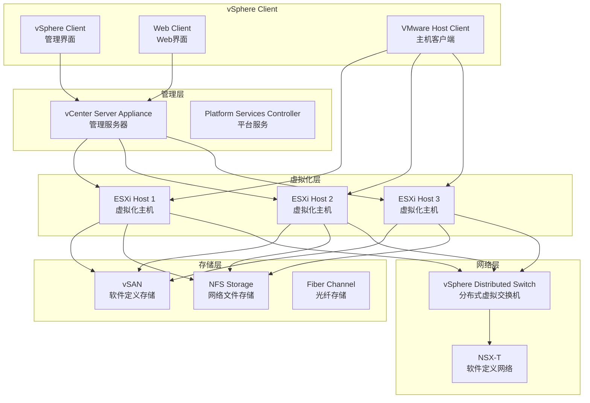
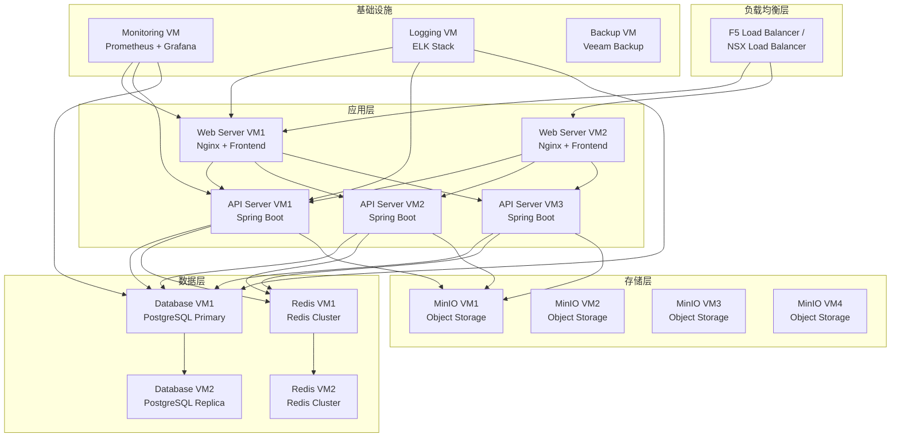

# VMware 部署指南

> **版本**: v1.0
> **最后更新**: 2025-11-16
> **维护者**: 基础设施团队

## 概述

本文档详细介绍如何在VMware vSphere环境中部署健身房综合管理系统，包括环境准备、虚拟机模板创建、资源池配置、高可用设置、存储和网络配置等完整的虚拟化部署方案。

## 目录

- [1. VMware 架构概述](#1-vmware-架构概述)
- [2. vSphere 环境准备](#2-vsphere-环境准备)
- [3. 虚拟机模板创建](#3-虚拟机模板创建)
- [4. 资源池配置](#4-资源池配置)
- [5. 高可用配置](#5-高可用配置)
- [6. 存储配置](#6-存储配置)
- [7. 网络配置](#7-网络配置)
- [8. 部署策略](#8-部署策略)
- [9. 监控和维护](#9-监控和维护)
- [10. 故障排查](#10-故障排查)
- [11. 最佳实践](#11-最佳实践)

---

## 1. VMware 架构概述

### 1.1 vSphere 组件架构



### 1.2 部署架构

#### 健身房系统虚拟化架构



### 1.3 环境要求

#### 硬件要求

| 组件 | 最低配置 | 推荐配置 | 高可用配置 |
|------|----------|----------|------------|
| **vCenter Server** | 2vCPU, 16GB RAM, 300GB存储 | 4vCPU, 32GB RAM, 500GB存储 | HA模式部署 |
| **ESXi Host** | 2xCPU, 64GB RAM, 1TB存储 | 2xCPU, 256GB RAM, 2TB存储 | 3+主机集群 |
| **应用VM** | 2vCPU, 4GB RAM, 50GB存储 | 4vCPU, 8GB RAM, 100GB存储 | 2-3个副本 |
| **数据库VM** | 4vCPU, 16GB RAM, 200GB存储 | 8vCPU, 32GB RAM, 500GB存储 | 主从复制 |
| **存储VM** | 2vCPU, 8GB RAM, 500GB存储 | 4vCPU, 16GB RAM, 1TB存储 | 分布式存储 |

#### 软件版本要求

| 组件 | 版本要求 | 说明 |
|------|----------|------|
| **vSphere** | 7.0+ | 支持最新的虚拟化特性 |
| **ESXi** | 7.0 Update 3+ | 主机虚拟化平台 |
| **vCenter** | 7.0+ | 虚拟化管理平台 |
| **vSAN** | 7.0+ | 软件定义存储 |
| **NSX-T** | 3.2+ | 软件定义网络（可选） |

---

## 2. vSphere 环境准备

### 2.1 vCenter Server 安装

#### VCSA 部署

```bash
# 使用 ovftool 部署 VCSA
ovftool \
  --name="vCenter Server" \
  --datastore="datastore1" \
  --network="VM Network" \
  --acceptAllEulas \
  "VMware-VCSA-all-7.0.0.iso" \
  vi://root:password@esxi-host/

# 或者使用 Web 界面部署
# 1. 访问 https://esxi-host/ui
# 2. 选择 "Virtual Machines" > "Create / Register VM"
# 3. 选择 "Deploy a virtual machine from an OVF or OVA file"
# 4. 上传 VCSA OVA 文件
# 5. 配置网络和存储
# 6. 完成部署
```

#### VCSA 配置

```bash
# VCSA 初始配置
# 1. 访问 https://vcsa-host:5480
# 2. 选择 "Set up vCenter Server"
# 3. 配置时间同步
# 4. 配置网络设置
# 5. 创建 SSO 域
# 6. 创建管理员账户
# 7. 配置数据库（嵌入式或外部）
```

### 2.2 ESXi 主机配置

#### ESXi 安装

```bash
# ESXi 安装步骤
# 1. 下载 ESXi ISO
# 2. 创建启动盘或配置 PXE 引导
# 3. 引导安装
# 4. 选择安装磁盘
# 5. 设置 root 密码
# 6. 配置管理网络
# 7. 完成安装
```

#### ESXi 网络配置

```bash
# ESXi 网络配置
# 1. 配置管理网络
esxcli network ip interface ipv4 set -i vmk0 -t static -p 255.255.255.0 -g 192.168.1.1

# 2. 配置 DNS
esxcli network ip dns server add --server=8.8.8.8
esxcli network ip dns server add --server=8.8.4.4

# 3. 配置 NTP
esxcli system ntp set --server=pool.ntp.org
esxcli system ntp start

# 4. 启用 SSH
vim-cmd hostsvc/enable_ssh
vim-cmd hostsvc/start_ssh
```

#### ESXi 存储配置

```bash
# 配置存储
# 1. 扫描新存储设备
esxcli storage core adapter rescan --all

# 2. 列出可用存储
esxcli storage filesystem list

# 3. 格式化新磁盘
esxcli storage filesystem erase -p vmfs6

# 4. 创建 VMFS 数据存储
esxcli storage filesystem create -p vmfs6
```

### 2.3 数据中心和集群创建

#### 数据中心创建

```bash
# 使用 PowerCLI 创建数据中心
Connect-VIServer -Server vcsa.fitness-gym.com -User administrator@vsphere.local -Password "password"

# 创建数据中心
New-Datacenter -Name "Fitness Gym DC" -Location (Get-Folder -Name "Datacenters")

# 创建集群
New-Cluster -Name "Production Cluster" -Location (Get-Datacenter "Fitness Gym DC") -HAEnabled -DREnabled
```

#### 集群配置

```bash
# 配置集群
# 1. 启用 vSphere HA
Set-Cluster -Cluster "Production Cluster" -HAEnabled $true -HAAdmissionControlEnabled $true

# 2. 配置 vSphere DRS
Set-Cluster -Cluster "Production Cluster" -DRSEnabled $true -DRSAutomationLevel "FullyAutomated"

# 3. 添加主机到集群
Add-VMHost -Name "esxi01.fitness-gym.com" -Location (Get-Cluster "Production Cluster") -User root -Password "password" -Force
Add-VMHost -Name "esxi02.fitness-gym.com" -Location (Get-Cluster "Production Cluster") -User root -Password "password" -Force
Add-VMHost -Name "esxi03.fitness-gym.com" -Location (Get-Cluster "Production Cluster") -User root -Password "password" -Force
```

---

## 3. 虚拟机模板创建

### 3.1 基础模板创建

#### CentOS 7 模板

```bash
# 1. 创建基础虚拟机
New-VM -Name "CentOS7-Template" -VMHost (Get-VMHost "esxi01.fitness-gym.com") -Datastore "datastore1" -NumCpu 2 -MemoryGB 4 -DiskGB 50 -NetworkName "VM Network" -GuestId "centos7"

# 2. 安装操作系统
# - 挂载 CentOS 7 ISO
# - 引导安装
# - 配置分区和软件包
# - 设置网络和主机名

# 3. 系统配置
# 在虚拟机内部执行
yum update -y
yum install -y open-vm-tools cloud-init

# 配置 cloud-init
systemctl enable cloud-init
systemctl start cloud-init

# 清理系统
yum clean all
rm -rf /var/log/*
history -c
```

#### Ubuntu 20.04 模板

```bash
# 1. 创建 Ubuntu 虚拟机
New-VM -Name "Ubuntu20-Template" -VMHost (Get-VMHost "esxi01.fitness-gym.com") -Datastore "datastore1" -NumCpu 2 -MemoryGB 4 -DiskGB 50 -NetworkName "VM Network" -GuestId "ubuntu64Guest"

# 2. 安装 Ubuntu
# - 挂载 Ubuntu ISO
# - 引导安装
# - 配置语言、时区、网络
# - 安装 OpenSSH Server

# 3. 系统配置
# 在虚拟机内部执行
apt update && apt upgrade -y
apt install -y open-vm-tools cloud-init

# 配置 cloud-init
systemctl enable cloud-init
systemctl start cloud-init

# 清理系统
apt clean
rm -rf /var/log/*
history -c
```

### 3.2 应用特定模板

#### 应用服务器模板

```bash
# 基于 CentOS 7 模板创建应用服务器模板
New-VM -Name "AppServer-Template" -VM (Get-VM "CentOS7-Template") -Datastore "datastore1"

# 在模板虚拟机中安装应用运行时
# 安装 Java
yum install -y java-11-openjdk-devel

# 安装 Docker
yum install -y yum-utils
yum-config-manager --add-repo https://download.docker.com/linux/centos/docker-ce.repo
yum install -y docker-ce docker-ce-cli containerd.io

systemctl enable docker
systemctl start docker

# 配置用户和权限
useradd -m -s /bin/bash fitness
usermod -aG docker fitness

# 安装监控代理
yum install -y telegraf
systemctl enable telegraf

# 清理并转换为模板
Stop-VM -VM "AppServer-Template" -Confirm:$false
Set-VM -VM "AppServer-Template" -ToTemplate -Confirm:$false
```

#### 数据库服务器模板

```bash
# 创建数据库服务器模板
New-VM -Name "DBServer-Template" -VM (Get-VM "CentOS7-Template") -Datastore "datastore1"

# 在模板虚拟机中安装 PostgreSQL
# 安装 PostgreSQL
yum install -y https://download.postgresql.org/pub/repos/yum/reporpms/EL-7-x86_64/pgdg-redhat-repo-latest.noarch.rpm
yum install -y postgresql14-server postgresql14-contrib

# 初始化数据库
/usr/pgsql-14/bin/postgresql-14-setup initdb

# 配置 PostgreSQL
systemctl enable postgresql-14
systemctl start postgresql-14

# 安装监控和备份工具
yum install -y pgbackrest pg_stat_monitor

# 配置用户和权限
useradd -m -s /bin/bash postgres
usermod -aG postgres postgres

# 清理并转换为模板
Stop-VM -VM "DBServer-Template" -Confirm:$false
Set-VM -VM "DBServer-Template" -ToTemplate -Confirm:$false
```

### 3.3 模板管理

#### 模板版本控制

```bash
# 创建模板快照
New-Snapshot -VM (Get-Template "AppServer-Template") -Name "v1.0.0" -Description "Initial application server template"

# 更新模板
# 1. 从模板创建虚拟机
New-VM -Name "AppServer-Template-Update" -Template (Get-Template "AppServer-Template") -Datastore "datastore1"

# 2. 应用更新
Start-VM -VM "AppServer-Template-Update"
# 在虚拟机中执行更新
Stop-VM -VM "AppServer-Template-Update"

# 3. 创建新模板
Set-VM -VM "AppServer-Template-Update" -ToTemplate -Confirm:$false

# 4. 更新模板引用
# 在部署脚本中更新模板名称
```

#### 模板存储优化

```bash
# 配置模板存储策略
# 1. 使用精简置备
Set-VM -VM "AppServer-Template" -StoragePolicy "Thin Provisioning"

# 2. 启用 CBT (Changed Block Tracking)
Set-VM -VM "AppServer-Template" -CBTEnabled $true

# 3. 配置存储 I/O 控制
Set-VM -VM "AppServer-Template" -StorageQoS "High"
```

---

## 4. 资源池配置

### 4.1 资源池层次结构

```bash
# 创建资源池层次结构
# 顶级资源池
New-ResourcePool -Name "Fitness-Gym" -Location (Get-Cluster "Production Cluster")

# 环境级资源池
New-ResourcePool -Name "Production" -Location (Get-ResourcePool "Fitness-Gym")
New-ResourcePool -Name "Staging" -Location (Get-ResourcePool "Fitness-Gym")
New-ResourcePool -Name "Development" -Location (Get-ResourcePool "Fitness-Gym")

# 应用级资源池
New-ResourcePool -Name "Application" -Location (Get-ResourcePool "Fitness-Gym/Production")
New-ResourcePool -Name "Database" -Location (Get-ResourcePool "Fitness-Gym/Production")
New-ResourcePool -Name "Infrastructure" -Location (Get-ResourcePool "Fitness-Gym/Production")
```

### 4.2 资源分配配置

#### CPU 和内存分配

```bash
# 配置生产环境应用资源池
Set-ResourcePool -ResourcePool (Get-ResourcePool "Fitness-Gym/Production/Application") -CpuSharesLevel "High" -MemSharesLevel "High" -CpuReservationMhz 4000 -MemReservationGB 8 -CpuLimitMhz 8000 -MemLimitGB 16

# 配置数据库资源池
Set-ResourcePool -ResourcePool (Get-ResourcePool "Fitness-Gym/Production/Database") -CpuSharesLevel "High" -MemSharesLevel "High" -CpuReservationMhz 8000 -MemReservationGB 32 -CpuLimitMhz 16000 -MemLimitGB 64

# 配置基础设施资源池
Set-ResourcePool -ResourcePool (Get-ResourcePool "Fitness-Gym/Production/Infrastructure") -CpuSharesLevel "Normal" -MemSharesLevel "Normal" -CpuReservationMhz 2000 -MemReservationGB 4 -CpuLimitMhz 4000 -MemLimitGB 8
```

#### 资源池监控

```bash
# 监控资源池使用情况
Get-ResourcePool -Location (Get-Cluster "Production Cluster") | Select Name, CpuUsageMhz, CpuReservationMhz, CpuLimitMhz, MemUsageGB, MemReservationGB, MemLimitGB

# 设置资源池告警
# 1. 在 vCenter Web Client 中
# 2. 导航到资源池
# 3. 创建告警定义
# - CPU 使用率 > 80%
# - 内存使用率 > 85%
# - 资源不足时发送邮件告警
```

### 4.3 DRS 集群配置

#### DRS 自动化级别

```bash
# 配置 DRS 自动化级别
Set-Cluster -Cluster "Production Cluster" -DRSAutomationLevel "FullyAutomated"

# 配置 DRS 阈值
Set-Cluster -Cluster "Production Cluster" -DRSThreshold 3

# 配置虚拟机 DRS 组
New-DrsClusterGroup -Name "AppServers" -Cluster "Production Cluster" -VM (Get-VM "fitness-app-01", "fitness-app-02", "fitness-app-03")

New-DrsClusterGroup -Name "DBServers" -Cluster "Production Cluster" -VM (Get-VM "fitness-db-01", "fitness-db-02")

# 配置 DRS 亲和性规则
New-DrsRule -Name "App-DB-Separation" -Cluster "Production Cluster" -VMGroup1 "AppServers" -VMGroup2 "DBServers" -Type "Separate"
```

---

## 5. 高可用配置

### 5.1 vSphere HA 配置

#### HA 集群设置

```bash
# 启用 vSphere HA
Set-Cluster -Cluster "Production Cluster" -HAEnabled $true

# 配置 HA 高级选项
# 主机隔离响应
Set-Cluster -Cluster "Production Cluster" -HostIsolationResponse "PowerOff"

# VM 监控
Set-Cluster -Cluster "Production Cluster" -VMMonitoring "vmMonitoringOnly"

# 应用程序监控
Set-Cluster -Cluster "Production Cluster" -ApplicationMonitoring $true

# 心跳数据存储
Set-Cluster -Cluster "Production Cluster" -HeartbeatDatastore (Get-Datastore "datastore1", "datastore2")
```

#### HA 容错级别

```bash
# 配置 HA 容错级别
# 1. 主机故障时的虚拟机重启优先级
Get-VM | Set-VM -HARestartPriority "High"

# 2. HA 准入控制策略
Set-Cluster -Cluster "Production Cluster" -HAAdmissionControlEnabled $true -HAFailoverLevel 1

# 3. 虚拟机组件保护 (VMCP)
Set-Cluster -Cluster "Production Cluster" -VMCP $true
```

### 5.2 Fault Tolerance (FT)

#### FT 虚拟机配置

```bash
# 为关键虚拟机启用 FT
$vm = Get-VM "fitness-db-primary"
Set-VM -VM $vm -FaultToleranceState "Enabled"

# 配置 FT 日志位置
Set-VM -VM $vm -FTLogLocation (Get-Datastore "datastore1")

# 配置 FT 延迟
Set-VM -VM $vm -FTLatency 100
```

### 5.3 负载均衡

#### DRS 负载均衡

```bash
# 配置 DRS 负载均衡
Set-Cluster -Cluster "Production Cluster" -DRSEnabled $true -DRSAutomationLevel "FullyAutomated"

# 设置负载均衡阈值
Set-Cluster -Cluster "Production Cluster" -DRSThreshold 3

# 配置负载均衡指标
# - CPU 负载不平衡度
# - 内存负载不平衡度
# - 存储 I/O 负载
```

---

## 6. 存储配置

### 6.1 vSAN 配置

#### vSAN 集群创建

```bash
# 启用 vSAN
Set-Cluster -Cluster "Production Cluster" -VsanEnabled $true

# 配置 vSAN 磁盘组
# 为每个主机配置缓存和容量磁盘
# 1. 选择 SSD 作为缓存层
# 2. 选择 HDD 作为容量层
# 3. 创建磁盘组

# 配置 vSAN 策略
New-VsanStoragePolicy -Name "Fitness-App-Policy" -Description "Policy for application VMs" -ProportionalCapacity 0 -StripeWidth 1 -CacheReservation 0 -ObjectHome 0 -IopsLimit 0 -ForceProvisioning 0

New-VsanStoragePolicy -Name "Fitness-DB-Policy" -Name "Policy for database VMs" -ProportionalCapacity 1 -StripeWidth 2 -CacheReservation 20 -ObjectHome 1 -IopsLimit 10000 -ForceProvisioning 1
```

#### vSAN 性能优化

```bash
# 配置 vSAN 性能
# 1. 启用 vSAN 性能服务
Set-VsanClusterConfiguration -Cluster "Production Cluster" -PerformanceServiceEnabled $true

# 2. 配置网络 I/O 控制
Set-VsanClusterConfiguration -Cluster "Production Cluster" -NetworkIOControlEnabled $true

# 3. 配置存储策略
# - RAID 1: 数据镜像
# - RAID 5: 性能和容量平衡
# - RAID 6: 高可靠性
```

### 6.2 NFS 存储配置

#### NFS 服务器配置

```bash
# 在存储虚拟机上配置 NFS
# 1. 安装 NFS 服务器
yum install -y nfs-utils

# 2. 创建共享目录
mkdir -p /export/fitness-data
chmod 755 /export/fitness-data
chown nfsnobody:nfsnobody /export/fitness-data

# 3. 配置 exports
echo "/export/fitness-data 192.168.1.0/24(rw,sync,no_root_squash)" >> /etc/exports

# 4. 启动 NFS 服务
systemctl enable nfs-server
systemctl start nfs-server

# 5. 配置防火墙
firewall-cmd --permanent --add-service=nfs
firewall-cmd --reload
```

#### NFS 数据存储挂载

```bash
# 在 vCenter 中添加 NFS 数据存储
New-Datastore -Nfs -Name "Fitness-NFS" -Path "/export/fitness-data" -NfsHost "storage.fitness-gym.com"
```

### 6.3 存储策略

#### 存储 DRS

```bash
# 启用存储 DRS
Set-DatastoreCluster -DatastoreCluster "Fitness-Storage-Cluster" -SDRSAutomationLevel "FullyAutomated"

# 配置存储 DRS 阈值
Set-DatastoreCluster -DatastoreCluster "Fitness-Storage-Cluster" -SDRSIoLoadBalanceEnabled $true -SDRSIoLatencyThreshold 15

# 配置存储维护模式
Set-DatastoreCluster -DatastoreCluster "Fitness-Storage-Cluster" -SDRSMaintenanceMode "Conservative"
```

#### 存储 I/O 控制

```bash
# 配置存储 I/O 控制
# 1. 在数据存储上启用 SIOC
Set-Datastore -Datastore "datastore1" -CongestionThresholdMillisecond 30

# 2. 配置虚拟机存储策略
Set-VM -VM "fitness-db-01" -StorageQoS "High"
Set-VM -VM "fitness-app-01" -StorageQoS "Normal"
```

---

## 7. 网络配置

### 7.1 虚拟交换机配置

#### 标准虚拟交换机

```bash
# 创建标准虚拟交换机
New-VirtualSwitch -Name "vSwitch-Fitness" -VMHost (Get-VMHost "esxi01.fitness-gym.com")

# 添加物理网卡到虚拟交换机
Add-VirtualSwitchPhysicalNetworkAdapter -VirtualSwitch (Get-VirtualSwitch -Name "vSwitch-Fitness") -VMHostPhysicalNic (Get-VMHostNetworkAdapter -VMHost "esxi01.fitness-gym.com" -Physical)

# 创建端口组
New-VirtualPortGroup -Name "VM-Network" -VirtualSwitch (Get-VirtualSwitch -Name "vSwitch-Fitness") -VLanId 0

New-VirtualPortGroup -Name "Storage-Network" -VirtualSwitch (Get-VirtualSwitch -Name "vSwitch-Fitness") -VLanId 10

New-VirtualPortGroup -Name "Management-Network" -VirtualSwitch (Get-VirtualSwitch -Name "vSwitch-Fitness") -VLanId 20
```

#### 分布式虚拟交换机

```bash
# 创建分布式虚拟交换机
New-VDSwitch -Name "Fitness-DVS" -Location (Get-Datacenter "Fitness Gym DC") -NumUplinkPorts 2 -Version "7.0.0"

# 添加主机到分布式交换机
Add-VDSwitchVMHost -VDSwitch (Get-VDSwitch "Fitness-DVS") -VMHost (Get-VMHost "esxi01.fitness-gym.com")

# 创建分布式端口组
New-VDPortgroup -Name "App-Network" -VDSwitch (Get-VDSwitch "Fitness-DVS") -VLanId 100 -PortBinding "Static"

New-VDPortgroup -Name "DB-Network" -VDSwitch (Get-VDSwitch "Fitness-DVS") -VLanId 200 -PortBinding "Static"

New-VDPortgroup -Name "Storage-Network" -VDSwitch (Get-VDSwitch "Fitness-DVS") -VLanId 300 -PortBinding "Static"
```

### 7.2 网络安全配置

#### VLAN 和安全策略

```bash
# 配置端口组安全策略
Set-VirtualPortGroup -VirtualPortGroup (Get-VirtualPortGroup "App-Network") -VLanId 100

# 配置流量整形
Set-VirtualPortGroup -VirtualPortGroup "App-Network" -AverageBandwidth 1000000 -PeakBandwidth 2000000 -BurstSize 102400

# 配置 NIC Teaming
Set-VirtualPortGroup -VirtualPortGroup "App-Network" -LoadBalancingPolicy "LoadBalanceIP" -FailoverDetection "LinkStatus" -NotifySwitches $true -Failback $true
```

#### 防火墙配置

```bash
# 在 ESXi 主机上配置防火墙
# 允许应用端口
esxcli network firewall ruleset set -r httpClient -e true
esxcli network firewall ruleset allowedip add -r httpClient -i 192.168.1.0/24

# 允许数据库端口
esxcli network firewall ruleset set -r remoteSerialPort -e true

# 配置自定义防火墙规则
esxcli network firewall ruleset create -n fitness-app -e true
esxcli network firewall ruleset rule add -n fitness-app -s fitness-app -p tcp -d 8080 -a accept
esxcli network firewall ruleset rule add -n fitness-app -s fitness-app -p tcp -d 8443 -a accept
```

### 7.3 负载均衡配置

#### NSX Load Balancer

```bash
# 配置 NSX 负载均衡器
# 1. 创建负载均衡器
# 2. 配置虚拟服务器
# 3. 配置服务器池
# 4. 配置健康检查
# 5. 配置 SSL 证书
```

#### 第三方负载均衡器

```bash
# 配置 F5 BIG-IP 负载均衡器
# 1. 创建虚拟服务器
# 2. 配置节点池
# 3. 配置健康监控
# 4. 配置 SSL 卸载
# 5. 配置会话持久性
```

---

## 8. 部署策略

### 8.1 自动化部署

#### PowerCLI 部署脚本

```powershell
# PowerCLI 部署脚本
param(
    [string]$Environment = "production",
    [string]$AppName = "fitness-gym",
    [int]$InstanceCount = 3
)

# 连接 vCenter
Connect-VIServer -Server "vcsa.fitness-gym.com" -User "administrator@vsphere.local" -Password "password"

# 获取模板和资源池
$template = Get-Template -Name "AppServer-Template"
$resourcePool = Get-ResourcePool -Name "Fitness-Gym/$Environment/Application"
$datastore = Get-Datastore -Name "datastore1"

# 部署虚拟机
for ($i = 1; $i -le $InstanceCount; $i++) {
    $vmName = "$AppName-$Environment-0$i"

    # 从模板克隆虚拟机
    New-VM -Name $vmName -Template $template -ResourcePool $resourcePool -Datastore $datastore

    # 配置虚拟机
    Set-VM -VM $vmName -NumCpu 4 -MemoryGB 8 -Confirm:$false

    # 配置网络
    Get-VM $vmName | Get-NetworkAdapter | Set-NetworkAdapter -NetworkName "App-Network" -Confirm:$false

    # 配置存储策略
    Set-VM -VM $vmName -StoragePolicy "Fitness-App-Policy"

    # 启动虚拟机
    Start-VM -VM $vmName
}

# 配置负载均衡
# 这里可以集成 NSX 或第三方负载均衡器配置

Write-Host "Deployment completed successfully"
```

#### Terraform 部署配置

```hcl
# Terraform 配置用于 VMware 部署
terraform {
  required_providers {
    vsphere = {
      source  = "hashicorp/vsphere"
      version = "~> 2.0"
    }
  }
}

provider "vsphere" {
  vsphere_server = var.vsphere_server
  user           = var.vsphere_user
  password       = var.vsphere_password
  allow_unverified_ssl = true
}

# 数据源
data "vsphere_datacenter" "dc" {
  name = var.datacenter
}

data "vsphere_datastore" "datastore" {
  name          = var.datastore
  datacenter_id = data.vsphere_datacenter.dc.id
}

data "vsphere_resource_pool" "pool" {
  name          = var.resource_pool
  datacenter_id = data.vsphere_datacenter.dc.id
}

data "vsphere_network" "network" {
  name          = var.network
  datacenter_id = data.vsphere_datacenter.dc.id
}

# 虚拟机部署
resource "vsphere_virtual_machine" "fitness_app" {
  count            = var.instance_count
  name             = "fitness-app-${count.index + 1}"
  resource_pool_id = data.vsphere_resource_pool.pool.id
  datastore_id     = data.vsphere_datastore.datastore.id

  num_cpus = var.vm_cpus
  memory   = var.vm_memory
  guest_id = data.vsphere_virtual_machine.template.guest_id

  network_interface {
    network_id = data.vsphere_network.network.id
  }

  disk {
    label            = "disk0"
    size             = var.vm_disk_size
    thin_provisioned = true
  }

  clone {
    template_uuid = data.vsphere_virtual_machine.template.id
  }

  provisioner "remote-exec" {
    inline = [
      "sudo yum update -y",
      "sudo systemctl enable docker",
      "sudo systemctl start docker"
    ]
  }
}
```

### 8.2 部署验证

#### 部署后检查

```bash
# 虚拟机状态检查
Get-VM -Name "fitness-app*" | Select Name, PowerState, NumCpu, MemoryGB

# 网络连通性检查
foreach ($vm in Get-VM -Name "fitness-app*") {
    Test-Connection -ComputerName $vm.Guest.IPAddress -Count 1
}

# 应用健康检查
foreach ($vm in Get-VM -Name "fitness-app*") {
    $ip = $vm.Guest.IPAddress
    try {
        $response = Invoke-WebRequest -Uri "http://$ip:8080/health" -TimeoutSec 10
        if ($response.StatusCode -eq 200) {
            Write-Host "$vm.Name is healthy"
        } else {
            Write-Host "$vm.Name health check failed"
        }
    } catch {
        Write-Host "$vm.Name is not responding"
    }
}
```

---

## 9. 监控和维护

### 9.1 vRealize Operations

#### 监控配置

```bash
# 配置 vROps 监控
# 1. 部署 vROps 虚拟机
# 2. 配置 vCenter 集成
# 3. 配置监控策略
# 4. 设置告警规则
# 5. 配置报告
```

#### 性能监控

```bash
# 配置性能指标收集
# CPU 使用率
# 内存使用率
# 存储 I/O
# 网络流量
# 虚拟机性能
# 主机性能
# 集群性能
```

### 9.2 备份策略

#### Veeam Backup 配置

```bash
# 配置 Veeam Backup
# 1. 部署 Veeam B&R 服务器
# 2. 添加 vCenter 作为备份基础设施
# 3. 创建备份作业
# 4. 配置备份策略
# 5. 设置备份窗口
# 6. 配置备份验证
```

#### 备份策略配置

```powershell
# PowerShell 备份脚本
$backupJob = @{
    Name = "Fitness-Gym-Backup"
    Objects = Get-VM -Name "fitness-*"
    Repository = Get-VBRBackupRepository -Name "Local Backup Repository"
    Schedule = New-VBRDailyOptions -DayOfWeek Sunday -Period 1
    RetentionPolicy = New-VBRSimpleRetentionPolicy -RetentionPeriodDays 30
}

Add-VBRJob @backupJob
```

### 9.3 补丁管理

#### ESXi 补丁管理

```bash
# 使用 Update Manager 进行补丁管理
# 1. 配置 Update Manager
# 2. 创建补丁基线
# 3. 扫描补丁合规性
# 4. 安排补丁升级
# 5. 验证补丁安装
```

#### 虚拟机补丁管理

```bash
# 在虚拟机中配置自动更新
# CentOS/RHEL
yum install -y yum-cron
systemctl enable yum-cron
systemctl start yum-cron

# Ubuntu
apt install -y unattended-upgrades
dpkg-reconfigure unattended-upgrades
```

---

## 10. 故障排查

### 10.1 虚拟机问题

#### 虚拟机无法启动

```bash
# 检查虚拟机配置
Get-VM -Name "problematic-vm" | Select Name, PowerState, VMHost, Datastore

# 检查主机资源
Get-VMHost -Name "esxi-host" | Select Name, CpuUsageMhz, MemoryUsageGB

# 检查存储可用性
Get-Datastore -Name "datastore1" | Select Name, FreeSpaceGB, CapacityGB

# 查看虚拟机事件
Get-VIEvent -Entity "problematic-vm" -MaxSamples 10
```

#### 虚拟机性能问题

```bash
# 收集性能数据
Get-Stat -Entity "problematic-vm" -Stat cpu.usage.average,mem.usage.average,disk.usage.average,net.usage.average -Start (Get-Date).AddHours(-1) -Finish (Get-Date)

# 检查资源争用
Get-VM -Name "problematic-vm" | Get-Stat -Stat cpu.ready.summation -Start (Get-Date).AddHours(-1) -Finish (Get-Date)

# 检查存储延迟
Get-VM -Name "problematic-vm" | Get-Stat -Stat disk.maxTotalLatency.latest -Start (Get-Date).AddHours(-1) -Finish (Get-Date)
```

### 10.2 网络问题

#### 网络连通性问题

```bash
# 检查虚拟交换机配置
Get-VirtualSwitch -VMHost "esxi-host" | Select Name, NumPorts, Mtu

# 检查端口组配置
Get-VirtualPortGroup -VMHost "esxi-host" | Select Name, VLanId, Security

# 检查虚拟机网络适配器
Get-VM -Name "problematic-vm" | Get-NetworkAdapter | Select Name, NetworkName, ConnectionState

# 测试网络连通性
Test-NetworkConnection -VM "problematic-vm" -Target "8.8.8.8"
```

#### DNS 解析问题

```bash
# 检查 DNS 配置
Get-VMHost -Name "esxi-host" | Select Name, @{N="DNS";E={$_.ExtensionData.Config.Network.DnsConfig.Address}}

# 在虚拟机中检查 DNS
# 登录虚拟机后执行
nslookup fitness-gym.com
dig fitness-gym.com
```

### 10.3 存储问题

#### 存储访问问题

```bash
# 检查数据存储状态
Get-Datastore | Select Name, State, CapacityGB, FreeSpaceGB

# 检查存储路径
Get-VM -Name "problematic-vm" | Select Name, @{N="Datastore";E={$_.ExtensionData.Config.DatastoreUrl}}

# 检查存储 I/O
Get-Stat -Entity "datastore1" -Stat datastore.numberReadAveraged.average,datastore.numberWriteAveraged.average -Start (Get-Date).AddHours(-1) -Finish (Get-Date)
```

#### vSAN 健康检查

```bash
# 检查 vSAN 健康状态
Get-VsanClusterHealth -Cluster "Production Cluster"

# 检查磁盘组状态
Get-VsanDiskGroup | Select VMHost, State, TotalCapacityGB, FreeCapacityGB

# 修复 vSAN 问题
Repair-VsanObject -VM "problematic-vm" -RepairType "Full"
```

### 10.4 集群问题

#### HA 故障排查

```bash
# 检查 HA 状态
Get-Cluster -Name "Production Cluster" | Select Name, HAEnabled, HAAdmissionControlEnabled

# 查看 HA 事件
Get-VIEvent -Entity "Production Cluster" -Type "ClusterStatusChangedEvent" -MaxSamples 20

# 检查主机隔离
Get-VMHost | Where-Object { $_.ConnectionState -eq "NotResponding" } | Select Name, ConnectionState
```

#### DRS 问题排查

```bash
# 检查 DRS 状态
Get-Cluster -Name "Production Cluster" | Select Name, DRSEnabled, DRSAutomationLevel

# 查看 DRS 建议
Get-DrsRecommendation -Cluster "Production Cluster"

# 检查资源池使用情况
Get-ResourcePool | Select Name, CpuUsageMhz, MemUsageGB, @{N="CpuUsagePercent";E={($_.CpuUsageMhz / $_.CpuLimitMhz) * 100}}
```

---

## 11. 最佳实践

### 11.1 架构设计最佳实践

#### 虚拟化设计原则

1. **资源规划**: 根据应用负载合理分配 CPU、内存和存储资源
2. **高可用性**: 配置 vSphere HA、FT 和 DRS 确保业务连续性
3. **性能优化**: 使用适当的存储策略和网络配置优化性能
4. **安全隔离**: 通过 VLAN 和安全组实现网络隔离
5. **监控覆盖**: 实施全面的监控和告警机制

#### 容量规划

```bash
# 容量规划脚本
$cluster = Get-Cluster "Production Cluster"
$hosts = Get-VMHost -Location $cluster
$vms = Get-VM -Location $cluster

# 计算资源利用率
$totalCpu = ($hosts | Measure-Object -Property CpuTotalMhz -Sum).Sum
$usedCpu = ($hosts | Measure-Object -Property CpuUsageMhz -Sum).Sum
$cpuUtilization = ($usedCpu / $totalCpu) * 100

$totalMemory = ($hosts | Measure-Object -Property MemoryTotalGB -Sum).Sum
$usedMemory = ($hosts | Measure-Object -Property MemoryUsageGB -Sum).Sum
$memoryUtilization = ($usedMemory / $totalMemory) * 100

Write-Host "CPU Utilization: $($cpuUtilization.ToString("F2"))%"
Write-Host "Memory Utilization: $($memoryUtilization.ToString("F2"))%"

# 容量规划建议
if ($cpuUtilization -gt 80) {
    Write-Warning "CPU utilization is high. Consider adding more hosts."
}

if ($memoryUtilization -gt 85) {
    Write-Warning "Memory utilization is high. Consider adding more memory or hosts."
}
```

### 11.2 运维最佳实践

#### 维护窗口管理

```powershell
# 维护窗口脚本
param(
    [string]$HostName,
    [switch]$MaintenanceMode,
    [switch]$ExitMaintenanceMode
)

if ($MaintenanceMode) {
    # 进入维护模式
    $vmhost = Get-VMHost -Name $HostName
    Set-VMHost -VMHost $vmhost -State "Maintenance"

    # 迁移虚拟机
    $vms = Get-VM -Location $vmhost
    foreach ($vm in $vms) {
        Move-VM -VM $vm -Destination (Get-VMHost | Where-Object { $_.Name -ne $HostName } | Select-Object -First 1)
    }
}

if ($ExitMaintenanceMode) {
    # 退出维护模式
    $vmhost = Get-VMHost -Name $HostName
    Set-VMHost -VMHost $vmhost -State "Connected"
}
```

#### 备份验证

```bash
# 备份验证脚本
param(
    [string]$BackupJobName,
    [string]$TestVMName = "backup-test-vm"
)

# 获取最新的备份
$backup = Get-VBRBackup -Name $BackupJobName | Sort-Object -Property CreationTime -Descending | Select-Object -First 1

# 创建测试虚拟机
$resourcePool = Get-ResourcePool -Name "Test"
$datastore = Get-Datastore -Name "test-datastore"

# 从备份恢复测试虚拟机
Start-VBRRestoreVM -Backup $backup -VMName $TestVMName -ResourcePool $resourcePool -Datastore $datastore -PowerOn:$false

# 验证恢复的虚拟机
$testVM = Get-VM -Name $TestVMName
if ($testVM.PowerState -eq "PoweredOff") {
    Write-Host "Backup verification successful: VM restored successfully"
    Remove-VM -VM $testVM -DeletePermanently -Confirm:$false
} else {
    Write-Error "Backup verification failed: VM not in expected state"
}
```

### 11.3 安全最佳实践

#### 访问控制

```bash
# 配置角色和权限
# 1. 创建自定义角色
New-VIRole -Name "Fitness-Admin" -Privilege (Get-VIPrivilege -Name "VirtualMachine.Interaction.ConsoleInteraction", "VirtualMachine.Interaction.PowerOn", "VirtualMachine.Interaction.PowerOff")

# 2. 分配权限
New-VIPermission -Entity (Get-Datacenter "Fitness Gym DC") -Principal "FITNESS\fitness-admins" -Role "Fitness-Admin"

# 3. 配置 SSO
# 在 vCenter 中配置 Active Directory 集成
```

#### 加密配置

```bash
# 配置 VM 加密
# 1. 配置 KMS
# 2. 创建加密策略
New-VMEncryptionPolicy -Name "Fitness-Encryption" -KeyProvider "vCenter-KMS"

# 3. 应用加密策略
Set-VM -VM "fitness-db-01" -EncryptionPolicy "Fitness-Encryption"
```

### 11.4 成本优化

#### 资源利用率优化

```powershell
# 资源利用率分析脚本
$cluster = Get-Cluster "Production Cluster"
$report = @()

# 分析每个虚拟机的资源使用情况
$vms = Get-VM -Location $cluster
foreach ($vm in $vms) {
    $cpuStats = Get-Stat -Entity $vm -Stat cpu.usage.average -Start (Get-Date).AddDays(-7) -Finish (Get-Date)
    $memStats = Get-Stat -Entity $vm -Stat mem.usage.average -Start (Get-Date).AddDays(-7) -Finish (Get-Date)

    $avgCpu = ($cpuStats | Measure-Object -Property Value -Average).Average
    $avgMem = ($memStats | Measure-Object -Property Value -Average).Average

    $report += [PSCustomObject]@{
        VMName = $vm.Name
        AvgCPU = [math]::Round($avgCpu, 2)
        AvgMemory = [math]::Round($avgMem, 2)
        NumCPU = $vm.NumCpu
        MemoryGB = $vm.MemoryGB
        Recommendation = if ($avgCpu -lt 20) { "Consider reducing CPU" } elseif ($avgMem -lt 30) { "Consider reducing memory" } else { "Optimal" }
    }
}

$report | Export-Csv -Path "vm-utilization-report.csv" -NoTypeInformation
```

#### 自动扩缩容

```powershell
# 自动扩缩容脚本
param(
    [string]$ClusterName = "Production Cluster",
    [double]$CpuThreshold = 80,
    [double]$MemoryThreshold = 85
)

$cluster = Get-Cluster -Name $ClusterName
$hosts = Get-VMHost -Location $cluster

foreach ($host in $hosts) {
    $cpuUsage = ($host.CpuUsageMhz / $host.CpuTotalMhz) * 100
    $memoryUsage = ($host.MemoryUsageGB / $host.MemoryTotalGB) * 100

    if ($cpuUsage -gt $CpuThreshold -or $memoryUsage -gt $MemoryThreshold) {
        Write-Host "Host $($host.Name) is under high load. Consider scaling up."

        # 发送告警邮件
        Send-MailMessage -To "ops@fitness-gym.com" -Subject "High Resource Usage Alert" -Body "Host $($host.Name) is experiencing high resource usage. CPU: $($cpuUsage.ToString("F2"))%, Memory: $($memoryUsage.ToString("F2"))%"

        # 可以集成自动化扩容逻辑
        # Add-VMHost, Move-VM 等操作
    }
}
```

通过实施这些VMware部署最佳实践，可以构建高可用、可扩展、安全可靠的虚拟化基础设施，为健身房综合管理系统提供稳定的运行环境。

---

*最后更新: 2025-11-16*  
*版本: v1.0*  
*维护者: 基础设施团队*
