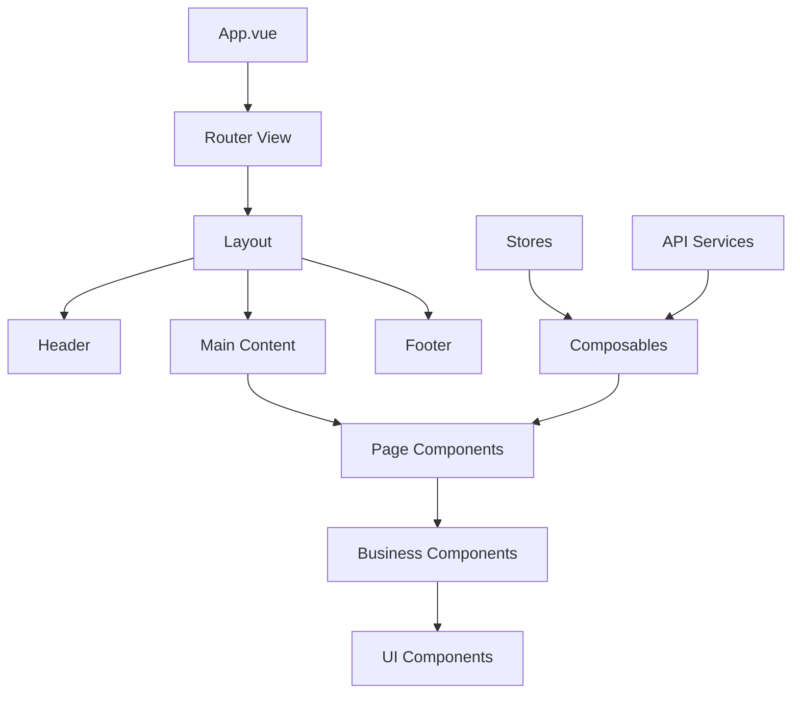
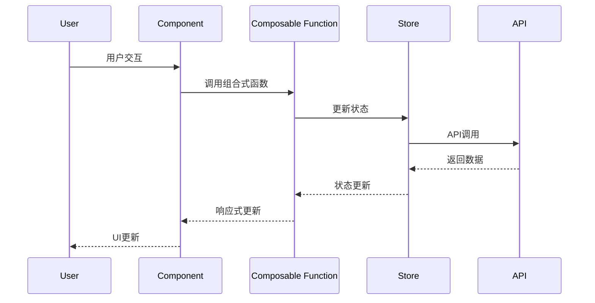

# Front前端架构概览

> **版本**：v1.0.0
> **更新日期**：2025-11-16
> **适用范围**：Front前端系统架构和技术设计
> **关键词**：架构, 前端, Vue, TypeScript, 设计

---

## 📋 目录

- [概述](#概述)
- [技术栈选择](#技术栈选择)
- [项目结构](#项目结构)
- [设计原则](#设计原则)
- [核心架构](#核心架构)
- [组件体系](#组件体系)
- [状态管理](#状态管理)
- [路由设计](#路由设计)
- [API集成](#api集成)
- [构建部署](#构建部署)
- [性能优化](#性能优化)
- [开发规范](#开发规范)

---

## 📖 概述

### 项目背景

Front前端是健身房综合管理系统的前台用户界面部分，采用现代前端技术栈构建，为用户提供课程浏览、预约、私教服务、会员管理等全方位功能。

### 架构目标

- **用户体验**：响应式设计，流畅交互，优秀的视觉效果
- **技术先进**：采用Vue 3 + TypeScript，现代化开发体验
- **性能优化**：快速加载，流畅运行，优秀的用户体验
- **可维护性**：模块化设计，代码规范，易于维护和扩展
- **可扩展性**：插件化架构，支持功能模块的灵活扩展

### 设计理念

基于Vue 3的组合式API和TypeScript的类型安全，打造现代化、类型安全、高性能的前端应用。

---

## 🛠️ 技术栈选择

### 核心框架

| 技术 | 版本 | 说明 | 选择理由 |
|------|------|------|----------|
| **Vue 3** | ^3.3.0 | 渐进式前端框架 | 组合式API，性能优异，生态完善 |
| **TypeScript** | ^5.0.0 | 类型脚本语言 | 类型安全，提高代码质量和开发体验 |
| **Vite** | ^4.4.0 | 下一代构建工具 | 快速构建，热更新，开发体验极佳 |
| **Pinia** | ^2.1.0 | Vue状态管理库 | 轻量级，类型安全，Vue 3官方推荐 |

### UI与样式

| 技术 | 版本 | 说明 | 选择理由 |
|------|------|------|----------|
| **Element Plus** | ^2.4.0 | Vue 3 UI组件库 | 功能丰富，主题定制，移动端适配 |
| **SCSS** | ^1.69.0 | CSS预处理器 | 变量、嵌套、混入，提高样式开发效率 |
| **Tailwind CSS** | ^3.3.0 | 原子化CSS框架 | 灵活定制，减少CSS体积，提高开发效率 |

### 工具库

| 技术 | 版本 | 说明 | 选择理由 |
|------|------|------|----------|
| **Vue Router** | ^4.2.0 | Vue路由管理 | 官方路由器，支持嵌套路由和守卫 |
| **Axios** | ^1.5.0 | HTTP客户端 | 功能完善，支持拦截器和取消请求 |
| **VueUse** | ^10.5.0 | Vue组合式函数库 | 提供常用逻辑，减少重复代码 |
| **GSAP** | ^3.12.0 | 高性能动画库 | 强大的动画效果，提升用户体验 |
| **D3.js** | ^7.8.0 | 数据可视化库 | 图表展示，数据可视化需求 |

### 开发工具

| 技术 | 说明 | 用途 |
|------|------|------|
| **ESLint** | 代码检查工具 | 代码质量保证 |
| **Prettier** | 代码格式化 | 统一代码风格 |
| **Husky** | Git钩子工具 | 提交前检查 |
| **Commitlint** | 提交信息规范 | 规范提交格式 |

---

## 📁 项目结构

### 目录架构

```
src/
├── pages/              # 页面组件（62个）
│   ├── index/         # 首页
│   ├── courses/       # 课程相关页面
│   ├── booking/       # 预约相关页面
│   └── user/          # 用户相关页面
├── components/         # 通用组件（37个）
│   ├── common/        # 基础通用组件
│   ├── business/      # 业务组件
│   └── ui/            # UI组件
├── composables/        # 组合式函数（9个）
│   ├── useUser.ts     # 用户管理
│   ├── useCourse.ts   # 课程管理
│   ├── useBooking.ts  # 预约管理
│   └── useCommon.ts   # 通用逻辑
├── stores/            # 状态管理（4个）
│   ├── user.ts        # 用户状态
│   ├── app.ts         # 应用状态
│   ├── course.ts      # 课程状态
│   └── booking.ts     # 预约状态
├── router/            # 路由配置
│   └── index.ts       # 路由定义
├── types/             # 类型定义（5个）
│   ├── user.ts        # 用户类型
│   ├── course.ts      # 课程类型
│   ├── booking.ts     # 预约类型
│   ├── common.ts      # 通用类型
│   └── api.ts         # API类型
├── utils/             # 工具函数（10个）
│   ├── format.ts      # 格式化工具
│   ├── validate.ts    # 验证工具
│   ├── storage.ts     # 存储工具
│   └── http.ts        # HTTP工具
├── styles/            # 样式文件（4个）
│   ├── variables.scss # 变量定义
│   ├── mixins.scss    # 混入定义
│   ├── base.scss      # 基础样式
│   └── themes/        # 主题样式
├── config/            # 配置文件（5个）
│   ├── api.ts         # API配置
│   ├── routes.ts      # 路由配置
│   ├── constants.ts   # 常量配置
│   └── modules.ts     # 模块配置
├── assets/            # 静态资源
│   ├── images/        # 图片资源
│   ├── icons/         # 图标资源
│   └── fonts/         # 字体资源
├── App.vue            # 根组件
├── main.ts            # 应用入口
└── env.d.ts           # 类型声明
```

### 文件组织原则

1. **按功能划分**：页面、组件、逻辑分离
2. **类型安全**：每个模块都有对应的类型定义
3. **逻辑复用**：通用逻辑抽离为组合式函数
4. **样式隔离**：组件样式独立，主题统一

---

## 🎯 设计原则

### 1. 组合式API优先

```typescript
// ✅ 推荐：使用组合式API
export default defineComponent({
  setup() {
    const { data, loading, error } = useDataFetching()
    const { user } = useUser()

    return {
      data,
      loading,
      error,
      user
    }
  }
})
```

### 2. 类型安全第一

```typescript
// ✅ 推荐：完整的类型定义
interface User {
  id: number
  name: string
  email: string
  role: 'user' | 'admin'
}

interface UseUserReturn {
  user: Ref<User | null>
  loading: Ref<boolean>
  login: (credentials: LoginCredentials) => Promise<void>
  logout: () => void
}
```

### 3. 组件化设计

- **单一职责**：每个组件只负责一个功能
- **可复用性**：组件设计要考虑复用场景
- **可测试性**：组件逻辑清晰，易于测试

### 4. 响应式设计

- **移动优先**：优先适配移动端
- **断点设计**：关键断点适配
- **性能优化**：图片压缩，懒加载

---

## 🏗️ 核心架构

### 组件架构



### 数据流设计



---

## 🧩 组件体系

### 组件分类

#### 1. 页面组件 (62个)

业务功能的主要载体，按模块组织：

- **用户模块**：登录、注册、个人中心等
- **课程模块**：课程列表、详情、搜索等
- **预约模块**：课程预约、私教预约等
- **会员模块**：会员卡购买、续费等

#### 2. 通用组件 (37个)

可复用的UI和业务组件：

- **基础组件**：按钮、输入框、卡片等
- **布局组件**：网格、间距、容器等
- **业务组件**：用户头像、课程卡片等
- **功能组件**：日期选择器、文件上传等

#### 3. 组合式函数 (27个)

业务逻辑复用单元：

- **数据获取**：`useCourses`, `useBookings`
- **用户管理**：`useAuth`, `useProfile`
- **表单处理**：`useFormValidation`, `useFormSubmission`
- **UI交互**：`useModal`, `useNotification`

### 组件设计模式

#### 组合模式

```vue
<!-- 页面组件组合业务组件 -->
<template>
  <CourseList
    :courses="courses"
    :loading="loading"
    @book="handleBookCourse"
  />
</template>
```

#### 插槽模式

```vue
<!-- 灵活的组件定制 -->
<Card>
  <template #header>
    <h3>课程标题</h3>
  </template>

  <template #content>
    <p>课程描述...</p>
  </template>

  <template #actions>
    <Button @click="book">预约</Button>
  </template>
</Card>
```

---

## 🔄 状态管理

### Pinia Store设计

```typescript
// stores/user.ts
export const useUserStore = defineStore('user', {
  state: () => ({
    currentUser: null as User | null,
    isAuthenticated: false,
    preferences: {} as UserPreferences
  }),

  getters: {
    displayName: (state) => state.currentUser?.name || '访客',
    isAdmin: (state) => state.currentUser?.role === 'admin'
  },

  actions: {
    async login(credentials: LoginCredentials) {
      const user = await api.login(credentials)
      this.currentUser = user
      this.isAuthenticated = true
    },

    async logout() {
      await api.logout()
      this.currentUser = null
      this.isAuthenticated = false
    },

    updatePreferences(preferences: Partial<UserPreferences>) {
      this.preferences = { ...this.preferences, ...preferences }
    }
  }
})
```

### Store组织原则

1. **按业务划分**：每个Store负责特定业务领域
2. **类型安全**：完整的TypeScript类型定义
3. **组合使用**：Store间可以相互引用
4. **插件扩展**：支持自定义插件和中间件

---

## 🛣️ 路由设计

### 路由架构

```typescript
// router/index.ts
const routes: RouteRecordRaw[] = [
  {
    path: '/',
    name: 'Home',
    component: () => import('@/pages/index/index.vue'),
    meta: { title: '首页', requiresAuth: false }
  },
  {
    path: '/courses',
    name: 'Courses',
    component: () => import('@/pages/courses/list.vue'),
    meta: { title: '课程列表', requiresAuth: false }
  },
  {
    path: '/user',
    name: 'User',
    component: () => import('@/pages/user/index.vue'),
    meta: { title: '个人中心', requiresAuth: true },
    children: [
      {
        path: 'profile',
        name: 'Profile',
        component: () => import('@/pages/user/profile.vue')
      }
    ]
  }
]
```

### 路由守卫

```typescript
// 全局前置守卫
router.beforeEach(async (to, from) => {
  // 权限检查
  if (to.meta.requiresAuth && !isAuthenticated()) {
    return { name: 'Login' }
  }

  // 页面标题设置
  if (to.meta.title) {
    document.title = `${to.meta.title} - 健身房管理系统`
  }
})
```

---

## 🔌 API集成

### HTTP客户端配置

```typescript
// utils/http.ts
import axios from 'axios'

const instance = axios.create({
  baseURL: import.meta.env.VITE_API_BASE_URL,
  timeout: 10000,
  headers: {
    'Content-Type': 'application/json'
  }
})

// 请求拦截器
instance.interceptors.request.use(
  (config) => {
    const token = getToken()
    if (token) {
      config.headers.Authorization = `Bearer ${token}`
    }
    return config
  },
  (error) => Promise.reject(error)
)

// 响应拦截器
instance.interceptors.response.use(
  (response) => response.data,
  (error) => {
    if (error.response?.status === 401) {
      // 处理未授权
      redirectToLogin()
    }
    return Promise.reject(error)
  }
)

export default instance
```

### API服务层

```typescript
// services/courseService.ts
import http from '@/utils/http'

export const courseService = {
  // 获取课程列表
  getCourses: (params?: CourseQueryParams) =>
    http.get('/courses', { params }),

  // 获取课程详情
  getCourseById: (id: number) =>
    http.get(`/courses/${id}`),

  // 预约课程
  bookCourse: (data: BookingData) =>
    http.post('/bookings', data)
}
```

---

## 🚀 构建部署

### Vite配置

```typescript
// vite.config.ts
import { defineConfig } from 'vite'
import vue from '@vitejs/plugin-vue'
import { resolve } from 'path'

export default defineConfig({
  plugins: [vue()],
  resolve: {
    alias: {
      '@': resolve(__dirname, 'src')
    }
  },
  build: {
    target: 'esnext',
    minify: 'esbuild',
    rollupOptions: {
      output: {
        manualChunks: {
          vendor: ['vue', 'vue-router', 'pinia'],
          ui: ['element-plus'],
          utils: ['axios', 'vueuse']
        }
      }
    }
  },
  server: {
    proxy: {
      '/api': {
        target: 'http://localhost:8080',
        changeOrigin: true
      }
    }
  }
})
```

### 部署策略

1. **开发环境**：热重载，本地开发
2. **测试环境**：自动化测试，集成测试
3. **生产环境**：CDN加速，压缩优化

---

## ⚡ 性能优化

### 构建优化

- **代码分割**：路由懒加载，组件异步加载
- **Tree Shaking**：移除未使用代码
- **压缩混淆**：减小包体积

### 运行时优化

- **虚拟滚动**：大数据量列表优化
- **图片优化**：懒加载，压缩，格式优化
- **缓存策略**：API缓存，静态资源缓存

### 监控指标

- **首屏加载时间**：< 3秒
- **包体积大小**：< 500KB
- **Lighthouse评分**：> 90分

---

## 📋 开发规范

### 代码规范

1. **TypeScript**：必须使用类型定义
2. **组合式API**：优先使用Composition API
3. **组件命名**：PascalCase，语义化
4. **文件命名**：kebab-case，语义化

### 提交规范

```bash
# 提交格式
<type>(<scope>): <subject>

# 示例
feat(user): add login functionality
fix(course): resolve booking bug
docs(component): update button documentation
```

### 分支策略

- **main**：生产分支
- **develop**：开发分支
- **feature/***：功能分支
- **hotfix/***：紧急修复分支

---

## 🔄 后续规划

### 短期目标 (1-3个月)

- [ ] 完善组件文档体系
- [ ] 建立自动化测试流程
- [ ] 优化性能监控体系

### 中期目标 (3-6个月)

- [ ] 微前端架构探索
- [ ] PWA功能实现
- [ ] 国际化支持

### 长期目标 (6-12个月)

- [ ] AI辅助开发
- [ ] 可视化页面搭建
- [ ] 跨平台支持

---

## 📚 相关文档

- [Front前端技术文档索引](../INDEX.md)
- [Front前端开发文档索引](../../development/frontend/INDEX.md)
- [Vue 3官方文档](https://vuejs.org/)
- [TypeScript文档](https://www.typescriptlang.org/)

---

**最后更新**：2025-11-16
**维护责任人**：前端架构师
**联系方式**：architect@company.com
