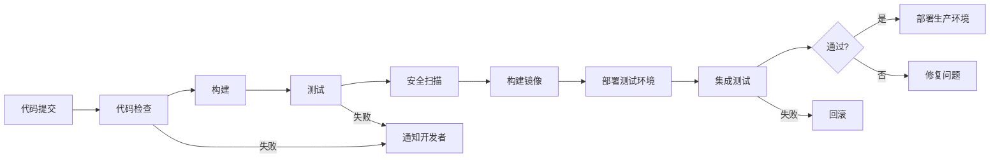

# [系统名称]CI/CD配置指南

> **版本**：v1.0.0
> **更新日期**：2025-11-16
> **适用范围**：[系统名称]持续集成和持续部署配置
> **关键词**：CI/CD, 流水线, 自动化, 部署

---

## 📋 目录

- [CI/CD概述](#cicd概述)
- [流水线架构](#流水线架构)
- [代码质量检查](#代码质量检查)
- [构建和测试](#构建和测试)
- [制品管理](#制品管理)
- [部署策略](#部署策略)
- [环境管理](#环境管理)
- [监控和回滚](#监控和回滚)

---

## CI/CD概述

### 1.1 CI/CD概念

[系统名称]采用现代化的持续集成/持续部署(CI/CD)实践，实现代码从提交到生产的自动化流程。

#### 持续集成 (CI)
- **自动构建**: 代码提交触发自动构建
- **自动化测试**: 运行单元测试、集成测试、端到端测试
- **代码质量检查**: 静态代码分析、代码覆盖率检查
- **早期反馈**: 快速发现和修复问题

#### 持续部署 (CD)
- **自动化部署**: 自动部署到不同环境
- **环境一致性**: 确保各环境配置一致
- **渐进式发布**: 金丝雀发布、蓝绿部署
- **快速回滚**: 出现问题时快速恢复

### 1.2 CI/CD目标

- **提升效率**: 减少手动操作，提高发布频率
- **保证质量**: 通过自动化测试确保代码质量
- **快速反馈**: 快速发现和修复问题
- **可靠发布**: 降低发布风险，提高系统稳定性
- **团队协作**: 促进开发和运维团队协作

### 1.3 技术栈选择

| 组件 | 技术选型 | 版本 | 说明 |
|------|----------|------|------|
| CI平台 | GitHub Actions | - | 云原生CI/CD平台 |
| 容器化 | Docker | 24.x | 应用容器化 |
| 制品库 | GitHub Packages | - | Docker镜像存储 |
| 代码质量 | SonarQube | 10.x | 代码质量分析 |
| 安全扫描 | Trivy | 0.45.x | 容器安全扫描 |
| 配置管理 | Ansible | 8.x | 自动化配置管理 |

---

## 流水线架构

### 2.1 流水线设计原则

#### 设计原则

1. **快速反馈**: 优先运行快速的检查和测试
2. **并行执行**: 将独立的任务并行执行
3. **失败快速**: 尽早发现问题，停止流水线
4. **环境隔离**: 不同阶段使用独立的运行环境
5. **可重用性**: 创建可重用的流水线组件
6. **可观测性**: 完整的日志记录和监控

#### 流水线阶段



### 2.2 流水线配置

#### GitHub Actions工作流

```yaml
# .github/workflows/ci-cd.yml
name: CI/CD Pipeline

on:
  push:
    branches: [ main, develop ]
  pull_request:
    branches: [ main ]

env:
  REGISTRY: ghcr.io
  IMAGE_NAME: ${{ github.repository }}

jobs:
  # 代码质量检查
  quality:
    runs-on: ubuntu-latest
    steps:
      - name: Checkout code
        uses: actions/checkout@v4

      - name: Setup Java
        uses: actions/setup-java@v4
        with:
          java-version: '21'
          distribution: 'temurin'
          cache: maven

      - name: Cache Maven dependencies
        uses: actions/cache@v3
        with:
          path: ~/.m2
          key: ${{ runner.os }}-m2-${{ hashFiles('**/pom.xml') }}
          restore-keys: ${{ runner.os }}-m2

      - name: Code quality check
        run: mvn clean compile

      - name: Run tests
        run: mvn test

      - name: Generate test report
        uses: dorny/test-reporter@v1
        if: success() || failure()
        with:
          name: JUnit Tests
          path: '**/surefire-reports/*.xml'
          reporter: java-junit

  # 安全扫描
  security:
    runs-on: ubuntu-latest
    needs: quality
    steps:
      - name: Checkout code
        uses: actions/checkout@v4

      - name: Run Trivy vulnerability scanner
        uses: aquasecurity/trivy-action@master
        with:
          scan-type: 'fs'
          scan-ref: '.'
          format: 'sarif'
          output: 'trivy-results.sarif'

      - name: Upload Trivy scan results
        uses: github/codeql-action/upload-sarif@v2
        if: always()
        with:
          sarif_file: 'trivy-results.sarif'

  # 构建和推送镜像
  build:
    runs-on: ubuntu-latest
    needs: [quality, security]
    permissions:
      contents: read
      packages: write
    steps:
      - name: Checkout code
        uses: actions/checkout@v4

      - name: Set up Docker Buildx
        uses: actions/setup-buildx-action@v3

      - name: Log in to Container Registry
        uses: docker/login-action@v3
        with:
          registry: ${{ env.REGISTRY }}
          username: ${{ github.actor }}
          password: ${{ secrets.GITHUB_TOKEN }}

      - name: Extract metadata
        id: meta
        uses: docker/metadata-action@v5
        with:
          images: ${{ env.REGISTRY }}/${{ env.IMAGE_NAME }}
          tags: |
            type=ref,event=branch
            type=ref,event=pr
            type=sha,prefix={{branch}}-
            type=raw,value=latest,enable={{is_default_branch}}

      - name: Build and push Docker image
        uses: docker/build-push-action@v5
        with:
          context: ./springboot1ngh61a2
          file: ./springboot1ngh61a2/Dockerfile
          push: true
          tags: ${{ steps.meta.outputs.tags }}
          labels: ${{ steps.meta.outputs.labels }}
          cache-from: type=gha
          cache-to: type=gha,mode=max

  # 部署到测试环境
  deploy-test:
    runs-on: ubuntu-latest
    needs: build
    if: github.ref == 'refs/heads/develop'
    environment: test
    steps:
      - name: Deploy to test environment
        run: |
          echo "Deploying to test environment..."
          # 部署命令
          echo "Deployment completed"

  # 部署到生产环境
  deploy-prod:
    runs-on: ubuntu-latest
    needs: build
    if: github.ref == 'refs/heads/main'
    environment: production
    steps:
      - name: Deploy to production
        run: |
          echo "Deploying to production..."
          # 生产部署命令
          echo "Production deployment completed"
```

---

## 代码质量检查

### 3.1 静态代码分析

#### Java代码检查

```xml
<!-- pom.xml -->
<plugin>
    <groupId>org.apache.maven.plugins</groupId>
    <artifactId>maven-checkstyle-plugin</artifactId>
    <version>3.3.0</version>
    <configuration>
        <configLocation>checkstyle.xml</configLocation>
        <encoding>UTF-8</encoding>
        <consoleOutput>true</consoleOutput>
        <failsOnError>true</failsOnError>
    </configuration>
    <executions>
        <execution>
            <id>validate</id>
            <phase>validate</phase>
            <goals>
                <goal>check</goal>
            </goals>
        </execution>
    </executions>
</plugin>
```

#### Checkstyle配置

```xml
<!-- checkstyle.xml -->
<?xml version="1.0"?>
<!DOCTYPE module PUBLIC
    "-//Checkstyle//DTD Checkstyle Configuration 1.3//EN"
    "https://checkstyle.org/dtds/configuration_1_3.dtd">

<module name="Checker">
    <property name="charset" value="UTF-8"/>
    <property name="severity" value="warning"/>
    <property name="fileExtensions" value="java, properties, xml"/>

    <module name="TreeWalker">
        <!-- 代码风格检查 -->
        <module name="AvoidInlineConditionals"/>
        <module name="CovariantEquals"/>
        <module name="EmptyStatement"/>
        <module name="EqualsAvoidNull"/>
        <module name="EqualsHashCode"/>
        <module name="HiddenField"/>
        <module name="IllegalInstantiation"/>
        <module name="InnerAssignment"/>
        <module name="MagicNumber"/>
        <module name="MissingSwitchDefault"/>
        <module name="RedundantThrows"/>
        <module name="SimplifyBooleanExpression"/>
        <module name="SimplifyBooleanReturn"/>
        <module name="UnusedImports"/>
        <module name="UpperEll"/>
    </module>
</module>
```

### 3.2 测试覆盖率

#### JaCoCo配置

```xml
<!-- pom.xml -->
<plugin>
    <groupId>org.jacoco</groupId>
    <artifactId>jacoco-maven-plugin</artifactId>
    <version>0.8.10</version>
    <executions>
        <execution>
            <goals>
                <goal>prepare-agent</goal>
            </goals>
        </execution>
        <execution>
            <id>report</id>
            <phase>test</phase>
            <goals>
                <goal>report</goal>
            </goals>
        </execution>
    </executions>
</plugin>
```

#### 覆盖率阈值配置

```xml
<!-- pom.xml -->
<plugin>
    <groupId>org.jacoco</groupId>
    <artifactId>jacoco-maven-plugin</artifactId>
    <version>0.8.10</version>
    <executions>
        <execution>
            <id>default-check</id>
            <goals>
                <goal>check</goal>
            </goals>
            <configuration>
                <rules>
                    <rule>
                        <element>BUNDLE</element>
                        <limits>
                            <limit>
                                <counter>LINE</counter>
                                <value>COVEREDRATIO</value>
                                <minimum>80%</minimum>
                            </limit>
                            <limit>
                                <counter>BRANCH</counter>
                                <value>COVEREDRATIO</value>
                                <minimum>75%</minimum>
                            </limit>
                        </limits>
                    </rule>
                </rules>
            </configuration>
        </execution>
    </executions>
</plugin>
```

### 3.3 前端代码质量

#### ESLint配置

```javascript
// .eslintrc.js
module.exports = {
  root: true,
  env: {
    browser: true,
    es2021: true,
    node: true
  },
  extends: [
    'eslint:recommended',
    '@vue/eslint-config-typescript',
    '@vue/eslint-config-prettier'
  ],
  parserOptions: {
    ecmaVersion: 12,
    sourceType: 'module'
  },
  rules: {
    'no-console': process.env.NODE_ENV === 'production' ? 'warn' : 'off',
    'no-debugger': process.env.NODE_ENV === 'production' ? 'warn' : 'off',
    'vue/multi-word-component-names': 'off',
    'prettier/prettier': ['error', {
      singleQuote: true,
      semi: false
    }]
  }
}
```

#### Prettier配置

```javascript
// .prettierrc.js
module.exports = {
  semi: false,
  singleQuote: true,
  tabWidth: 2,
  trailingComma: 'none',
  printWidth: 100,
  endOfLine: 'lf'
}
```

---

## 构建和测试

### 4.1 多阶段构建

#### Dockerfile优化

```dockerfile
# 多阶段构建Dockerfile
FROM maven:3.9.4-openjdk-21-slim AS builder

WORKDIR /app

# 复制Maven配置文件
COPY pom.xml .
COPY .mvn/ .mvn/
COPY mvnw .

# 下载依赖（利用缓存）
RUN ./mvnw dependency:go-offline -B

# 复制源代码
COPY src ./src

# 构建应用
RUN ./mvnw clean package -DskipTests

# 运行时镜像
FROM openjdk:21-jre-slim

WORKDIR /app

# 创建非root用户
RUN addgroup --system spring && adduser --system spring --ingroup spring
USER spring:spring

# 复制构建产物
COPY --from=builder /app/target/*.jar app.jar

# 健康检查
HEALTHCHECK --interval=30s --timeout=3s --start-period=60s --retries=3 \
    CMD curl -f http://localhost:8080/actuator/health || exit 1

EXPOSE 8080

ENTRYPOINT ["java", "-jar", "app.jar"]
```

### 4.2 并行测试执行

#### Maven Surefire插件配置

```xml
<!-- pom.xml -->
<plugin>
    <groupId>org.apache.maven.plugins</groupId>
    <artifactId>maven-surefire-plugin</artifactId>
    <version>3.1.2</version>
    <configuration>
        <!-- 并行执行测试 -->
        <parallel>classes</parallel>
        <threadCount>4</threadCount>
        <useUnlimitedThreads>false</useUnlimitedThreads>

        <!-- 测试报告 -->
        <reportsDirectory>${project.build.directory}/surefire-reports</reportsDirectory>

        <!-- 包含/排除测试 -->
        <includes>
            <include>**/*Test.java</include>
            <include>**/*Tests.java</include>
        </includes>
        <excludes>
            <exclude>**/*IT.java</exclude>
        </excludes>
    </configuration>
</plugin>
```

### 4.3 集成测试

#### TestContainers配置

```java
// 集成测试基础配置
@SpringBootTest(webEnvironment = SpringBootTest.WebEnvironment.RANDOM_PORT)
@Testcontainers
public class IntegrationTest {

    @Container
    static PostgreSQLContainer<?> postgres = new PostgreSQLContainer<>("postgres:16-alpine")
        .withDatabaseName("testdb")
        .withUsername("test")
        .withPassword("test");

    @Container
    static GenericContainer<?> redis = new GenericContainer<>("redis:7-alpine")
        .withExposedPorts(6379);

    @DynamicPropertySource
    static void properties(DynamicPropertyRegistry registry) {
        registry.add("spring.datasource.url", postgres::getJdbcUrl);
        registry.add("spring.datasource.username", postgres::getUsername);
        registry.add("spring.datasource.password", postgres::getPassword);
        registry.add("spring.redis.host", redis::getHost);
        registry.add("spring.redis.port", () -> redis.getMappedPort(6379));
    }
}
```

---

## 制品管理

### 5.1 Docker镜像管理

#### 镜像标签策略

```yaml
# 镜像标签策略
tags:
  # 分支标签
  - type=ref,event=branch

  # 拉取请求标签
  - type=ref,event=pr

  # 提交SHA标签
  - type=sha,prefix={{branch}}-

  # 最新标签（仅主分支）
  - type=raw,value=latest,enable={{is_default_branch}}

  # 语义化版本标签
  - type=raw,value={{version}},enable={{is_tag}}
```

#### 镜像清理策略

```bash
#!/bin/bash
# clean_old_images.sh

echo "清理旧的Docker镜像..."

# 删除7天前的镜像
docker image prune -f --filter "until=168h"

# 删除未使用的镜像
docker image prune -f

# 删除特定模式的旧镜像
docker images [system-name] --format "table {{.Repository}}\t{{.Tag}}\t{{.CreatedAt}}" | \
    grep -E "[0-9]{4}-[0-9]{2}-[0-9]{2}" | \
    head -n -10 | \
    awk '{print $1":"$2}' | \
    xargs -r docker rmi

echo "镜像清理完成"
```

### 5.2 依赖缓存

#### Maven依赖缓存

```yaml
# GitHub Actions Maven缓存
- name: Cache Maven dependencies
  uses: actions/cache@v3
  with:
    path: ~/.m2
    key: ${{ runner.os }}-m2-${{ hashFiles('**/pom.xml') }}
    restore-keys: ${{ runner.os }}-m2
```

#### Node.js依赖缓存

```yaml
# GitHub Actions Node.js缓存
- name: Setup Node.js
  uses: actions/setup-node@v4
  with:
    node-version: '18'
    cache: 'npm'
    cache-dependency-path: |
      front/package-lock.json
      admin/package-lock.json
```

#### Docker层缓存

```yaml
# Docker BuildKit缓存
- name: Build and push Docker image
  uses: docker/build-push-action@v5
  with:
    context: .
    push: true
    cache-from: type=gha
    cache-to: type=gha,mode=max
```

---

## 部署策略

### 6.1 环境策略

#### 多环境配置

```yaml
# 环境配置
environments:
  development:
    branch: develop
    environment: dev
    auto_deploy: true
    requires_approval: false

  staging:
    branch: release/*
    environment: staging
    auto_deploy: true
    requires_approval: true

  production:
    branch: main
    environment: production
    auto_deploy: false
    requires_approval: true
```

#### 环境保护规则

```yaml
# GitHub Environments
production:
  required_reviewers:
    - team: platform-team
    - user: admin
  deployment_branch_policy:
    protected_branches: true
    custom_branch_policies: false
```

### 6.2 部署策略

#### 滚动部署

```yaml
# Kubernetes滚动部署
apiVersion: apps/v1
kind: Deployment
metadata:
  name: [system-name]
spec:
  replicas: 3
  strategy:
    type: RollingUpdate
    rollingUpdate:
      maxUnavailable: 1
      maxSurge: 1
  template:
    spec:
      containers:
      - name: app
        image: [image]:latest
        readinessProbe:
          httpGet:
            path: /actuator/health
            port: 8080
          initialDelaySeconds: 30
          periodSeconds: 10
```

#### 蓝绿部署

```yaml
# 蓝绿部署脚本
#!/bin/bash
# blue_green_deploy.sh

BLUE="blue"
GREEN="green"
CURRENT=$(kubectl get svc [system-name] -o jsonpath='{.spec.selector.version}')

if [ "$CURRENT" = "$BLUE" ]; then
    TARGET=$GREEN
else
    TARGET=$BLUE
fi

echo "部署到 $TARGET 环境..."

# 部署新版本
kubectl set image deployment/[system-name]-$TARGET app=[new-image]

# 等待就绪
kubectl rollout status deployment/[system-name]-$TARGET

# 切换流量
kubectl patch svc [system-name] -p "{\"spec\":{\"selector\":{\"version\":\"$TARGET\"}}}"

echo "蓝绿部署完成，当前版本: $TARGET"
```

#### 金丝雀部署

```yaml
# 金丝雀部署配置
apiVersion: networking.istio.io/v1beta1
kind: VirtualService
metadata:
  name: [system-name]
spec:
  http:
  - route:
    - destination:
        host: [system-name]
        subset: v1
      weight: 90
    - destination:
        host: [system-name]
        subset: v2
      weight: 10
```

---

## 环境管理

### 7.1 配置管理

#### 环境变量管理

```bash
# 环境变量文件模板
cat > .env.template << EOF
# 应用配置
APP_NAME=[system-name]
APP_VERSION=1.0.0
APP_ENV=production

# 数据库配置
DB_HOST=localhost
DB_PORT=5432
DB_NAME=[database]
DB_USER=[username]
DB_PASSWORD=[password]

# Redis配置
REDIS_HOST=localhost
REDIS_PORT=6379
REDIS_PASSWORD=[password]

# 其他配置
LOG_LEVEL=INFO
JVM_OPTS=-Xmx4g -Xms2g
EOF
```

#### 配置验证

```bash
#!/bin/bash
# validate_config.sh

echo "验证配置..."

# 检查必需的环境变量
REQUIRED_VARS=("DB_HOST" "DB_USER" "DB_PASSWORD" "REDIS_HOST")
for var in "${REQUIRED_VARS[@]}"; do
    if [ -z "${!var}" ]; then
        echo "❌ 缺少必需的环境变量: $var"
        exit 1
    fi
done

# 验证数据库连接
if ! psql -h $DB_HOST -U $DB_USER -d $DB_NAME -c "SELECT 1;" > /dev/null; then
    echo "❌ 数据库连接失败"
    exit 1
fi

# 验证Redis连接
if ! redis-cli -h $REDIS_HOST -p $REDIS_PORT -a $REDIS_PASSWORD ping > /dev/null; then
    echo "❌ Redis连接失败"
    exit 1
fi

echo "✅ 配置验证通过"
```

### 7.2 密钥管理

#### GitHub Secrets配置

```yaml
# 工作流中的密钥使用
- name: Deploy to production
  environment: production
  steps:
    - name: Deploy
      run: |
        echo ${{ secrets.DB_PASSWORD }} | docker login -u ${{ secrets.DOCKER_USERNAME }} --password-stdin
        # 部署命令
```

#### 密钥轮换策略

```bash
#!/bin/bash
# rotate_secrets.sh

echo "轮换密钥..."

# 生成新密码
NEW_DB_PASSWORD=$(openssl rand -base64 32)
NEW_REDIS_PASSWORD=$(openssl rand -base64 32)

# 更新应用配置
sed -i "s/DB_PASSWORD=.*/DB_PASSWORD=$NEW_DB_PASSWORD/" .env
sed -i "s/REDIS_PASSWORD=.*/REDIS_PASSWORD=$NEW_REDIS_PASSWORD/" .env

# 更新数据库密码
psql -U postgres -d [database] -c "ALTER USER [db_user] PASSWORD '$NEW_DB_PASSWORD';"

# 更新Redis密码
redis-cli -a [old_redis_password] CONFIG SET requirepass $NEW_REDIS_PASSWORD

# 重启服务
sudo systemctl restart [system-name]

echo "密钥轮换完成"
```

---

## 监控和回滚

### 8.1 部署监控

#### 部署状态监控

```bash
#!/bin/bash
# monitor_deployment.sh

DEPLOY_TIMEOUT=300  # 5分钟超时
START_TIME=$(date +%s)

echo "监控部署状态..."

while true; do
    CURRENT_TIME=$(date +%s)
    ELAPSED=$((CURRENT_TIME - START_TIME))

    if [ $ELAPSED -gt $DEPLOY_TIMEOUT ]; then
        echo "❌ 部署超时"
        exit 1
    fi

    # 检查应用健康
    if curl -f -s http://localhost:8080/actuator/health > /dev/null; then
        echo "✅ 应用部署成功"
        exit 0
    fi

    # 检查错误日志
    ERROR_COUNT=$(grep -c "ERROR" /var/log/[system-name]/app.log)
    if [ $ERROR_COUNT -gt 10 ]; then
        echo "❌ 检测到过多错误日志"
        exit 1
    fi

    sleep 10
done
```

#### 性能监控

```bash
#!/bin/bash
# monitor_performance.sh

echo "监控部署后性能..."

# 响应时间监控
RESPONSE_TIME=$(curl -o /dev/null -s -w "%{time_total}" http://localhost:8080/actuator/health)
if (( $(echo "$RESPONSE_TIME > 1.0" | bc -l) )); then
    echo "⚠️ 响应时间较慢: ${RESPONSE_TIME}s"
fi

# 错误率监控
ERROR_RATE=$(curl -s http://localhost:8080/actuator/metrics/http.server.requests?tag=status:500 | jq '.measurements[0].value // 0')
if (( $(echo "$ERROR_RATE > 0.01" | bc -l) )); then
    echo "⚠️ 错误率过高: ${ERROR_RATE}"
fi

# 数据库连接监控
DB_CONNECTIONS=$(psql -U [db_user] -d [database] -t -c "SELECT count(*) FROM pg_stat_activity WHERE datname = current_database();")
if [ "$DB_CONNECTIONS" -gt 50 ]; then
    echo "⚠️ 数据库连接数过高: $DB_CONNECTIONS"
fi

echo "性能监控完成"
```

### 8.2 回滚策略

#### 自动回滚触发条件

```yaml
# 回滚触发规则
rollback_conditions:
  - name: health_check_failed
    condition: health_check_status != 200
    wait_time: 60s
    action: rollback

  - name: error_rate_high
    condition: error_rate > 5%
    wait_time: 300s
    action: rollback

  - name: response_time_slow
    condition: response_time_p95 > 2000ms
    wait_time: 300s
    action: rollback
```

#### 回滚脚本

```bash
#!/bin/bash
# rollback.sh

echo "开始回滚..."

# 获取上一版本镜像
PREVIOUS_IMAGE=$(docker images [system-name] --format "{{.Repository}}:{{.Tag}}" | sed -n '2p')

if [ -z "$PREVIOUS_IMAGE" ]; then
    echo "❌ 未找到上一版本镜像"
    exit 1
fi

echo "回滚到镜像: $PREVIOUS_IMAGE"

# 停止当前容器
docker-compose down

# 更新镜像标签
sed -i "s|image:.*|image: $PREVIOUS_IMAGE|" docker-compose.yml

# 启动旧版本
docker-compose up -d

# 等待启动完成
sleep 30

# 验证回滚结果
if curl -f -s http://localhost:8080/actuator/health > /dev/null; then
    echo "✅ 回滚成功"
else
    echo "❌ 回滚失败"
    exit 1
fi
```

#### 回滚验证

```bash
#!/bin/bash
# verify_rollback.sh

echo "验证回滚结果..."

# 1. 服务可用性检查
if ! curl -f -s http://localhost:8080/actuator/health > /dev/null; then
    echo "❌ 服务不可用"
    exit 1
fi

# 2. 功能完整性检查
RESPONSE=$(curl -s http://localhost:8080/api/health)
if [ "$RESPONSE" != "OK" ]; then
    echo "❌ 功能检查失败"
    exit 1
fi

# 3. 数据一致性检查
DATA_COUNT=$(psql -U [db_user] -d [database] -t -c "SELECT count(*) FROM users;")
if [ "$DATA_COUNT" -lt 1 ]; then
    echo "❌ 数据一致性检查失败"
    exit 1
fi

# 4. 性能基准检查
RESPONSE_TIME=$(curl -o /dev/null -s -w "%{time_total}" http://localhost:8080/api/users)
if (( $(echo "$RESPONSE_TIME > 2.0" | bc -l) )); then
    echo "⚠️ 响应时间异常: ${RESPONSE_TIME}s"
fi

echo "✅ 回滚验证通过"
```

---

## 更新记录

| 日期 | 版本 | 更新内容 | 更新人 |
|------|------|----------|--------|
| 2025-11-16 | v1.0.0 | 初始版本 | [作者] |

---

> 💡 **提示**: CI/CD是现代软件开发的核心实践。通过自动化流水线，可以显著提升开发效率、代码质量和部署可靠性。建议根据项目特点持续优化流水线配置。
