# [系统名称]部署指南

> **版本**：v1.0.0
> **更新日期**：2025-11-16
> **适用范围**：[系统名称]部署和配置
> **关键词**：部署, 安装, 配置, Docker, 生产环境

---

## 📋 目录

- [部署概述](#部署概述)
- [环境要求](#环境要求)
- [快速开始](#快速开始)
- [详细部署](#详细部署)
- [配置管理](#配置管理)
- [服务启动](#服务启动)
- [验证部署](#验证部署)
- [故障排查](#故障排查)
- [回滚方案](#回滚方案)

---

## 部署概述

### 1.1 系统介绍

[系统名称]是一个[系统类型]，采用[技术栈]构建，支持[主要功能]。

### 1.2 部署架构

#### 架构图

```mermaid
graph TB
    A[用户] --> B[负载均衡器]
    B --> C[应用服务器1]
    B --> D[应用服务器2]
    C --> E[数据库主库]
    D --> E
    E --> F[数据库从库1]
    E --> G[数据库从库2]
    C --> H[Redis集群]
    D --> H
    C --> I[MinIO集群]
    D --> I
```



#### 部署模式

| 模式 | 适用场景 | 特点 |
|------|----------|------|
| 单机部署 | 开发/测试环境 | 简单快速，资源消耗少 |
| 分布式部署 | 生产环境 | 高可用，高性能，可扩展 |
| Docker部署 | 容器化环境 | 环境一致，易于管理 |
| 云原生部署 | 云平台 | 弹性伸缩，自动化运维 |

### 1.3 部署清单

#### 核心组件

- [ ] 应用服务器 (Java 21+)
- [ ] 数据库服务器 (PostgreSQL 16+)
- [ ] 缓存服务器 (Redis 7+)
- [ ] 文件存储 (MinIO)
- [ ] 负载均衡器 (Nginx)
- [ ] 监控系统 (Prometheus + Grafana)

#### 网络配置

- [ ] 域名解析
- [ ] SSL证书
- [ ] 防火墙规则
- [ ] 安全组配置

#### 数据准备

- [ ] 数据库初始化脚本
- [ ] 基础数据导入
- [ ] 配置文件准备
- [ ] 环境变量设置

---

## 环境要求

### 2.1 硬件要求

#### 生产环境推荐配置

| 组件 | CPU | 内存 | 磁盘 | 网络 |
|------|-----|------|------|------|
| 应用服务器 | 4核+ | 8GB+ | 100GB+ SSD | 1Gbps |
| 数据库服务器 | 8核+ | 16GB+ | 500GB+ SSD | 1Gbps |
| 缓存服务器 | 2核+ | 4GB+ | 50GB+ SSD | 1Gbps |
| 文件服务器 | 2核+ | 4GB+ | 1TB+ HDD | 1Gbps |

#### 测试环境最小配置

| 组件 | CPU | 内存 | 磁盘 | 网络 |
|------|-----|------|------|------|
| 应用服务器 | 2核 | 4GB | 50GB | 100Mbps |
| 数据库服务器 | 2核 | 4GB | 100GB | 100Mbps |
| 缓存服务器 | 1核 | 2GB | 20GB | 100Mbps |

### 2.2 软件要求

#### 操作系统

| 操作系统 | 版本 | 架构 | 说明 |
|----------|------|------|------|
| Ubuntu | 20.04+ | x86_64 | 推荐 |
| CentOS | 8.0+ | x86_64 | 兼容 |
| Debian | 11.0+ | x86_64 | 兼容 |
| Windows Server | 2019+ | x86_64 | 仅开发环境 |

#### 运行时环境

| 组件 | 版本要求 | 下载地址 |
|------|----------|----------|
| Java | 21+ | https://adoptium.net/ |
| Node.js | 18+ | https://nodejs.org/ |
| Docker | 20.10+ | https://docker.com/ |
| Docker Compose | 2.0+ | https://docker.com/ |

#### 数据库要求

| 组件 | 版本 | 配置要求 |
|------|------|----------|
| PostgreSQL | 16+ | UTF8编码，最大连接数100+ |
| Redis | 7+ | 持久化配置，内存4GB+ |

### 2.3 网络要求

#### 端口配置

| 服务 | 端口 | 协议 | 说明 |
|------|------|------|------|
| HTTP | 80 | TCP | Web服务 |
| HTTPS | 443 | TCP | 安全Web服务 |
| SSH | 22 | TCP | 远程管理 |
| PostgreSQL | 5432 | TCP | 数据库服务 |
| Redis | 6379 | TCP | 缓存服务 |
| MinIO API | 9000 | TCP | 对象存储API |
| MinIO Console | 9001 | TCP | 管理控制台 |

#### 域名配置

```
# 生产环境域名配置
api.example.com     -> 应用服务器
admin.example.com   -> 管理后台
static.example.com  -> 静态资源
db.example.com      -> 数据库服务器 (内网)
cache.example.com   -> 缓存服务器 (内网)
```

### 2.4 依赖检查

#### 系统依赖

```bash
# 检查操作系统版本
cat /etc/os-release

# 检查可用内存
free -h

# 检查磁盘空间
df -h

# 检查网络连接
ping -c 3 google.com
```

#### 软件依赖检查

```bash
# 检查Java版本
java -version

# 检查Docker版本
docker --version
docker-compose --version

# 检查网络工具
curl --version
wget --version
```

---

## 快速开始

### 3.1 Docker快速部署

#### 前置要求

- Docker 20.10+
- Docker Compose 2.0+
- 至少4GB可用内存
- 至少20GB可用磁盘空间

#### 一键部署

```bash
# 1. 克隆项目
git clone [repository-url]
cd [project-directory]

# 2. 配置环境变量
cp env.example .env
# 编辑 .env 文件，设置数据库密码等

# 3. 启动服务
docker-compose up -d

# 4. 查看启动日志
docker-compose logs -f

# 5. 验证部署
curl http://localhost/health
```

#### 预期结果

```
✅ 数据库服务启动成功
✅ 缓存服务启动成功
✅ 应用服务启动成功
✅ 文件服务启动成功
✅ 所有健康检查通过
```

### 3.2 验证部署

#### 健康检查

```bash
# 检查服务状态
docker-compose ps

# 检查应用健康
curl http://localhost:8080/[context-path]/user/login

# 检查数据库连接
docker-compose exec postgres pg_isready -U postgres

# 检查缓存服务
docker-compose exec redis redis-cli ping
```

#### 访问测试

| 服务 | URL | 预期状态 |
|------|-----|----------|
| 前端应用 | http://localhost:8080/[context-path]/front/ | 200 OK |
| 管理后台 | http://localhost:8080/[context-path]/admin/ | 200 OK |
| API文档 | http://localhost:8080/[context-path]/swagger-ui.html | 200 OK |
| 健康检查 | http://localhost:8080/[context-path]/health | 200 OK |

---

## 详细部署

### 4.1 环境准备

#### 系统更新

```bash
# Ubuntu/Debian
sudo apt update && sudo apt upgrade -y

# CentOS/RHEL
sudo yum update -y

# 安装基础工具
sudo apt install -y curl wget git vim htop iotop

# 配置时区
sudo timedatectl set-timezone Asia/Shanghai
```

#### 用户创建

```bash
# 创建应用用户
sudo useradd -m -s /bin/bash appuser
sudo usermod -aG docker appuser

# 设置权限
sudo chown -R appuser:appuser /opt/[system-name]/
sudo chmod -R 755 /opt/[system-name]/
```

#### 目录结构

```bash
# 创建标准目录结构
sudo mkdir -p /opt/[system-name]/{app,config,logs,data,backup}
sudo mkdir -p /var/log/[system-name]/
sudo mkdir -p /etc/[system-name]/

# 设置权限
sudo chown -R appuser:appuser /opt/[system-name]/
sudo chown -R appuser:appuser /var/log/[system-name]/
sudo chown -R appuser:appuser /etc/[system-name]/
```

### 4.2 数据库部署

#### PostgreSQL安装

```bash
# Ubuntu/Debian
sudo apt install -y postgresql postgresql-contrib

# CentOS/RHEL
sudo yum install -y postgresql-server postgresql-contrib
sudo postgresql-setup initdb

# 启动服务
sudo systemctl enable postgresql
sudo systemctl start postgresql
```

#### 数据库配置

```bash
# 切换到postgres用户
sudo -u postgres psql

# 创建数据库和用户
CREATE DATABASE [database_name] OWNER [db_user];
CREATE USER [db_user] WITH PASSWORD '[db_password]';
GRANT ALL PRIVILEGES ON DATABASE [database_name] TO [db_user];

# 配置远程访问 (生产环境谨慎配置)
# 编辑 /etc/postgresql/16/main/pg_hba.conf
# 添加: host    [database_name]    [db_user]    192.168.1.0/24    md5

# 重启服务
sudo systemctl restart postgresql
```

#### 数据初始化

```bash
# 导入表结构
psql -U [db_user] -d [database_name] -f schema-postgresql.sql

# 导入基础数据
psql -U [db_user] -d [database_name] -f data.sql

# 验证数据
psql -U [db_user] -d [database_name] -c "SELECT COUNT(*) FROM users;"
```

### 4.3 应用部署

#### Java应用部署

```bash
# 下载应用包
wget [application-url] -O app.jar

# 创建启动脚本
cat > /opt/[system-name]/start.sh << 'EOF'
#!/bin/bash
JAVA_OPTS="-Xmx4g -Xms2g -XX:+UseG1GC"
JAR_FILE="/opt/[system-name]/app.jar"

java $JAVA_OPTS -jar $JAR_FILE \
  --spring.profiles.active=prod \
  --logging.file.path=/var/log/[system-name]/ \
  > /var/log/[system-name]/app.log 2>&1 &
EOF

# 设置执行权限
chmod +x /opt/[system-name]/start.sh
```

#### Systemd服务配置

```bash
# 创建systemd服务文件
cat > /etc/systemd/system/[system-name].service << EOF
[Unit]
Description=[System Name] Application
After=network.target postgresql.service redis.service

[Service]
Type=simple
User=appuser
Group=appuser
Environment=JAVA_HOME=/usr/lib/jvm/java-21-openjdk-amd64
Environment=PATH=/usr/lib/jvm/java-21-openjdk-amd64/bin:$PATH
ExecStart=/opt/[system-name]/start.sh
ExecStop=/bin/kill -TERM $MAINPID
Restart=always
RestartSec=10

[Install]
WantedBy=multi-user.target
EOF

# 重新加载systemd配置
sudo systemctl daemon-reload

# 启用服务
sudo systemctl enable [system-name]
```

### 4.4 前端部署

#### Node.js环境配置

```bash
# 安装Node.js
curl -fsSL https://deb.nodesource.com/setup_18.x | sudo -E bash -
sudo apt-get install -y nodejs

# 验证安装
node --version
npm --version
```

#### 前端构建

```bash
# 构建用户站点
cd springboot1ngh61a2/src/main/resources/front/front
npm ci
npm run build

# 构建管理后台
cd springboot1ngh61a2/src/main/resources/admin/admin
npm ci
npm run build
```

#### Nginx配置

```bash
# 安装Nginx
sudo apt install -y nginx

# 配置虚拟主机
cat > /etc/nginx/sites-available/[system-name] << EOF
server {
    listen 80;
    server_name api.example.com;

    # API代理
    location /[context-path]/ {
        proxy_pass http://localhost:8080;
        proxy_set_header Host \$host;
        proxy_set_header X-Real-IP \$remote_addr;
        proxy_set_header X-Forwarded-For \$proxy_add_x_forwarded_for;
        proxy_set_header X-Forwarded-Proto \$scheme;
    }
}

server {
    listen 80;
    server_name front.example.com;

    root /opt/[system-name]/front/dist;
    index index.html;

    location / {
        try_files \$uri \$uri/ /index.html;
    }
}

server {
    listen 80;
    server_name admin.example.com;

    root /opt/[system-name]/admin/dist;
    index index.html;

    location / {
        try_files \$uri \$uri/ /index.html;
    }
}
EOF

# 启用配置
sudo ln -s /etc/nginx/sites-available/[system-name] /etc/nginx/sites-enabled/
sudo nginx -t
sudo systemctl reload nginx
```

### 4.5 缓存服务部署

#### Redis安装

```bash
# 安装Redis
sudo apt install -y redis-server

# 配置Redis
sudo sed -i 's/supervised no/supervised systemd/' /etc/redis/redis.conf
sudo sed -i 's/# requirepass foobared/requirepass [redis_password]/' /etc/redis/redis.conf

# 启用持久化
echo 'save 900 1' >> /etc/redis/redis.conf
echo 'save 300 10' >> /etc/redis/redis.conf
echo 'save 60 10000' >> /etc/redis/redis.conf

# 启动服务
sudo systemctl enable redis
sudo systemctl start redis
```

### 4.6 文件存储部署

#### MinIO部署

```bash
# 下载MinIO
wget https://dl.min.io/server/minio/release/linux-amd64/minio -O /usr/local/bin/minio
chmod +x /usr/local/bin/minio

# 创建MinIO用户
sudo useradd -m -s /bin/bash minio

# 创建数据目录
sudo mkdir -p /opt/minio/data
sudo chown -R minio:minio /opt/minio/

# 创建systemd服务
cat > /etc/systemd/system/minio.service << EOF
[Unit]
Description=MinIO
After=network.target

[Service]
Type=simple
User=minio
Group=minio
ExecStart=/usr/local/bin/minio server /opt/minio/data --console-address ":9001"
Restart=always
RestartSec=10

[Install]
WantedBy=multi-user.target
EOF

# 启动服务
sudo systemctl daemon-reload
sudo systemctl enable minio
sudo systemctl start minio
```

---

## 配置管理

### 5.1 配置文件结构

```
/etc/[system-name]/
├── application-prod.yml    # Spring Boot生产配置
├── nginx.conf             # Nginx配置
├── redis.conf             # Redis配置
├── minio.conf             # MinIO配置
└── monitoring/            # 监控配置
    ├── prometheus.yml
    ├── alertmanager.yml
    └── grafana/
        └── dashboards/
```

### 5.2 环境变量配置

#### 系统环境变量

```bash
# 创建环境变量文件
cat > /etc/[system-name]/environment << EOF
# 数据库配置
DB_HOST=localhost
DB_PORT=5432
DB_NAME=[database_name]
DB_USER=[db_user]
DB_PASSWORD=[db_password]

# Redis配置
REDIS_HOST=localhost
REDIS_PORT=6379
REDIS_PASSWORD=[redis_password]

# MinIO配置
MINIO_ENDPOINT=http://localhost:9000
MINIO_ACCESS_KEY=[minio_access_key]
MINIO_SECRET_KEY=[minio_secret_key]

# 应用配置
JAVA_OPTS="-Xmx4g -Xms2g -XX:+UseG1GC"
LOG_LEVEL=INFO
EOF
```

#### 应用配置

```yaml
# application-prod.yml
spring:
  profiles:
    active: prod

  datasource:
    url: jdbc:postgresql://${DB_HOST}:${DB_PORT}/${DB_NAME}
    username: ${DB_USER}
    password: ${DB_PASSWORD}
    driver-class-name: org.postgresql.Driver

    hikari:
      maximum-pool-size: 50
      minimum-idle: 10
      connection-timeout: 30000

  redis:
    host: ${REDIS_HOST}
    port: ${REDIS_PORT}
    password: ${REDIS_PASSWORD}
    timeout: 2000ms

minio:
  endpoint: ${MINIO_ENDPOINT}
  access-key: ${MINIO_ACCESS_KEY}
  secret-key: ${MINIO_SECRET_KEY}
  bucket-name: ${MINIO_BUCKET_NAME:-[system-name]}

logging:
  level:
    root: ${LOG_LEVEL}
  file:
    path: /var/log/[system-name]/
    name: app.log
```

### 5.3 配置验证

#### 配置检查脚本

```bash
#!/bin/bash
# config_validation.sh

echo "开始配置验证..."

# 检查环境变量
source /etc/[system-name]/environment

REQUIRED_VARS=("DB_HOST" "DB_USER" "DB_PASSWORD" "REDIS_HOST" "MINIO_ENDPOINT")
for var in "${REQUIRED_VARS[@]}"; do
    if [ -z "${!var}" ]; then
        echo "❌ 缺少必需的环境变量: $var"
        exit 1
    fi
done

# 检查数据库连接
if ! psql -h $DB_HOST -U $DB_USER -d $DB_NAME -c "SELECT 1;" > /dev/null 2>&1; then
    echo "❌ 数据库连接失败"
    exit 1
fi

# 检查Redis连接
if ! redis-cli -h $REDIS_HOST -p $REDIS_PORT -a $REDIS_PASSWORD ping > /dev/null 2>&1; then
    echo "❌ Redis连接失败"
    exit 1
fi

# 检查MinIO连接
if ! curl -f $MINIO_ENDPOINT/minio/health/live > /dev/null 2>&1; then
    echo "❌ MinIO连接失败"
    exit 1
fi

echo "✅ 配置验证通过"
```

---

## 服务启动

### 6.1 启动顺序

正确的服务启动顺序：

1. **数据库服务** (PostgreSQL)
2. **缓存服务** (Redis)
3. **文件存储** (MinIO)
4. **应用服务** ([system-name])
5. **Web服务器** (Nginx)

### 6.2 启动脚本

#### 完整启动脚本

```bash
#!/bin/bash
# full_startup.sh

echo "开始启动[system-name]系统..."

SERVICES=("postgresql" "redis" "minio" "[system-name]" "nginx")

for service in "${SERVICES[@]}"; do
    echo "启动 $service..."
    sudo systemctl start $service

    # 等待服务就绪
    case $service in
        postgresql)
            sleep 5
            ;;
        redis)
            sleep 3
            ;;
        minio)
            sleep 5
            ;;
        [system-name])
            sleep 10
            ;;
        nginx)
            sleep 2
            ;;
    esac

    # 检查服务状态
    if sudo systemctl is-active --quiet $service; then
        echo "✅ $service 启动成功"
    else
        echo "❌ $service 启动失败"
        exit 1
    fi
done

echo "🎉 所有服务启动完成！"
```

#### 停止脚本

```bash
#!/bin/bash
# full_shutdown.sh

echo "开始停止[system-name]系统..."

SERVICES=("nginx" "[system-name]" "minio" "redis" "postgresql")

for service in "${SERVICES[@]}"; do
    echo "停止 $service..."
    sudo systemctl stop $service

    if sudo systemctl is-active --quiet $service; then
        echo "⚠️  $service 停止可能失败，强制终止"
        sudo systemctl kill $service
    else
        echo "✅ $service 停止成功"
    fi
done

echo "🛑 所有服务已停止"
```

### 6.3 健康检查

#### 启动后验证

```bash
# 检查所有服务状态
sudo systemctl status postgresql redis minio [system-name] nginx

# 检查端口监听
netstat -tlnp | grep -E ':(80|443|5432|6379|9000|9001|8080)'

# 检查应用健康
curl -f http://localhost:8080/[context-path]/health

# 检查数据库
psql -U [db_user] -d [database_name] -c "SELECT version();"

# 检查Redis
redis-cli -a [redis_password] info

# 检查MinIO
curl http://localhost:9000/minio/health/live
```

---

## 验证部署

### 7.1 功能验证

#### API测试

```bash
# 用户登录测试
curl -X POST http://localhost:8080/[context-path]/user/login \
  -H "Content-Type: application/json" \
  -d '{"username":"admin","password":"admin"}'

# 获取课程列表
curl http://localhost:8080/[context-path]/api/courses

# 文件上传测试
curl -X POST http://localhost:8080/[context-path]/api/upload \
  -F "file=@test.jpg"
```

#### 前端验证

```bash
# 检查前端页面加载
curl -s http://localhost/front/ | head -20

# 检查管理后台
curl -s http://localhost/admin/ | head -20

# 检查静态资源
curl -I http://localhost/static/css/app.css
curl -I http://localhost/static/js/app.js
```

### 7.2 性能验证

#### 负载测试

```bash
# 使用Apache Bench进行压力测试
ab -n 1000 -c 10 http://localhost:8080/[context-path]/api/courses

# 使用wrk进行高并发测试
wrk -t12 -c400 -d30s http://localhost:8080/[context-path]/health
```

#### 数据库性能

```sql
-- 检查数据库性能
SELECT * FROM pg_stat_activity;

-- 检查慢查询
SELECT * FROM pg_stat_statements
ORDER BY total_time DESC
LIMIT 10;

-- 检查表大小
SELECT schemaname, tablename,
       pg_size_pretty(pg_total_relation_size(schemaname||'.'||tablename)) as size
FROM pg_tables
ORDER BY pg_total_relation_size(schemaname||'.'||tablename) DESC;
```

### 7.3 监控验证

#### 监控检查

```bash
# 检查Prometheus指标
curl http://localhost:9090/api/v1/targets

# 检查Grafana访问
curl -I http://localhost:3000/login

# 检查日志收集
tail -f /var/log/[system-name]/app.log
```

---

## 故障排查

### 8.1 启动失败

#### 应用启动失败

```bash
# 查看应用日志
tail -f /var/log/[system-name]/app.log

# 检查Java进程
ps aux | grep java

# 检查端口占用
netstat -tlnp | grep 8080

# 手动启动调试
cd /opt/[system-name]
sudo -u appuser ./start.sh
```

#### 数据库连接失败

```bash
# 检查数据库状态
sudo systemctl status postgresql

# 检查数据库日志
tail -f /var/log/postgresql/postgresql-16-main.log

# 测试连接
psql -U [db_user] -d [database_name] -h localhost

# 检查防火墙
sudo ufw status
```

### 8.2 性能问题

#### 高CPU使用率

```bash
# 查看CPU使用情况
top -p $(pgrep java)

# 生成线程转储
jstack $(pgrep java) > thread_dump.txt

# 分析堆内存
jmap -heap $(pgrep java)
```

#### 内存不足

```bash
# 查看内存使用
free -h

# 检查Java堆使用
jstat -gc $(pgrep java)

# 调整JVM参数
JAVA_OPTS="-Xmx2g -Xms1g -XX:+UseG1GC"
```

### 8.3 网络问题

#### 连接超时

```bash
# 检查网络连接
ping -c 3 localhost

# 检查防火墙规则
sudo ufw status
sudo iptables -L

# 检查SELinux
sestatus
```

---

## 回滚方案

### 9.1 应用回滚

#### 备份策略

```bash
# 创建应用备份
BACKUP_DIR="/opt/[system-name]/backup/$(date +%Y%m%d_%H%M%S)"
mkdir -p $BACKUP_DIR

# 备份当前版本
cp /opt/[system-name]/app.jar $BACKUP_DIR/
cp /etc/[system-name]/application-prod.yml $BACKUP_DIR/

# 备份数据库
pg_dump -U [db_user] -d [database_name] > $BACKUP_DIR/database.sql

echo "备份完成: $BACKUP_DIR"
```

#### 快速回滚

```bash
#!/bin/bash
# rollback.sh

if [ $# -eq 0 ]; then
    echo "Usage: $0 <backup-directory>"
    exit 1
fi

BACKUP_DIR=$1

echo "开始回滚到: $BACKUP_DIR"

# 停止应用
sudo systemctl stop [system-name]

# 恢复应用文件
cp $BACKUP_DIR/app.jar /opt/[system-name]/
cp $BACKUP_DIR/application-prod.yml /etc/[system-name]/

# 恢复数据库
psql -U [db_user] -d [database_name] < $BACKUP_DIR/database.sql

# 启动应用
sudo systemctl start [system-name]

# 验证回滚
curl -f http://localhost:8080/[context-path]/health

echo "回滚完成"
```

### 9.2 数据库回滚

#### 基于时间点的恢复

```sql
-- 创建恢复点
SELECT pg_create_restore_point('before_deployment');

-- 回滚到指定时间点
-- (需要停止应用后恢复)
```

#### 使用备份恢复

```bash
# 从备份恢复
psql -U [db_user] -d [database_name] < backup.sql

# 验证数据完整性
psql -U [db_user] -d [database_name] -c "SELECT COUNT(*) FROM users;"
```

### 9.3 完整环境回滚

#### Docker环境回滚

```bash
# 停止当前服务
docker-compose down

# 回滚到上一版本
docker-compose pull [service]:previous-tag

# 重启服务
docker-compose up -d

# 验证服务
docker-compose ps
```

---

## 更新记录

| 日期 | 版本 | 更新内容 | 更新人 |
|------|------|----------|--------|
| 2025-11-16 | v1.0.0 | 初始版本 | [作者] |

---

> 💡 **提示**: 部署完成后，建议进行完整的功能测试和性能测试。如遇问题，请参考故障排查章节或联系技术支持团队。
