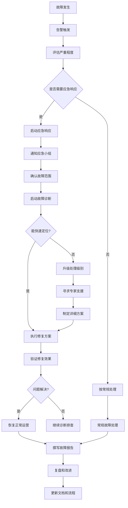
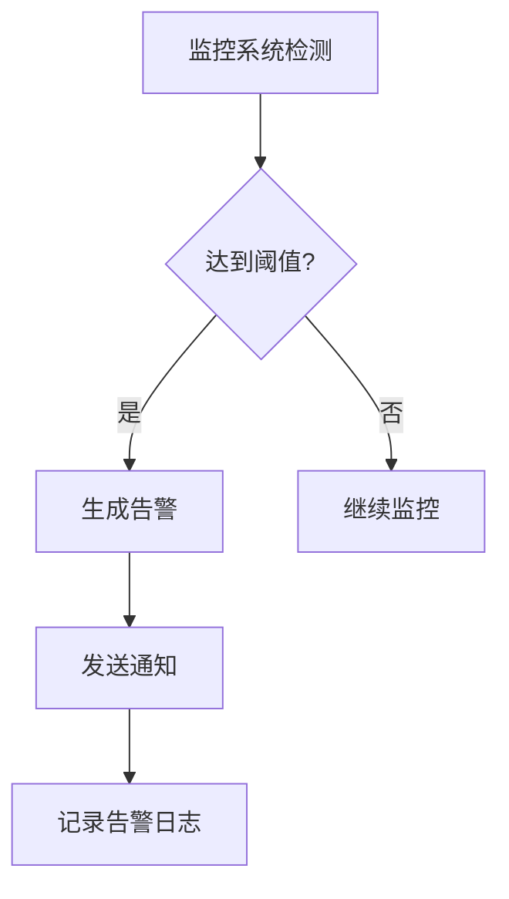
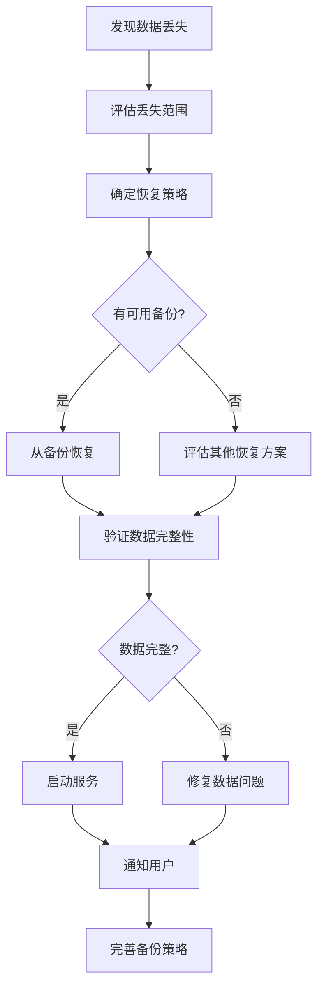

# [系统名称]故障处理指南

> **版本**：v1.0.0
> **更新日期**：2025-11-16
> **适用范围**：[系统名称]故障诊断和处理
> **关键词**：故障, 诊断, 恢复, 应急处理

---

## 📋 目录

- [故障处理概述](#故障处理概述)
- [故障分级标准](#故障分级标准)
- [故障诊断流程](#故障诊断流程)
- [常见故障处理](#常见故障处理)
- [紧急故障处理](#紧急故障处理)
- [系统恢复流程](#系统恢复流程)
- [故障报告模板](#故障报告模板)
- [经验教训总结](#经验教训总结)

---

## 故障处理概述

### 1.1 故障处理目标

[系统名称]故障处理体系的目标：

- **快速响应**: 在规定时间内响应和处理故障
- **准确诊断**: 快速定位故障根因，减少影响范围
- **有效恢复**: 采用最佳方案恢复系统正常运行
- **持续改进**: 通过故障分析改进系统稳定性和可靠性
- **知识积累**: 建立故障处理知识库，避免重复问题

### 1.2 故障处理原则

#### 基本原则

1. **安全第一**: 故障处理过程中确保数据安全和系统稳定
2. **分级响应**: 根据故障级别采用相应的处理流程和资源
3. **记录完整**: 详细记录故障现象、处理过程和解决方案
4. **及时沟通**: 主动向相关方通报故障状态和处理进展
5. **复盘改进**: 故障解决后进行复盘，提出改进措施

#### 处理原则

- **不要慌张**: 保持冷静，按流程处理
- **先评估影响**: 了解故障影响范围和严重程度
- **再定位问题**: 收集信息，分析根因
- **后制定方案**: 评估风险，选择最佳恢复方案
- **最后验证**: 确认修复效果，监控系统稳定

### 1.3 故障处理流程图



---

## 故障分级标准

### 2.1 故障分级定义

#### 故障级别定义

| 级别 | 名称 | 描述 | 影响范围 | 响应时间 | 解决时间 |
|------|------|------|----------|----------|----------|
| **L1** | 轻微故障 | 局部功能异常，不影响核心业务 | 单用户/单功能 | 4小时 | 24小时 |
| **L2** | 一般故障 | 部分功能异常，影响部分用户 | 多用户/多功能 | 2小时 | 12小时 |
| **L3** | 严重故障 | 核心功能异常，影响大部分用户 | 大部分用户 | 30分钟 | 4小时 |
| **L4** | 灾难故障 | 系统完全不可用或数据丢失 | 全部用户 | 15分钟 | 2小时 |

#### 故障影响评估

##### 用户影响
- **影响用户数**: 10人以下(L1), 10-100人(L2), 100-1000人(L3), 1000人以上(L4)
- **影响时长**: <1小时(L1), 1-4小时(L2), 4-12小时(L3), >12小时(L4)

##### 业务影响
- **收入损失**: <1000元(L1), 1000-10000元(L2), 10000-100000元(L3), >100000元(L4)
- **声誉影响**: 可控(L1/L2), 一般(L3), 严重(L4)

##### 系统影响
- **数据丢失**: 无(L1/L2), 可恢复(L3), 不可恢复(L4)
- **安全风险**: 无(L1/L2), 一般(L3), 严重(L4)

### 2.2 故障上报流程

#### 自动上报



#### 手动上报

1. **发现故障**: 开发/测试/运维人员发现系统异常
2. **初步评估**: 判断故障级别和影响范围
3. **填写报告**: 使用故障报告模板记录详细信息
4. **选择渠道**: 根据级别选择上报渠道
5. **跟踪处理**: 关注处理进度，及时更新状态

#### 上报渠道

| 故障级别 | 上报渠道 | 负责人 | 响应时间 |
|----------|----------|--------|----------|
| L1 | IM群/邮件 | 运维工程师 | 4小时内 |
| L2 | IM群+电话 | 运维主管 | 2小时内 |
| L3 | 电话+IM群 | 技术总监 | 30分钟内 |
| L4 | 电话+短信+邮件 | CTO/CEO | 15分钟内 |

### 2.3 应急响应团队

#### 核心应急小组

| 角色 | 职责 | 联系方式 | 备份人员 |
|------|------|----------|----------|
| **应急协调员** | 总体协调，决策 | [电话][邮箱] | [备份人员] |
| **技术负责人** | 技术方案，核心修复 | [电话][邮箱] | [备份人员] |
| **运维负责人** | 系统恢复，监控 | [电话][邮箱] | [备份人员] |
| **业务负责人** | 业务影响评估 | [电话][邮箱] | [备份人员] |
| **沟通负责人** | 内外沟通 | [电话][邮箱] | [备份人员] |

#### 技术支援小组

- **数据库专家**: 数据恢复，性能优化
- **网络专家**: 网络故障诊断
- **安全专家**: 安全事件处理
- **第三方供应商**: 外部服务支持

---

## 故障诊断流程

### 3.1 诊断准备

#### 信息收集清单

**基本信息**:
- [ ] 故障发生时间
- [ ] 故障发现方式 (用户报告/监控告警/主动发现)
- [ ] 故障现象描述
- [ ] 影响范围评估

**环境信息**:
- [ ] 系统版本和配置
- [ ] 服务器状态 (CPU/内存/磁盘/网络)
- [ ] 数据库状态
- [ ] 缓存服务状态
- [ ] 第三方服务状态

**日志信息**:
- [ ] 应用日志 (错误/异常信息)
- [ ] 系统日志 (/var/log/messages)
- [ ] 数据库日志
- [ ] 网络设备日志

#### 诊断工具准备

```bash
# 系统诊断工具
which top htop iotop iostat vmstat netstat ss

# 网络诊断工具
which ping traceroute nslookup dig curl wget

# 数据库诊断工具
which psql pg_isready pg_stat_statements

# Java诊断工具
which jps jstat jmap jstack jcmd

# 容器诊断工具
which docker docker-compose kubectl
```

### 3.2 系统层诊断

#### 服务器状态检查

```bash
#!/bin/bash
# system_health_check.sh

echo "=== 系统健康检查 ==="
echo "检查时间: $(date)"

# CPU检查
echo -e "\n1. CPU状态:"
top -bn1 | head -5
echo "CPU负载: $(uptime | awk -F'load average:' '{ print $2 }')"

# 内存检查
echo -e "\n2. 内存状态:"
free -h
echo "内存使用率: $(free | awk 'NR==2{printf "%.2f%", $3*100/$2 }')"

# 磁盘检查
echo -e "\n3. 磁盘状态:"
df -h
echo "磁盘使用率:"
df | awk 'NR>1 {print $1 ": " $5}'

# 网络检查
echo -e "\n4. 网络状态:"
ss -tuln | head -10
echo "网络连接数: $(ss -tuln | wc -l)"

# 进程检查
echo -e "\n5. 关键进程状态:"
ps aux | head -5
echo "Java进程: $(pgrep java | wc -l)"
echo "PostgreSQL进程: $(pgrep postgres | wc -l)"
echo "Redis进程: $(pgrep redis | wc -l)"
```

#### 网络连通性检查

```bash
#!/bin/bash
# network_connectivity_check.sh

echo "=== 网络连通性检查 ==="

# 本地网络检查
echo "1. 本地网络接口:"
ip addr show

# DNS解析检查
echo -e "\n2. DNS解析:"
nslookup localhost
nslookup $(hostname)

# 端口连通性检查
echo -e "\n3. 服务端口检查:"
# PostgreSQL
if nc -z localhost 5432 2>/dev/null; then
    echo "✅ PostgreSQL端口(5432)可访问"
else
    echo "❌ PostgreSQL端口(5432)不可访问"
fi

# Redis
if nc -z localhost 6379 2>/dev/null; then
    echo "✅ Redis端口(6379)可访问"
else
    echo "❌ Redis端口(6379)不可访问"
fi

# 应用服务
if nc -z localhost 8080 2>/dev/null; then
    echo "✅ 应用服务端口(8080)可访问"
else
    echo "❌ 应用服务端口(8080)不可访问"
fi

# 外部连通性检查
echo -e "\n4. 外部连通性:"
ping -c 3 8.8.8.8 >/dev/null 2>&1 && echo "✅ 互联网连通" || echo "❌ 互联网不可访问"
```

### 3.3 应用层诊断

#### 应用状态检查

```bash
#!/bin/bash
# application_health_check.sh

echo "=== 应用健康检查 ==="

# Spring Boot Actuator检查
echo "1. 应用健康端点:"
HEALTH_URL="http://localhost:8080/[context-path]/health"
if curl -f -s "$HEALTH_URL" > /dev/null; then
    echo "✅ 应用健康检查通过"
    curl -s "$HEALTH_URL" | jq '.status' 2>/dev/null || echo "健康状态响应正常"
else
    echo "❌ 应用健康检查失败"
fi

# 数据库连接检查
echo -e "\n2. 数据库连接:"
DB_CHECK_URL="http://localhost:8080/[context-path]/db-check"
if curl -f -s "$DB_CHECK_URL" > /dev/null; then
    echo "✅ 数据库连接正常"
else
    echo "❌ 数据库连接异常"
fi

# 缓存连接检查
echo -e "\n3. 缓存服务连接:"
REDIS_CHECK_URL="http://localhost:8080/[context-path]/redis-check"
if curl -f -s "$REDIS_CHECK_URL" > /dev/null; then
    echo "✅ 缓存服务连接正常"
else
    echo "❌ 缓存服务连接异常"
fi
```

#### 日志分析

```bash
#!/bin/bash
# log_analysis.sh

echo "=== 日志分析 ==="

LOG_FILE="/var/log/[system-name]/app.log"
ERROR_LOG="/tmp/error_analysis_$(date +%Y%m%d_%H%M%S).txt"

# 统计错误类型
echo "1. 错误统计 (最近1小时):"
echo "总错误数: $(grep -c "ERROR" $LOG_FILE)"
echo "异常数: $(grep -c "Exception" $LOG_FILE)"
echo "超时错误: $(grep -c "timeout" $LOG_FILE)"

# 最近错误信息
echo -e "\n2. 最近10个错误:"
grep "ERROR" $LOG_FILE | tail -10 > $ERROR_LOG

# 高频错误模式
echo -e "\n3. 高频错误模式:"
grep "ERROR" $LOG_FILE | \
    sed 's/.*ERROR//' | \
    sort | \
    uniq -c | \
    sort -nr | \
    head -10

# 性能问题分析
echo -e "\n4. 慢查询统计:"
grep "Slow query" $LOG_FILE | wc -l

# 内存相关错误
echo -e "\n5. 内存相关错误:"
grep -i "memory\|heap\|gc" $LOG_FILE | tail -5

echo -e "\n详细错误日志已保存到: $ERROR_LOG"
```

### 3.4 数据库层诊断

#### 数据库状态检查

```sql
-- database_health_check.sql

-- 1. 数据库基本信息
SELECT version();

-- 2. 连接统计
SELECT count(*) as active_connections FROM pg_stat_activity;

-- 3. 数据库大小
SELECT pg_size_pretty(pg_database_size(current_database()));

-- 4. 表大小统计
SELECT schemaname, tablename,
       pg_size_pretty(pg_total_relation_size(schemaname||'.'||tablename)) as size
FROM pg_tables
WHERE schemaname = 'public'
ORDER BY pg_total_relation_size(schemaname||'.'||tablename) DESC
LIMIT 10;

-- 5. 锁状态
SELECT locktype, mode, granted, count(*) as count
FROM pg_locks
GROUP BY locktype, mode, granted
ORDER BY count DESC;

-- 6. 慢查询统计 (需要pg_stat_statements扩展)
SELECT query, calls, total_time/calls as avg_time,
       pg_size_pretty((blk_read_time + blk_write_time)/calls * 1000) as avg_io_time
FROM pg_stat_statements
ORDER BY total_time DESC
LIMIT 10;
```

#### 数据库性能分析

```bash
# 数据库性能诊断脚本
#!/bin/bash

echo "=== 数据库性能分析 ==="

# 连接数监控
echo "1. 数据库连接数:"
psql -U [db_user] -d [database] -c "SELECT count(*) FROM pg_stat_activity;"

# 缓存命中率
echo -e "\n2. 缓存命中率:"
psql -U [db_user] -d [database] -c "
SELECT
  sum(blks_hit) * 100 / (sum(blks_hit) + sum(blks_read)) as cache_hit_ratio
FROM pg_stat_database;"

# 活跃查询
echo -e "\n3. 长时间运行的查询:"
psql -U [db_user] -d [database] -c "
SELECT pid, now() - pg_stat_activity.query_start as duration, query
FROM pg_stat_activity
WHERE state = 'active' AND now() - pg_stat_activity.query_start > interval '30 seconds'
ORDER BY duration DESC;"

# 等待锁的查询
echo -e "\n4. 等待锁的查询:"
psql -U [db_user] -d [database] -c "
SELECT w.query as waiting_query, l.query as locking_query,
       w.pid as waiting_pid, l.pid as locking_pid
FROM pg_stat_activity w
JOIN pg_stat_activity l ON l.pid = ANY(pg_blocking_pids(w.pid))
WHERE w.waiting = true;"
```

---

## 常见故障处理

### 4.1 应用层故障

#### 4.1.1 服务启动失败

**现象**: 应用无法启动，日志显示端口占用或配置错误

**处理步骤**:
1. 检查端口占用: `netstat -tlnp | grep [port]`
2. 杀死占用进程: `kill -9 [pid]`
3. 检查配置文件语法
4. 检查依赖服务状态
5. 查看详细启动日志

**预防措施**:
- 定期检查配置文件语法
- 使用配置验证工具
- 建立启动前检查脚本

#### 4.1.2 内存溢出

**现象**: 应用频繁重启，日志显示OutOfMemoryError

**处理步骤**:
1. 检查当前内存使用: `free -h`
2. 分析JVM堆使用: `jstat -gc [pid]`
3. 生成堆转储: `jmap -dump:live,file=heap.hprof [pid]`
4. 分析堆转储文件 (使用MAT工具)
5. 调整JVM参数或修复内存泄漏

**预防措施**:
- 设置合理的JVM参数
- 定期进行内存泄漏检查
- 监控内存使用趋势

#### 4.1.3 接口响应超时

**现象**: API请求响应慢或超时

**处理步骤**:
1. 检查网络连通性
2. 分析接口性能日志
3. 检查数据库查询性能
4. 检查缓存服务状态
5. 分析线程池使用情况

**预防措施**:
- 设置合理的超时时间
- 优化慢查询
- 实施缓存策略

### 4.2 数据库层故障

#### 4.2.1 连接池耗尽

**现象**: 数据库连接数达到上限，新请求失败

**处理步骤**:
1. 检查连接池配置
2. 分析连接泄漏
3. 增加连接池大小
4. 重启应用释放连接

**预防措施**:
- 合理配置连接池参数
- 实施连接泄漏检测
- 监控连接池使用率

#### 4.2.2 数据库死锁

**现象**: 事务长时间等待，系统响应慢

**处理步骤**:
1. 查看锁状态: `SELECT * FROM pg_locks;`
2. 分析死锁查询
3. 终止阻塞进程
4. 优化查询和索引

**预防措施**:
- 优化事务设计
- 合理使用锁级别
- 实施死锁检测和处理

#### 4.2.3 数据文件损坏

**现象**: 数据库无法启动，数据文件损坏

**处理步骤**:
1. 检查数据库日志
2. 使用pg_resetwal重置WAL
3. 从备份恢复数据
4. 验证数据完整性

**预防措施**:
- 实施定期备份策略
- 监控磁盘健康状态
- 使用RAID或分布式存储

### 4.3 系统层故障

#### 4.3.1 高CPU使用率

**现象**: 系统响应慢，CPU使用率持续高于80%

**处理步骤**:
1. 识别高CPU进程: `top -p [pid]`
2. 分析线程状态: `jstack [pid]`
3. 优化代码或配置
4. 考虑水平扩展

**预防措施**:
- 实施性能监控
- 定期进行性能测试
- 优化系统配置

#### 4.3.2 磁盘空间不足

**现象**: 系统警告磁盘空间不足

**处理步骤**:
1. 检查磁盘使用情况: `df -h`
2. 识别大文件: `find / -type f -size +100M`
3. 清理临时文件和日志
4. 扩展磁盘空间

**预防措施**:
- 实施磁盘监控告警
- 定期清理过期文件
- 规划存储容量

#### 4.3.3 网络故障

**现象**: 服务间通信失败

**处理步骤**:
1. 检查网络配置: `ip addr show`
2. 测试连通性: `ping [target]`
3. 检查防火墙规则
4. 分析网络流量

**预防措施**:
- 实施网络监控
- 配置冗余网络
- 定期检查网络设备

---

## 紧急故障处理

### 5.1 L4级别故障处理

#### 灾难恢复预案

**触发条件**:
- 系统完全不可用
- 数据中心故障
- 大规模数据丢失

**处理流程**:
1. **立即响应** (0-15分钟)
   - 激活应急小组
   - 通知所有相关方
   - 启动备用系统

2. **评估损失** (15-30分钟)
   - 确认故障范围
   - 评估数据丢失情况
   - 确定恢复优先级

3. **执行恢复** (30分钟-2小时)
   - 激活灾难恢复站点
   - 恢复关键数据
   - 逐步恢复服务

4. **验证恢复** (2-4小时)
   - 验证系统功能
   - 确认数据完整性
   - 逐步恢复用户访问

#### 通信模板

```markdown
# 🚨 紧急故障通知

**故障级别**: L4 (灾难级别)
**发生时间**: [时间]
**影响范围**: [影响范围描述]
**当前状态**: [处理状态]

## 影响评估
- 用户影响: [影响用户数]
- 业务影响: [业务影响描述]
- 预计恢复时间: [预计时间]

## 处理进度
- [ ] 应急小组已激活
- [ ] 备用系统已启动
- [ ] 数据恢复进行中
- [ ] 服务逐步恢复

## 联系方式
- 应急协调: [电话]
- 技术支持: [电话]
- 用户咨询: [电话]

---
[系统名称]应急指挥中心
[时间]
```

### 5.2 数据丢失处理

#### 数据恢复优先级

1. **P0 - 关键数据** (立即恢复)
   - 用户账户信息
   - 订单数据
   - 支付记录

2. **P1 - 重要数据** (4小时内恢复)
   - 用户行为数据
   - 业务配置信息
   - 历史统计数据

3. **P2 - 一般数据** (24小时内恢复)
   - 日志数据
   - 缓存数据
   - 临时文件

#### 恢复流程



---

## 系统恢复流程

### 6.1 恢复准备

#### 恢复清单

**环境准备**:
- [ ] 备份环境可用
- [ ] 网络连通性正常
- [ ] 依赖服务就绪
- [ ] 配置文件正确

**数据准备**:
- [ ] 备份文件完整
- [ ] 备份文件可访问
- [ ] 验证备份有效性
- [ ] 准备回滚方案

**人员准备**:
- [ ] 恢复团队到位
- [ ] 沟通渠道畅通
- [ ] 权限已授权
- [ ] 工具准备就绪

### 6.2 恢复执行

#### 应用恢复

```bash
#!/bin/bash
# application_recovery.sh

echo "=== 开始应用恢复 ==="

# 1. 停止受影响的服务
echo "停止当前服务..."
sudo systemctl stop [system-name]

# 2. 备份当前状态
echo "备份当前状态..."
BACKUP_DIR="/tmp/recovery_backup_$(date +%Y%m%d_%H%M%S)"
mkdir -p $BACKUP_DIR
cp -r /opt/[system-name]/* $BACKUP_DIR/

# 3. 恢复应用文件
echo "恢复应用文件..."
cp /path/to/backup/app.jar /opt/[system-name]/

# 4. 恢复配置文件
echo "恢复配置文件..."
cp /path/to/backup/application.yml /etc/[system-name]/

# 5. 启动服务
echo "启动服务..."
sudo systemctl start [system-name]

# 6. 验证恢复
echo "验证恢复..."
for i in {1..30}; do
    if curl -f http://localhost:8080/[context-path]/health > /dev/null; then
        echo "✅ 应用恢复成功"
        exit 0
    fi
    echo "等待服务启动... ($i/30)"
    sleep 10
done

echo "❌ 应用恢复失败"
exit 1
```

#### 数据库恢复

```bash
#!/bin/bash
# database_recovery.sh

echo "=== 开始数据库恢复 ==="

# 1. 停止应用
echo "停止应用服务..."
sudo systemctl stop [system-name]

# 2. 备份当前数据库
echo "备份当前数据库..."
pg_dump -U [db_user] -d [database] > emergency_backup_$(date +%Y%m%d_%H%M%S).sql

# 3. 恢复数据库
echo "恢复数据库..."
psql -U [db_user] -d [database] < /path/to/backup/database.sql

# 4. 验证数据完整性
echo "验证数据完整性..."
TABLE_COUNT=$(psql -U [db_user] -d [database] -t -c "SELECT count(*) FROM information_schema.tables WHERE table_schema = 'public';")
echo "表数量: $TABLE_COUNT"

RECORD_COUNT=$(psql -U [db_user] -d [database] -t -c "SELECT sum(n_tup_ins) FROM pg_stat_user_tables;")
echo "记录数量: $RECORD_COUNT"

# 5. 启动应用
echo "启动应用..."
sudo systemctl start [system-name]

echo "数据库恢复完成"
```

### 6.3 恢复验证

#### 功能验证

```bash
#!/bin/bash
# recovery_validation.sh

echo "=== 恢复验证检查 ==="

ERRORS=0

# 1. 应用健康检查
echo "1. 应用健康检查..."
if ! curl -f -s http://localhost:8080/[context-path]/health > /dev/null; then
    echo "❌ 应用健康检查失败"
    ((ERRORS++))
else
    echo "✅ 应用健康检查通过"
fi

# 2. 数据库连接检查
echo "2. 数据库连接检查..."
if ! psql -U [db_user] -d [database] -c "SELECT 1;" > /dev/null; then
    echo "❌ 数据库连接检查失败"
    ((ERRORS++))
else
    echo "✅ 数据库连接检查通过"
fi

# 3. 核心功能检查
echo "3. 核心功能检查..."

# 用户登录
if ! curl -f -s -X POST http://localhost:8080/[context-path]/user/login \
    -H "Content-Type: application/json" \
    -d '{"username":"test","password":"test"}' > /dev/null; then
    echo "❌ 用户登录功能异常"
    ((ERRORS++))
else
    echo "✅ 用户登录功能正常"
fi

# 数据查询
if ! curl -f -s http://localhost:8080/[context-path]/api/courses > /dev/null; then
    echo "❌ 数据查询功能异常"
    ((ERRORS++))
else
    echo "✅ 数据查询功能正常"
fi

# 4. 性能检查
echo "4. 性能检查..."
RESPONSE_TIME=$(curl -o /dev/null -s -w "%{time_total}" http://localhost:8080/[context-path]/health)
if (( $(echo "$RESPONSE_TIME > 1.0" | bc -l) )); then
    echo "⚠️ 响应时间较慢: ${RESPONSE_TIME}s"
else
    echo "✅ 响应时间正常: ${RESPONSE_TIME}s"
fi

# 汇总结果
echo -e "\n=== 验证结果 ==="
if [ $ERRORS -eq 0 ]; then
    echo "🎉 所有验证通过，系统恢复成功！"
    exit 0
else
    echo "⚠️ 发现 $ERRORS 个问题，需要进一步检查"
    exit 1
fi
```

---

## 故障报告模板

### 7.1 故障报告模板

```markdown
# 故障报告

## 基本信息
- **故障ID**: INC-2025-001
- **报告人**: [姓名]
- **报告时间**: 2025-11-16 14:30:00
- **故障级别**: L2 (一般故障)

## 故障描述
### 现象
[详细描述故障现象，包括用户反馈、监控告警、系统日志等]

### 影响范围
- **影响用户数**: [数量]
- **影响功能**: [功能列表]
- **业务影响**: [业务影响描述]
- **经济损失**: [估算损失]

### 环境信息
- **系统版本**: [版本号]
- **部署环境**: [环境名称]
- **服务器配置**: [配置信息]
- **时间窗口**: [发生时间段]

## 诊断过程
### 初步分析
[故障发现时的初步判断和分析]

### 详细排查
1. [排查步骤1]
   - 结果: [排查结果]
   - 结论: [分析结论]

2. [排查步骤2]
   - 结果: [排查结果]
   - 结论: [分析结论]

### 根因分析
**根本原因**: [故障根本原因]

**诱发因素**: [导致故障发生的诱发条件]

**影响链条**: [故障影响的传播路径]

## 处理过程
### 紧急措施
[故障发生时的紧急处理措施]

### 修复方案
1. **方案评估**
   - 方案1: [描述] - 风险: [风险评估] - 时长: [预计时长]
   - 方案2: [描述] - 风险: [风险评估] - 时长: [预计时长]

2. **执行方案**
   选择方案: [选择的方案]
   执行时间: [开始-结束时间]
   执行人员: [参与人员]

3. **验证结果**
   - [ ] 功能验证通过
   - [ ] 性能验证通过
   - [ ] 用户反馈正常

## 恢复情况
### 服务恢复
- **恢复时间**: [实际恢复时间]
- **恢复范围**: [恢复的功能范围]
- **验证方法**: [验证过程]

### 数据恢复
- **数据完整性**: [是否完整]
- **数据一致性**: [是否一致]
- **备份有效性**: [备份是否有效]

## 影响评估
### 用户影响
- **受影响用户**: [数量和类型]
- **用户体验**: [影响程度]
- **投诉处理**: [投诉数量和处理情况]

### 业务影响
- **业务指标**: [影响的KPI]
- **收入影响**: [经济损失评估]
- **声誉影响**: [品牌影响评估]

### 系统影响
- **性能影响**: [系统性能变化]
- **稳定性影响**: [系统稳定性评估]
- **扩展性影响**: [对未来扩展的影响]

## 预防措施
### 短期措施
1. [立即采取的预防措施1]
2. [立即采取的预防措施2]

### 长期措施
1. [长期改进措施1]
   - 负责人: [姓名]
   - 完成时间: [时间]
   - 验收标准: [标准]

2. [长期改进措施2]
   - 负责人: [姓名]
   - 完成时间: [时间]
   - 验收标准: [标准]

## 经验教训
### 问题点
1. [发现的问题1]
   - 原因: [原因分析]
   - 改进: [改进措施]

2. [发现的问题2]
   - 原因: [原因分析]
   - 改进: [改进措施]

### 最佳实践
1. [总结的最佳实践1]
2. [总结的最佳实践2]

### 流程改进
1. [需要改进的流程1]
2. [需要改进的流程2]

## 附件
- [日志文件](logs/error.log)
- [监控截图](screenshots/monitoring.png)
- [修复脚本](scripts/fix.sh)
- [相关文档](docs/troubleshooting.md)

## 审批
- **报告审核**: [审核人] [日期]
- **技术确认**: [技术负责人] [日期]
- **业务确认**: [业务负责人] [日期]

---
*报告生成时间: [自动生成时间]*
```

---

## 经验教训总结

### 8.1 常见问题模式

#### 1. 配置相关问题
**典型问题**: 配置错误导致服务启动失败
**发生频率**: 高
**预防措施**:
- 实施配置审查流程
- 使用配置模板
- 自动化配置验证

#### 2. 依赖服务故障
**典型问题**: 数据库或缓存服务异常
**发生频率**: 中
**预防措施**:
- 实施服务依赖监控
- 配置服务降级策略
- 准备备用服务

#### 3. 代码质量问题
**典型问题**: 代码缺陷导致运行时错误
**发生频率**: 中
**预防措施**:
- 加强代码审查
- 完善单元测试
- 实施自动化测试

#### 4. 容量和性能问题
**典型问题**: 高并发导致系统过载
**发生频率**: 低
**预防措施**:
- 实施容量规划
- 配置自动扩缩容
- 定期性能测试

### 8.2 改进建议

#### 技术改进
1. **监控体系完善**
   - 增加更多业务指标监控
   - 实施分布式追踪
   - 完善日志聚合

2. **自动化能力提升**
   - 实施基础设施即代码
   - 完善CI/CD流程
   - 自动化故障恢复

3. **架构优化**
   - 实施服务治理
   - 完善熔断降级
   - 优化数据库设计

#### 流程改进
1. **响应流程优化**
   - 缩短故障响应时间
   - 完善应急预案
   - 加强团队培训

2. **沟通机制改进**
   - 建立状态页面
   - 完善通知机制
   - 加强内外沟通

3. **知识管理**
   - 建立故障知识库
   - 完善文档体系
   - 加强经验分享

---

## 更新记录

| 日期 | 版本 | 更新内容 | 更新人 |
|------|------|----------|--------|
| 2025-11-16 | v1.0.0 | 初始版本 | [作者] |

---

> 💡 **提示**: 故障处理是一个持续改进的过程。每次故障都是学习和成长的机会，通过总结经验教训，不断提升系统的稳定性和可靠性。
