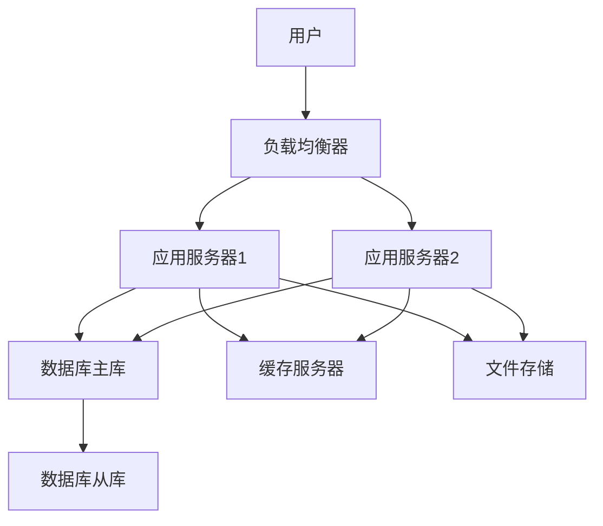
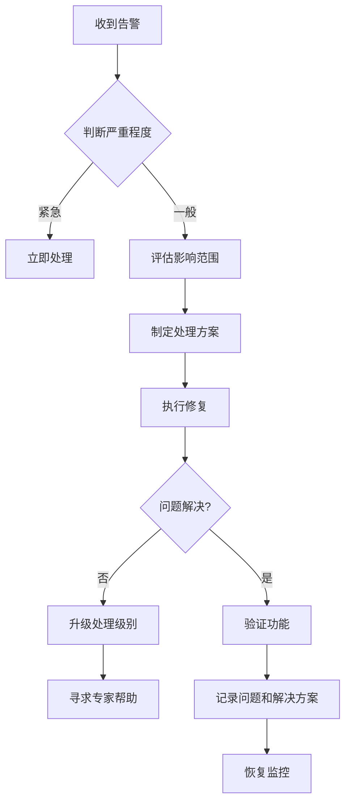
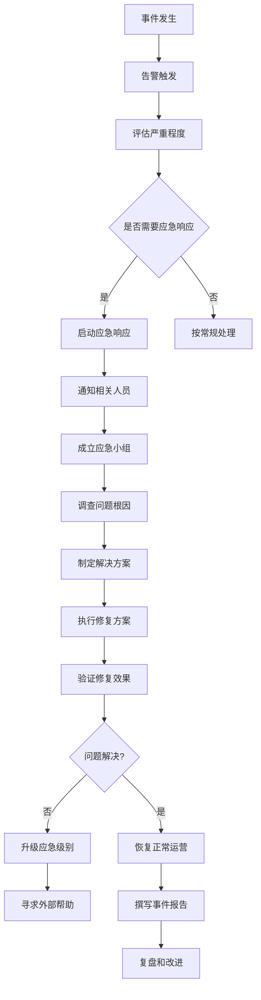

# [系统名称]运维手册

> **版本**：v1.0.0
> **更新日期**：2025-11-16
> **适用范围**：[系统名称]生产环境运维
> **关键词**：运维, 监控, 维护, 故障处理

---

## 📋 目录

- [系统概述](#系统概述)
- [日常运维](#日常运维)
- [监控告警](#监控告警)
- [备份恢复](#备份恢复)
- [故障处理](#故障处理)
- [性能优化](#性能优化)
- [安全运维](#安全运维)
- [应急预案](#应急预案)
- [联系方式](#联系方式)

---

## 系统概述

### 1.1 系统介绍

[系统名称]是一个[系统类型]，主要功能包括：

- 功能点1
- 功能点2
- 功能点3

### 1.2 技术架构

#### 架构图



#### 技术栈

| 组件 | 技术选型 | 版本 | 说明 |
|------|----------|------|------|
| 后端 | Java Spring Boot | 3.2.x | RESTful API服务 |
| 前端 | Vue.js | 3.x | 用户界面 |
| 数据库 | PostgreSQL | 16.x | 主数据库 |
| 缓存 | Redis | 7.x | 缓存服务 |
| 消息队列 | RabbitMQ | 3.x | 异步处理 |

### 1.3 部署环境

#### 生产环境

- **服务器数量**：[数量]台
- **配置**：[CPU/内存/磁盘]
- **操作系统**：[OS版本]
- **网络**：[网络配置]

#### 测试环境

- **服务器数量**：[数量]台
- **配置**：[CPU/内存/磁盘]
- **用途**：功能测试、性能测试

#### 开发环境

- **服务器数量**：[数量]台
- **配置**：[CPU/内存/磁盘]
- **用途**：开发调试

---

## 日常运维

### 2.1 服务管理

#### 启动服务

```bash
# 启动应用服务
sudo systemctl start [service-name]

# 启动数据库
sudo systemctl start postgresql

# 启动缓存服务
sudo systemctl start redis
```

#### 停止服务

```bash
# 停止应用服务
sudo systemctl stop [service-name]

# 停止所有服务
sudo systemctl stop [service-name] postgresql redis
```

#### 重启服务

```bash
# 重启应用服务
sudo systemctl restart [service-name]

# 重启所有服务
sudo systemctl restart [service-name] postgresql redis
```

#### 查看服务状态

```bash
# 查看所有服务状态
sudo systemctl status

# 查看特定服务状态
sudo systemctl status [service-name]

# 查看服务日志
sudo journalctl -u [service-name] -f
```

### 2.2 日志管理

#### 日志文件位置

| 服务 | 日志路径 | 轮转策略 |
|------|----------|----------|
| 应用服务 | `/var/log/[system-name]/` | 按大小轮转，保留7天 |
| 数据库 | `/var/log/postgresql/` | 按大小轮转，保留30天 |
| 缓存 | `/var/log/redis/` | 按大小轮转，保留7天 |

#### 日志分析

```bash
# 查看错误日志
grep "ERROR" /var/log/[system-name]/app.log

# 统计HTTP状态码
grep "HTTP/" /var/log/[system-name]/access.log | awk '{print $9}' | sort | uniq -c

# 分析慢查询
grep "Slow query" /var/log/[system-name]/app.log
```

#### 日志轮转配置

```bash
# logrotate配置示例
/var/log/[system-name]/*.log {
    daily
    rotate 7
    compress
    delaycompress
    missingok
    notifempty
    create 644 [user] [group]
}
```

### 2.3 数据管理

#### 数据备份

```bash
# 数据库备份
pg_dump -U [username] -h [host] [database] > backup_$(date +%Y%m%d_%H%M%S).sql

# 文件备份
tar -czf backup_files_$(date +%Y%m%d).tar.gz /path/to/files/

# 配置备份
cp -r /etc/[system-name]/ config_backup_$(date +%Y%m%d)/
```

#### 数据清理

```bash
# 清理临时文件
find /tmp -name "[system-name]*" -type f -mtime +7 -delete

# 清理过期日志
find /var/log/[system-name]/ -name "*.log.*" -mtime +30 -delete

# 清理缓存
redis-cli FLUSHALL
```

---

## 监控告警

### 3.1 监控指标

#### 系统指标

- **CPU使用率**：阈值 80%
- **内存使用率**：阈值 85%
- **磁盘使用率**：阈值 90%
- **网络流量**：监控出入流量

#### 应用指标

- **响应时间**：平均 < 500ms
- **错误率**：< 1%
- **并发用户数**：监控趋势
- **数据库连接数**：阈值 80%

#### 业务指标

- **订单量**：每日统计
- **用户活跃度**：DAU/MAU
- **转化率**：关键路径监控

### 3.2 告警配置

#### 告警级别

| 级别 | 描述 | 处理时效 | 通知方式 |
|------|------|----------|----------|
| 紧急 | 系统不可用 | 15分钟内 | 电话 + 短信 + 邮件 |
| 严重 | 核心功能受影响 | 1小时内 | 短信 + 邮件 + IM |
| 一般 | 非核心功能异常 | 4小时内 | 邮件 + IM |
| 提醒 | 潜在问题 | 工作时间内 | 邮件 |

#### 告警规则

```yaml
# Prometheus告警规则示例
groups:
  - name: [system-name].rules
    rules:
      - alert: HighCPUUsage
        expr: cpu_usage > 80
        for: 5m
        labels:
          severity: warning
        annotations:
          summary: "CPU使用率过高"
          description: "CPU使用率已超过80%持续5分钟"

      - alert: ServiceDown
        expr: up == 0
        for: 1m
        labels:
          severity: critical
        annotations:
          summary: "服务不可用"
          description: "服务 {{ $labels.instance }} 已停止运行"
```

### 3.3 监控工具

#### 工具栈

- **Prometheus**：指标收集和存储
- **Grafana**：可视化仪表板
- **AlertManager**：告警管理
- **ELK Stack**：日志分析
- **Zabbix**：传统监控

#### 仪表板

访问地址：
- Grafana: http://[grafana-host]:3000
- Kibana: http://[kibana-host]:5601
- Prometheus: http://[prometheus-host]:9090

---

## 备份恢复

### 4.1 备份策略

#### 备份类型

| 类型 | 频率 | 保留时间 | 存储位置 |
|------|------|----------|----------|
| 全量备份 | 每周日02:00 | 3个月 | NAS存储 |
| 增量备份 | 每日02:00 | 7天 | 本地磁盘 |
| 日志备份 | 每小时 | 24小时 | 本地磁盘 |

#### 备份清单

- [ ] 数据库数据
- [ ] 配置文件
- [ ] 用户上传文件
- [ ] 应用代码
- [ ] SSL证书

### 4.2 恢复流程

#### 数据库恢复

```bash
# 停止应用服务
sudo systemctl stop [service-name]

# 恢复数据库
psql -U [username] -h [host] [database] < backup.sql

# 启动应用服务
sudo systemctl start [service-name]

# 验证恢复
curl http://localhost/health
```

#### 文件恢复

```bash
# 解压备份文件
tar -xzf backup_files.tar.gz -C /path/to/restore/

# 恢复权限
chown -R [user]:[group] /path/to/files/

# 验证文件完整性
find /path/to/files/ -type f -exec md5sum {} \; > checksums.txt
```

### 4.3 备份验证

#### 验证脚本

```bash
#!/bin/bash
# backup_verification.sh

echo "开始备份验证..."

# 数据库连接测试
if psql -U [username] -h [host] -d [database] -c "SELECT 1;" > /dev/null; then
    echo "✅ 数据库连接正常"
else
    echo "❌ 数据库连接失败"
    exit 1
fi

# 文件完整性检查
if [ -f "/path/to/backup/checksum" ]; then
    if md5sum -c /path/to/backup/checksum > /dev/null; then
        echo "✅ 文件完整性正常"
    else
        echo "❌ 文件完整性校验失败"
        exit 1
    fi
fi

# 配置验证
if [ -f "/etc/[system-name]/config.yaml" ]; then
    echo "✅ 配置文件存在"
else
    echo "❌ 配置文件缺失"
    exit 1
fi

echo "备份验证完成"
```

---

## 故障处理

### 5.1 常见故障

#### 服务启动失败

**现象**：
- 服务无法启动
- 日志显示端口占用

**处理步骤**：
1. 检查端口占用：`netstat -tlnp | grep [port]`
2. 杀死占用进程：`kill -9 [pid]`
3. 检查配置文件
4. 重启服务

#### 数据库连接超时

**现象**：
- 应用报数据库连接错误
- 数据库响应慢

**处理步骤**：
1. 检查数据库状态：`sudo systemctl status postgresql`
2. 检查连接数：`psql -c "SELECT count(*) FROM pg_stat_activity;"`
3. 检查网络连接：`telnet [db-host] [db-port]`
4. 重启数据库服务

#### 内存溢出

**现象**：
- 应用频繁重启
- 日志显示OutOfMemoryError

**处理步骤**：
1. 检查内存使用：`free -h`
2. 分析堆转储：`jmap -dump:live,format=b,file=heap.bin [pid]`
3. 调整JVM参数：`-Xmx2048m -Xms1024m`
4. 重启应用

### 5.2 故障排查流程



### 5.3 故障记录

#### 故障记录模板

```markdown
# 故障记录

## 基本信息
- **故障ID**: INC-2025-001
- **发生时间**: 2025-11-16 14:30:00
- **恢复时间**: 2025-11-16 15:15:00
- **影响范围**: 生产环境，用户登录功能
- **严重程度**: 严重

## 故障现象
[详细描述故障现象]

## 原因分析
[分析故障根本原因]

## 处理过程
1. [处理步骤1]
2. [处理步骤2]
3. [处理步骤3]

## 影响评估
- **用户影响**: [影响的用户数量和程度]
- **业务影响**: [对业务的影响]
- **经济损失**: [估算的经济损失]

## 预防措施
1. [后续改进措施]
2. [监控优化建议]
3. [流程改进建议]

## 经验教训
[总结经验教训]
```

---

## 性能优化

### 6.1 性能监控

#### 关键指标

- **响应时间**：API响应时间分布
- **吞吐量**：QPS/TPS
- **资源利用率**：CPU/内存/磁盘/网络
- **错误率**：各类错误统计

#### 性能基线

| 指标 | 当前值 | 目标值 | 阈值 |
|------|--------|--------|------|
| API响应时间 | 200ms | <100ms | >500ms |
| 并发用户数 | 1000 | 5000 | >8000 |
| CPU使用率 | 40% | <60% | >80% |
| 内存使用率 | 60% | <80% | >90% |

### 6.2 优化策略

#### 应用层优化

```yaml
# JVM优化配置
java:
  opts:
    - -Xmx4g
    - -Xms2g
    - -XX:+UseG1GC
    - -XX:MaxGCPauseMillis=200
    - -XX:+PrintGCDetails
```

#### 数据库优化

```sql
-- 创建索引
CREATE INDEX idx_user_email ON users(email);
CREATE INDEX idx_order_created ON orders(created_at);

-- 查询优化
EXPLAIN ANALYZE
SELECT * FROM orders
WHERE created_at >= '2025-01-01'
ORDER BY total DESC;
```

#### 缓存优化

```java
// 缓存配置
@Configuration
public class CacheConfig {

    @Bean
    public RedisCacheManager cacheManager(RedisConnectionFactory connectionFactory) {
        return RedisCacheManager.builder(connectionFactory)
            .cacheDefaults(RedisCacheConfiguration.defaultCacheConfig()
                .entryTtl(Duration.ofHours(1)))
            .build();
    }
}
```

### 6.3 容量规划

#### 容量评估

基于以下公式进行容量规划：

```
所需服务器数 = ceil(峰值并发 / 单机承载量)
峰值并发 = 日活用户 * 平均请求数 / 86400
单机承载量 = 总QPS * 响应时间 / CPU核数
```

#### 扩展策略

- **垂直扩展**：增加单机资源（CPU/内存）
- **水平扩展**：增加服务器数量
- **读写分离**：数据库主从架构
- **缓存集群**：Redis集群部署

---

## 安全运维

### 7.1 访问控制

#### 用户权限管理

```bash
# 创建运维用户
sudo useradd -m -s /bin/bash ops
sudo usermod -aG sudo ops

# 配置SSH密钥
ssh-keygen -t rsa -b 4096
ssh-copy-id ops@[server-ip]

# 禁用密码登录
sudo sed -i 's/#PasswordAuthentication yes/PasswordAuthentication no/' /etc/ssh/sshd_config
sudo systemctl restart sshd
```

#### 防火墙配置

```bash
# UFW配置
sudo ufw default deny incoming
sudo ufw default allow outgoing

# 开放必要端口
sudo ufw allow 22/tcp      # SSH
sudo ufw allow 80/tcp      # HTTP
sudo ufw allow 443/tcp     # HTTPS
sudo ufw allow 5432/tcp    # PostgreSQL (仅内网)

sudo ufw enable
```

### 7.2 数据安全

#### 加密配置

```yaml
# 数据库加密
spring:
  datasource:
    url: jdbc:postgresql://localhost:5432/[database]?ssl=true&sslmode=require
    username: ${DB_USER}
    password: ${DB_PASSWORD}

# 文件加密
encrypt:
  algorithm: AES256
  key: ${ENCRYPTION_KEY}
```

#### 备份加密

```bash
# 加密备份文件
openssl enc -aes-256-cbc -salt -in backup.sql -out backup.sql.enc -k $BACKUP_KEY

# 解密恢复
openssl enc -d -aes-256-cbc -in backup.sql.enc -out backup.sql -k $BACKUP_KEY
```

### 7.3 安全监控

#### 安全事件监控

- **异常登录尝试**
- **权限变更**
- **敏感文件访问**
- **网络攻击**

#### 日志审计

```bash
# 审计日志查询
ausearch -m USER_AUTH --start today
ausearch -m ACCOUNT_CHANGE --start yesterday

# 安全事件告警
- 多次登录失败
- 权限提升操作
- 敏感文件下载
```

---

## 应急预案

### 8.1 应急响应流程



### 8.2 应急资源

#### 联系人信息

| 角色 | 姓名 | 电话 | 邮箱 |
|------|------|------|------|
| 应急负责人 | [姓名] | [电话] | [邮箱] |
| 技术负责人 | [姓名] | [电话] | [邮箱] |
| 业务负责人 | [姓名] | [电话] | [邮箱] |
| 外部支持 | [供应商] | [电话] | [邮箱] |

#### 应急工具

- **远程访问工具**: TeamViewer, AnyDesk
- **日志分析工具**: ELK Stack, Splunk
- **性能监控工具**: Prometheus, Grafana
- **备份恢复工具**: 自研脚本, 商业工具

### 8.3 应急演练

#### 演练计划

- **频率**: 每季度一次
- **场景**: 服务宕机、数据丢失、网络攻击
- **参与人员**: 运维团队、开发团队、业务团队
- **评估指标**: 响应时间、恢复时间、影响范围

#### 演练记录

```markdown
# 应急演练记录

## 演练信息
- **演练日期**: 2025-11-16
- **演练场景**: 数据库主从切换
- **参与人员**: [列表]
- **演练时长**: 2小时

## 演练过程
1. [步骤1]
2. [步骤2]
3. [步骤3]

## 发现问题
1. [问题1]
2. [问题2]

## 改进措施
1. [措施1]
2. [措施2]

## 评估结果
- **响应时间**: 5分钟 (目标: <10分钟) ✅
- **恢复时间**: 15分钟 (目标: <30分钟) ✅
- **影响评估**: 准确 (目标: 准确) ✅
```

---

## 联系方式

### 9.1 内部联系人

| 角色 | 姓名 | 电话 | 邮箱 | 职责 |
|------|------|------|------|------|
| 运维负责人 | [姓名] | [电话] | [邮箱] | 总体运维协调 |
| 系统管理员 | [姓名] | [电话] | [邮箱] | 系统配置管理 |
| 数据库管理员 | [姓名] | [电话] | [邮箱] | 数据库运维 |
| 网络管理员 | [姓名] | [电话] | [邮箱] | 网络运维 |

### 9.2 外部支持

| 供应商 | 联系人 | 电话 | 邮箱 | 支持范围 |
|--------|--------|------|------|----------|
| 阿里云 | [姓名] | [电话] | [邮箱] | 云服务支持 |
| PostgreSQL | [姓名] | [电话] | [邮箱] | 数据库支持 |
| Redis | [姓名] | [电话] | [邮箱] | 缓存服务支持 |

### 9.3 紧急联系

**24小时紧急联系电话**: [电话号码]

**备用联系方式**:
- 短信: [短信号码]
- IM: [即时通讯账号]

---

## 更新记录

| 日期 | 版本 | 更新内容 | 更新人 |
|------|------|----------|--------|
| 2025-11-16 | v1.0.0 | 初始版本 | [作者] |

---

> 💡 **提示**: 本运维手册为动态文档，请根据实际情况及时更新。如有疑问，请联系运维负责人。
