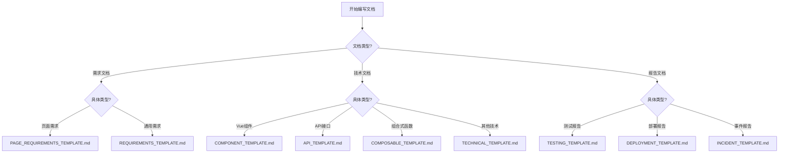

# 文档模板使用指南

> **版本**：v1.0.0
> **更新日期**：2025-11-17
> **适用范围**：所有文档贡献者
> **关键词**：模板, 文档规范, 使用指南

---

## 📋 目录

- [概述](#概述)
- [模板分类](#模板分类)
- [模板使用流程](#模板使用流程)
- [模板字段说明](#模板字段说明)
- [最佳实践](#最佳实践)
- [常见问题](#常见问题)

---

## 📖 概述

本文档介绍健身房综合管理系统项目的文档模板体系，包括各类模板的使用方法、字段说明和最佳实践。

### 模板体系架构

```
文档模板体系
├── requirements/          # 需求文档模板
│   ├── PAGE_REQUIREMENTS_TEMPLATE.md    # 页面需求模板
│   └── REQUIREMENTS_TEMPLATE.md         # 通用需求模板
├── technical/            # 技术文档模板
│   ├── COMPONENT_TEMPLATE.md           # Vue组件模板
│   ├── API_TEMPLATE.md                 # API接口模板
│   ├── COMPOSABLE_TEMPLATE.md          # 组合式函数模板
│   └── TECHNICAL_TEMPLATE.md           # 通用技术模板
├── reports/              # 报告文档模板
│   ├── TESTING_TEMPLATE.md             # 测试报告模板
│   ├── DEPLOYMENT_TEMPLATE.md          # 部署报告模板
│   └── INCIDENT_TEMPLATE.md            # 事件报告模板
└── README.md             # 本使用指南
```

---

## 🗂️ 模板分类

### 需求文档模板

#### PAGE_REQUIREMENTS_TEMPLATE.md
- **用途**：页面级功能需求描述
- **适用场景**：新增页面、页面改版、功能优化
- **包含内容**：
  - 页面逻辑结构
  - 视觉规范
  - 交互设计
  - 验收标准

#### REQUIREMENTS_TEMPLATE.md
- **用途**：通用功能需求描述
- **适用场景**：API需求、数据需求、系统功能需求
- **包含内容**：
  - 功能概述
  - 需求规格
  - 接口定义
  - 验收标准

### 技术文档模板

#### COMPONENT_TEMPLATE.md
- **用途**：Vue组件技术文档
- **适用场景**：组件开发完成、技术文档编写
- **包含内容**：
  - API接口（Props、Events、Slots）
  - 使用示例
  - 实现细节
  - 测试说明

#### API_TEMPLATE.md
- **用途**：后端API接口文档
- **适用场景**：API开发完成、接口文档编写
- **包含内容**：
  - 接口规范
  - 数据模型
  - 错误码
  - SDK工具

#### COMPOSABLE_TEMPLATE.md
- **用途**：Vue组合式函数文档
- **适用场景**：组合式函数开发完成
- **包含内容**：
  - 函数签名
  - 参数说明
  - 使用示例
  - 测试说明

#### TECHNICAL_TEMPLATE.md
- **用途**：通用技术文档
- **适用场景**：架构设计、技术方案、部署运维
- **包含内容**：
  - 技术方案概述
  - 架构设计
  - 实现方案
  - 运维指南

### 报告文档模板

#### TESTING_TEMPLATE.md
- **用途**：测试报告
- **适用场景**：单元测试、集成测试、E2E测试完成
- **包含内容**：测试结果、覆盖率分析、问题总结

#### DEPLOYMENT_TEMPLATE.md
- **用途**：部署报告
- **适用场景**：系统部署、环境配置、发布记录
- **包含内容**：部署过程、配置参数、验证结果

#### INCIDENT_TEMPLATE.md
- **用途**：事件报告
- **适用场景**：生产事故、系统故障、安全事件
- **包含内容**：事件经过、影响评估、解决措施

---

## 🔄 模板使用流程

### 1. 选择合适模板

根据文档类型和使用场景选择对应的模板：



### 2. 复制模板文件

```bash
# 复制模板到目标位置
cp docs/templates/COMPONENT_TEMPLATE.md docs/technical/frontend/components/MyComponent.md

# 或者使用脚本（如果有的话）
node scripts/create-doc-from-template.js COMPONENT_TEMPLATE MyComponent
```

### 3. 填写模板内容

按照模板结构逐一填写：

1. **头部信息**：版本、日期、状态、分类、标签
2. **概述部分**：背景、目标、范围、依赖
3. **主体内容**：根据模板要求填写具体内容
4. **相关文档**：关联文档链接
5. **更新记录**：版本变更历史

### 4. 验证和审查

```bash
# 格式验证
node scripts/validate-doc-format.js docs/technical/frontend/components/MyComponent.md

# 内容完整性检查
node scripts/check-doc-completeness.js docs/technical/frontend/components/MyComponent.md
```

### 5. 提交和发布

```bash
# 提交到Git
git add docs/technical/frontend/components/MyComponent.md
git commit -m "docs: add MyComponent technical documentation"

# 触发文档发布流程
npm run docs:publish
```

---

## 📝 模板字段说明

### 头部信息字段

所有文档模板都包含以下标准头部字段：

```markdown
---
title: 文档标题
version: v1.0.0
last_updated: YYYY-MM-DD
status: active | draft | deprecated
category: requirements | technical | development | reports
tags: [tag1, tag2, tag3]
---

# 文档标题

> **版本**：v1.0.0
> **更新日期**：YYYY-MM-DD
> **适用范围**：[具体适用范围]
> **关键词**：[关键词1], [关键词2], [关键词3]
```

#### 字段说明

| 字段 | 类型 | 必需 | 说明 | 示例 |
|------|------|------|------|------|
| title | string | 是 | 文档标题 | Vue组件技术文档 |
| version | string | 是 | 语义化版本号 | v1.2.3 |
| last_updated | date | 是 | 最后更新日期 | 2025-11-17 |
| status | enum | 是 | 文档状态 | active, draft, deprecated |
| category | enum | 是 | 文档分类 | requirements, technical, development, reports |
| tags | array | 否 | 标签列表 | [vue, component, frontend] |

### 状态定义

- **active**：正式发布的活跃文档
- **draft**：草稿状态，内容不完整
- **deprecated**：已废弃，不再维护

### 分类定义

- **requirements**：需求相关文档
- **technical**：技术实现相关文档
- **development**：开发过程相关文档
- **reports**：报告和分析文档

---

## 🎯 最佳实践

### 文档编写原则

#### 1. 保持一致性
- 使用统一的模板结构
- 遵循相同的命名规范
- 采用一致的格式风格

#### 2. 内容完整性
- 填写所有必需字段
- 提供完整的示例代码
- 包含必要的图表和说明

#### 3. 及时更新
- 代码变更后及时更新文档
- 定期审查文档时效性
- 记录所有重要变更

### 模板定制

#### 团队特定模板
```typescript
// 为特定项目定制模板
interface CustomTemplate {
  header: StandardHeader;
  sections: SectionConfig[];
  validation: ValidationRules;
}
```

#### 自动化填充
```javascript
// 自动填充头部信息
function fillHeader(template, metadata) {
  return {
    ...template,
    version: metadata.version,
    last_updated: new Date().toISOString().split('T')[0],
    status: 'draft'
  };
}
```

### 版本管理

#### 语义化版本
- **MAJOR**：破坏性变更
- **MINOR**：新增功能
- **PATCH**：错误修复

#### 更新记录格式
```markdown
| 日期 | 版本 | 更新内容 | 更新人 |
|------|------|----------|--------|
| 2025-11-17 | v1.1.0 | 添加新功能说明 | 张三 |
```

---

## ❓ 常见问题

### Q: 如何选择合适的模板？
A: 根据文档的**主要用途**和**目标读者**选择：
- 面向业务方的文档选需求模板
- 面向开发者的文档选技术模板
- 面向运维的文档选部署模板

### Q: 模板内容可以修改吗？
A: 可以根据实际需要调整，但要保持：
- 标准头部格式不变
- 核心章节结构完整
- 符合文档分类规范

### Q: 如何处理多语言文档？
A: 为不同语言创建独立的文档文件：
```
MyComponent.md          # 中文版本
MyComponent.en.md       # 英文版本
MyComponent.ja.md       # 日文版本
```

### Q: 文档如何与代码同步？
A: 建议采用以下策略：
- 代码注释与文档同步更新
- 使用自动化工具生成API文档
- 建立文档更新提醒机制

### Q: 如何处理文档冲突？
A: 当多个模板适用于同一文档时：
1. 选择**最具体**的模板
2. 参考其他模板的章节结构
3. 在文档中说明选择原因

---

## 🛠️ 工具支持

### 自动化工具

#### 文档生成器
```bash
# 生成组件文档
npm run docs:generate -- --template component --component MyComponent

# 生成API文档
npm run docs:generate -- --template api --module user
```

#### 格式校验器
```bash
# 校验文档格式
npm run docs:lint docs/technical/frontend/components/MyComponent.md

# 批量校验
npm run docs:lint -- --all
```

#### 内容检查器
```bash
# 检查文档完整性
npm run docs:check -- --file docs/technical/frontend/components/MyComponent.md

# 生成检查报告
npm run docs:report
```

### CI/CD集成

#### GitHub Actions配置
```yaml
name: Docs Check
on: [push, pull_request]

jobs:
  docs-check:
    runs-on: ubuntu-latest
    steps:
      - uses: actions/checkout@v3
      - name: Setup Node.js
        uses: actions/setup-node@v3
        with:
          node-version: '18'
      - name: Install dependencies
        run: npm ci
      - name: Lint docs
        run: npm run docs:lint
      - name: Check docs completeness
        run: npm run docs:check
```

---

## 📚 相关文档

### 内部文档
- [文档分类标准](DOC_CLASSIFICATION_STANDARDS.md) - 文档分类规范
- [文档编写指南](DOCUMENTATION_GUIDE.md) - 详细编写指南
- [文档生命周期管理](DOC_LIFECYCLE_MANAGEMENT.md) - 文档维护规范

### 外部资源
- [Markdown 指南](https://www.markdownguide.org/) - Markdown语法
- [Vue 组件文档最佳实践](https://vuejs.org/guide/scaling-up/tooling.html#ide-support) - Vue组件文档
- [API文档规范](https://swagger.io/specification/) - OpenAPI规范

---

## 🔄 更新记录

| 日期 | 版本 | 更新内容 | 更新人 |
|------|------|----------|--------|
| 2025-11-17 | v1.0.0 | 初始版本，文档模板使用指南 | 文档工程团队 |
