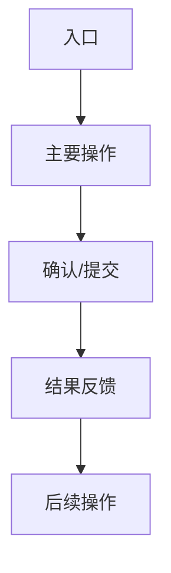

# 页面/功能需求文档模板

> **版本**：v1.0.0
> **更新日期**：YYYY-MM-DD
> **适用范围**：前端/后端/全栈
> **关联组件**：ComponentName.vue/ControllerName.java
> **优先级**：P0/P1/P2
> **状态**：✅ 已实现 / ⚠️ 部分实现 / ❌ 未实现 / 🔄 开发中

---

## 0. 设计关键词（Design Keywords）

- **[核心理念1]** · **[核心理念2]** · **[核心理念3]**
- **[一句话描述核心价值主张]**

---

## 1. 页面逻辑结构

### 1.1 整体布局

| 顺序 | 区块 | 目的 | 交互方式 |
|------|------|------|----------|
| ① | 区块名称 | 核心功能说明 | 点击/滑动/输入等 |
| ② | 区块名称 | 辅助功能说明 | 点击/滑动/输入等 |

### 1.2 用户流程



---

## 2. 视觉规范

### 2.1 色彩系统

| 元素 | 颜色值 | 用途 | 备注 |
|------|--------|------|------|
| 主色 | #3A80FF | CTA按钮、链接 | 科技蓝调 |
| 强调色 | #FDD835 | 高亮、警告 | 金黄色 |
| 背景色 | #0A0A0A | 页面背景 | 深色主题 |

### 2.2 字体层级

| 层级 | 字体大小 | 字重 | 行高 | 用途 |
|------|----------|------|------|------|
| H1 | 32px | 700 | 1.2 | 页面标题 |
| H2 | 24px | 600 | 1.3 | 区块标题 |
| H3 | 18px | 500 | 1.4 | 子标题 |
| 正文 | 14px | 400 | 1.5 | 内容文本 |

### 2.3 动效规范

- **Hover效果**：上浮 4px，发光增强 8%
- **加载动画**：骨架屏 + 渐进式出现
- **成功反馈**：GSAP 粒子爆发效果
- **过渡时长**：200ms (ease-out)

---

## 3. 功能需求

### 3.1 核心功能

#### 3.1.1 功能名称

**需求描述**：
- 功能的具体描述和业务价值

**交互流程**：
1. 用户操作步骤1
2. 系统响应步骤2
3. 结果反馈步骤3

**数据结构**：

```typescript
interface DataStructure {
  id: string;
  name: string;
  status: 'active' | 'inactive';
  createdAt: Date;
  updatedAt: Date;
}
```

**接口规范**：

```typescript
// 请求
POST /api/endpoint
{
  "field1": "value1",
  "field2": "value2"
}

// 响应
{
  "code": 0,
  "msg": "success",
  "data": {
    "result": "data"
  }
}
```

**边界场景**：
- 场景1：异常情况处理
- 场景2：数据验证失败
- 场景3：网络异常处理

### 3.2 扩展功能

#### 3.2.1 功能名称

**需求描述**：
- 扩展功能的具体描述

**实现方案**：
- 技术实现方式
- 依赖的组件/服务

---

## 4. 响应式策略

### 4.1 断点定义

| 设备 | 断点 | 布局方式 | 特殊处理 |
|------|------|----------|----------|
| 桌面 | ≥1200px | 多列布局 | 无 |
| 平板 | 768px-1199px | 双列布局 | 隐藏次要信息 |
| 手机 | <768px | 单列布局 | 底部导航，简化操作 |

### 4.2 适配原则

- **移动优先**：从小屏幕设计向大屏幕扩展
- **内容优先**：核心功能在所有设备上完整展示
- **交互优化**：触摸设备优化手势操作

---

## 5. 技术实现

### 5.1 前端实现

**组件结构**：
```
ComponentName/
├── ComponentName.vue       # 主组件
├── ComponentName.test.ts   # 单元测试
├── types.ts               # 类型定义
└── composables/
    └── useComponentName.ts # 组合式函数
```

**状态管理**：
```typescript
// Pinia Store
export const useComponentStore = defineStore('component', {
  state: () => ({
    data: [],
    loading: false
  }),
  actions: {
    async loadData() {
      // 实现逻辑
    }
  }
})
```

**API集成**：
```typescript
// 服务层
export const componentService = {
  getData: (params) => http.get('/api/data', { params }),
  updateData: (data) => http.post('/api/data', data)
}
```

### 5.2 后端实现

**Controller层**：
```java
@RestController
@RequestMapping("/api/data")
public class DataController {

    @Autowired
    private DataService dataService;

    @GetMapping
    public Result getData(@RequestParam Map<String, Object> params) {
        return dataService.getData(params);
    }
}
```

**Service层**：
```java
@Service
public class DataService {

    @Autowired
    private DataDao dataDao;

    public Result getData(Map<String, Object> params) {
        // 业务逻辑实现
        return Result.success(dataDao.selectList(params));
    }
}
```

---

## 6. 测试策略

### 6.1 单元测试

**测试场景**：
- 正常流程测试
- 异常情况测试
- 边界条件测试

**测试代码示例**：
```typescript
describe('ComponentName', () => {
  it('should render correctly', () => {
    // 测试实现
  })

  it('should handle error states', () => {
    // 测试实现
  })
})
```

### 6.2 集成测试

**测试范围**：
- API调用测试
- 数据流测试
- 用户交互测试

### 6.3 E2E测试

**测试流程**：
1. 用户操作流程
2. 端到端验证
3. 性能监控

---

## 7. 验收标准

### 7.1 功能验收

- [ ] 核心功能完整实现
- [ ] 所有交互流程正常
- [ ] 数据验证正确
- [ ] 错误处理完善

### 7.2 性能验收

- [ ] 页面加载时间 < 2秒
- [ ] 交互响应时间 < 100ms
- [ ] 内存泄漏检查通过

### 7.3 兼容性验收

- [ ] Chrome 90+ 支持
- [ ] Firefox 88+ 支持
- [ ] Safari 14+ 支持
- [ ] 移动端浏览器支持

### 7.4 可访问性验收

- [ ] 键盘导航支持
- [ ] 屏幕阅读器支持
- [ ] 颜色对比度符合标准

---

## 8. 风险与依赖

### 8.1 技术风险

| 风险项 | 影响程度 | 应对方案 |
|--------|----------|----------|
| 第三方API不稳定 | 中 | 实现重试机制和降级方案 |
| 浏览器兼容性问题 | 低 | 使用Polyfill和优雅降级 |

### 8.2 业务依赖

- 依赖服务：服务A、服务B
- 数据依赖：数据表X、数据表Y
- 外部接口：第三方API Z

---

## 9. 后续规划

### 9.1 优化计划

- [ ] 性能优化
- [ ] 用户体验改进
- [ ] 功能扩展

### 9.2 版本规划

- v1.1.0：添加功能X
- v1.2.0：优化性能Y
- v2.0.0：重构架构Z

---

## 10. 相关文档

- [系统架构文档](../technical/architecture/ARCHITECTURE.md)
- [API文档](../technical/api/API.md)
- [数据库设计](../technical/database/DATABASE.md)
- [测试策略](../development/testing/TESTING_STRATEGY.md)

---

## 更新记录

| 日期 | 版本 | 更新内容 | 更新人 |
|------|------|----------|--------|
| YYYY-MM-DD | v1.0.0 | 初始版本 | 开发者姓名 |
