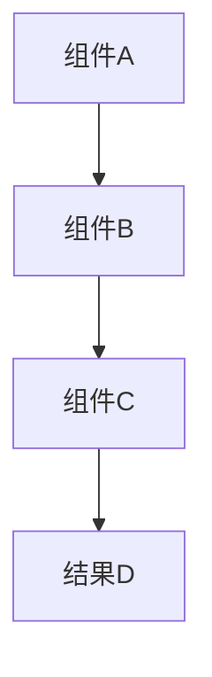

# 技术文档模板

---
title: 文档标题
version: v1.0.0
last_updated: YYYY-MM-DD
status: active
category: technical
tags: [tag1, tag2]
---

# 技术文档标题

> **版本**：v1.0.0
> **更新日期**：YYYY-MM-DD
> **适用范围**：前端/后端/全栈
> **关键词**：关键词1, 关键词2, 关键词3

---

## 📋 目录

- [概述](#概述)
- [核心概念](#核心概念)
- [架构设计](#架构设计)
- [实现方案](#实现方案)
- [配置说明](#配置说明)
- [最佳实践](#最佳实践)
- [故障排除](#故障排除)
- [相关文档](#相关文档)

---

## 📖 概述

### 背景

[说明该技术方案的背景和产生原因]

### 目标

[明确该技术方案要解决的问题和达到的目标]

### 范围

[定义该文档涵盖的技术范围和边界]

---

## 🧩 核心概念

### 概念1

**定义**：
[概念的详细定义]

**作用**：
[概念在系统中的作用]

**示例**：
```code
// 代码示例
```

### 概念2

**定义**：
[概念的详细定义]

**作用**：
[概念在系统中的作用]

**关系**：
[与其他概念的关系]

---

## 🏗️ 架构设计

### 整体架构



### 组件关系

| 组件 | 职责 | 输入 | 输出 |
|------|------|------|------|
| 组件A | 职责描述 | 输入数据 | 输出数据 |
| 组件B | 职责描述 | 输入数据 | 输出数据 |

### 数据流

1. **步骤1**：描述数据处理流程
2. **步骤2**：描述数据转换过程
3. **步骤3**：描述结果输出方式

---

## 🔧 实现方案

### 技术栈选择

| 技术 | 版本 | 用途 | 替代方案 |
|------|------|------|----------|
| 技术A | v1.0 | 主要用途 | 替代技术 |
| 技术B | v2.0 | 辅助用途 | 替代技术 |

### 核心实现

#### 主要类/组件

```typescript
// TypeScript/JavaScript 示例
export class MainClass {
  constructor(options: Options) {
    // 构造函数实现
  }

  public async execute(): Promise<Result> {
    // 核心逻辑实现
  }
}
```

```java
// Java 示例
public class MainService {

    @Autowired
    private Dependency dependency;

    public Result execute(Request request) {
        // 核心逻辑实现
        return Result.success();
    }
}
```

#### 关键算法

```algorithm
// 伪代码描述核心算法
function coreAlgorithm(input) {
    // 步骤1: 数据预处理
    processedData = preprocess(input)

    // 步骤2: 核心计算
    result = calculate(processedData)

    // 步骤3: 结果优化
    optimizedResult = optimize(result)

    return optimizedResult
}
```

### 配置管理

#### 环境变量

```bash
# 必需的环境变量
REQUIRED_VAR=value1
OPTIONAL_VAR=value2
```

#### 配置文件

```yaml
# config.yml
component:
  enabled: true
  settings:
    option1: value1
    option2: value2
```

---

## ⚙️ 配置说明

### 基本配置

```json
{
  "basic": {
    "enabled": true,
    "timeout": 30000,
    "retries": 3
  }
}
```

### 高级配置

```json
{
  "advanced": {
    "optimization": true,
    "debug": false,
    "customOptions": {
      "key": "value"
    }
  }
}
```

### 配置验证

| 配置项 | 类型 | 必需 | 默认值 | 说明 |
|--------|------|------|--------|------|
| enabled | boolean | 是 | true | 是否启用该功能 |
| timeout | number | 否 | 30000 | 超时时间(毫秒) |

---

## 🎯 最佳实践

### 性能优化

#### 1. 内存管理

```typescript
// 好的实践
class OptimizedClass {
  private cache = new Map();

  getData(key: string) {
    if (this.cache.has(key)) {
      return this.cache.get(key);
    }

    const data = this.fetchData(key);
    this.cache.set(key, data);
    return data;
  }
}
```

#### 2. 异步处理

```typescript
// 推荐的异步处理方式
async function processData(items: Item[]) {
  const results = await Promise.allSettled(
    items.map(item => processItem(item))
  );

  return results
    .filter(result => result.status === 'fulfilled')
    .map(result => result.value);
}
```

### 错误处理

```typescript
// 完善的错误处理
export class ServiceError extends Error {
  constructor(
    message: string,
    public code: string,
    public statusCode: number = 500
  ) {
    super(message);
    this.name = 'ServiceError';
  }
}

try {
  await riskyOperation();
} catch (error) {
  if (error instanceof ServiceError) {
    // 处理已知错误
    handleServiceError(error);
  } else {
    // 处理未知错误
    handleUnknownError(error);
  }
}
```

### 安全性考虑

- [ ] 输入验证和清理
- [ ] 权限检查
- [ ] 敏感数据保护
- [ ] 日志记录和监控

---

## 🔍 故障排除

### 常见问题

#### 问题1：错误描述

**症状**：
[问题表现]

**原因**：
[问题根本原因]

**解决方案**：
1. 步骤1
2. 步骤2
3. 验证结果

**预防措施**：
[如何避免该问题再次发生]

#### 问题2：错误描述

**症状**：
[问题表现]

**原因**：
[问题根本原因]

**解决方案**：
[解决方案描述]

---

## 📊 监控和指标

### 关键指标

| 指标 | 正常范围 | 警告阈值 | 紧急阈值 |
|------|----------|----------|----------|
| 响应时间 | <100ms | 200ms | 500ms |
| 错误率 | <1% | 5% | 10% |
| 吞吐量 | >1000 req/s | 500 req/s | 100 req/s |

### 日志分析

```log
# 正常日志示例
2024-01-01 10:00:00 INFO  Component initialized successfully
2024-01-01 10:00:01 INFO  Processing request: id=123

# 错误日志示例
2024-01-01 10:00:05 ERROR Failed to process request: id=123, error=Timeout
2024-01-01 10:00:05 ERROR Stack trace: ...
```

---

## 📚 相关文档

### 内部文档

- [系统架构](../architecture/ARCHITECTURE.md)
- [API文档](../api/API.md)
- [部署指南](../deployment/DEPLOYMENT.md)

### 外部资源

- [官方文档](https://example.com/docs)
- [相关RFC](https://example.com/rfc)
- [最佳实践指南](https://example.com/best-practices)

---

## 🔄 更新记录

| 日期 | 版本 | 更新内容 | 更新人 |
|------|------|----------|--------|
| YYYY-MM-DD | v1.0.0 | 初始版本 | 开发者姓名 |
| YYYY-MM-DD | v1.1.0 | 添加新功能 | 开发者姓名 |
