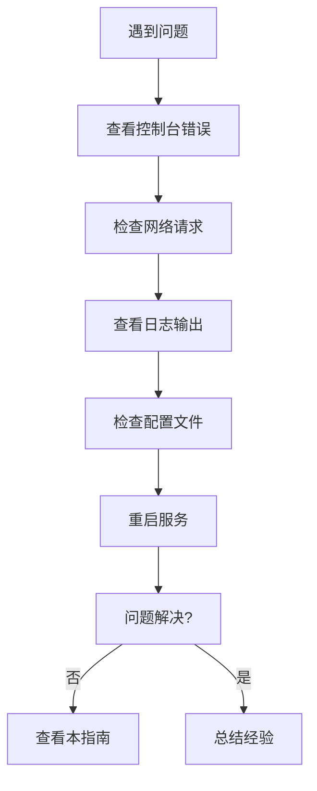

# Admin 前端故障排除指南

> 版本：v1.0
> 更新日期：2025-11-16
> 适用项目：`springboot1ngh61a2/src/main/resources/admin/admin`

---

## 目录

- [1. 概述](#1-概述)
- [2. 开发环境问题](#2-开发环境问题)
  - [2.1 依赖安装失败](#21-依赖安装失败)
  - [2.2 启动服务失败](#22-启动服务失败)
  - [2.3 热更新不生效](#23-热更新不生效)
- [3. 构建和部署问题](#3-构建和部署问题)
  - [3.1 构建失败](#31-构建失败)
  - [3.2 构建产物过大](#32-构建产物过大)
  - [3.3 生产环境404错误](#33-生产环境404错误)
- [4. 运行时错误](#4-运行时错误)
  - [4.1 Token认证失败](#41-token认证失败)
  - [4.2 API请求失败](#42-api请求失败)
  - [4.3 文件上传失败](#43-文件上传失败)
  - [4.4 路由跳转问题](#44-路由跳转问题)
- [5. 测试相关问题](#5-测试相关问题)
  - [5.1 单元测试失败](#51-单元测试失败)
  - [5.2 端到端测试失败](#52-端到端测试失败)
  - [5.3 覆盖率报告异常](#53-覆盖率报告异常)
- [6. 样式和UI问题](#6-样式和ui问题)
  - [6.1 样式不生效](#61-样式不生效)
  - [6.2 响应式布局异常](#62-响应式布局异常)
  - [6.3 图标显示异常](#63-图标显示异常)
- [7. 性能问题](#7-性能问题)
  - [7.1 页面加载缓慢](#71-页面加载缓慢)
  - [7.2 内存泄漏](#72-内存泄漏)
  - [7.3 打包体积过大](#73-打包体积过大)
- [8. 安全问题](#8-安全问题)
  - [8.1 XSS攻击防护](#81-xss攻击防护)
  - [8.2 CSRF防护异常](#82-csrf防护异常)
  - [8.3 文件上传安全](#83-文件上传安全)
- [9. 调试技巧](#9-调试技巧)
- [10. 常见错误码](#10-常见错误码)
- [11. 附录](#11-附录)

---

## 1. 概述

本文档汇总了 Admin 前端开发过程中常见的故障现象、原因分析和解决方案，帮助开发者快速定位和解决问题。

### 1.1 如何使用本指南

1. **按症状查找**: 根据遇到的具体错误现象，找到对应的章节
2. **按优先级解决**: 先检查最可能的原因，再逐步排查
3. **记录问题**: 如果问题未在本指南中找到，请记录并反馈给团队

### 1.2 问题排查流程



---

## 2. 开发环境问题

### 2.1 依赖安装失败

**现象**: `npm install` 失败，报各种依赖错误

**可能原因**:
1. Node.js 版本不匹配
2. npm 缓存问题
3. 网络问题
4. 权限问题

**解决方案**:

```bash
# 1. 检查 Node.js 版本
node --version  # 应为 16.0.0+
npm --version   # 应为 8.0.0+

# 2. 清理缓存
npm cache clean --force
rm -rf node_modules package-lock.json

# 3. 使用国内镜像
npm config set registry https://registry.npmmirror.com

# 4. 重新安装
npm install

# 5. 如果仍有问题，使用 yarn
npm install -g yarn
yarn install
```

**预防措施**:
- 使用 `.nvmrc` 文件指定 Node.js 版本
- 定期更新 `package-lock.json`
- 使用 CI/CD 确保环境一致性

### 2.2 启动服务失败

**现象**: `npm run dev` 失败，无法启动开发服务器

**可能原因**:
1. 端口被占用
2. 配置文件错误
3. 依赖缺失

**解决方案**:

```bash
# 1. 检查端口占用
netstat -ano | findstr :8081  # Windows
lsof -i :8081                  # macOS/Linux

# 2. 杀死占用进程
taskkill /PID <PID> /F  # Windows
kill -9 <PID>           # macOS/Linux

# 3. 检查配置文件
cat vite.config.ts
cat .env.development

# 4. 清理并重启
rm -rf node_modules/.vite
npm run dev
```

**备用方案**:
```bash
# 使用不同端口
npm run dev -- --port 8082
```

### 2.3 热更新不生效

**现象**: 修改代码后页面不自动刷新

**可能原因**:
1. 文件在 `node_modules` 或其他忽略目录
2. Vite 配置问题
3. 浏览器缓存

**解决方案**:

```bash
# 1. 检查文件路径
# 确保修改的文件在 src/ 目录下

# 2. 检查 Vite 配置
# vite.config.ts 中的 server.hmr 选项

# 3. 清除浏览器缓存
# Chrome DevTools: Network -> Disable cache

# 4. 重启开发服务器
npm run dev
```

**检查清单**:
- [ ] 文件是否在 `src/` 目录
- [ ] 文件是否被 `.gitignore` 排除
- [ ] Vite 配置是否正确
- [ ] 浏览器是否启用了缓存

---

## 3. 构建和部署问题

### 3.1 构建失败

**现象**: `npm run build` 失败，报 TypeScript 或其他错误

**可能原因**:
1. TypeScript 类型错误
2. ESLint 错误
3. 依赖版本冲突
4. 环境变量缺失

**解决方案**:

```bash
# 1. 检查 TypeScript 错误
npm run type-check

# 2. 检查代码规范
npm run check

# 3. 修复环境变量
cp .env.example .env.production

# 4. 清理缓存后重新构建
rm -rf node_modules/.vite dist
npm run build
```

**常见错误**:
```typescript
// 错误: Cannot find module '@/utils/api'
# 解决方案: 检查 vite.config.ts 中的别名配置

// 错误: 'X' is not defined
# 解决方案: 检查自动导入配置
```

### 3.2 构建产物过大

**现象**: 构建产物超过预期大小

**可能原因**:
1. 未使用的依赖未被 Tree Shaking
2. 图片资源未优化
3. 第三方库重复打包

**解决方案**:

```bash
# 1. 分析包大小
npm run build:analyze

# 2. 优化图片
# 使用适当的图片格式和压缩

# 3. 检查重复依赖
npm ls --depth=0

# 4. 动态导入大组件
const Component = () => import('./LargeComponent.vue')
```

**优化建议**:
- 使用 `import()` 进行代码分割
- 启用 Gzip 压缩
- 优化图片资源
- 移除未使用的依赖

### 3.3 生产环境404错误

**现象**: 生产环境访问非根路径时出现404

**可能原因**:
1. SPA 路由配置问题
2. 服务器配置错误
3. 构建配置问题

**解决方案**:

**Nginx 配置**:
```nginx
server {
    listen 80;
    server_name your-domain.com;
    root /var/www/admin/dist;
    index index.html;

    location / {
        try_files $uri $uri/ /index.html;
    }

    location /springboot1ngh61a2 {
        proxy_pass http://localhost:8080;
    }
}
```

**Apache 配置**:
```apache
<VirtualHost *:80>
    DocumentRoot /var/www/admin/dist
    ServerName your-domain.com

    <Directory /var/www/admin/dist>
        RewriteEngine On
        RewriteCond %{REQUEST_FILENAME} !-f
        RewriteCond %{REQUEST_FILENAME} !-d
        RewriteRule . /index.html [L]
    </Directory>

    ProxyPass /springboot1ngh61a2 http://localhost:8080/springboot1ngh61a2
    ProxyPassReverse /springboot1ngh61a2 http://localhost:8080/springboot1ngh61a2
</VirtualHost>
```

---

## 4. 运行时错误

### 4.1 Token认证失败

**现象**: 登录后访问其他页面提示未授权

**可能原因**:
1. Token 存储失败
2. Token 过期
3. 请求头设置错误

**解决方案**:

```typescript
// 1. 检查 Token 存储
import { tokenStorage } from '@/utils/secureStorage'
console.log('Token:', tokenStorage.getToken())

// 2. 检查请求拦截器
// src/utils/http.ts 第44-67行

// 3. 检查响应拦截器
// src/utils/http.ts 第70-296行
```

**调试步骤**:
1. 打开浏览器开发者工具
2. 查看 Network 标签页
3. 检查 API 请求的 Headers
4. 确认 Token 是否正确发送

### 4.2 API请求失败

**现象**: 接口调用失败，返回错误信息

**可能原因**:
1. 后端服务未启动
2. 网络问题
3. 请求参数错误
4. 权限不足

**解决方案**:

```bash
# 1. 检查后端服务
curl http://localhost:8080/springboot1ngh61a2

# 2. 检查网络连接
ping localhost

# 3. 查看请求详情
// 在浏览器 Network 标签页查看请求
// 检查 Request Headers 和 Response
```

**常见错误码处理**:
```typescript
// 处理不同错误码
switch (response.code) {
  case 401:
    // 未授权，跳转登录
    router.push('/login')
    break
  case 403:
    // 权限不足
    ElMessage.error('权限不足')
    break
  case 500:
    // 服务器错误
    router.push('/error/500')
    break
}
```

### 4.3 文件上传失败

**现象**: 文件上传失败，提示错误信息

**可能原因**:
1. 文件大小超过限制
2. 文件类型不支持
3. Token 过期
4. 服务器存储空间不足

**解决方案**:

```typescript
// 1. 检查文件限制
const limits = {
  size: 10 * 1024 * 1024, // 10MB
  types: ['image/jpeg', 'image/png', 'application/pdf']
}

// 2. 检查上传组件配置
<FileUpload
  :action="'file/upload'"
  :limit="5"
  :before-upload="handleBeforeUpload"
/>

// 3. 实现上传前校验
const handleBeforeUpload = (file: File) => {
  if (file.size > limits.size) {
    ElMessage.error('文件大小超过限制')
    return false
  }
  if (!limits.types.includes(file.type)) {
    ElMessage.error('不支持的文件类型')
    return false
  }
  return true
}
```

### 4.4 路由跳转问题

**现象**: 路由跳转失败或跳转到错误页面

**可能原因**:
1. 路由配置错误
2. 路由守卫阻止跳转
3. 动态路由未注册

**解决方案**:

```typescript
// 1. 检查路由配置
// src/router/index.ts

// 2. 检查路由守卫
router.beforeEach((to, from, next) => {
  console.log('Route:', to.path)
  // 检查权限逻辑
})

// 3. 动态添加路由
router.addRoute({
  path: '/dynamic',
  component: () => import('@/views/DynamicPage.vue')
})
```

---

## 5. 测试相关问题

### 5.1 单元测试失败

**现象**: `npm run test:unit` 失败，测试用例不通过

**可能原因**:
1. Mock 配置错误
2. 依赖未正确隔离
3. 异步操作未正确处理

**解决方案**:

```typescript
// 1. 检查 Mock 配置
vi.mock('@/utils/http', () => ({
  default: {
    get: vi.fn(),
    post: vi.fn()
  }
}))

// 2. 正确处理异步测试
it('should handle async operation', async () => {
  const mockResponse = { data: 'test' }
  vi.mocked(http.get).mockResolvedValue(mockResponse)

  const result = await service.getData()
  expect(result).toEqual(mockResponse)
})

// 3. 使用 act 包装状态更新
import { act } from '@testing-library/vue'
await act(async () => {
  await wrapper.vm.$nextTick()
})
```

### 5.2 端到端测试失败

**现象**: Playwright 测试失败

**可能原因**:
1. 浏览器版本问题
2. 页面元素定位失败
3. 网络超时

**解决方案**:

```bash
# 1. 更新浏览器
npx playwright install

# 2. 检查选择器
await page.waitForSelector('[data-testid="login-button"]')

# 3. 增加等待时间
await page.waitForTimeout(2000)

# 4. 使用更稳定的定位方式
await page.getByRole('button', { name: '登录' }).click()
```

### 5.3 覆盖率报告异常

**现象**: 覆盖率报告无法生成或数据异常

**可能原因**:
1. 测试文件执行失败
2. 配置错误
3. 忽略文件设置不当

**解决方案**:

```bash
# 1. 检查覆盖率配置
// vitest.config.ts
coverage: {
  include: ['src/**/*.{ts,tsx,js,jsx,vue}'],
  exclude: ['src/main.ts', 'src/**/*.d.ts']
}

# 2. 运行覆盖率测试
npm run test:coverage

# 3. 查看报告
open coverage/index.html
```

---

## 6. 样式和UI问题

### 6.1 样式不生效

**现象**: CSS 样式未正确应用

**可能原因**:
1. CSS 模块化冲突
2. 样式优先级问题
3. 构建时样式丢失

**解决方案**:

```vue
<!-- 1. 使用 scoped 样式 -->
<style scoped lang="scss">
.component {
  color: red;
}
</style>

<!-- 2. 使用深度选择器 -->
<style scoped lang="scss">
:deep(.element-plus-class) {
  color: blue;
}
</style>

<!-- 3. 使用 CSS 变量 -->
<style scoped lang="scss">
:root {
  --primary-color: #409eff;
}
</style>
```

### 6.2 响应式布局异常

**现象**: 在不同设备上布局显示异常

**可能原因**:
1. 断点设置不当
2. Flexbox/Grid 布局问题
3. 媒体查询未生效

**解决方案**:

```scss
// 1. 使用设计系统断点
@media (max-width: 768px) {
  .mobile-layout {
    flex-direction: column;
  }
}

// 2. 检查容器查询
.container {
  container-type: inline-size;

  @container (max-width: 600px) {
    .content {
      font-size: 14px;
    }
  }
}
```

### 6.3 图标显示异常

**现象**: SVG 图标不显示或显示错误图标

**可能原因**:
1. 图标文件缺失
2. 图标名称错误
3. SVG 配置问题

**解决方案**:

```vue
<!-- 1. 检查图标名称 -->
<SvgIcon name="user" />
<SvgIcon name="edit" />

<!-- 2. 检查图标文件 -->
<!-- src/icons/svg/user.svg 应存在 -->

<!-- 3. 检查图标配置 -->
<!-- vite.config.ts 中的 createSvgIconsPlugin 配置 -->
```

---

## 7. 性能问题

### 7.1 页面加载缓慢

**现象**: 页面首次加载时间过长

**可能原因**:
1. 包体积过大
2. 未使用代码分割
3. 资源未优化

**解决方案**:

```typescript
// 1. 路由懒加载
const routes = [
  {
    path: '/dashboard',
    component: () => import('@/views/Dashboard.vue')
  }
]

// 2. 组件懒加载
const AsyncComponent = defineAsyncComponent({
  loader: () => import('./HeavyComponent.vue'),
  loadingComponent: LoadingComponent
})

// 3. 图片懒加载

```

### 7.2 内存泄漏

**现象**: 应用运行时间长后性能下降

**可能原因**:
1. 事件监听器未清理
2. 定时器未清除
3. 组件未正确卸载

**解决方案**:

```vue
<script setup lang="ts">
import { onMounted, onUnmounted } from 'vue'

let timer: number | null = null

onMounted(() => {
  timer = window.setInterval(() => {
    // 执行定时任务
  }, 1000)
})

onUnmounted(() => {
  if (timer) {
    clearInterval(timer)
    timer = null
  }
})
</script>
```

### 7.3 打包体积过大

**现象**: 构建产物体积过大

**解决方案**:

```typescript
// 1. 分析包大小
npm run build:analyze

// 2. 移除未使用依赖
npm uninstall unused-package

// 3. 使用轻量级替代方案
// moment.js -> dayjs
// lodash -> lodash-es with tree shaking

// 4. 压缩资源
// 启用 Gzip 压缩
// 优化图片资源
```

---

## 8. 安全问题

### 8.1 XSS攻击防护

**现象**: 可能存在 XSS 安全漏洞

**解决方案**:

```vue
<!-- 1. 使用 SafeHtml 组件 -->
<template>
  <SafeHtml :html="userContent" />
</template>

<!-- 2. 验证用户输入 -->
import { validateXSS } from '@/utils/validator'

const userInput = ref('')
const handleInput = (value: string) => {
  if (validateXSS(value)) {
    ElMessage.error('输入包含非法字符')
    return
  }
  userInput.value = value
}
```

### 8.2 CSRF防护异常

**现象**: CSRF 防护导致合法请求失败

**解决方案**:

```typescript
// 1. 检查 CSRF Token 生成
import { getOrCreateCsrfToken } from '@/utils/csrf'

const token = getOrCreateCsrfToken()
console.log('CSRF Token:', token)

// 2. 确认请求头设置
headers['X-CSRF-Token'] = token
```

### 8.3 文件上传安全

**现象**: 文件上传存在安全风险

**解决方案**:

```typescript
// 1. 文件类型验证
const allowedTypes = ['image/jpeg', 'image/png', 'application/pdf']

const validateFile = (file: File) => {
  if (!allowedTypes.includes(file.type)) {
    throw new Error('不支持的文件类型')
  }

  if (file.size > 10 * 1024 * 1024) { // 10MB
    throw new Error('文件大小超过限制')
  }
}

// 2. 文件名清理
const sanitizeFileName = (name: string) => {
  return name.replace(/[^a-zA-Z0-9._-]/g, '_')
}
```

---

## 9. 调试技巧

### 9.1 浏览器开发者工具

```javascript
// 1. Vue DevTools
// 安装 Vue DevTools 浏览器扩展

// 2. 网络调试
// Network 标签页查看 API 请求

// 3. 控制台调试
console.log('Debug info:', data)
console.error('Error:', error)

// 4. 断点调试
// Sources 标签页设置断点
```

### 9.2 Vue 调试技巧

```vue
<script setup lang="ts">
// 1. 响应式数据调试
import { watch } from 'vue'

watch(user, (newUser, oldUser) => {
  console.log('User changed:', { newUser, oldUser })
}, { deep: true })

// 2. 生命周期调试
onMounted(() => {
  console.log('Component mounted')
})

onUnmounted(() => {
  console.log('Component unmounted')
})
</script>
```

### 9.3 性能调试

```typescript
// 1. 性能监控
const observer = new PerformanceObserver((list) => {
  for (const entry of list.getEntries()) {
    console.log('Performance:', entry.name, entry.duration)
  }
})
observer.observe({ entryTypes: ['measure'] })

// 2. 内存分析
// Chrome DevTools -> Memory 标签页
// 拍摄堆快照，分析内存使用
```

---

## 10. 常见错误码

### 10.1 HTTP 状态码

| 状态码 | 含义 | 处理方式 |
|--------|------|----------|
| 200 | 成功 | 正常处理 |
| 400 | 请求参数错误 | 检查请求参数 |
| 401 | 未授权 | 跳转登录页 |
| 403 | 权限不足 | 显示权限错误 |
| 404 | 资源不存在 | 显示404页面 |
| 409 | 资源冲突 | 显示冲突提示 |
| 423 | 账户锁定 | 显示锁定提示 |
| 500 | 服务器错误 | 显示错误页面 |
| 503 | 服务不可用 | 显示维护页面 |

### 10.2 业务错误码

| 错误码 | 含义 | 处理方式 |
|--------|------|----------|
| 0 | 成功 | 正常处理 |
| 400 | 参数错误 | 显示参数错误提示 |
| 401 | 用户名或密码错误 | 显示登录错误 |
| 403 | 权限不足 | 显示权限提示 |
| 404 | 数据不存在 | 显示不存在提示 |
| 409 | 数据冲突 | 显示冲突提示 |
| 423 | 账户锁定 | 显示锁定提示 |
| 500 | 服务器错误 | 显示服务器错误 |

---

## 11. 附录

### 11.1 常用命令

```bash
# 开发环境
npm run dev              # 启动开发服务器
npm run build           # 构建生产版本
npm run preview         # 预览构建结果
npm run type-check      # TypeScript 类型检查
npm run check           # 代码规范检查

# 测试
npm run test:unit       # 运行单元测试
npm run test:coverage   # 生成覆盖率报告
npm run test:e2e        # 运行端到端测试

# 代码质量
npm run lint            # 代码格式化
npm run format          # 代码检查
```

### 11.2 环境变量

```bash
# .env.development
VITE_API_BASE_URL=http://localhost:8080/springboot1ngh61a2
VITE_APP_TITLE=健身房管理系统

# .env.production
VITE_API_BASE_URL=https://api.yourdomain.com/springboot1ngh61a2
VITE_APP_TITLE=健身房管理系统
```

### 11.3 配置文件检查清单

- [ ] `vite.config.ts` - Vite 配置正确
- [ ] `tsconfig.json` - TypeScript 配置正确
- [ ] `vitest.config.ts` - 测试配置正确
- [ ] `.env` - 环境变量设置正确
- [ ] `package.json` - 依赖版本正确

### 11.4 日志级别

```typescript
// 开发环境：显示所有日志
console.log('Info message')
console.warn('Warning message')
console.error('Error message')

// 生产环境：只显示错误
if (process.env.NODE_ENV === 'development') {
  console.log('Debug info')
}
```

---

**文档维护者**: 开发团队
**最后更新**: 2025-11-16
**版本**: v1.0

---

> 💡 **提示**: 如果遇到本指南未覆盖的问题，请记录详细的错误信息、复现步骤和环境信息，并提交给开发团队。
